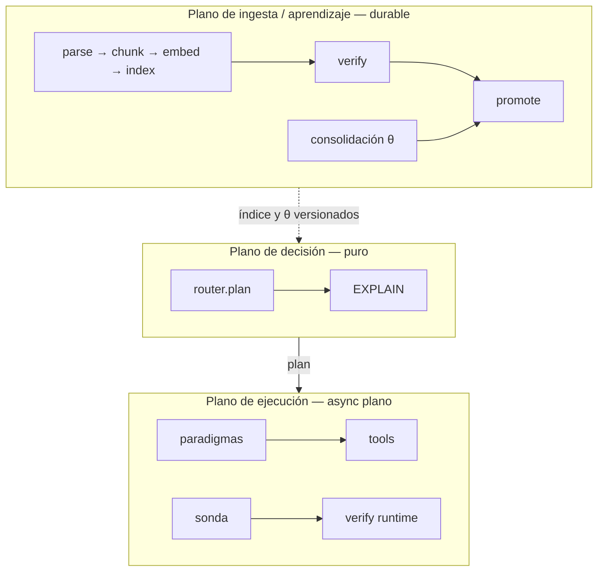
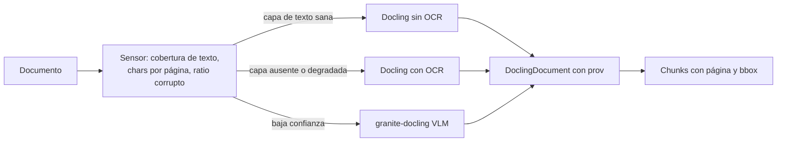
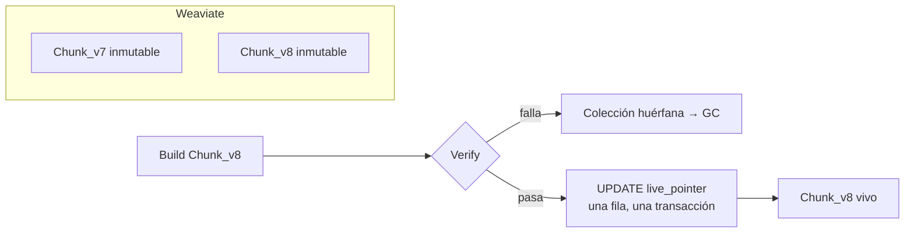

# Arquitectura de plataforma de MAPO

**Estado del documento: PROPUESTA.** Ninguna de estas piezas está ejecutada. Bajo la
regla del proyecto (`DISENO.es.md` §2), nada de acá se describe como capacidad entregada
ni entra al paper hasta ejecutarse y medirse. Este archivo fija decisiones de
infraestructura con su justificación y su condición de reversa, para que no se
re-litiguen cada vez.

`DISENO.es.md` define la arquitectura **lógica** — factibilidad, creencias, garantía,
ruteo, EXPLAIN — y su deuda. Este documento define la **física**: dónde corre, con qué
persistencia, con qué ingesta y con qué backend.

Punto de partida real: hoy el producto persiste en JSONL bajo `results/`, recibe los
documentos como un dict en memoria (`app/serve.py`, `Request.documents`) y expone
endpoints sin streaming (`app/main.py`). Eso alcanza para el banco y no alcanza para un
producto.

## 0. Restricciones fijadas por el autor (2026-08-27)

| Restricción | Valor |
|---|---|
| Despliegue | On-prem / Docker, VM propia. Sin dependencia de nube salvo la API del modelo. |
| Motor vectorial | Weaviate. |
| Tenencia | Single-tenant. `tenant_id` queda en el esquema, sin RLS. |

Referencia interna consultada: el proyecto Lumen (`D:\Apps\chat`) ya corre en producción
Weaviate, Docling + PyMuPDF4LLM, Redis Streams y workers. Se toma de ahí lo que funciona
y se corrigen tres cosas que ahí están resueltas de una forma que MAPO no puede copiar.
Se lee, no se importa — la misma regla que rige `legacy/`.

---

## 1. Tres planos, tres respuestas distintas

El error a evitar es elegir *un* orquestador para todo. MAPO tiene tres planos con
requisitos opuestos:

| Plano | Latencia | Durabilidad que necesita | Respuesta |
|---|---|---|---|
| **Decisión** (`router.plan`) | µs, puro, sin I/O | ninguna: es una función | Python puro. Sin framework. |
| **Ejecución** (paradigmas, sonda, tools) | segundos, streaming | reintento por paso | async plano + adapter de durabilidad |
| **Ingesta / consolidación** | minutos a horas | fan-out, reanudable, idempotente | driver durable |

La regla que ordena todo:

> **La durabilidad es un adapter, no un modelo de programación.**

Un paradigma sigue siendo `async def paradigm(ctx) -> Answer`. Si mañana hay que
envolverlo en un motor durable, se envuelve; no se reescribe. Eso es lo que preserva el
isomorfismo banco↔producción que `CLAUDE.md` protege: el banco mide exactamente las
funciones que producción ejecuta.



---

## 2. Orquestación: no Temporal todavía, no LangGraph nunca

### 2.1 Temporal: la elección correcta sobre el plano equivocado, y prematura

Temporal resuelve exactamente lo que la ingesta necesita: fan-out por unidad en task
queues, reintentos declarados, idempotencia, timers, señales de cancelación, e historia
que sobrevive a un deploy. La intuición a favor —reintentos, workflows, colas— es
correcta sobre **ese** plano.

Tres razones para no adoptarlo ahora:

1. **Dos determinismos que compiten.** Temporal replaya código de workflow desde su
   event history: es determinismo de *orquestación*. MAPO replaya una *decisión* desde
   historia canónica de creencias + digest de reglas + digest de θ, sin invocar al modelo
   (`app/README.es.md`, contrato de determinismo). Si la decisión vive dentro de un
   workflow, el certificado EXPLAIN pasa a ser derivado de un store operacional. El
   ledger epistémico tiene que sostenerse solo y ser auditable sin el orquestador.
2. **Costo operativo on-prem.** Temporal self-hosted son cuatro contenedores o más
   —server, su propia base, visibility, UI— antes de la primera línea de MAPO. Para un
   producto que todavía no capturó brecha neta positiva contra el mejor fijo, es
   infraestructura que no compra medición.
3. **El plano de query empeora.** Partir una respuesta de tres segundos en doce
   activities agrega round-trips al server y no resuelve el streaming de tokens: habría
   que sacarlos por fuera igual. `CLAUDE.md` ya lo decidió —"en el plano de query queda
   como envoltorio opcional, no como requisito"—; acá queda el detalle de por qué.

### 2.2 LangGraph: descartado, no pospuesto

- Los trece paradigmas **son** la unidad medida. Reescribirlos como grafos cambia lo que
  el banco mide: viola la regla de isomorfismo de raíz.
- Sus checkpointers guardan estado *entre* nodos, no *dentro*. Las olas de
  `dag_strategy` y el bucle de la sonda son intra-nodo: no compraría durabilidad
  justamente donde hace falta.
- LangGraph quiere el grafo fijo en tiempo de construcción. La tesis de MAPO es que la
  estructura de control se elige **por request** con un router determinista. Es un
  competidor de lo que se vende, no un anfitrión.
- Evidencia local: `legacy/agentic/` son 8.549 LOC de LangGraph, sin ensamblado de grafo
  y con cero tests. Ese precio ya se pagó una vez.

### 2.3 Lo que se adopta

**Fase 0 — ahora: work table en Postgres.** `SELECT ... FOR UPDATE SKIP LOCKED`.
Aproximadamente doscientas líneas, cero infraestructura nueva, y dedupe transaccional
gratis porque vive en la misma base que el ledger. Cada paso es idempotente y
direccionado por hash de contenido, que es lo que hace reversible la decisión.

**Fase 1 — cuando duela: DBOS.** `pip install`, el mismo Postgres, decoradores
(`@DBOS.step`, `@DBOS.workflow`) sobre funciones que siguen siendo Python plano. Su
ventaja decisiva para MAPO no es la comodidad: el paso y su registro de durabilidad
**commitean en la misma transacción**. Para la promoción de θ eso significa que "instalé
la candidata" y "quedó registrada" no pueden divergir nunca. Cierra la deuda de
`DISENO.es.md` §5.8 con una propiedad del motor en lugar de con disciplina.

**Fase 2 — Temporal, sólo si aparece uno de estos disparadores.** Quedan escritos para
que la decisión no se vuelva a discutir:

- un gate A3 que deba quedar parkeado días esperando aprobación humana, con timers;
- fan-out sobre más de una máquina;
- un segundo lenguaje o servicio en el pipeline.

### 2.4 Por qué la fase 0 alcanza

`chat/batch/services/redis_task_queue.py` son 612 líneas de cola artesanal: Redis
Streams, consumer groups, XACK, DLQ, locks, heartbeat, dedupe y cancelación. Corre en
producción y aun así no da replay ni exactly-once. Es el argumento a favor de **no**
volver a escribirla: o es una work table de cincuenta líneas, o es un motor durable de
verdad. El punto intermedio ya se probó y cuesta 612 líneas de mantenimiento.

---

## 3. Lectura de documentos: Docling primario, sensor barato adelante

`pymupdf4llm` es rápido y produce buen markdown. **No sirve como extractor primario de
MAPO**, y la razón no es de calidad: no emite anclas de bloque estables. La procedencia
`OBSERVED` exige que un verificador ligue una afirmación a evidencia concreta
(`DISENO.es.md` §4.2). Sin `(página, bbox)` no hay cita verificable; hay markdown.

**Docling** emite `DoclingDocument`: cada ítem con `prov` —página y bounding box—, tablas
como estructura, orden de lectura resuelto, y un chunker que preserva esa procedencia.
Licencia MIT. Es cinco a treinta veces más lento y arrastra uno o dos gigabytes de pesos,
y eso es aceptable porque la ingesta es offline y batcheada.

**Marker queda descartado por licencia** —restringe uso comercial sobre un umbral de
facturación—, no por calidad.

### 3.1 Las dos correcciones sobre lo que hace Lumen

`chat/batch/services/document_service.py` hace dos cosas que MAPO no debe copiar:

1. **Exporta a markdown y descarta la procedencia** (`_export_docling_with_pagebreaks`).
   MAPO persiste el `DoclingDocument` serializado como artefacto content-addressed y
   deriva el markdown desde ahí. El markdown es una vista; la fuente es el documento
   estructurado.
2. **Parsea dos veces los PDF escaneados**: corre Docling sin OCR, cuenta caracteres, y
   si hay menos de cien vuelve a correr Docling con OCR. MAPO usa un **sensor barato**
   —cobertura de capa de texto por página, caracteres por página, ratio de caracteres
   corruptos— para decidir `do_ocr` **antes** de la primera pasada.

Esa escalación es la tesis del producto aplicada a la ingesta: una señal contable y
determinista decide; nunca "corré siempre el caro". Y el resultado del sensor se registra
como creencia `COMPUTED` del documento, no como heurística escondida en una rama.



### 3.2 Alerta de licencia

**PyMuPDF es AGPL.** Usarlo aunque sea como sensor linkea el producto. Para el sensor va
**`pypdfium2`** —BSD, y ya es uno de los backends de Docling—, o se compra la licencia de
Artifex. Hay que resolverlo antes de que esto sea producto, no después.

### 3.3 Tier de escalación

`granite-docling` (VLM de 258M) como contenedor propio, para páginas donde el sensor
marca baja confianza. Sin dependencia de nube, consistente con la restricción on-prem.

---

## 4. Weaviate y el commit en dos stores

Weaviate está fijado y hay razones buenas: ya corre en Lumen (1.38.x, `vectorizer: none`,
embeddings externos), da **hybrid nativo** —BM25 más vector, con fusión—, filtros con
índice de payload propio, y named vectors.

**Mejora inmediata sobre lo que hace Lumen:** ahí sólo se usa `near_vector`. No hay una
sola llamada a `query.hybrid` ni a BM25 en todo el repo. MAPO usa **hybrid con `alpha`
declarado** y rerank cross-encoder sobre top-40 → top-8. La receta de cuatro ramas más
RRF más rerank de `legacy/agentic/subgraphs/semantic_search.py` se porta como *diseño*,
no como código.

### 4.1 El problema que Weaviate introduce

Con Weaviate, el ledger epistémico (Postgres) y el índice viven en stores distintos, así
que `VerifyIndex → Promote` deja de ser una transacción. La solución es no necesitar una:

- **Una colección por versión de índice**: `Chunk_v7`, `Chunk_v8`. Inmutables una vez
  promovidas.
- **Postgres es la única autoridad sobre qué versión está viva**: la tabla `live_pointer`
  de fila única.
- Promover es: construir `Chunk_v8` → verificar → **un UPDATE de una fila en Postgres**.
  Weaviate no se muta en el flip. Si el flip falla, la colección nueva queda huérfana y la
  recolección la limpia; nunca queda un índice a medio promover.



Una versión de índice fija: `embedder + dim + normalización + parser_version +
chunker_version + hash de manifiesto del corpus`. Eso es lo que hace replayable una
decisión: si cambia cualquiera de esos campos es otro índice, y el EXPLAIN lo dice.

### 4.2 Puerta de salida

Todo detrás del `Retriever` Protocol que ya existe (`app/retrieval.py`). Si Weaviate
dejara de alcanzar, cambiar de motor es una clase, no una migración.

---

## 5. Postgres como ledger epistémico

Postgres es correcto para "pesos y aprendizajes", pero llamarlo así lo subestima. Lo
importante es que **el esquema haga estructuralmente imposibles las deudas** que hoy
`DISENO.es.md` §5 lista como bloqueantes. Una restricción de integridad no se olvida en
una revisión de código.

```sql
-- Deuda §5.2: las repeticiones crudas cuentan como episodios independientes.
-- La PK hace imposible insertar un trial como si fuera un episodio.
create table episode (
  task_id        text not null,
  paradigm       text not null,
  policy_version int  not null,
  split          text not null check (split in ('train','val','final')),
  utility        double precision not null,
  cost_tokens    int  not null,
  was_best       boolean not null,
  n_trials       int  not null check (n_trials >= 3),
  primary key (task_id, paradigm, policy_version)
);

-- Deuda §5.8 + BENCHMARK, disciplina de datos 7 y 8: "tocar final una sola vez".
-- Lo impone la base, no la disciplina.
create table final_use_ledger (
  claim_id             text primary key,
  dataset_manifest_hash text not null,
  certificate_id       uuid not null references promotion_certificate(id),
  used_at              timestamptz not null default now()
);

-- Append-only real: trigger que aborta UPDATE y DELETE.
-- verify_chain() sigue siendo una función pura sobre estas filas.
create table belief_log (
  seq        bigserial primary key,
  request_id text  not null,
  prev_hash  bytea not null,
  hash       bytea not null,
  payload    jsonb not null
);

create table index_version (
  id                    serial primary key,
  collection            text not null unique,   -- Chunk_v8
  embedder              text not null,
  dim                   int  not null,
  parser_version        text not null,
  chunker_version       text not null,
  corpus_manifest_hash  text not null,
  verified_at           timestamptz,
  promoted_at           timestamptz
);

-- Fila única: el flip atómico de promoción.
create table live_pointer (
  singleton        boolean primary key default true check (singleton),
  index_version_id int not null references index_version(id),
  policy_version   int not null references policy_bundle(version)
);
```

Además: `policy_bundle` (inmutable, con digest), `promotion_certificate` (liga
incumbente, candidata, manifiesto de datos, split y medición), y `request_log` con el
EXPLAIN en JSONB.

**Artefactos grandes fuera de la base.** PDF originales, `DoclingDocument` serializado y
bundles de θ van a un volumen content-addressed (`sha256/aa/bb/<hash>`); Postgres guarda
el hash y el puntero. MinIO recién cuando haya que compartir el store entre máquinas.

**Lo que se conserva del diseño actual.** La cadena hash de `app/store.py` y el cache
content-addressed de `app/llm.py` y `app/embeddings.py`. Ese cache es lo que hace que el
replay sea gratis: migrar a Postgres y a un volumen no lo elimina, lo reubica.

**Sobre el vocabulario.** El digest sigue siendo SHA-256 y sigue llamándose digest. No es
firma criptográfica y el documento no debe decir que lo es (`DISENO.es.md` §2).

---

## 6. Backend: FastAPI con SSE resumible

- **Un endpoint**: `POST /v1/answer` → `text/event-stream`.
- **Eventos tipados, no sólo tokens**: `decision` (plan y EXPLAIN, emitido **antes** de
  generar nada — es el diferencial del producto: se ve *por qué* antes que *qué*),
  `probe`, `paradigm.step`, `token`, `citation`, `usage`, y un terminal
  `done` | `gated` | `deferred`. Los tres terminales son distintos y no se confunden:
  esa distinción es la razón de existir de `serve.py`.
- **Stream desacoplado del cómputo**: el trabajo corre como tarea de fondo escribiendo a
  un Redis Stream por `request_id`; el endpoint SSE lo taila desde `Last-Event-ID`. Si se
  corta la conexión, el trabajo sigue y el cliente reconecta sin reiniciar.
- **La capa de decisión queda síncrona y pura**, invocada inline. Sólo el I/O es async.
- **`GET /v1/decide`** —decide sin ejecutar— y **`POST /v1/replay`** —reproduce un plan
  desde su EXPLAIN, sin red— son endpoints de primera clase. El replay sin modelo es el
  claim central del producto: tiene que ser invocable, no una promesa del paper.

### 6.1 Lo que el dial A0–A3 le impone al transporte

Hacer streaming de tokens antes de verificar citas contradice "citado-o-callado". En A3
se streamean eventos de progreso y **la respuesta se buffea** hasta que las citas
verifiquen. El dial de garantía no es sólo un filtro sobre el espacio de paradigmas:
cambia la forma del transporte. Es una consecuencia del diseño que no estaba escrita en
ningún lado.

### 6.2 Deuda de frontera que esto cierra

`serve.py` importa hoy `grading` del banco para verificar peldaños de cascada
(`DISENO.es.md` §3). Se reemplaza por `exec/verify.py`: un verificador de runtime que
liga una cita a `(chunk_id, página, bbox)` en la versión de índice viva. No sabe qué es
gold. Docling con procedencia es lo que lo hace posible.

---

## 7. Topología on-prem

```
mapo-api        FastAPI + uvicorn                        :8000
mapo-worker     ingesta + consolidación (work table)
postgres:18     ledger epistémico + work table
weaviate:1.38   vectorizer none, hybrid, gRPC            :8080 / :50051
redis:8         bus de eventos para SSE resumible
docling-vlm     tier de escalación OCR   (perfil opcional)
tei             embeddings on-prem       (perfil opcional)
```

Volúmenes: `pgdata`, `weaviate_data`, `artifacts` (content-addressed).

Redis es opcional con una sola réplica de `mapo-api` —bus in-process detrás del mismo
port `EventBus`— y pasa a obligatorio en cuanto haya dos.

### 7.1 Embeddings

Se mantiene el deployment de embeddings que ya funciona y que ya tiene cache
content-addressed. Si más adelante se quiere cien por ciento on-prem, `EmbeddingGemma`
(300M) o `Qwen3-Embedding` (0.6B) en un contenedor TEI; ambos son Matryoshka, lo que
permite guardar 768 dimensiones y consultar en 256 para una primera pasada barata. Es un
switch de configuración detrás de `app/embeddings.py`, no una reescritura.

**No cambiarlo ahora.** No es el cuello de botella, y cambiar de embedder invalida el
índice entero.

---

## 8. Layout del repo y la regla que lo mantiene honesto

```
mapo/
  core/     PURO. sin I/O, sin async, sin red.
            features · feasibility · beliefs · rules · assurance · router · policy · explain
  exec/     async plano, sin framework.
            paradigms/ · probe · verify · tools
  data/     ports.py (Protocols) + adapters: pg/ · weaviate/ · blob/ · bus/
  ingest/   parse (sensor + docling) · chunk · embed · index · verify · promote · jobs
  learn/    consolidation · splits · certificate        (offline únicamente)
  api/      app · sse · auth
bench/      importa mapo/. jamás al revés.
```

Dos reglas mecánicamente verificables, escritas como test:

1. `bench` puede importar `mapo`; `mapo` no puede importar `bench`.
2. `mapo.core` no importa `mapo.exec`, `mapo.data`, ni ninguna librería de I/O.

La regla 2 es la que impide que la capa de decisión vuelva a mezclarse con la ejecución,
que es exactamente lo que pasó en `app/`.

---

## 9. Orden de implementación

Respeta `CIERRE-2026-08-27.es.md` §9: primero la validez del aprendizaje, después las
capacidades. Construir sobre episodios pseudorreplicados y un final contaminado produciría
una mejora aparente que el propio protocolo debería rechazar.

1. Esquema Postgres y migración del ledger desde JSONL. Cierra §5.2 y §5.8 por
   construcción: es la deuda bloqueante.
2. `data/ports.py` y adapters; mover `mapo.core` a puro, con el test de imports.
3. Ingesta fase 0: sensor `pypdfium2` → Docling con procedencia → chunk → embed →
   `Chunk_vN` → verify → flip de `live_pointer`.
4. `exec/verify.py` de runtime; sacar `grading` de `serve.py`.
5. API SSE con eventos tipados y `/replay`.
6. Recién entonces REC (`PATRON_REC.es.md`), sobre datos cuya validez ya no esté en duda.

---

## 10. Verificación

| Qué se prueba | Cómo |
|---|---|
| Regla de frontera | Test que falla si `mapo` importa `bench`, o si `mapo.core` importa I/O. |
| Replay sin red | Fijar creencias, reglas, θ y versión de índice; reproducir el plan sin una sola llamada al modelo. |
| Anti-pseudorreplicación | Insertar dos trials del mismo `(task, paradigm, policy_version)` debe violar la PK. |
| Final una sola vez | Dos `promote` con el mismo `claim_id`: el segundo falla. |
| Promoción atómica | Matar `mapo-worker` entre `verify` y el flip: `live_pointer` sigue en la versión anterior y la colección nueva queda huérfana. |
| SSE resumible | Cortar la conexión a mitad de respuesta y reconectar con `Last-Event-ID`: no debe reejecutarse el paradigma. |
| Procedencia real | Toda cita de una respuesta A2/A3 resuelve a `(chunk_id, página, bbox)` en la versión viva del índice. |
| Ingesta idempotente | Reingestar el mismo PDF no crea objetos nuevos (hash de contenido). |

---

## 11. Lo que este documento no decide

- El diseño de REC: vive en `PATRON_REC.es.md` y no cambia por esto.
- Multi-tenant y RLS: `tenant_id` queda en el esquema, sin RLS, por decisión del autor.
- Firma autenticada de certificados: hoy hay digest SHA-256 y se sigue llamando digest.
- Si Weaviate deja de escalar: la puerta de salida es el `Retriever` Protocol, no una
  migración.
