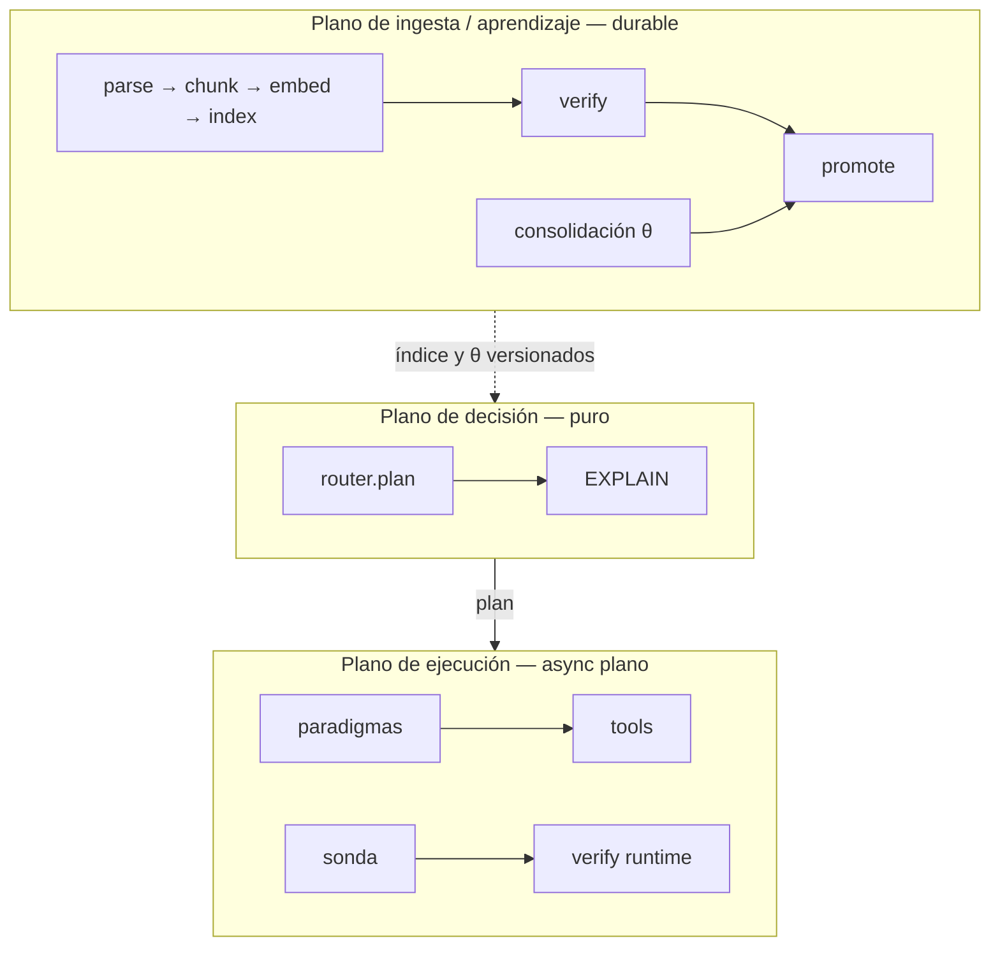
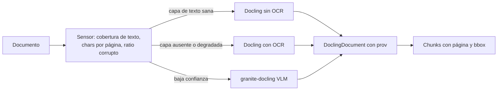
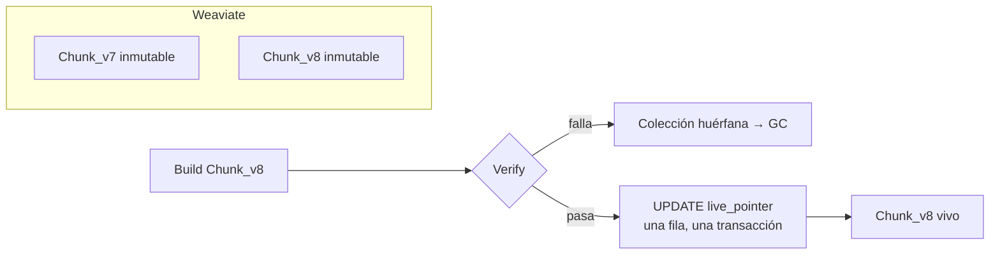

# Arquitectura de plataforma de MAPO

**Estado del documento: PROPUESTA.** Ninguna de estas piezas está ejecutada. Bajo la
regla del proyecto (`DISENO.es.md` §2), nada de acá se describe como capacidad entregada
ni entra al paper hasta ejecutarse y medirse. Este archivo fija decisiones de
infraestructura con su justificación y su condición de reversa, para que no se
re-litiguen cada vez.

`DISENO.es.md` define la arquitectura **lógica** — factibilidad, creencias, garantía,
ruteo, EXPLAIN — y su deuda. Este documento define la **física**: dónde corre, con qué
persistencia, con qué ingesta y con qué backend.

Punto de partida real: hoy el producto persiste en JSONL bajo `results/` y recibe los
documentos como un dict en memoria (`app/serve.py`, `Request.documents`). Eso alcanza para
el banco y no alcanza para un producto.

**Y sobre el streaming, con la precisión que faltaba** (2026-08-29): `_answer_stream`
(`serve.py`) **sí** emite los eventos tipados con `yield`, y `Event.as_sse()`
(`events.py`) los serializa. Lo que no existe es el **endpoint**: `answer` es `def`, no
`async def`, y consume el generador entero para devolver un dict. O sea que la escalera de
decisión ya tiene quién la produzca y le falta el caño — que es `E-3` en `PRODUCTO.es.md`,
y viene con la guarda de §6.1: **A3 buffea la respuesta hasta verificar las citas**.

## 0. Restricciones fijadas por el autor (2026-08-27)

| Restricción | Valor |
|---|---|
| Despliegue | On-prem / Docker, VM propia. Sin dependencia de nube salvo la API del modelo. |
| Motor vectorial | Weaviate. |
| Tenencia | Single-tenant. `tenant_id` queda en el esquema, sin RLS. |

Referencia interna consultada: un sistema anterior del autor, en producción y FUERA de
este repo, ya corre Weaviate, Docling + PyMuPDF4LLM, Redis Streams y workers. Se toma de
ahí lo que funciona y se corrigen las cosas que ahí están resueltas de una forma que MAPO
no puede copiar. Se lee, no se importa — la misma regla que rige `legacy/`, y por la regla
del repo ese sistema no se nombra.

---

## 1. Tres planos, tres respuestas distintas

El error a evitar es elegir *un* orquestador para todo. MAPO tiene tres planos con
requisitos opuestos:

| Plano | Latencia | Durabilidad que necesita | Respuesta |
|---|---|---|---|
| **Decisión** (`router.plan`) | µs, puro, sin I/O | ninguna: es una función | Python puro. Sin framework. |
| **Ejecución** (paradigmas, sonda, tools) | segundos, streaming | reintento por paso | async plano + adapter de durabilidad |
| **Ingesta / consolidación** | minutos a horas | fan-out, reanudable, idempotente | driver durable |

La regla que ordena todo:

> **La durabilidad es un adapter, no un modelo de programación.**

Un paradigma sigue siendo `async def paradigm(ctx) -> Answer`. Si mañana hay que
envolverlo en un motor durable, se envuelve; no se reescribe. Eso es lo que preserva el
isomorfismo banco↔producción que `CLAUDE.md` protege: el banco mide exactamente las
funciones que producción ejecuta.



---

## 2. Orquestación: no Temporal todavía, no LangGraph nunca

### 2.1 Temporal: la elección correcta sobre el plano equivocado, y prematura

Temporal resuelve exactamente lo que la ingesta necesita: fan-out por unidad en task
queues, reintentos declarados, idempotencia, timers, señales de cancelación, e historia
que sobrevive a un deploy. La intuición a favor —reintentos, workflows, colas— es
correcta sobre **ese** plano.

Tres razones para no adoptarlo ahora:

1. **Dos determinismos que compiten.** Temporal replaya código de workflow desde su
   event history: es determinismo de *orquestación*. MAPO replaya una *decisión* desde
   historia canónica de creencias + digest de reglas + digest de θ, sin invocar al modelo
   (`app/README.es.md`, contrato de determinismo). Si la decisión vive dentro de un
   workflow, el certificado EXPLAIN pasa a ser derivado de un store operacional. El
   ledger epistémico tiene que sostenerse solo y ser auditable sin el orquestador.
2. **Costo operativo on-prem.** Temporal self-hosted son cuatro contenedores o más
   —server, su propia base, visibility, UI— antes de la primera línea de MAPO. Para un
   producto que todavía no capturó brecha neta positiva contra el mejor fijo, es
   infraestructura que no compra medición.
3. **El plano de query empeora.** Partir una respuesta de tres segundos en doce
   activities agrega round-trips al server y no resuelve el streaming de tokens: habría
   que sacarlos por fuera igual. `CLAUDE.md` ya lo decidió —"en el plano de query queda
   como envoltorio opcional, no como requisito"—; acá queda el detalle de por qué.

### 2.2 LangGraph: descartado, no pospuesto

- Los paradigmas **son** la unidad medida. Reescribirlos como grafos cambia lo que
  el banco mide: viola la regla de isomorfismo de raíz.
- Sus checkpointers guardan estado *entre* nodos, no *dentro*. Las olas de
  `dag_strategy` y el bucle de la sonda son intra-nodo: no compraría durabilidad
  justamente donde hace falta.
- LangGraph quiere el grafo fijo en tiempo de construcción. La tesis de MAPO es que la
  estructura de control se elige **por request** con un router determinista. Es un
  competidor de lo que se vende, no un anfitrión.
- Evidencia local: `legacy/agentic/` son 8.549 LOC de LangGraph, sin ensamblado de grafo
  y con cero tests. Ese precio ya se pagó una vez.

### 2.3 Lo que se adopta

**Fase 0 — ahora: work table en Postgres.** `SELECT ... FOR UPDATE SKIP LOCKED`.
Aproximadamente doscientas líneas, cero infraestructura nueva, y dedupe transaccional
gratis porque vive en la misma base que el ledger. Cada paso es idempotente y
direccionado por hash de contenido, que es lo que hace reversible la decisión.

**Fase 1 — cuando duela: DBOS.** `pip install`, el mismo Postgres, decoradores
(`@DBOS.step`, `@DBOS.workflow`) sobre funciones que siguen siendo Python plano. Su
ventaja decisiva para MAPO no es la comodidad: el paso y su registro de durabilidad
**commitean en la misma transacción**. Para la promoción de θ eso significa que "instalé
la candidata" y "quedó registrada" no pueden divergir nunca. Cierra la deuda de
`DISENO.es.md` §5.8 con una propiedad del motor en lugar de con disciplina.

**Fase 2 — Temporal, sólo si aparece uno de estos disparadores.** Quedan escritos para
que la decisión no se vuelva a discutir:

- un gate A3 que deba quedar parkeado días esperando aprobación humana, con timers;
- fan-out sobre más de una máquina;
- un segundo lenguaje o servicio en el pipeline.

### 2.3bis Spike ejecutado (2026-09-05): el autor decide probar Temporal

El autor decidió probar Temporal para la ingesta, las tareas asincrónicas y el
fan-out/fan-in de agentes, antes de que dispare ninguno de los tres gatillos de §2.3. Por
la regla del repo, primero se corrió y después se escribe: el spike está en
`spikes/temporal/` (`README.es.md`, `RESULTADO.md`) y pasó cuatro pruebas contra un
`temporal server start-dev` local con actividades stub, sin llamadas al modelo:

- caída del worker entre `verify` y el flip de `live_pointer`: los cinco pasos previos
  corrieron una sola vez y `promote` lo completó otro worker, 7,4 s en total;
- un 429 con hora de reset convertido en timer durable del server, con el worker matado
  durante la espera: el workflow durmió 5,99 s y completó en otro worker;
- reingesta del mismo hash rechazada con `REJECT_DUPLICATE`, tabla `chunk` sin cambios;
- fan-out de cinco agentes con `asyncio.gather` en el workflow, una rama reintentada por
  RetryPolicy y otra reejecutada tras timer durable sin afectar al resto.

Dos parámetros salieron de medir, no de leer: `heartbeat_timeout` en toda actividad
(sin él la caída se detectó a los 20 s del `start_to_close`, con él a los 3 s) y
`sticky_queue_schedule_to_start_timeout` bajo en el `Worker` (el default de 10 s retenía
el workflow task en la cola del worker muerto).

Qué cambia y qué no. El plano de ingesta y el fan-out de agentes pasan a tener a Temporal
como candidato en evaluación, y el `not_before` de la work table que este documento
hubiera necesitado para esperas largas con hora conocida ya no hace falta: es
`workflow.sleep`. La razón 1 de §2.1 se sostiene con una regla, no con una prohibición:
el workflow sólo orquesta; `mapo.core` nunca corre dentro de uno y la decisión no aparece
en la event history. La razón 3 no cambia: el plano de query sigue en §6.

La razón 2 se midió el mismo día, más tarde: server `temporalio/auto-setup` con esquema en
el Postgres 18 del ledger (bases `temporal` y `temporal_visibility`) más `temporalio/ui`,
en contenedores `wslc` (`infra/wslc/stack.ps1`, `infra/README.es.md`). El spike pasó igual
que contra el server de desarrollo (7,8 s, 10,0 s, duplicado rechazado, fan-out 7,1 s). La
VM de contenedores pasó de 763 MB vacía a 1.248 MB con Postgres, Temporal y UI corriendo.
Ése es el costo operativo: dos contenedores más que §7 y dos bases en el Postgres que ya
existe.

### 2.4 Por qué la fase 0 alcanza

`chat/batch/services/redis_task_queue.py` son 612 líneas de cola artesanal: Redis
Streams, consumer groups, XACK, DLQ, locks, heartbeat, dedupe y cancelación. Corre en
producción y aun así no da replay ni exactly-once. Es el argumento a favor de **no**
volver a escribirla: o es una work table de cincuenta líneas, o es un motor durable de
verdad. El punto intermedio ya se probó y cuesta 612 líneas de mantenimiento.

---

## 3. Lectura de documentos: Docling primario, sensor barato adelante

`pymupdf4llm` es rápido y produce buen markdown. **No sirve como extractor primario de
MAPO**, y la razón no es de calidad: no emite anclas de bloque estables. La procedencia
`OBSERVED` exige que un verificador ligue una afirmación a evidencia concreta
(`DISENO.es.md` §4.2). Sin `(página, bbox)` no hay cita verificable; hay markdown.

**Docling** emite `DoclingDocument`: cada ítem con `prov` —página y bounding box—, tablas
como estructura, orden de lectura resuelto, y un chunker que preserva esa procedencia.
Licencia MIT. Es cinco a treinta veces más lento y arrastra uno o dos gigabytes de pesos,
y eso es aceptable porque la ingesta es offline y batcheada.

**Marker queda descartado por licencia** —restringe uso comercial sobre un umbral de
facturación—, no por calidad.

### 3.1 Las dos correcciones sobre el sistema de referencia

`chat/batch/services/document_service.py` hace dos cosas que MAPO no debe copiar:

1. **Exporta a markdown y descarta la procedencia** (`_export_docling_with_pagebreaks`).
   MAPO persiste el `DoclingDocument` serializado como artefacto content-addressed y
   deriva el markdown desde ahí. El markdown es una vista; la fuente es el documento
   estructurado.
2. **Parsea dos veces los PDF escaneados**: corre Docling sin OCR, cuenta caracteres, y
   si hay menos de cien vuelve a correr Docling con OCR. MAPO usa un **sensor barato**
   —cobertura de capa de texto por página, caracteres por página, ratio de caracteres
   corruptos— para decidir `do_ocr` **antes** de la primera pasada.

Esa escalación es la tesis del producto aplicada a la ingesta: una señal contable y
determinista decide; nunca "corré siempre el caro". Y el resultado del sensor se registra
como creencia `COMPUTED` del documento, no como heurística escondida en una rama.



### 3.2 Alerta de licencia

**PyMuPDF es AGPL.** Usarlo aunque sea como sensor linkea el producto. Para el sensor va
**`pypdfium2`** —BSD, y ya es uno de los backends de Docling—, o se compra la licencia de
Artifex. Hay que resolverlo antes de que esto sea producto, no después.

### 3.3 Tier de escalación

`granite-docling` (VLM de 258M) como contenedor propio, para páginas donde el sensor
marca baja confianza. Sin dependencia de nube, consistente con la restricción on-prem.

---

## 4. Weaviate y el commit en dos stores

Weaviate está fijado y hay razones buenas: ya corre en el sistema de referencia (1.38.x,
`vectorizer: none`, embeddings externos), da **hybrid nativo** —BM25 más vector, con fusión—, filtros con
índice de payload propio, y named vectors.

**Mejora inmediata sobre el sistema de referencia:** ahí sólo se usa `near_vector` — ni
una llamada a `query.hybrid` ni a BM25 en todo su repo. MAPO usa **hybrid con `alpha`
declarado** y rerank cross-encoder sobre top-40 → top-8. La receta de cuatro ramas más
RRF más rerank de `legacy/agentic/subgraphs/semantic_search.py` se porta como *diseño*,
no como código.

### 4.1 El problema que Weaviate introduce

Con Weaviate, el ledger epistémico (Postgres) y el índice viven en stores distintos, así
que `VerifyIndex → Promote` deja de ser una transacción. La solución es no necesitar una:

- **Una colección por versión de índice**: `Chunk_v7`, `Chunk_v8`. Inmutables una vez
  promovidas.
- **Postgres es la única autoridad sobre qué versión está viva**: la tabla `live_pointer`
  de fila única.
- Promover es: construir `Chunk_v8` → verificar → **un UPDATE de una fila en Postgres**.
  Weaviate no se muta en el flip. Si el flip falla, la colección nueva queda huérfana y la
  recolección la limpia; nunca queda un índice a medio promover.



Una versión de índice fija: `embedder + dim + normalización + parser_version +
chunker_version + hash de manifiesto del corpus`. Eso es lo que hace replayable una
decisión: si cambia cualquiera de esos campos es otro índice, y el EXPLAIN lo dice.

### 4.2 La fusión se clava, no se hereda (decisión del autor, 2026-08-29)

**`fusionType: rankedFusion` explícito en toda colección.** No es una preferencia de
estilo: **Weaviate cambió su default de RRF a Relative Score Fusion en la v1.24**, así que
un cluster que se actualiza sin fijarlo cambia de método de fusión **en silencio**. El
banco fusiona por RRF sobre rangos (`RRF_K`, `app/retrieval.py`), y si producción fusionara
distinto, el banco mediría otra cosa que la que se ejecuta — que es el único modo de falla
que este documento existe para evitar.

**Cuál de las dos, decidido midiendo y no argumentando.** Se implementaron las dos en el
banco (`HybridRetriever(fusion=...)`) y se compararon por `recall@k` contra las unidades
portadoras que el corpus declara — gratis, porque la fusión opera sobre rankings ya
computados y los embeddings están cacheados:

| corpus | fusión | R@1 | R@3 | R@5 | R@10 |
|---|---|---|---|---|---|
| previo a K-6 | RRF | 0,454 | 0,624 | 0,709 | 0,791 |
| previo a K-6 | relative_score | 0,472 | 0,652 | **0,763** | 0,825 |
| con entidades (K-6) | RRF | **0,532** | **0,797** | 0,899 | 0,971 |
| con entidades (K-6) | relative_score | 0,508 | 0,772 | 0,909 | 0,971 |

**El efecto se da vuelta según el corpus y en los dos queda dentro del ruido** (máximo 1,72
errores estándar en el viejo; ≤0,62 en el nuevo). No hay evidencia de que ninguna sea
mejor, así que la decisión pasa a otro criterio: **RRF**, porque no depende de una
normalización min-max cuyo resultado se mueve cuando cambia el *peor* elemento de la lista,
y porque es la fusión bajo la que corrió todo el registro.

Lo que **no** es opcional: banco y producción usan **la misma**. Si algún día se elige
Relative Score, se cambia en los dos lados a la vez y con el número que lo justifique.

### 4.3 El analizador es parte del contrato, no un detalle del motor

La tokenización decide qué puede encontrar BM25, y una diferencia ahí hace que el banco y
producción busquen distinto aunque los dos digan «BM25». **La colección declara su
analizador y tiene que coincidir con `app/retrieval.tokenise`.**

Se descubrió midiendo, y era un defecto real: el banco filtraba todo token de uno o dos
caracteres (`len(t) > 2`), lo que con el corpus previo no costaba nada —ningún nombre traía
iniciales— y con el corpus de entidades **destruía la única señal que desambigua**:

    tokenise("M. Cavallero")  ->  ['cavallero']
    tokenise("I. Cavallero")  ->  ['cavallero']      <- IDÉNTICO

Corregido a lo que hace un motor real: **sin filtro de largo, con lista de palabras
vacías**, dejando que el IDF pondere. El mismo par pasó a puntuar 0,875 contra 0,182.

### 4.4 NER en la ingesta, y por qué eso no es una función de la base

**Ninguna base de datos hace NER**: lo que ofrecen Weaviate, OpenSearch y Elastic es un
pipeline que corre *un modelo* durante la ingesta. El modelo ya lo tenemos. Así que el NER
vive en la **etapa de ingesta** (`app/ingest.py`), y tiene que **agrupar, clusterizar y
deduplicar** superficies: sin eso `M. Cavallero` y `Marta Cavallero` son dos nodos
distintos y el grafo se fragmenta — con el corpus de entidades eso es peor que no tener
NER.

### 4.5 Los dos motores que se evaluaron y no se eligieron

- **ClickHouse — descartado, y no por versión.** Desde 25.6 tiene HNSW y sus índices
  full-text llegaron a GA, pero es un *acceleration engine, not a relevance engine*: **no
  soporta TF-IDF ni BM25** y no guarda posiciones de palabra (hay issue abierto pidiendo
  Okapi BM25). Sin scoring no hay ranking, y sin ranking no hay fusión: `hybrid` combina
  **rangos**, no filas. Sirve como store analítico, no como motor de recuperación.
- **OpenSearch 2.19 — evaluado, no elegido.** Es el que más se acerca a las tres cosas:
  hybrid como compound query más search pipeline de normalización, k-NN nativo, y desde
  **2.14 el ML inference processor**, que corre modelos en la ingesta con NER nombrado
  explícitamente entre los tipos soportados. Queda como **puerta de salida documentada**:
  si el NER en ingesta se vuelve el cuello, es el candidato, y el `Retriever` Protocol de
  §4.2 hace que sea una clase y no una migración.

### 4.6 Lo que NO entra al banco

**Weaviate va en el producto y no en el banco** (decisión del autor, 2026-08-29). El banco
mantiene su recuperación en proceso —BM25 propio, denso sobre vectores cacheados, RRF— por
la regla del repo: si el ejecutor necesitara un runtime para correr, dejaría de medir lo
que producción ejecuta. Y hay una razón medida además de la regla: a la escala del banco
—1.689 vectores, 107 MB— el índice no es cuello de nada, así que meterlo cambiaría *qué se
mide* (el BM25 y la tokenización pasarían a ser los de Weaviate) sin comprar velocidad.

Lo que sí queda como obligación: **verificar la coincidencia**, no suponerla. Misma fusión
(§4.2) y mismo analizador (§4.3), comprobados contra la colección viva.

---

### 4.7 Puerta de salida

Todo detrás del `Retriever` Protocol que ya existe (`app/retrieval.py`). Si Weaviate
dejara de alcanzar, cambiar de motor es una clase, no una migración.

---

## 5. Postgres como ledger epistémico

Postgres es correcto para "pesos y aprendizajes", pero llamarlo así lo subestima.

**Corrección respecto de una versión anterior de este documento.** Las dos deudas que
acá se citaban como bloqueantes —pseudorreplicación y fuga del bloque final— ya están
cerradas en código (`DISENO.es.md` §5, "Cerrado 2026-08-27"): un episodio es una celda
`(tarea, paradigma)` en `runner.py`, la candidata se ajusta sin el bloque final en
`consolidation.py`, y `app/certify.py:98` tiene un `FinalLedger` que rechaza la segunda
certificación contra el mismo mundo final. El esquema de abajo **no cierra esas deudas:
las persiste**. Hoy la guarda vive en proceso y en un archivo; en Postgres sobrevive a
un reinicio, a dos workers concurrentes y a una auditoría externa. Eso es lo que agrega.

```sql
-- Persiste la regla de runner.py: un episodio es una celda, no un trial.
-- La PK hace imposible que dos workers reintroduzcan la pseudorreplicación.
create table episode (
  task_id        text not null,
  paradigm       text not null,
  policy_version int  not null,
  split          text not null check (split in ('train','val','final')),
  utility        double precision not null,
  cost_tokens    int  not null,
  was_best       boolean not null,
  n_trials       int  not null check (n_trials >= 3),
  primary key (task_id, paradigm, policy_version)
);

-- La contraparte durable de FinalLedger (app/certify.py:98): "tocar final una sola vez"
-- deja de depender de un archivo local y pasa a ser una restricción de integridad.
create table final_use_ledger (
  claim_id             text primary key,
  dataset_manifest_hash text not null,
  certificate_id       uuid not null references promotion_certificate(id),
  used_at              timestamptz not null default now()
);

-- Append-only real: trigger que aborta UPDATE y DELETE.
-- verify_chain() sigue siendo una función pura sobre estas filas.
create table belief_log (
  seq        bigserial primary key,
  request_id text  not null,
  prev_hash  bytea not null,
  hash       bytea not null,
  payload    jsonb not null
);

create table index_version (
  id                    serial primary key,
  collection            text not null unique,   -- Chunk_v8
  embedder              text not null,
  dim                   int  not null,
  parser_version        text not null,
  chunker_version       text not null,
  corpus_manifest_hash  text not null,
  verified_at           timestamptz,
  promoted_at           timestamptz
);

-- Fila única: el flip atómico de promoción.
create table live_pointer (
  singleton        boolean primary key default true check (singleton),
  index_version_id int not null references index_version(id),
  policy_version   int not null references policy_bundle(version)
);
```

Además: `policy_bundle` (inmutable, con digest), `promotion_certificate` (liga
incumbente, candidata, manifiesto de datos, split y medición), y `request_log` con el
EXPLAIN en JSONB.

**Artefactos grandes fuera de la base.** PDF originales, `DoclingDocument` serializado y
bundles de θ van a un volumen content-addressed (`sha256/aa/bb/<hash>`); Postgres guarda
el hash y el puntero. MinIO recién cuando haya que compartir el store entre máquinas.

**Lo que se conserva del diseño actual.** La cadena hash de `app/store.py` y el cache
content-addressed de `app/llm.py` y `app/embeddings.py`. Ese cache es lo que hace que el
replay sea gratis: migrar a Postgres y a un volumen no lo elimina, lo reubica.

**Sobre el vocabulario.** El digest sigue siendo SHA-256 y sigue llamándose digest. No es
firma criptográfica y el documento no debe decir que lo es (`DISENO.es.md` §2).

---

## 6. Backend: FastAPI con SSE resumible

- **Un endpoint**: `POST /v1/answer` → `text/event-stream`.
- **Eventos tipados, no sólo tokens**: `decision` (plan y EXPLAIN, emitido **antes** de
  generar nada — es el diferencial del producto: se ve *por qué* antes que *qué*),
  `probe`, `paradigm.step`, `token`, `citation`, `usage`, y un terminal
  `done` | `gated` | `deferred`. Los tres terminales son distintos y no se confunden:
  esa distinción es la razón de existir de `serve.py`.
- **Stream desacoplado del cómputo**: el trabajo corre como tarea de fondo escribiendo a
  un Redis Stream por `request_id`; el endpoint SSE lo taila desde `Last-Event-ID`. Si se
  corta la conexión, el trabajo sigue y el cliente reconecta sin reiniciar.
- **La capa de decisión queda síncrona y pura**, invocada inline. Sólo el I/O es async.
- **`GET /v1/decide`** —decide sin ejecutar— y **`POST /v1/replay`** —reproduce un plan
  desde su EXPLAIN, sin red— son endpoints de primera clase. El replay sin modelo es el
  claim central del producto: tiene que ser invocable, no una promesa del paper.

### 6.1 Lo que el dial A0–A3 le impone al transporte

Hacer streaming de tokens antes de verificar citas contradice "citado-o-callado". En A3
se streamean eventos de progreso y **la respuesta se buffea** hasta que las citas
verifiquen. El dial de garantía no es sólo un filtro sobre el espacio de paradigmas:
cambia la forma del transporte. Es una consecuencia del diseño que no estaba escrita en
ningún lado.

### 6.2 Deuda de frontera que esto cierra

`serve.py` importa hoy `grading` del banco para verificar peldaños de cascada
(`DISENO.es.md` §3). Se reemplaza por `exec/verify.py`: un verificador de runtime que
liga una cita a `(chunk_id, página, bbox)` en la versión de índice viva. No sabe qué es
gold. Docling con procedencia es lo que lo hace posible.

---

## 6bis. Observabilidad: Langfuse con su propio SDK, sin OpenTelemetry en el medio

> **Decisión del autor (2026-08-29).** Vale la UI, y el SDK traza Python arbitrario y no
> sólo llamadas al modelo. **No se instala OpenTelemetry como capa intermedia**: por
> dentro el SDK ya es OTel, y ponerlo a mano agrega un plano que nadie pidió.

### La decisión, y lo que se cede a cambio

Planteé instrumentar con OTel y apuntar el exporter a Langfuse — cuesta lo mismo hoy y
deja cambiar de backend cambiando un endpoint. El autor decidió lo contrario **y la
decisión manda**: la ruta simple. Lo que se cede queda escrito para que sea una decisión y
no una sorpresa: si algún día se cambia de backend, la instrumentación se reescribe, porque
los decoradores y el cliente son de Langfuse.

Lo que **no** se cede: el SDK de Python configura OTel solo al inicializarse, así que no
hay nada que montar. Y para otros lenguajes —si algún día entra uno— ahí sí habría que
armar OTel a mano contra el endpoint OTLP (`/api/public/otel`, HTTP JSON o protobuf; **no
hay gRPC**).

### Lo que se traza, y es la mitad difícil

**Trazar las llamadas al modelo es lo fácil, y no es lo que distingue a este producto.**
Cualquier tracer las muestra. Lo que hay que ver es **la decisión**, y el SDK traza
funciones Python arbitrarias, así que puede:

| span | qué tiene que quedar registrado |
|---|---|
| **factibilidad** | qué paradigmas se podaron por aritmética, con la cota y el número que la cruzó — **antes de que exista un token** |
| **creencias** | cada proposición asentada, con su procedencia y su origen |
| **dial** | `max(pedido, piso de creencias, piso aprendido)` y **cuál de los tres ganó** |
| **ruteo** | la región, los brazos admisibles, el margen, y si **se abstuvo** |
| **contratos** | el veredicto por ranura: qué se emitió y qué se rechazó, con el motivo |
| **guard y board** | expulsiones, rescates, y la cobertura que el agente vio |

> **Una traza dice qué llamadas ocurrieron. `EXPLAIN` y el ledger dicen qué creyó el
> sistema y por qué decidió eso.** Langfuse no reemplaza a ninguno de los dos: los hace
> mirables. El ledger sigue siendo la fuente de verdad, con su cadena de hashes.

### Dos cosas que NO se delegan, y son las que evitan que el registro se corrompa

**1. Los precios siguen saliendo de `config/tariffs.json`.** Langfuse trae su propia tabla
de costos por modelo. Usarla sería un **segundo lugar donde vive el mismo hecho**, y el que
nadie mantiene es el que miente. El costo que se reporta lleva su procedencia estampada
(`usd@nano/2026-08-28`); el número de la UI es indicativo y no entra a ningún reporte.

**2. La evaluación NO es de Langfuse.** Su historia de evals gira alrededor de
**LLM-as-judge**, y acá el gold se verifica **independiente del generador** y se califica
por **exact match, sin juez**. Esa mitad de la herramienta no se usa, y decirlo es parte de
la decisión: *Langfuse entra como observabilidad, no como evaluador.* Si algún día aparece
un score en su UI, no es el número del banco.

### El banco no se toca

`lab/` sigue con su `.jsonl` por fila y su traza por llamada en `results/<modelo>/traces/`,
sin dependencia. **El banco es sin framework por diseño**: un SDK adentro del instrumento
que mide cambia lo que mide. Y el `.jsonl` es replayable, entra en un diff, y se puede
releer dentro de un año sin que ningún servicio esté vivo.

La frontera es la misma de siempre: **el banco importa al producto; el producto no sabe que
el banco existe.** Langfuse vive del lado del producto.

### La pila, y lo que Langfuse mismo dice de ella

Self-hosted son **seis piezas**: Postgres, **ClickHouse**, Redis/Valkey, un blob store
S3-compatible (MinIO en el compose oficial), el web server y un worker. Todas con
**timezone en UTC**, que es requisito y no recomendación.

`docker-compose` es *«la forma más simple de probarlo»* y **su propia documentación lo
desaconseja para producción**: *«le falta alta disponibilidad, capacidad de escalar, y
backup»*, y recomiendan Kubernetes.

**Para este caso concreto eso pesa menos de lo que parece, salvo una cosa.** El producto es
**single-tenant y on-prem**: no hace falta escalar horizontalmente ni alta disponibilidad —
si Langfuse se cae, el producto sigue respondiendo, porque la traza es observación y no
camino crítico. **Lo que sí hace falta es el backup**, y ése es el único ítem de los tres
que hay que resolver a mano.

> **Y es más pesado que lo que ya se pospuso.** ClickHouse es un segundo motor de base con
> su propia operación, y Temporal —una sola dependencia— quedó diferido hasta que se
> cumpla un gatillo escrito. Esto entra igual porque el autor decidió que la UI lo vale;
> queda anotado para que la asimetría sea visible y no un olvido.

### Orden

Entra **con el producto, no antes**. Hoy no hay servicio que trazar: `serve.py` existe y el
motor no. Cuando el producto arranque, el primer span es el de **factibilidad** — si sólo
se instrumenta una cosa, que sea la que ocurre antes del primer token.

## 7. Topología on-prem

```
mapo-api        FastAPI + uvicorn                        :8000
mapo-worker     ingesta + consolidación (work table)
postgres:18     ledger epistémico + work table
weaviate:1.38   vectorizer none, hybrid, gRPC            :8080 / :50051
redis:8         bus de eventos para SSE resumible
docling-vlm     tier de escalación OCR   (perfil opcional)
tei             embeddings on-prem       (perfil opcional)
```

Volúmenes: `pgdata`, `weaviate_data`, `artifacts` (content-addressed).

**Runtime local (2026-09-05): `wslc`, no Docker Desktop.** Contenedores nativos de WSL
2.9.10 (pre-release), misma sintaxis que Docker, sin `compose`: lo reemplaza
`infra/wslc/stack.ps1`. Postgres 18 ya corre ahí con el esquema de §5 aplicado
(`infra/postgres/001_ledger.sql`) y las guardas SQL de §10 en verde
(`infra/postgres/test_ledger.sql`). Pendiente del paso 1 de §9: migrar el JSONL y el adapter.

Redis es opcional con una sola réplica de `mapo-api` —bus in-process detrás del mismo
port `EventBus`— y pasa a obligatorio en cuanto haya dos.

### 7.1 Embeddings

Se mantiene el deployment de embeddings que ya funciona y que ya tiene cache
content-addressed. Si más adelante se quiere cien por ciento on-prem, `EmbeddingGemma`
(300M) o `Qwen3-Embedding` (0.6B) en un contenedor TEI; ambos son Matryoshka, lo que
permite guardar 768 dimensiones y consultar en 256 para una primera pasada barata. Es un
switch de configuración detrás de `app/embeddings.py`, no una reescritura.

**No cambiarlo ahora.** No es el cuello de botella, y cambiar de embedder invalida el
índice entero.

---

## 8. Layout del repo y la regla que lo mantiene honesto

```
mapo/
  core/     PURO. sin I/O, sin async, sin red.
            features · feasibility · beliefs · rules · assurance · router · policy · explain
  exec/     async plano, sin framework.
            paradigms/ · probe · verify · tools
  data/     ports.py (Protocols) + adapters: pg/ · weaviate/ · blob/ · bus/
  ingest/   parse (sensor + docling) · chunk · embed · index · verify · promote · jobs
  learn/    consolidation · splits · certificate        (offline únicamente)
  api/      app · sse · auth
bench/      importa mapo/. jamás al revés.
```

Dos reglas mecánicamente verificables, escritas como test:

1. `bench` puede importar `mapo`; `mapo` no puede importar `bench`.
2. `mapo.core` no importa `mapo.exec`, `mapo.data`, ni ninguna librería de I/O.

La regla 2 es la que impide que la capa de decisión vuelva a mezclarse con la ejecución,
que es exactamente lo que pasó en `app/`.

---

## 9. Orden de implementación

La validez del aprendizaje ya se saneó en código. Lo que falta es que esas guardas
sobrevivan fuera de un proceso: hoy un reinicio, un segundo worker o un auditor externo
no tienen cómo verificarlas. Por eso la persistencia va primero y REC va último.

1. Esquema Postgres y migración del ledger desde JSONL: hace durables las guardas que
   `runner.py`, `consolidation.py` y `certify.py` ya imponen en proceso.
2. `data/ports.py` y adapters; mover `mapo.core` a puro, con el test de imports.
3. Ingesta fase 0: sensor `pypdfium2` → Docling con procedencia → chunk → embed →
   `Chunk_vN` → verify → flip de `live_pointer`.
4. `exec/verify.py` de runtime; sacar `grading` de `serve.py`.
5. API SSE con eventos tipados y `/replay`.
6. Recién entonces REC (`PATRON_REC.es.md`), sobre datos cuya validez ya no esté en duda.

---

## 10. Verificación

| Qué se prueba | Cómo |
|---|---|
| Regla de frontera | Test que falla si `mapo` importa `bench`, o si `mapo.core` importa I/O. |
| Replay sin red | Fijar creencias, reglas, θ y versión de índice; reproducir el plan sin una sola llamada al modelo. |
| Anti-pseudorreplicación | Insertar dos trials del mismo `(task, paradigm, policy_version)` debe violar la PK. |
| Final una sola vez | Dos `promote` con el mismo `claim_id`: el segundo falla. |
| Promoción atómica | Matar `mapo-worker` entre `verify` y el flip: `live_pointer` sigue en la versión anterior y la colección nueva queda huérfana. |
| SSE resumible | Cortar la conexión a mitad de respuesta y reconectar con `Last-Event-ID`: no debe reejecutarse el paradigma. |
| Procedencia real | Toda cita de una respuesta A2/A3 resuelve a `(chunk_id, página, bbox)` en la versión viva del índice. |
| Ingesta idempotente | Reingestar el mismo PDF no crea objetos nuevos (hash de contenido). |

---

## 11. Lo que este documento no decide

- El diseño de REC: vive en `PATRON_REC.es.md` y no cambia por esto.
- Multi-tenant y RLS: `tenant_id` queda en el esquema, sin RLS, por decisión del autor.
- Firma autenticada de certificados: hoy hay digest SHA-256 y se sigue llamando digest.
- Si Weaviate deja de escalar: la puerta de salida es el `Retriever` Protocol, no una
  migración.
