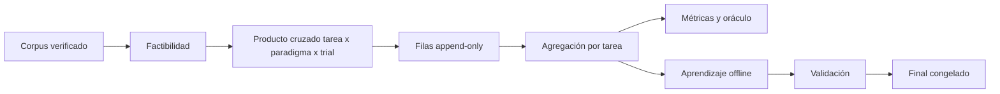

# Banco de medición

El banco mide exactamente las funciones que el producto ejecuta. No es un runtime de
producción ni debe filtrar gold hacia la capa de decisión.

## Flujo experimental

## Separación obligatoria

| Evaluador | Runtime |
|---|---|
| Gold exacto | Pregunta y documentos |
| `cell` | Presupuesto y flags declarados |
| `truth_coupling` | Features computables |
| `truth_horizon_*` | Creencias elicitadas u observadas |
| `relevant_units` | Scope, sin saber dónde está la respuesta |
| F1 y mejor contrafactual | Verificador barato solo cuando realmente existe |

La presencia de una respuesta gold no implica que producción tenga un detector barato.
Conflarlas activa cascadas que un request real no podría ejecutar.

## Unidad estadística

- **Trial:** repetición usada para medir dispersión.
- **Celda agregada:** media de trials de una tarea y paradigma.
- **Episodio de aprendizaje:** una celda agregada, no cada trial.
- **Unidad independiente:** tarea, escenario o mundo, según cómo se haya generado.

El oráculo se calcula después de promediar trials. La marca `was_best` también debe salir
de esas medias. Repetir tres veces una tarea no produce tres ejemplos independientes.

## Infraestructura

Un error de cuota o transporte:

- se registra con costo ya consumido;
- no puntúa como respuesta incorrecta;
- se excluye de estudio, aprendizaje, ruido y consolidación;
- debe quedar elegible para completar el trial faltante.

## Comparación del motor

Toda evaluación del producto reporta:

- utilidad del motor;
- mejor fijo factible;
- siempre-`react`;
- brecha de oráculo;
- fracción capturada;
- piso de ruido por celda;
- costo total, incluidas sondas;
- cobertura, deferral y gates;
- errores de infraestructura excluidos;
- replay de EXPLAIN.

El criterio de éxito es utilidad neta positiva frente al mejor fijo en datos held-out,
no exactitud del router ni cercanía a la etiqueta del oráculo.

## Disciplina de datos

1. Registrar hipótesis y presupuesto antes de correr.
2. Partir por tarea o mundo, nunca por fila.
3. Mantener juntas repeticiones y variantes relacionadas.
4. Usar train para ajustar estadísticas.
5. Usar validación para elegir reglas y umbrales.
6. Congelar candidato y protocolo.
7. Tocar final una sola vez.
8. No reutilizar el final para corregir el mismo claim.

**El punto 7 ya se cumple** (cerrado 2026-08-27, `test_consolidation.py`). La
implementación construía θ con **todos** los episodios y después le entregaba a la guarda de
promoción ese mismo bloque final — o sea, se corregía el propio examen. Hoy **la candidata
se ajusta sin el bloque final**, y el final lo toca únicamente la guarda.

Junto con eso se cerró el punto 2, que fallaba por otro lado: un **episodio** es una celda
`(tarea, paradigma)` con utilidad media, no un trial. Antes tres réplicas de una tarea
contaban como tres evidencias, y una réplica con suerte cobraba un refuerzo que la media de
su paradigma nunca ganó.

Lo que **sigue abierto** de esta lista no es el 7 sino el 8: el mundo final es de un solo
uso y el ledger lo impone, pero eso vale por *claim* — reusarlo para corregir el **mismo**
claim sigue dependiendo de que quien lo escriba no lo intente.

## Artefactos mínimos

- filas crudas con modelo y configuración identificables;
- manifiesto y hash del corpus;
- manifiesto de splits;
- agregados por tarea;
- política incumbente y candidata;
- EXPLAIN por decisión;
- exclusiones de infraestructura;
- certificado de promoción;
- reporte final parseable.
