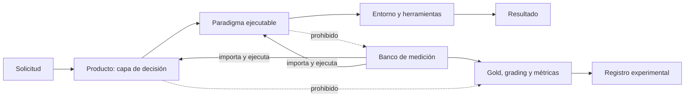
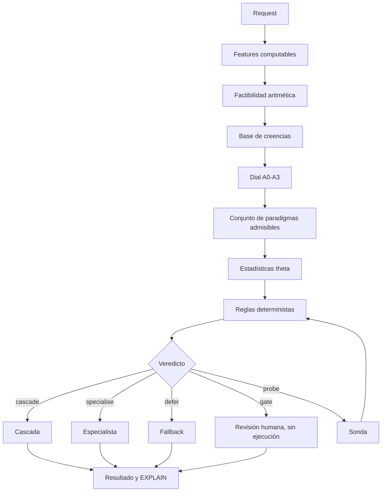
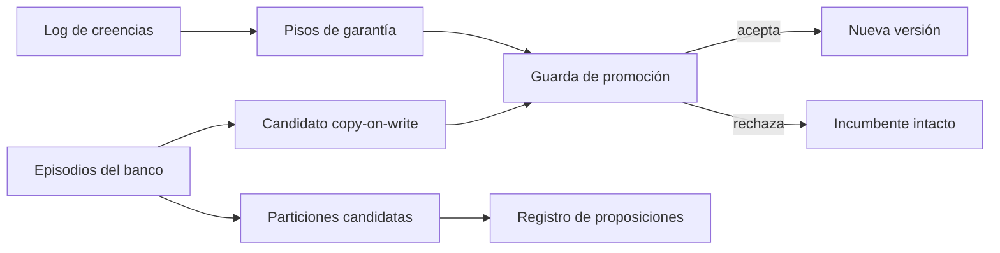

# Diseño y decisiones de MAPO

**Estado del documento:** descripción del ejecutable actual, sus deudas comprobadas y
la dirección aprobada. Este archivo no convierte una propuesta en una capacidad.

## 1. Propósito

MAPO es una capa de decisión delante de la ejecución de agentes LLM. Su objetivo
medible es elegir, diferir o bloquear por solicitud de forma que, sobre un corpus gold
nuevo, obtenga utilidad neta superior a cualquier paradigma fijo del banco, incluido
siempre-`react`.

El resultado P15 demostró que ese objetivo todavía no se cumple: sobre
`gold_transfer`, el motor obtuvo `0,52747` frente a `0,61488` del mejor fijo
(`dag_strategy`). La diferencia fue `-0,08740`; la fracción capturada de la brecha de
oráculo fue `-0,8332`. La estabilidad de decisión sí reprodujo 26 de 26 decisiones.

La lectura de diseño es precisa: MAPO ya puede explicar una decisión, pero todavía no
puede usar esa explicación para reparar de manera segura la información que le faltó.

## 2. Estados de una afirmación

Toda documentación técnica usa uno de estos estados:

| Estado | Significado |
|---|---|
| **Ejecutado** | Existe un camino invocable en el programa y una prueba o registro que lo ejercita. |
| **Medido** | Además de ejecutarse, produjo un artefacto experimental identificable. |
| **Deuda** | Existe parcialmente o su comportamiento contradice la garantía declarada. |
| **Propuesta** | Diseño aprobado, todavía no implementado ni medido. |
| **Falsificado** | Una predicción registrada falló bajo el protocolo declarado. |

Una propuesta no se describe como producto entregado. Una medición sintética no se
presenta como evidencia de campo. Un checksum no se denomina firma criptográfica.

## 3. Frontera de arquitectura

La frontera deseada es:

- **Producto:** factibilidad, creencias, reglas, garantía, ruteo, sondas, política,
  consolidación, persistencia, ejecución y paradigmas.
- **Banco:** corpus, gold, grading, runner, métricas, scripts y pruebas científicas.
- **Dirección permitida:** el banco importa al producto.
- **Dirección prohibida:** el producto no conoce gold, celdas ni métricas del banco.

### Deuda de frontera

`serve.py` usa actualmente el grading del banco para verificar peldaños de una cascada.
La corrección conceptual es una capacidad de verificación de runtime, independiente del
gold usado por el evaluador.

## 4. Flujo actual de una solicitud

### 4.1 Factibilidad

**Estado: ejecutado.**

Antes de seleccionar se eliminan paradigmas que no caben en contexto, presupuesto o
cardinalidad. La decisión es aritmética y no consume inferencia. Esto evita aprender por
ensayo y error una imposibilidad que ya puede calcularse.

### 4.2 Creencias y procedencia

**Estado: ejecutado, con deuda de integración.**

La jerarquía es `COMPUTED > OBSERVED > ELICITED > ASSUMED`.

- `COMPUTED`: función pura del payload; credencia `1,0` obligatoria.
- `OBSERVED`: resultado que un verificador puede ligar a evidencia concreta.
- `ELICITED`: afirmación de un modelo; nunca se convierte en observación por confianza.
- `ASSUMED`: prior débil y reemplazable.

Las reglas toman decisiones; el LLM solo propone lecturas. La base conserva creencias,
pero el camino actual de replanning reconstruye una base nueva y pierde la secuencia
elicitada-observada. Esa pérdida impide una explicación causal completa y limita la
calibración.

### 4.3 Garantía por solicitud

**Estado: perfiles ejecutados parcialmente.**

El nivel efectivo es el máximo entre lo pedido por el caller y el piso derivado de la
solicitud. El nivel restringe procedencia y espacio de patrones. Hoy se aplican el piso
de procedencia, el conjunto admisible y la profundidad máxima. Sellado A3, aprendizaje
online A0 y logging productivo no están plenamente impuestos.

### 4.4 Reglas

**Estado: ejecutado.**

Las reglas son datos ordenados por prioridad y nombre. El orden total evita que una
decisión dependa del orden incidental de un contenedor. La traza registra requisitos,
valores sostenidos, procedencia exigida y motivo tipado de rechazo.

### 4.5 Política aprendida

**Estado: ejecutada parcialmente; la automejora no está cerrada.**

El bundle conserva estadísticas por región y paradigma, pisos de garantía, versión y
digest de integridad. El router usa utilidad media, tasa de victoria, evidencia y margen.
El campo de peso Hebbiano se actualiza y se muestra, pero no participa en la selección.
Por tanto, no se lo considera hoy un mecanismo operativo de decisión.

El digest SHA-256 detecta modificación accidental o no acompañada por un nuevo digest.
No autentica al emisor: cualquiera con acceso de escritura puede recalcularlo.

### 4.6 Sonda

**Estado: ejecutada, con deudas críticas.**

La sonda lee una unidad y permite que un modelo proponga referencias. Solo una referencia
verificada puede elevar acoplamiento a `OBSERVED`; una lectura negativa permanece
`ELICITED` porque una unidad silenciosa no demuestra independencia global.

Deudas:

- siempre selecciona la primera unidad;
- no recompone la región después de observar;
- pierde la base previa de creencias;
- su costo no integra el total de ejecución;
- una referencia en scope puede aceptarse sin demostrar suficientemente la relación;
- si la evidencia sigue faltando, el camino actual puede ejecutar igualmente.

### 4.7 EXPLAIN

**Estado: ejecutado para una decisión; incompleto como certificado integral.**

Incluye acción, paradigma, escalera, gate, necesidad de sonda, exclusiones por garantía,
reglas evaluadas, creencias, versión y digest de theta, y digest del plan.

Para un replay integral todavía faltan el vector/región completa, factibilidad
estructurada, candidatos, digest de reglas y perfiles, identidad de contenido, historia
pre/post sonda y certificado de promoción.

## 5. Aprendizaje actual

### Lo que sí existe

- actualización offline de estadísticas;
- bundle versionado y verificable por digest;
- guarda de promoción contra un conjunto retenido;
- aprendizaje monotónico de pisos desde rechazos tipados;
- búsqueda de particiones con propuesta y validación separadas;
- log de creencias encadenado y auditoría de calibración;
- copy-on-write: el incumbente no se muta durante una propuesta.

### Cerrado (2026-08-27), y por qué era deuda

- **La candidata se ajusta SIN el bloque final** (`consolidation.py`). Antes se ajustaba
  con todos los episodios y después se le entregaba ese mismo bloque a la guarda de
  promoción: la guarda evaluaba contra datos que ya habían formado a la candidata, que
  es marcarse el propio examen. Hoy `final` lo toca la guarda y nadie más.
- **Un episodio es una celda `(tarea, paradigma)` con utilidad media** (`runner.py`).
  Antes cada trial era un episodio, así que tres réplicas de una tarea contaban como
  tres evidencias independientes — pseudorreplicación — y `was_best` calculado sobre
  trials crudos dejaba que una réplica con suerte cobrara el refuerzo que la MEDIA de
  su paradigma nunca ganó.
- **Una sola historia de creencias por solicitud** (`decide.py`). El re-plan posterior
  a la sonda continúa la base de la primera decisión en lugar de abrir una nueva, así
  la observación supersede a la estimación dentro de un único linaje de digest.
- **La región se recalcula después de observar** (`decide.py`). Replanificar bajo la
  región vieja dejaba el request en el bin de "acoplamiento desconocido" que la sonda
  acababa de abandonar.

### Lo que todavía impide llamarlo automejora segura completa

> **Recontado el 2026-08-29 contra el código.** Esta lista tenía siete puntos y cinco ya
> estaban cerrados: se habían arreglado sin tachar el renglón. Una lista de deudas que
> incluye deudas pagadas hace lo mismo que un contador desactualizado — se lee con la
> autoridad de un diagnóstico.

**Cerradas, con dónde verificarlo:**

| deuda | cómo se cerró |
|---|---|
| ~~1. repetir una consolidación reaplica historia ya absorbida~~ | el peso y la cuenta de evidencia no se mueven al reaplicar el mismo registro, y **el bundle declara que salteó** (`already absorbed`). Un episodio nuevo sí entra: la guarda no congela el aprendizaje. `test_science.py` §28 |
| ~~3. algunas particiones usan truth de evaluación o variables posteriores~~ | los ejes están **tipados por cuándo se conocen**: `DECISION_TIME_ATTRIBUTES` (las de φ), `POSTERIOR_ATTRIBUTES` (existen sólo después de correr) y `FORBIDDEN_ATTRIBUTES` (`truth_coupling`, `utility` — el oráculo). Partir sobre un prohibido **levanta**. Los posteriores no se tiran: sirven para diagnosticar, y lo que no pueden es volverse regla |
| ~~4. la calibración persistida no se inyecta en el router~~ | el router lee `self._theta.trusts_elicited` desde el bundle firmado. Antes recibía un `Calibration` que **nadie construía** — cinco sitios lo pasaban y ninguno lo llenaba |
| ~~5. el producto no persiste resultados y creencias~~ | `serve._record` deja rastro alrededor del request entero: sin registro no hay EXPLAIN que auditar, y sin log de creencias la calibración no se computa nunca — así que `trusts_elicited` no se ganaría jamás en producción |
| ~~6. la promoción usa puntos estimados~~ | decide sobre un **intervalo**, no sobre un punto. `test_science.py` §29 |

**Abiertas, y las dos son la misma forma de defecto:**

1. **Las particiones descubiertas se persisten y no gobiernan el router.** La deuda 3
   explicaba a ésta: una regla sólo puede gobernar si se la puede **evaluar en el momento
   de decidir**, y los cuatro ejes originales fallaban eso. Ahora el tipo lo dice en vez de
   que se descubra al intentar cablearlas — pero **cablearlas sigue sin hacerse**.

2. **El peso Hebbiano se actualiza y `router.py` no lo lee nunca.** Con una precisión que
   la versión anterior de este renglón no tenía: **está probado que no puede servir ahí.**
   En el punto fijo `w* = 1,6p − 0,6` es monótona en la tasa de victorias y el router ya
   ordena por esa tasa; una transformación monótona no cambia un argmax. Así que la deuda
   real **no es** conectarlo al ruteo — es que su único sentido vivo, la asociación entre
   **pares ordenados** de tools, produce creencias (`AssociationTable.as_beliefs()`,
   `COMPUTED` sobre `POPULATION`) que **ninguna regla consume**. Es `P-2g`.

> **Las dos abiertas son la misma familia**, y es la que este repo encontró cuatro veces en
> dos días: algo que se declara o se produce y **nadie lee**. `theta_may_learn_online` vivía
> en el perfil sin lector —la invariante se cumplía por casualidad— y hoy la impone
> `serve.py`; `seal_replay` prometía replay sellado y no lo imponía nadie (`X-5h`, cerrado
> el 2026-08-29); `arm_dose` existía y ningún análisis la exigía (`AR-5`, cerrado el mismo
> día). **Ninguna la atrapa `_audit_declarado.py`**, porque en las cuatro el nombre *sí* se
> lee: lo lee quien lo produce. Lo que falta es un consumidor, y eso es una propiedad del
> cruce entre dos módulos, no de un nombre.

## 6. Decisiones de diseño

| Decisión | Motivo | Problema que evita | Alternativa descartada |
|---|---|---|---|
| Factibilidad antes de aprender | Las restricciones duras son computables. | Gastar episodios en planes imposibles. | Hacer que el router aprenda límites aritméticos. |
| LLM como sensor | La inferencia aporta información pero no estabilidad de control. | Que texto probabilístico maneje gates. | LLM como controlador autónomo. |
| Procedencia separada de credencia | Confianza y calidad de evidencia son dimensiones distintas. | Tratar una opinión segura como observación. | Un único score de confianza. |
| Garantía por request | El riesgo no es uniforme. | Cobrar A3 a todo el tráfico. | Modo determinista global. |
| Abstención explícita | El falso positivo puede costar más que perder cobertura. | Forzar una especialización sin margen. | Cobertura obligatoria de 100%. |
| Aprendizaje offline | La política debe permanecer estable durante una solicitud. | Deriva silenciosa dentro del request. | Actualización online de theta. |
| Copy-on-write | Toda propuesta debe poder rechazarse sin alterar producción. | Rollback ambiguo y mutación parcial. | Editar el incumbente in place. |
| Reglas como datos | Deben poder serializarse, compararse y auditarse. | Política escondida en ramas de código. | `if/elif` como fuente normativa. |
| Sin LLM judge | El sesgo del juez está alineado con verbosidad y costo. | Premiar paradigmas caros por estilo. | Evaluación generativa subjetiva. |
| Producto y banco separados | La medición debe observar exactamente lo servido. | Que producción conozca gold o que el banco mida otro sistema. | Dos caminos de decisión. |

## 6bis. El board dirige y el guard acota — y el banco tiene el mecanismo partido

> **Revisión del 2026-08-29**, disparada por una corrección del autor: *«el board o una
> cola de evidencia y pendientes es GENERAL, no de `dag`»*, y *«el guard es para mantener
> el contexto controlado»*. Las dos son correctas y las dos estaban mal modeladas.

### El board no es memoria, es dirección

Un board que sólo acumula hallazgos es un **log**: dice qué pasó y no cambia ninguna
decisión. Lo que dirige una investigación es lo que dice **qué falta**:

| lo que renderiza | qué decide |
|---|---|
| cobertura `N/M` | si seguir o cerrar |
| **NO chequeados**, nombrados | dónde mirar ahora |
| consultas ya emitidas — **no repetir** | qué no volver a gastar |
| directiva derivada del número | la acción siguiente |

Y por eso es **general**. Un agente solo tiene el mismo problema que un grupo: no sabe qué
le falta, no sabe qué ya pidió, y su transcripción se compacta. Que el estado sea
**compartido** entre varios o **propio** de uno es una dimensión distinta de si existe.

**Cómo estaba, y es la trampa de siempre.** La cola llegaba al modelo por dos caminos y
los dos eran particulares: la plantilla del sub-agente de `dag_strategy`, y el retorno de
la tool `board` —que el modelo **llamó 1 vez en 125 llamadas**, 0,8%—. Un agente solo no
podía llevar cola: el factor se prendía, corría entero y medía cero.

**Cómo está ahora**: se inyecta en el **bucle de herramientas compartido**, el único del
repo que manda la declaración de tools, así que alcanza a todo paradigma iterativo.
Reemplaza en vez de apilar —N copias desactualizadas con la más vieja arriba cuestan el
cuadrado de las vueltas— y **un board vacío no inyecta nada**: decir «no hay estado» en
cada vuelta gasta ventana para no informar. `test_science.py` §61, 25 asserts.

### El guard acota, y el banco no lo tiene

La capa anterior —congelada, la única que corrió contra un índice real— acotaba el
contexto por **crecimiento**: si creció más de 20k caracteres en una iteración, expulsa el
`ToolMessage` grande más viejo y **lo reemplaza por un hallazgo extraído y enfocado en la
pregunta**, que va al board. Nunca toca el prompt de sistema, la pregunta ni los mensajes
del board.

**El banco tiene dos compactaciones y NINGUNA extrae un hallazgo:**

| | qué hace | qué se midió |
|---|---|---|
| `compact_history` (cognitive) | reemplaza por un stub **sólo las unidades que el modelo anotó** | el modelo escribió **1 nota en 28 filas**: casi nunca dispara. Y **28 filas es toda la exposición que la superficie `cognitive` tuvo jamás** —27 de 5.083 en todo el registro, 1,1%— así que el nulo vale a esa escala y no autoriza a decir que el modelo no se autogestiona (`X-21`) |
| `manage_history` (managed) | degrada incondicionalmente a stub con el id | llamada **61 veces sobre `w4`**, degradó **0 mensajes** |
| *guard de la capa anterior* | expulsa por crecimiento y **crea** un hallazgo enfocado | **no está en el banco** |

Las dos del banco **degradan**; la que falta **produce contenido nuevo**. Y esa diferencia
es exactamente lo que le da algo al board que sostener.

> **Son un solo mecanismo y el banco lo tiene partido.** El guard acota la ventana y
> genera el hallazgo; el board lo conserva y con eso dirige lo que sigue. Con el board sin
> destinatario y la compactación produciendo stubs en vez de hallazgos, **ninguna de las
> dos mitades estaba entera**.

**Consecuencia para la medición, y es una decisión de plata:** medir `board_queue` sola
mide media máquina. La cola llevaría cobertura y pendientes —que ya sirven— pero sus
*hallazgos* seguirían siendo lo que el modelo se acuerde de postear, no lo que la
expulsión rescató. El orden correcto es **extracción en la expulsión primero, cola
después**, o cruzar los dos ejes en la misma corrida.

### Lo que la revisión NO encontró

Se barrió la capa congelada módulo por módulo contra el banco. Lo demás está, o su
ausencia es una decisión escrita:

| pieza | estado |
|---|---|
| HyDE | **está** (brazo de la matriz liviana) |
| caché | **está**, content-addressed en vez de Redis |
| fusión RRF | **está**, y `relative_score` es un factor medido |
| rerank | **está** como brazo opcional |
| clasificación de estrategia por LLM | **reemplazada a propósito** por θ: el LLM no decide flujo de control |
| pre-fetch / resolución de entidades | **omisión declarada** en `dag.py` §2 — son calidad de recuperación compartida por todas las estrategias, e incluirlas le daría al DAG una ventaja que los otros brazos no tienen |

Y las dos auditorías de inercia que ya existían **no podían ver esto**:
`_audit_declarado.py` busca nombres que nadie lee —y `render()` **sí** se leía—, y
`_audit_inerte.py` busca guardas que ningún corpus dispara —y el board no es una guarda—.
La falla vivía en el **camino hasta el prompt**, que es una tercera clase: algo que se
lee, se ejecuta, tiene test que pasa, y **no llega al modelo**.

## 7. Dirección aprobada

**Reparación Epistémica Contrafactual (REC)**. No agrega otro paradigma de respuestas:
usa la explicación determinista de una decisión fallida para identificar qué creencia o
procedencia faltante habría cambiado el plan, aprende offline cómo resolver ese déficit
con evidencia acotada, y promueve la reparación como cláusula ejecutable certificada.

**Estado: implementada**, en dos módulos, con las guardas que le dan sentido.

`rec.py` — el diagnóstico. Orden de minimalidad explícito (menos proposiciones, después
la más barata, después la procedencia suficiente MÁS DÉBIL, y desempate lexicográfico
para que dos corridas coincidan). El esquema de intervenciones es cerrado y firmado:
sólo se proponen las hipótesis declaradas, porque un solucionador que puede inventar la
evidencia que le conviene siempre encuentra una reparación. El complemento se recalcula
contra el piso de la política igual que en la decisión original — evaluarlo contra una
clausura estática dejaba que una hipótesis `ELICITED` apagara una regla que exige
`OBSERVED`.

`certify.py` — la certificación. Tres mundos con roles distintos: proponer no decide
nada, validar decide si se consulta el final, y el final es de **un solo uso** y se
gasta ANTES de responder (un segundo reclamo levanta `PermissionError`). La cláusula
nace en borrador y no entra al bundle firmado sin certificado; el certificado no entra
en su propio digest; la instalación es fail-closed.

Los vecinos de literatura y los criterios de falsación siguen en
[`PATRON_REC.es.md`](PATRON_REC.es.md).

## 8. Orden de implementación

| # | Paso | Estado |
|---|---|---|
| 1 | Separar gold de evaluación y capacidad de verificación en runtime | **parcial** — el corpus ya declara `has_oracle` por celda (`--honest-detectors`); falta que lo LEAN los dos sitios que hoy miran el gold: `features.py:214` (la región) y `rules.py:248` (la creencia `oracle_available`, que es la que la cascada lee) |
| 2 | Agregar por tarea antes de aprender y eliminar la fuga del bloque final | **hecho** |
| 3 | Retirar del camino activo las afirmaciones Hebbianas que no gobiernan decisiones | abierto |
| 4 | Conservar una sola historia de creencias por solicitud | **hecho** (`decide.py`) |
| 5 | Fortalecer verificadores de evidencia y contabilizar todo costo | **parcial** — la sonda exige span literal, fuente ≠ destino y unidad en alcance; lo que cuesta decidir se devuelve en `Decision.usage` |
| 6 | Recalcular región después de cada observación | **hecho** (`decide.py`) |
| 7 | Implementar el diagnóstico contrafactual mínimo y el controlador REC | **hecho** (`rec.py`, `certify.py`) |
| 8 | Persistir manifiestos, sesiones y certificados | **parcial** — certificados y ledger final persisten; el producto todavía no cierra el bucle de resultados y creencias (deuda 5 de §5) |
| 9 | Congelar diseño, registrar predicciones y recién entonces generar un mundo final | en curso |

El paso 1 es el que gobierna la medición pendiente: mientras `has_oracle` se derive de
`bool(task["oracle"])`, toda tarea corregible tiene detector, la regla de cascada dispara
con prioridad 90 y la de selección — prioridad 70 — no se evalúa nunca. Ser corregible
implicaba tener detector, y por eso el banco no podía medir selección.

Medido sin gastar un token (`_analyze_p17_mechanism.py`): sobre `gold_p17`, aplicar los
dos sitios hace caer la cascada de **22 a 2** de 26, y deja **14 tareas esperando la
sonda** — que es el único lugar de donde la selección puede salir. **P16 ya cerró** (2026-08-27: P16a refutada
en −1,2888, P16c decisiva, P16d 26/26, 0 infra, 13,95M tokens), así que el bloqueante que
este párrafo declaraba —«no tocar `features.py` / `rules.py` / `policy.py` con una corrida
a mitad de camino»— **ya no aplica**. El cambio está listo y lo que falta es aplicarlo.

Y conviene decir por qué el bloqueante existía, porque la regla sigue viva aunque el
bloqueo no: tocar el código de decisión con una corrida a mitad de camino disolvería la
única garantía que hace que registrar una predicción valga algo.

## 9. Mapa documental

**El índice canónico está en [`CLAUDE.md`](CLAUDE.md) §«Qué documento es cada cosa».**

Acá había una segunda tabla con los mismos documentos, y pasó lo previsible: se
desincronizó. Declaraba `CONTRATOS.es.md` como «pizarra, no implementado» cuando
`app/contracts.py` tiene 688 líneas y cierra dos de sus tres clases, y no conocía
`PAPER.es.md`, `PRODUCTO.es.md` ni `historico/BITACORA-PREDICCIONES.es.md`. **Dos índices
del mismo repo empiezan a decir cosas distintas**, y el que nadie mantiene es el que
miente.

Lo único que es propio de este documento, y que el índice no dice:

| | |
|---|---|
| **qué contesta `DISENO.es.md`** | qué hay **hoy** en el ejecutable, y cuáles de sus deudas están **comprobadas** — no supuestas |
| **qué NO contesta** | qué falta (`PENDIENTES.es.md`), qué probó el banco (`LECCIONES.es.md`), ni cómo va a ser la plataforma (`ARQUITECTURA.es.md`, que es propuesta) |
| **la distinción que lo gobierna** | §2: una afirmación es **ejecutada**, **deuda** o **propuesta**, y mezclarlas es el error que este documento existe para no cometer |
