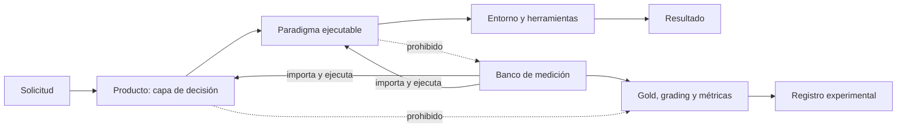
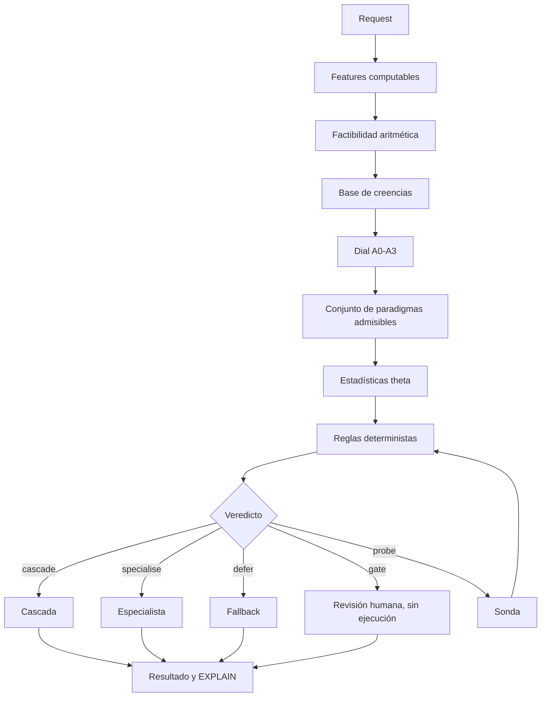
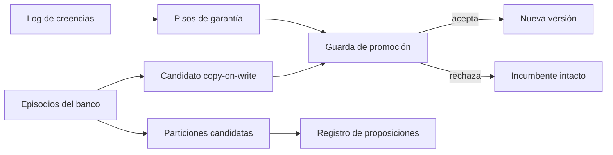

# Diseño y decisiones de MAPO

**Estado del documento:** descripción del ejecutable actual, sus deudas comprobadas y
la dirección aprobada. Este archivo no convierte una propuesta en una capacidad.

## 1. Propósito

MAPO es una capa de decisión delante de la ejecución de agentes LLM. Su objetivo
medible es elegir, diferir o bloquear por solicitud de forma que, sobre un corpus gold
nuevo, obtenga utilidad neta superior a cualquier paradigma fijo del banco, incluido
siempre-`react`.

El resultado P15 demostró que ese objetivo todavía no se cumple: sobre
`gold_transfer`, el motor obtuvo `0,52747` frente a `0,61488` del mejor fijo
(`dag_strategy`). La diferencia fue `-0,08740`; la fracción capturada de la brecha de
oráculo fue `-0,8332`. La estabilidad de decisión sí reprodujo 26 de 26 decisiones.

La lectura de diseño es precisa: MAPO ya puede explicar una decisión, pero todavía no
puede usar esa explicación para reparar de manera segura la información que le faltó.

## 2. Estados de una afirmación

Toda documentación técnica usa uno de estos estados:

| Estado | Significado |
|---|---|
| **Ejecutado** | Existe un camino invocable en el programa y una prueba o registro que lo ejercita. |
| **Medido** | Además de ejecutarse, produjo un artefacto experimental identificable. |
| **Deuda** | Existe parcialmente o su comportamiento contradice la garantía declarada. |
| **Propuesta** | Diseño aprobado, todavía no implementado ni medido. |
| **Falsificado** | Una predicción registrada falló bajo el protocolo declarado. |

Una propuesta no se describe como producto entregado. Una medición sintética no se
presenta como evidencia de campo. Un checksum no se denomina firma criptográfica.

## 3. Frontera de arquitectura

La frontera deseada es:

- **Producto:** factibilidad, creencias, reglas, garantía, ruteo, sondas, política,
  consolidación, persistencia, ejecución y paradigmas.
- **Banco:** corpus, gold, grading, runner, métricas, scripts y pruebas científicas.
- **Dirección permitida:** el banco importa al producto.
- **Dirección prohibida:** el producto no conoce gold, celdas ni métricas del banco.

### Deuda de frontera

`serve.py` usa actualmente el grading del banco para verificar peldaños de una cascada.
La corrección conceptual es una capacidad de verificación de runtime, independiente del
gold usado por el evaluador.

## 4. Flujo actual de una solicitud

### 4.1 Factibilidad

**Estado: ejecutado.**

Antes de seleccionar se eliminan paradigmas que no caben en contexto, presupuesto o
cardinalidad. La decisión es aritmética y no consume inferencia. Esto evita aprender por
ensayo y error una imposibilidad que ya puede calcularse.

### 4.2 Creencias y procedencia

**Estado: ejecutado, con deuda de integración.**

La jerarquía es `COMPUTED > OBSERVED > ELICITED > ASSUMED`.

- `COMPUTED`: función pura del payload; credencia `1,0` obligatoria.
- `OBSERVED`: resultado que un verificador puede ligar a evidencia concreta.
- `ELICITED`: afirmación de un modelo; nunca se convierte en observación por confianza.
- `ASSUMED`: prior débil y reemplazable.

Las reglas toman decisiones; el LLM solo propone lecturas. La base conserva creencias,
pero el camino actual de replanning reconstruye una base nueva y pierde la secuencia
elicitada-observada. Esa pérdida impide una explicación causal completa y limita la
calibración.

### 4.3 Garantía por solicitud

**Estado: perfiles ejecutados parcialmente.**

El nivel efectivo es el máximo entre lo pedido por el caller y el piso derivado de la
solicitud. El nivel restringe procedencia y espacio de patrones. Hoy se aplican el piso
de procedencia, el conjunto admisible y la profundidad máxima. Sellado A3, aprendizaje
online A0 y logging productivo no están plenamente impuestos.

### 4.4 Reglas

**Estado: ejecutado.**

Las reglas son datos ordenados por prioridad y nombre. El orden total evita que una
decisión dependa del orden incidental de un contenedor. La traza registra requisitos,
valores sostenidos, procedencia exigida y motivo tipado de rechazo.

### 4.5 Política aprendida

**Estado: ejecutada parcialmente; la automejora no está cerrada.**

El bundle conserva estadísticas por región y paradigma, pisos de garantía, versión y
digest de integridad. El router usa utilidad media, tasa de victoria, evidencia y margen.
El campo de peso Hebbiano se actualiza y se muestra, pero no participa en la selección.
Por tanto, no se lo considera hoy un mecanismo operativo de decisión.

El digest SHA-256 detecta modificación accidental o no acompañada por un nuevo digest.
No autentica al emisor: cualquiera con acceso de escritura puede recalcularlo.

### 4.6 Sonda

**Estado: ejecutada, con deudas críticas.**

La sonda lee una unidad y permite que un modelo proponga referencias. Solo una referencia
verificada puede elevar acoplamiento a `OBSERVED`; una lectura negativa permanece
`ELICITED` porque una unidad silenciosa no demuestra independencia global.

Deudas:

- siempre selecciona la primera unidad;
- no recompone la región después de observar;
- pierde la base previa de creencias;
- su costo no integra el total de ejecución;
- una referencia en scope puede aceptarse sin demostrar suficientemente la relación;
- si la evidencia sigue faltando, el camino actual puede ejecutar igualmente.

### 4.7 EXPLAIN

**Estado: ejecutado para una decisión; incompleto como certificado integral.**

Incluye acción, paradigma, escalera, gate, necesidad de sonda, exclusiones por garantía,
reglas evaluadas, creencias, versión y digest de theta, y digest del plan.

Para un replay integral todavía faltan el vector/región completa, factibilidad
estructurada, candidatos, digest de reglas y perfiles, identidad de contenido, historia
pre/post sonda y certificado de promoción.

## 5. Aprendizaje actual

### Lo que sí existe

- actualización offline de estadísticas;
- bundle versionado y verificable por digest;
- guarda de promoción contra un conjunto retenido;
- aprendizaje monotónico de pisos desde rechazos tipados;
- búsqueda de particiones con propuesta y validación separadas;
- log de creencias encadenado y auditoría de calibración;
- copy-on-write: el incumbente no se muta durante una propuesta.

### Lo que impide llamarlo automejora segura completa

1. La consolidación construye theta con todos los episodios antes de evaluar el bloque
   final; el holdout influye en el candidato.
2. Las repeticiones crudas cuentan como episodios independientes y pueden inflar la
   confianza.
3. Repetir una consolidación reaplica historia ya absorbida por el incumbente.
4. Las particiones descubiertas se persisten pero no gobiernan el router.
5. Algunas particiones usan truth de evaluación o variables posteriores a la ejecución.
6. La calibración persistida no se inyecta en el router de producto.
7. El producto no persiste de manera completa resultados y creencias para cerrar el
   bucle.
8. La promoción usa puntos estimados, sin incertidumbre ni certificado autenticado.

## 6. Decisiones de diseño

| Decisión | Motivo | Problema que evita | Alternativa descartada |
|---|---|---|---|
| Factibilidad antes de aprender | Las restricciones duras son computables. | Gastar episodios en planes imposibles. | Hacer que el router aprenda límites aritméticos. |
| LLM como sensor | La inferencia aporta información pero no estabilidad de control. | Que texto probabilístico maneje gates. | LLM como controlador autónomo. |
| Procedencia separada de credencia | Confianza y calidad de evidencia son dimensiones distintas. | Tratar una opinión segura como observación. | Un único score de confianza. |
| Garantía por request | El riesgo no es uniforme. | Cobrar A3 a todo el tráfico. | Modo determinista global. |
| Abstención explícita | El falso positivo puede costar más que perder cobertura. | Forzar una especialización sin margen. | Cobertura obligatoria de 100%. |
| Aprendizaje offline | La política debe permanecer estable durante una solicitud. | Deriva silenciosa dentro del request. | Actualización online de theta. |
| Copy-on-write | Toda propuesta debe poder rechazarse sin alterar producción. | Rollback ambiguo y mutación parcial. | Editar el incumbente in place. |
| Reglas como datos | Deben poder serializarse, compararse y auditarse. | Política escondida en ramas de código. | `if/elif` como fuente normativa. |
| Sin LLM judge | El sesgo del juez está alineado con verbosidad y costo. | Premiar paradigmas caros por estilo. | Evaluación generativa subjetiva. |
| Infraestructura fuera de estadística | Un 429 no informa calidad del paradigma. | Enseñar que una cuota agotada es un fallo cognitivo. | Puntuar `infra_error` como cero. |
| Producto y banco separados | La medición debe observar exactamente lo servido. | Que producción conozca gold o que el banco mida otro sistema. | Dos caminos de decisión. |

## 7. Dirección aprobada

La próxima evolución es **Reparación Epistémica Contrafactual (REC)**. No agrega otro
paradigma de respuestas: utiliza la explicación determinista de una decisión fallida
para identificar qué creencia o procedencia faltante habría cambiado el plan, aprende
offline cómo resolver ese déficit mediante evidencia acotada y promueve la reparación
como una cláusula ejecutable certificada.

El diseño completo vive en [`PATRON_REC.es.md`](PATRON_REC.es.md). Su estado es
**propuesta no implementada**.

## 8. Orden de implementación

1. Separar gold de evaluación y capacidad de verificación en runtime.
2. Agregar por tarea antes de aprender y eliminar la fuga del bloque final.
3. Retirar del camino activo las afirmaciones Hebbianas que no gobiernan decisiones.
4. Conservar una sola historia de creencias por solicitud.
5. Fortalecer verificadores de evidencia y contabilizar todo costo.
6. Recalcular región después de cada observación.
7. Implementar el diagnóstico contrafactual mínimo y el controlador REC.
8. Persistir manifiestos, sesiones y certificados.
9. Congelar diseño, registrar predicciones y recién entonces generar un mundo final.

## 9. Mapa documental

| Documento | Alcance |
|---|---|
| `DISENO.es.md` | Arquitectura lógica, decisiones, garantías y deuda. |
| `ARQUITECTURA.es.md` | Arquitectura de plataforma: orquestación, ingesta, persistencia y backend. **Propuesta.** |
| `PATRON_REC.es.md` | Patrón propuesto y protocolo de investigación. |
| `app/README.es.md` | Mapa de módulos del producto. |
| `app/paradigms/README.es.md` | Catálogo y estado de paradigmas. |
| `BENCHMARK.es.md` | Protocolo del banco y validez científica. |
| `corpus/README.es.md` | Gold, generación, verificación y leakage. |
| `tests/README.es.md` | Qué demuestra y qué no demuestra cada suite. |
| `CIERRE-2026-08-27.es.md` | Handoff exhaustivo, hallazgos finos y orden de reanudación. |
