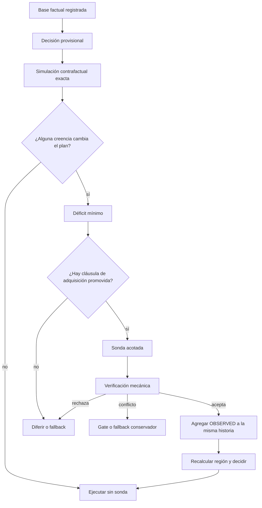
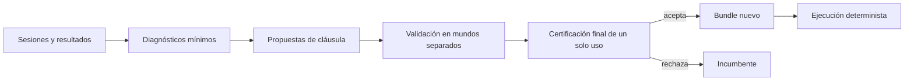
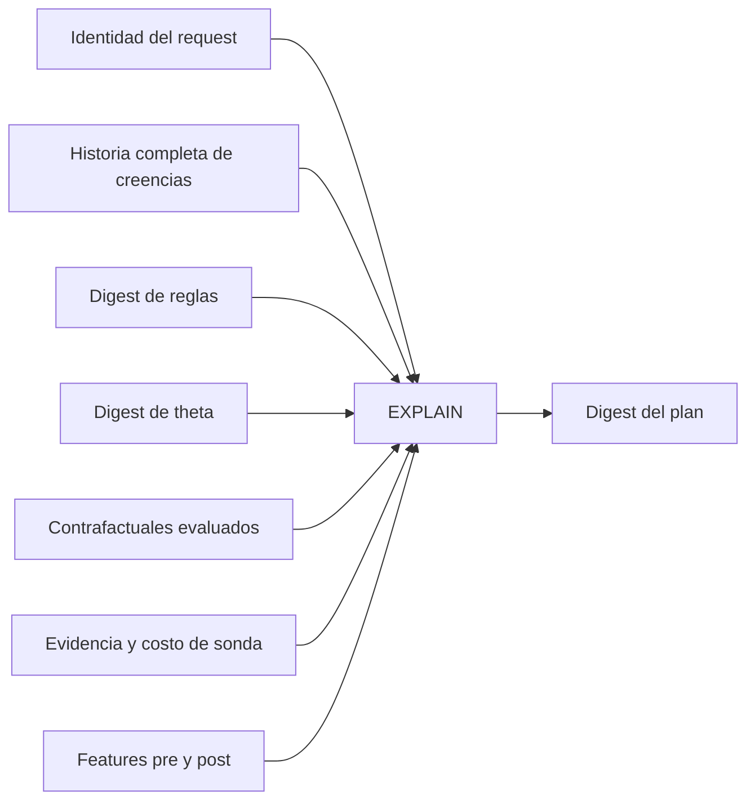

# Reparación Epistémica Contrafactual (REC)

**Estado:** propuesta de investigación aprobada, no implementada y no medida.

**Regla de publicación:** este patrón no entra al paper como contribución ejecutada
hasta existir en el programa, superar pruebas negativas y producir una evaluación
held-out preregistrada.

## 1. Problema observado

P15 evaluó el motor sobre un mundo que theta no había visto. El resultado fue negativo:

| Magnitud | Resultado |
|---|---:|
| Mejor fijo (`dag_strategy`) | `0,61488` |
| Siempre-`react` | `0,49212` |
| Router | `0,52747` |
| Brecha neta contra mejor fijo | `-0,08740` |
| Piso de ruido registrado | `0,05729` |
| Fracción de brecha capturada | `-0,8332` |
| Replay de decisiones | `26/26` |

El fallo principal no fue falta de explicación. El sistema reprodujo todas sus
decisiones. El fallo fue que la explicación no alimentaba una reparación: C5 compartía
región con C2/C4 porque el vocabulario activo no expresaba continuidad/horizonte, y theta
aplicó el ganador de cobertura independiente a una tarea que exigía continuar buscando.

## 2. Intuición

Un router común pregunta: **¿qué acción parece mejor con lo que sé?**

REC agrega dos preguntas:

1. **¿Qué creencia mínima, si fuera distinta o tuviera mejor procedencia, cambiaría la
   decisión?**
2. **¿Existe una observación acotada capaz de resolverla con valor neto positivo?**

El objetivo no es producir una explicación más narrativa. Es convertir una traza
determinista en una especificación de qué evidencia comprar.

## 3. Definición

Sea un estado de decisión registrado compuesto por:

- una base de creencias `B`;
- un conjunto ordenado de reglas `R`;
- una política versionada `theta`;
- un conjunto de paradigmas factibles y admisibles `P`;
- una función determinista de decisión `D(B, R, theta, P)`.

Un **déficit epistémico contrafactual** es un conjunto de intervenciones hipotéticas
sobre proposiciones, valores, credencias o procedencias que cambia la salida de `D`.

Una reparación es **mínima** bajo un orden declarado. El orden recomendado es:

1. menor cantidad de proposiciones intervenidas;
2. menor costo estimado de adquisición;
3. menor fuerza de procedencia requerida;
4. desempate lexicográfico estable.

La minimalidad explica la decisión, no el resultado. Que una creencia cambie la ruta no
demuestra que la ruta alternativa habría respondido mejor. Esa segunda afirmación exige
resultados contrafactuales del banco o evidencia externa.

## 4. Patrón

### 4.1 Diagnóstico contrafactual

El motor enumera únicamente proposiciones admitidas por un esquema firmado. Para cada
una evalúa alternativas tipadas sin agregarlas a la base factual. El resultado registra:

- plan original;
- intervención hipotética;
- plan alternativo;
- regla cuya satisfacción cambió;
- requisito exacto de valor, credencia y procedencia;
- si el cambio es robusto al resto de alternativas.

Las hipótesis viven en una traza de simulación separada. Nunca adquieren procedencia
factual por haber sido útiles para explicar.

### 4.2 Política de adquisición

Una cláusula REC promovida contiene:

| Campo | Función |
|---|---|
| Predicado de aplicabilidad | Identifica el déficit y la región previa. |
| Proposición objetivo | Declara qué incertidumbre resolver. |
| Especificación de sonda | Indica qué lectura o consulta acotada ejecutar. |
| Verificador | Define qué evidencia acepta el código. |
| Procedencia alcanzable | Declara como máximo qué fuerza puede ganar la lectura. |
| Presupuesto | Limita lecturas, llamadas y tokens. |
| Parada | Finaliza al resolver, agotar presupuesto o detectar conflicto. |
| Salida segura | Fallback, deferral o gate si no verifica. |
| Evidencia de promoción | Liga la cláusula al certificado que autorizó su uso. |

El LLM puede proponer un span, una clave o una relación. No decide si la sonda corre, si
la evidencia verifica, si se detiene ni qué ruta sigue.

### 4.3 Actualización factual

Una sonda puede resolver una proposición como verdadera, falsa, conflictiva o no
resuelta. “No encontré” en una muestra acotada no demuestra una negación global.

La base de creencias conserva:

- la afirmación inicial;
- la lectura propuesta por el sensor;
- la evidencia aceptada o rechazada;
- el verificador y su versión;
- hashes y ubicaciones de la evidencia;
- la decisión previa y posterior.

### 4.4 Replanificación

Después de una observación se recalculan las features y la región desde la base actual.
Reutilizar la región previa anularía la reparación: theta seguiría consultando la celda
que causó el error.

## 5. Señal correcta para C5

El C5 actual no permite afirmar honestamente `horizon_unknown=OBSERVED`. El generador y
el verificador construyen exactamente dos saltos: filing a cuenta y cuenta a titular.
Una lectura acotada tampoco puede demostrar la proposición global “no se conoce de
antemano cuántos pasos serán necesarios”.

La proposición observable recomendada es:

> **recurrencia de clave entre unidades:** una clave literal presente en una unidad
> fuente también aparece en una unidad distinta dentro del scope.

Para ganar `OBSERVED`, el verificador debe comprobar:

- span literal en la fuente;
- fuente y destino distintos y dentro del scope;
- misma clave normalizada en ambos textos;
- resolución determinista del destino;
- hashes de contenido y versión del verificador.

Esto prueba que existe una continuación entre unidades. No prueba por sí solo que la
clave sea semánticamente decisiva. Esa relevancia permanece `ELICITED` hasta disponer de
otro verificador.

## 6. Aprendizaje offline

REC aprende fuera del request:

1. agrupa repeticiones por tarea y paradigma;
2. localiza decisiones con pérdida frente al mejor contrafactual disponible;
3. calcula déficits epistémicos mínimos;
4. agrupa déficits equivalentes por features disponibles antes de ejecutar;
5. propone cláusulas de adquisición y parada;
6. descarta cláusulas cuyo beneficio no supera costo, ruido y regresiones;
7. certifica una candidata congelada sobre datos no usados para proponer ni elegir.

El episodio estadístico es una tarea independiente, no un trial. Los trials miden ruido.

## 7. Certificado de promoción

El certificado no es una explicación libre. Es un manifiesto verificable que liga:

- digest del incumbente y del candidato;
- digest exacto de la cláusula REC;
- versiones de features, reglas, sonda y verificador;
- fingerprints de modelo, recuperación y superficie;
- manifiestos de train, validación y final;
- prueba de no solapamiento por mundo o escenario;
- tareas y trials por celda;
- errores de infraestructura excluidos;
- utilidad, costo, cobertura, deferral y ruido;
- reproducción determinista de decisiones;
- criterio preregistrado y resultado;
- identidad autenticada de quien autoriza la promoción.

Una fecha no integra el digest semántico de la política. Los datos y reglas sí.

## 8. EXPLAIN de REC

Un auditor debe poder responder sin invocar al modelo:

1. por qué el plan original era el resultado de las reglas;
2. qué creencia mínima podía cambiarlo;
3. por qué se eligió o rechazó una sonda;
4. qué evidencia elevó procedencia;
5. por qué cambió la región;
6. qué certificado autorizó la cláusula;
7. si el mismo registro reproduce el mismo plan.

## 9. Invariantes

1. El aprendizaje nunca ocurre dentro de una solicitud.
2. Una hipótesis contrafactual nunca entra en la base factual.
3. Ninguna afirmación del modelo obtiene `OBSERVED` sin verificador.
4. Una muestra silenciosa no establece una negación global.
5. Toda observación conserva fuente, hash y versión del verificador.
6. La región se recalcula después de adquirir evidencia.
7. Una necesidad de evidencia no resuelta nunca ejecuta un placeholder barato.
8. El costo de sensing y probing descuenta presupuesto y entra en utilidad.
9. Gold, celdas y truth del banco nunca llegan al runtime.
10. Un trial adicional no aumenta el tamaño muestral de tareas.
11. El conjunto final no propone, elige ni ajusta una candidata.
12. Una candidata sin certificado válido no se instala.

## 10. Fallos seguros

| Fallo | Respuesta |
|---|---|
| Sensor ilegible | Registrar ausencia de lectura. |
| Referencia inventada | Rechazar evidencia; no elevar procedencia. |
| Evidencia fuera de scope | Rechazar y registrar motivo. |
| Conflicto entre observaciones | Marcar conflicto y diferir o gatear. |
| Sonda deshabilitada | Diferir; no ejecutar el paradigma provisional. |
| Presupuesto agotado | Detener y usar salida segura. |
| Documento distinto al hash | Invalidar replay. |
| Región sin evidencia suficiente | Fallback. |
| Bundle o certificado inválido | Rechazar ruteo. |
| Error de infraestructura | Registrar y excluir de estadística. |

## 11. Hipótesis falsables futuras

Estas hipótesis **no están preregistradas todavía**; son el diseño del próximo
registro. Registrarlas con fecha es gratis y es la condición para que el resultado
cuente — el patrón está implementado (`rec.py`, `certify.py`) y **sin medir**, que por
las reglas del repo es deuda.

| Hipótesis | Evidencia que la refuta |
|---|---|
| REC recupera utilidad neta frente al router P15. | La mejora no supera costo y piso de ruido. |
| REC supera al mejor fijo en mundos finales nuevos. | El intervalo inferior de la diferencia no supera cero. |
| La ganancia se concentra en decisiones sensibles a evidencia. | Las tareas disparadas no mejoran o el beneficio aparece en controles. |
| La sonda verificada tiene alta precisión. | Referencias aceptadas no corresponden a relaciones reales. |
| El controlador reduce sondas innecesarias. | Sonda igual cuando los contrafactuales producen el mismo plan. |
| La explicación es reproducible. | Cualquier sesión no reproduce decisión y digest. |

## 12. Diseño experimental

### Brazos

- mejor paradigma fijo factible;
- siempre-`react`;
- **router de P17** — detectores honestos por celda y ciclo sonda→re-plan;
- nuevo eje de features sin REC;
- sonda fija;
- REC completa;
- REC sin costo de sonda, solo como ablación diagnóstica.

> **Corrección del 2026-08-27, y por qué no es cosmética.** El brazo de control decía
> «router P15 congelado». Después quedó medido que en ese router **la regla de selección
> no dispara nunca**: está pre-empatada tres veces —el corpus declaraba detector en el
> 96% de las tareas, sacar el detector le entrega la decisión a la sonda y no a la
> selección, y el banco daba un solo paso de los dos que `probe_then_decide` nombra.
>
> Con ese brazo como control, una diferencia a favor de REC **no** significaría «REC
> repara lo que la selección no resuelve». Significaría «REC le gana a un router al que
> nunca lo dejaron seleccionar» — un resultado bastante más chico, y de los que se leen
> mal con facilidad. El control tiene que ser un router **al que sí se lo dejó decidir**,
> que es el de P17.
>
> **Consecuencia de orden**: REC se mide **después** de P17, no en paralelo. La
> dependencia no estaba escrita y ahora lo está.

### Métricas primarias

- diferencia pareada de utilidad contra el mejor fijo;
- intervalo por mundos o escenarios independientes;
- brecha neta del piso de ruido por celda;
- costo total, incluida adquisición;
- tasa de replay exacto.

### Métricas secundarias

- tasa de disparo, resolución y cambio de decisión;
- precisión y recall de evidencia verificada;
- cobertura y deferral;
- ECE y Brier por proposición;
- colisión de regiones entre controles y continuidad;
- utilidad recuperada del déficit P15;
- regresiones por estrato.

### Datos

`gold_transfer` queda reservado para diagnóstico. El resultado final necesita mundos
nuevos creados después de congelar política, presupuesto, umbrales, candidatos y regla
de decisión. Para una afirmación doctoral se necesita además un corpus independiente del
generador actual.

## 13. Novedad provisional

No son contribuciones nuevas por separado:

- adquisición activa de features;
- valor de información;
- reparación de políticas;
- reglas legibles;
- compilación simbólica;
- LLM como sensor;
- certificados de política;
- evaluación retenida.

Vecinos directos que deben leerse completos antes de reclamar novedad:

- EnvProbe, arXiv:2606.31422;
- FABLE, arXiv:2608.00215;
- Kintsugi, arXiv:2605.09487;
- SHARP, arXiv:2605.06822;
- Trace2Policy, arXiv:2606.10457;
- Polaris, arXiv:2603.23129;
- SEAL, arXiv:2607.24300;
- CARA, arXiv:2607.29465;
- Interactive Concept Bottleneck Models, arXiv:2212.07430;
- literatura de active feature acquisition, VoI, diagnóstico basado en modelos,
  explicación contrafactual y reparación de programas.

La única formulación provisionalmente defendible es la conjunción:

> diagnóstico contrafactual mínimo sobre una traza simbólica con procedencia, convertido
> offline en un programa acotado de resolución de evidencia, ejecutado por control
> determinista y admitido mediante certificación separada.

Hasta completar implementación, lectura y evaluación, debe describirse como **pregunta de
investigación**, no como “primero” ni como aporte probado.

## 14. Criterio doctoral

REC puede constituir una contribución doctoral si aporta:

- definición formal y algoritmo exacto o con garantías para minimalidad;
- separación entre cambio de ruta y mejora causal de resultado;
- contratos explícitos sobre procedencia alcanzable por cada sonda;
- regla de parada fundamentada en valor o riesgo;
- certificación estadística separada de la búsqueda adaptativa;
- generalización a mundos y dominios no usados en el diseño;
- comparación contra adquisición activa, reparación de reglas y mejores fijos;
- artefactos completos de replay y falsificación.

No alcanza nivel doctoral si queda como una sonda fija, una regla escrita a mano o una
explicación producida por otro LLM.
