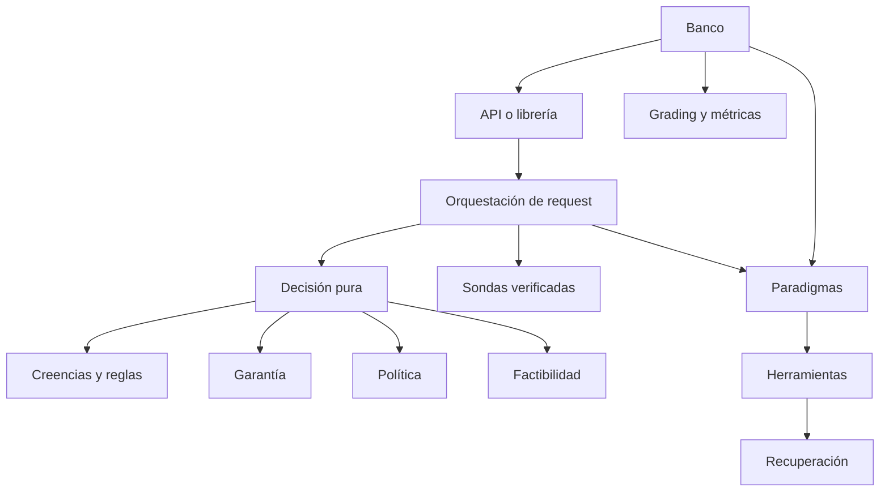

# Capa de producto

Este directorio contiene actualmente la capa de decisión, los paradigmas ejecutables y
algunos módulos del banco que todavía deben separarse. La arquitectura normativa está en
[`../DISENO.es.md`](../DISENO.es.md).

## Mapa de módulos

Cada módulo lleva su propio docstring con el PORQUÉ de sus decisiones; esta tabla es
el índice, no el sustituto. Cuando el código y la tabla discrepan, gana el código y la
tabla es el bug.

### Decisión

| Módulo | Responsabilidad | Estado relevante |
|---|---|---|
| `features.py` | Features estructurales y región. | Ejecutado. La región tiene cuatro segmentos (`cardinalidad/oráculo/acoplamiento/continuación`) y está versionada. **Deuda viva (línea 214)**: deriva `has_oracle` de `bool(task["oracle"])`, o sea del gold. |
| `feasibility.py` | Poda aritmética previa. | Ejecutado. |
| `beliefs.py` | Creencias, procedencia, reglas, trazas y calibración. | Ejecutado. El rechazo es tipado (`ABSENT`/`PROVENANCE`/`CREDENCE`/`VALUE`/`MAGNITUDE`), que es lo que hace posible aprender pisos; la historia pre/post sonda se conserva en un solo linaje. |
| `rules.py` | Vocabulario y reglas estándar como datos. | Ejecutado. Prioridades: gate 100 > cascada 90 > sonda 80 > especializar 70 > especializar-por-acoplamiento 60. **Deuda viva (línea 248)**: la creencia `oracle_available` también sale de `bool(task["oracle"])`, y ESTA es la que la cascada lee — cambiar sólo la región no cambia nada. Las dos esperan a que P16 cierre. |
| `assurance.py` | Dial A0-A3 y pisos aprendidos de estadísticas de rechazo. | Ejecutado. El piso aprendido nunca llega a `CERTIFIED`: ese nivel restringe los patrones admisibles, y subirlo solo porque una región rechaza mucho sería castigar a la región recortándole el catálogo. Varios flags del dial siguen siendo declarativos. |
| `probe.py` | Sonda de reconocimiento sobre UNA unidad. | Ejecutado. La asimetría es el diseño: un puntero que resuelve vale `OBSERVED` 1.0; uno inventado, `ELICITED` 0.2; "autocontenido", `ELICITED` 0.6 — **una unidad de silencio no es una medición de las otras 47**. |
| `decide.py` | El ciclo de decisión de dos pasos. | Ejecutado. `probe_then_decide` nombra dos pasos; vive una sola vez y lo comparten el producto y el banco. Devuelve lo que costó decidir en vez de absorberlo. |
| `router.py` | Integra factibilidad, garantía, theta y reglas. | Ejecutado. Recibe la región desde afuera; `decide.py` la recalcula tras observar. `region_backoff` es opt-in y devuelve QUÉ nivel contestó. |
| `policy.py` | Bundle, estadísticas y promoción. | Parcial; el peso Hebbiano se actualiza acá y `router.py` no lo lee nunca. |
| `consolidation.py` | Replay, particiones, pisos, auditoría y promoción. | Ejecutado. La candidata se ajusta SIN el bloque final; la fuga está cerrada. |
| `rec.py` | Diagnóstico contrafactual mínimo. | Ejecutado. Esquema de intervenciones cerrado y firmado. |
| `certify.py` | Mundos separados, ledger de un solo uso, certificado. | Ejecutado. El mundo final se gasta ANTES de responder. |
| `store.py` | Estado persistido del aprendizaje. | Parcial; falta el registro productivo integral. |
| `serve.py` | Request real, decisión y ejecución. | Ejecutado; todavía importa grading del banco. |
| `association.py` | Asociaciones entre pares ORDENADOS, con el ciclo de vida del peso. | Ejecutado. No cae bajo la demostración de redundancia del peso Hebbiano: aquélla es sobre `(región, paradigma)`, y esto asocia pares — es el único sentido vivo de la tesis Hebbiana, establecido con `p = 0,0078` y **débil** (3 celdas de 13, un corpus, un modelo). |
| `contracts.py` | Contratos de afirmación: el proyector que el código decide, y su residuo. | Ejecutado. Implementa **dos** de las tres clases de `../CONTRATOS.es.md` — las dos que se pueden cerrar sin parsear prosa. |
| `models.py` | El modelo como **acción**: parte de lo que se elige, no de lo que se observa. | Ejecutado. El espacio de decisión pasa de `paradigma` al par `(modelo, paradigma)`. Meter el modelo en el vocabulario de región habría sido el error. |
| `verify.py` | Acuerdo entre una respuesta y un criterio: el verificador **del producto**. | Ejecutado. Existe separado del banco porque `serve.py` necesita verificar para correr la cascada, y tomarlo del banco invertía la dependencia. |
| `paradigms/` | Estructuras de control ejecutables. | Ver `paradigms/README.es.md`. |

### Infraestructura de producto

| Módulo | Responsabilidad | Estado relevante |
|---|---|---|
| `llm.py` | Cliente, caché direccionado por contenido, retry y throttle. | Caché con namespace por cuenta. |
| `retrieval.py` | Scope y brazos de recuperación. | Ejecutado. |
| `embeddings.py` | Embeddings (configuración separada del modelo de medición). | Ejecutado. |
| `tools.py` | Herramientas y señales contables. | Ejecutado. |
| `cognitive.py` | Señales contables de estancamiento y cobertura. | Ejecutado. |
| `config.py` | Configuración sin defaults: env faltante = raise en import. | Ejecutado. |
| `fsio.py` | Escritura atómica. | Ejecutado. |
| `ingest.py` | La ingesta como **etapa**, separada del request que responde. | Ejecutado. Impone la regla: ningún paradigma construye estado derivado propio adentro de un request. Su gasto se cobra en su propia columna (`ingest_tokens`), no mezclado con el del paradigma. |
| `board.py` | Estado compartido entre sub-agentes: una **dimensión**, no un paradigma. | Ejecutado. Vivía adentro de `dag.py` y no lo usaba nadie más, lo cual confundía la topología con el estado compartido. |
| `events.py` | Los eventos tipados que el motor emite mientras decide, con `yield`. | Ejecutado. Es lo que consume `ui/`: la escalera de decisión se ve antes de que exista un token. |
| `pool.py` | El catálogo de modelos instanciado: un cliente por modelo, y una huella del conjunto. | Ejecutado. Un cliente por modelo y no uno que cambia de deployment, porque la huella ES la identidad de decodificación y va adentro de la clave de caché. |
| `tariffs.py` | Aranceles: se **leen** de `config/tariffs.json`, no se escriben acá. | Ejecutado. Un precio es una cláusula del contrato con el proveedor: cambia sin avisar y actualizarlo no debería tocar un módulo. |

### Banco (debe salir de la capa de producto)

| Módulo | Responsabilidad | Estado relevante |
|---|---|---|
| `runner.py` | Producto cruzado experimental. | Un episodio es una celda `(tarea, paradigma)`, no un trial. |
| `metrics.py` | Métricas del estudio, riesgo-cobertura. | Banco. |
| `grading.py` | F1 exacto contra gold. | Banco. |
| `baselines.py` | Router textual de comparación. | Banco. |
| `main.py` | API que compone endpoints de ambos lados. | Frontera mixta temporal. |

La regla de la separación pendiente: **el banco importa al producto; el producto jamás
sabe que el banco existe.**

## Dependencias deseadas

El router no ejecuta red ni herramientas. Una sonda se ejecuta en la capa de
orquestación y devuelve creencias verificadas. El aprendizaje trabaja sobre registros
después de las solicitudes y produce un bundle nuevo; nunca muta una decisión en curso.

## Contrato de determinismo

La garantía correcta requiere fijar más que la base de creencias:

- historia canónica de creencias;
- reglas y perfiles;
- bundle de política;
- conjunto de candidatos y veredictos de factibilidad;
- versiones de features, costos y verificadores.

Con esos elementos fijados, el plan debe reproducirse sin invocar al modelo. El texto de
respuesta puede seguir variando y no integra esta garantía.

## REC

`rec.py` y `certify.py` usan la traza del router para identificar el déficit epistémico
mínimo y adquirir sólo la evidencia capaz de cambiar una decisión. El patrón, sus
vecinos de literatura y sus criterios de falsación están en
[`../PATRON_REC.es.md`](../PATRON_REC.es.md).
