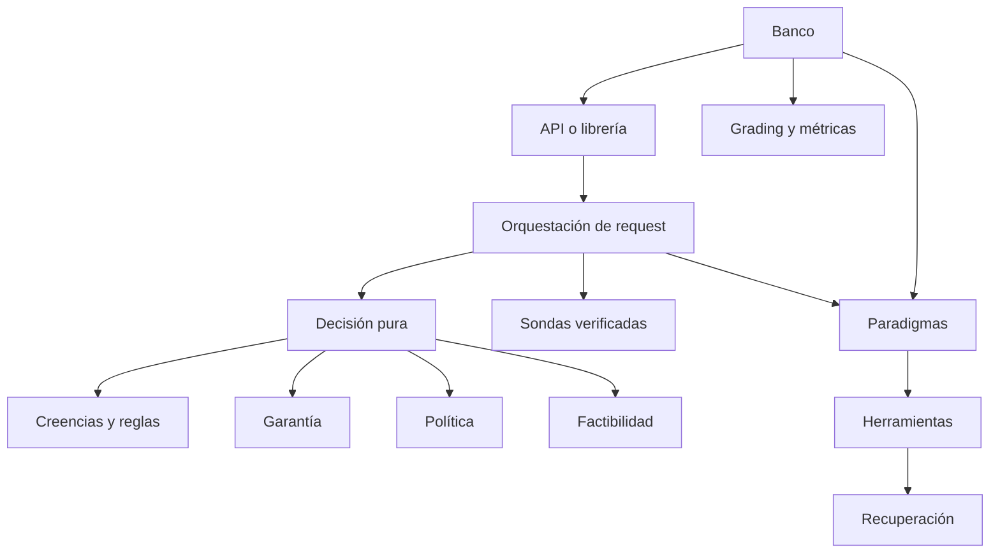

# Capa de producto

Este directorio contiene actualmente la capa de decisión, los paradigmas ejecutables y
algunos módulos del banco que todavía deben separarse. La arquitectura normativa está en
[`../DISENO.es.md`](../DISENO.es.md).

## Mapa de módulos

| Módulo | Responsabilidad | Estado relevante |
|---|---|---|
| `features.py` | Features estructurales y región. | Ejecutado; la región no incluye horizonte y queda obsoleta tras la sonda. |
| `feasibility.py` | Poda aritmética previa. | Ejecutado. |
| `beliefs.py` | Creencias, procedencia, reglas, trazas y calibración. | Ejecutado; falta conservar la historia pre/post sonda. |
| `rules.py` | Vocabulario y reglas estándar como datos. | Ejecutado. |
| `assurance.py` | Dial A0-A3 y pisos aprendidos. | Parcial: varios flags son declarativos. |
| `probe.py` | Sonda de acoplamiento. | Ejecutado; selección y verificación requieren fortalecimiento. |
| `router.py` | Integra factibilidad, garantía, theta y reglas. | Ejecutado; recibe una región externa y estática. |
| `policy.py` | Bundle, estadísticas y promoción. | Parcial; el peso Hebbiano no gobierna decisiones. |
| `consolidation.py` | Replay, particiones, pisos, auditoría y promoción. | Parcial; existe fuga del conjunto final. |
| `store.py` | Estado persistido del aprendizaje. | Ejecutado parcialmente; falta el registro productivo integral. |
| `serve.py` | Request real, decisión y ejecución. | Ejecutado; todavía importa grading del banco. |
| `paradigms/` | Estructuras de control ejecutables. | Ver `paradigms/README.es.md`. |
| `llm.py` | Cliente, caché, retry y throttle. | Infraestructura de producto. |
| `retrieval.py` | Scope y brazos de recuperación. | Infraestructura de producto. |
| `tools.py` | Herramientas y señales contables. | Infraestructura de producto. |
| `runner.py` | Producto cruzado experimental. | Banco; debe salir de la capa de producto. |
| `metrics.py` | Métricas del estudio. | Banco. |
| `grading.py` | F1 exacto contra gold. | Banco. |
| `baselines.py` | Router textual de comparación. | Banco. |
| `main.py` | API que compone endpoints de ambos lados. | Frontera mixta temporal. |

## Dependencias deseadas

El router no ejecuta red ni herramientas. Una sonda se ejecuta en la capa de
orquestación y devuelve creencias verificadas. El aprendizaje trabaja sobre registros
después de las solicitudes y produce un bundle nuevo; nunca muta una decisión en curso.

## Contrato de determinismo

La garantía correcta requiere fijar más que la base de creencias:

- historia canónica de creencias;
- reglas y perfiles;
- bundle de política;
- conjunto de candidatos y veredictos de factibilidad;
- versiones de features, costos y verificadores.

Con esos elementos fijados, el plan debe reproducirse sin invocar al modelo. El texto de
respuesta puede seguir variando y no integra esta garantía.

## Dirección REC

[`../PATRON_REC.es.md`](../PATRON_REC.es.md) propone usar la traza del router para
identificar déficits epistémicos y adquirir solo evidencia capaz de cambiar una decisión.
No existe todavía un módulo REC en este directorio.
