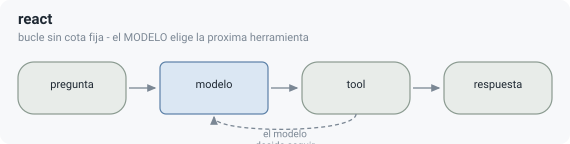
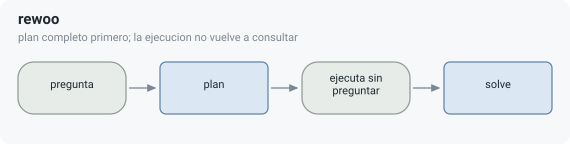
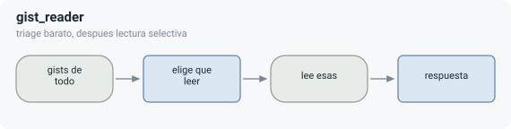
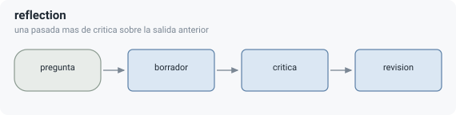
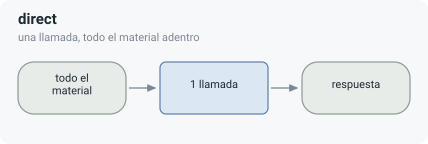
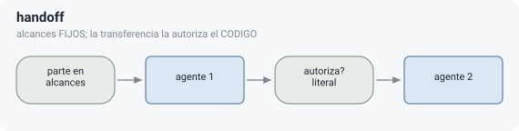
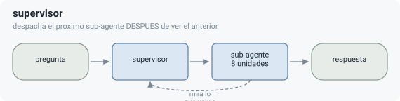

# Paradigmas ejecutables

Un paradigma es una estructura de control, no una variante de prompt. El banco conserva
controles históricos y candidatos falsificados para reproducibilidad; eso no los vuelve
candidatos activos del producto.

## Catálogo

Son **15 registrados** y **12 que corren la campaña**, de los cuales **8 están
activos**. El plantel no se escribe a mano: sale de `campaign_roster()`, que lo
deriva del `CATALOG` y exige **nombrar** cada excepción. Actualizado 2026-08-29.

| Nombre | Estructura | Región o propósito | Estado actual |
|---|---|---|---|
| `direct` | Una llamada con todo el material. | Caso degenerado cuando la evidencia cabe. | Control, gateado por factibilidad. |
| `react` | Bucle abierto de herramientas. | Fallback general. | Activo, costoso y sensible al modelo. |
| `reflection` | Borrador, crítica y revisión. | Corrección de respuesta. | Activo; la mejora anterior se retiró como ruido. |
| `dag_strategy` | DAG, blackboard, verificación y replanning. | Dependencias complejas. | Activo; costo alto y flujo menos certificable. |
| `rewoo` | Plan de dataflow previo, ejecución y solve final. | Cobertura independiente barata. | Especialista activo; falla con continuidad no prevista. |
| `handoff` | Agentes con alcance propio y transferencia **autorizada por código**. | Partición fija del alcance. | Candidato nuevo (K-8). P23 registrada antes de correr. |
| `supervisor` | Orquestador que elige el próximo sub-agente **después** de ver el anterior. | El medio entre plan fijo y partición fija: lo que hoy se llama «subagentes». | Candidato nuevo (K-9). P28a–d registradas antes de correr. El sub-agente recibe **un pedazo** de contexto, y el recorte lo hace el código (`SUB_SCOPE_UNITS = 8`), no el modelo. |
| `gist_reader` | Tabla de gists y lecturas dirigidas. | Evidencia fuera de ventana. | Falsificado en dos de tres regiones objetivo. |
| `extract_compute` | Extracción estructurada y cómputo. | Agregación exacta. | Infactible bajo el presupuesto de producción medido. |
| `streaming_scan` | Escaneo secuencial con estado acotado. | Cobertura estable. | Infactible bajo el presupuesto de producción medido. |
| `pointer_chase` | Bucle por código, una unidad por salto. | Cadenas con punteros visibles. | P14a falsificado; frenos P14b confirmados. |

### Fuera del ruteo, por decisión escrita

| Nombre | Por qué |
|---|---|
| `cot` | **La ingeniería de prompts no es un patrón** (2026-08-26). Dominado por `direct` en toda celda medida: misma utilidad, nunca más barato, y redundante con modelos razonadores. Se conserva **sólo** como control nulo — es la evidencia de que el andamiaje por prompt no compra nada. |
| `plan_execute` | Retirado por dominado (2026-08-29). Sin región ganadora medida. |
| `map_reduce` | **Retirado 2026-08-29 por decisión del autor.** Su nicho está vacío: donde el material entra lo domina `direct`, donde no entra la aritmética lo poda (180 filas de 270). Gana 1 celda de 33, y en P20 su reducción fue 0,0% porque su fan-out lo fija el código. Pasó por `standby` primero; el paso a retirado es la decisión que aquélla difirió |

### En `standby`: no retirados, y con condición de revival escrita

| Nombre | Estructura | Por qué está en standby |
|---|---|---|
| `graph_traverse` | Índice de entidades y BFS. | **P10a falsificado** (u=0,000 en las dos celdas acopladas, con las aristas presentes y el índice 100% anclado al texto). Revive con (a) un corpus con resolución de entidades real y (b) un índice con la disciplina de la sonda — las dos condiciones están escritas en el ejecutable. |

Su dato histórico **se replaya igual**: un brazo que no se corre igual se replaya, y un
replay sobre código roto falla igual.

## Los ocho que sobreviven, con su forma y lo que la medición les encontró

> **Los diagramas se generan** (`py app/paradigms/_diagramas.py`), no se dibujan. Ocho SVG
> a mano se desincronizan de a uno: el día que un patrón cambia de forma, siete siguen bien
> y uno miente, y no hay cómo saber cuál. Un patrón activo sin forma declarada **levanta**.
>
> **Lo que dibujan es lo único que distingue un patrón de otro**: las cuatro preguntas de
> [`PATRON_O_FACTOR.es.md`](../../PATRON_O_FACTOR.es.md) — cuántas llamadas y quién las
> decide, quién elige la próxima acción, si hay estado compartido, y si un paso puede
> cambiar el plan. Un diagrama que se pudiera dibujar igual para dos patrones estaría
> dibujando otra cosa.
>
> **Y una advertencia sobre las fortalezas.** Cada «único mejor en N» viene del registro
> anterior a K-6, sobre 96 celdas de seis corpus (`_audit_catalog.py`). Vale para **ese**
> régimen: otro corpus, otro tokenizador, sin entidades. La corrida homogénea existe para
> volver a medirlos a todos bajo las mismas condiciones, y hasta que corra estos números
> son el mejor dato que hay y **no** el dato que va al paper.

---

### `react` — el fallback

| | |
|---|---|
| **fortaleza** | resuelve casi cualquier cosa, y por eso es el fallback. Es el brazo contra el que se mide todo: **ningún resultado del motor se reporta sin siempre-`react` al lado** |
| **debilidad** | **el modelo elige la próxima herramienta**, así que su costo es una lotería: es el único del catálogo cuyo gasto no lo acota el código. Y en el segundo modelo degrada en 10 de 14 celdas factibles |
| **quién decide** | el modelo, cada vuelta |

### `rewoo` — el barato que gana empatando

| | |
|---|---|
| **fortaleza** | **único mejor en 10 celdas, y el más barato al empatar en 46.** Mide **982 tokens por celda** en `w4` contra ~30.000 del resto: 30× más barato. Con λ ≥ 0,05 la brecha de oráculo ya es 0,0000 en los tres corpus medidos **y `rewoo` domina** |
| **debilidad** | el plan se arma **antes** de ver nada, así que falla con continuidad no prevista: si la primera respuesta cambia lo que había que preguntar, ya no puede |
| **quién decide** | el código, después del plan — la ejecución no vuelve a consultar |

### `dag_strategy` — la topología más elaborada

| | |
|---|---|
| **fortaleza** | **único mejor en 8 celdas de 96.** Es el único con replanificación acotada: verifica sobre cuatro ejes y replanifica hasta tres veces |
| **debilidad** | **el más caro del catálogo**: 89.800 tokens por celda contra 2.435 de `rewoo` — **37×**. Su flujo es el menos certificable, así que `A3` lo excluye. Y es secuencial, con lo que su **latencia no es comparable** con la de los demás |
| **quién decide** | el código, sobre un plan que el modelo propuso y que la verificación puede revisar |

### `gist_reader` — triage antes de leer

| | |
|---|---|
| **fortaleza** | **único mejor en 9 celdas.** Es la respuesta al régimen fuera de ventana: mira resúmenes de todo y lee sólo lo que eligió |
| **debilidad** | **falsificado en dos de sus tres regiones objetivo.** Y es el más caro **por llamada** de todo el catálogo —14.798 tokens— porque su contexto no crece con los turnos sino con las **unidades**. Además **nunca busca**: recibe dosis 0% de cualquier factor de recuperación, así que un cambio de brazo no lo toca (`AR-5`) |
| **quién decide** | el modelo elige qué leer; el código arma los gists y ejecuta la lectura |

### `reflection` — una pasada más

| | |
|---|---|
| **fortaleza** | **único mejor en 1 de 14**: delgado, y **no dominado** — que es la vara, no «gana mucho» |
| **debilidad** | la mejora que justificaba el patrón **se retiró como ruido** cuando se midió con piso por celda. Paga tres llamadas para lo que a veces resuelve una |
| **quién decide** | el código: las tres pasadas son fijas |

### `direct` — el caso degenerado

| | |
|---|---|
| **fortaleza** | cuando la evidencia entra en ventana, **una llamada y listo**. No hay estructura que pueda ganarle a no tener estructura. Es lo que dejó a `map_reduce` sin nicho |
| **debilidad** | fuera de ventana **no existe**: la aritmética lo poda en **72 de 78** tareas de `gold_h1`, a costo cero. Y en el segundo modelo rompe en las celdas de juicio (C5, h3) — tener todo adentro no alcanza cuando la síntesis exige criterio |
| **quién decide** | nadie: no hay decisión que tomar |

---

### Los dos candidatos nuevos, **sin medir**

Entran con predicción falsable registrada **antes** de correr, como todos. Lo de abajo es
lo que se predijo, no lo que se midió — y la diferencia es el punto.

### `handoff` — alcances fijos, transferencia autorizada por código

| | |
|---|---|
| **qué lo hace un patrón** | la transferencia **no** es una herramienta que el modelo llama. Los tres frameworks consultados la ofrecen como `transfer_to_agent()`, y eso es flujo de control decidido por el modelo. Acá el agente **propone** (`ELICITED`, es su lectura) y el **código autoriza** (`COMPUTED`: exige que lo que falta aparezca **literal** en otro alcance) |
| **lo que promete** | `P23c` es la que vale aunque las otras fallen: **réplicas del mismo caso autorizan el mismo conjunto de transferencias.** La utilidad es propiedad de este corpus; la reproducibilidad de la transferencia es propiedad del mecanismo, y es lo único que ningún handoff por prompt puede igualar |
| **dónde puede romperse** | si la transferencia **nunca** dispara, el patrón degenera en dos agentes aislados; si dispara en más de la mitad de las celdas acopladas, la regla del puente literal está autorizando sobre ruido |
| **lo que no aprende** | **el reparto**. `_scopes` parte por índice (`unit_ids[i::n]`), a propósito arbitrario: un bloque contiguo mediría localidad del corpus en vez de alcance |

### `supervisor` — despacha según lo que vuelve

| | |
|---|---|
| **qué lo hace un patrón** | es **el que faltaba de la familia**: `dag_strategy` fija su plan antes de ejecutar, `handoff` fija sus alcances en el código, y acá las llamadas **no están decididas de antemano** — mira lo que volvió y recién ahí despacha la siguiente. Es lo que hoy se llama «subagentes» |
| **la corrección que lo salvó** | el sub-agente recibe **un pedazo** del contexto, no la superficie completa. Con todo a la vista esto era `react` con más pasos y una llamada de coordinación de más. El recorte lo hace el **código** (`SUB_SCOPE_UNITS = 8`), no el modelo enumerando ids: si el modelo dibujara la frontera del sub-agente, **ahí sí** se cruzaría el invariante |
| **lo que promete** | `P28a`: le gana a `react` en las celdas acopladas por ≥ 0,05. Si no, despachar de nuevo no compra nada que un agente con más vueltas no compre igual, y el patrón es `react` con un impuesto de coordinación |
| **la que puede avergonzar al diseño** | `P28c`: su tasa de **relectura** tiene que ser menor que la de `dag_strategy`, porque un sub-agente con ventana recortada **no puede** releer lo que no tiene. Si es igual o mayor, la ventana no acota y el recorte es decorativo. Es la única predicción que hace el mecanismo directamente, y se mide **sin oráculo** |

---

### Y los cuatro que no sobrevivieron

No se borran del `REGISTRY`: las filas ya pagadas hay que poder leerlas, y borrar la función
volvería irreproducible el registro que la midió.

| brazo | por qué se fue |
|---|---|
| `cot` | **la ingeniería de prompts no es un patrón.** Mismo grafo de control que `direct`, misma utilidad, nunca más barato. Revive **nunca por diseño** |
| `plan_execute` | dominado, sin región ganadora medida |
| `pointer_chase` | **P14a falsificado**: nunca tocó una unidad relevante — la semilla de recuperación es el eslabón débil. Pero sus frenos (`P14b`) se confirmaron, y **el mecanismo sobrevive a la muerte del patrón**: un bucle guiado por código elimina la lotería de costo (réplicas idénticas en camino y dentro del 0,1% en gasto) |
| `map_reduce` | **retirado 2026-08-29 por decisión del autor.** Su nicho está **vacío**: donde el material entra lo domina `direct`, donde no entra la aritmética lo poda (180 filas de 270). Gana 1 celda de 33, y en P20 su reducción fue 0,0% porque su fan-out lo fija el código. **No se retiró por solaparse con `supervisor`** — la prueba de las cuatro preguntas los separa en dos de ellas |

Y uno en **`standby`**, que es distinto de retirado:

`graph_traverse` dio **u = 0,000** en las dos celdas acopladas (`P10a`), y la falsación
sobrevivió a su objeción más seria: el índice estaba 100% anclado al texto y las cadenas
estaban conectadas. Pero corrió **donde resolver entidades era gratis** — cero abreviaturas,
cero anáfora, una forma canónica por entidad. `gold_h1` ya no es así (36,5% de las menciones
son invisibles a un `keyword_search` del nombre completo), así que **una de sus dos
condiciones de revival se cumplió**, y por eso entra a la campaña. La otra es un índice con
la disciplina de la sonda.

> **Una falsación vale para el régimen en que corrió.** Un generador que vuelve trivial una
> dependencia no puede falsificar el patrón que existe para esa dependencia.

---

## Reglas del catálogo

- Una diferencia de fraseo no crea un paradigma.
- Todo paradigma nuevo declara estructura, nicho, anti-nicho, factibilidad y frenos.
- Un candidato falsificado no se borra del registro experimental.
- El fallback debe estar medido en todas las tareas usadas para juzgar el motor.
- Un nivel de garantía puede excluir un paradigma por flujo no acotado aunque su calidad
  sea alta.
- El costo de una herramienta forma parte de la topología, no es ruido externo.

## Relación con REC

REC no es un paradigma de esta lista. Es una política de adquisición de evidencia antes
de elegir entre paradigmas. Puede terminar en especialización, fallback, deferral o gate.
