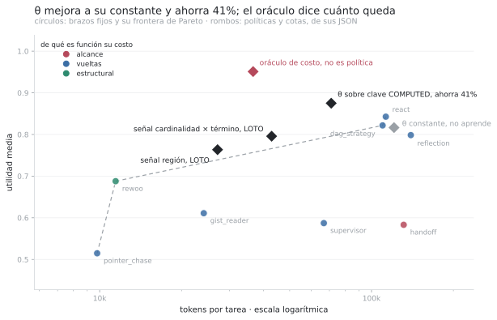
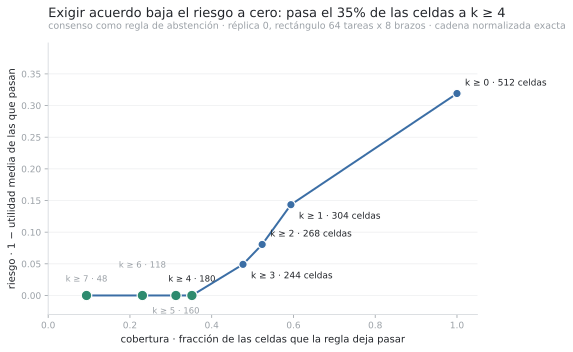

# Hard Guarantees over Hope: Deterministic Control for LLM Agents

## Policy-as-Code, procedencia tipada y ejecución selectiva

Versión breve, v2.1, 2026-09-03. Autor: Ariel Edgardo Levy.

> Versión de conferencia. La extensa (veinte figuras, tres algoritmos en pseudocódigo, los dos
> teoremas con sus demostraciones completas, el registro por celda y la cronología de
> predicciones) es `paper-es.md`.

---

## Resumen

Un arnés de agentes es todo lo que rodea a un LLM y lo convierte en un sistema: arma el prompt y
administra el contexto, expone herramientas y ejecuta las llamadas que el modelo pide, guarda
estado entre llamadas y entre rollouts, impone presupuesto, permisos y guardas de seguridad,
verifica la salida y registra lo que pasó. Y decide qué llamada viene después, qué buscar y
cuándo parar. Cada una es una decisión con dueño, el código o el modelo, y la que depende de
una emisión estocástica del modelo hereda su variación, sea una guarda, una compactación de
memoria, una vuelta más o una rama. El motor aplica a cualquiera; el banco mide las que
ramifican el flujo, porque fijan de quién depende la trayectoria. La tesis es una sola: separar un plano
de percepción estocástico de un plano de control determinista. El modelo propone contenido; el
código tipa, admite y decide. Una decisión cuya invariancia se promete no depende de una salida
estocástica no canonizada del modelo.

Formalizamos esa tesis con ramificaciones delegadas y dos cantidades: desacuerdo de trayectoria
`V_T` y desacuerdo de salida `V_Y`. Bajo un stack determinista, si ninguna identidad del próximo
nodo depende de la aleatoriedad del modelo, `V_T = 0` y toda discrepancia de salida se localiza
en un nodo común (Proposición 1). La arquitectura materializa el principio como
`proponer → tipar → verificar/admitir → decidir`: una base separa procedencia, credencia y
alcance; policy-as-code aplica factibilidad, piso de garantía y abstención; políticas
consolidadas offline cambian la decisión sin actualizar los pesos del LLM. La garantía es
«misma base de creencias, misma decisión», no «mismo prompt, misma respuesta».

Evaluamos el mecanismo en un benchmark sintético controlado de análisis forense documental: 78
tareas, doce paradigmas y tres réplicas, sin juez LLM. Entre 12% y 28% de las celdas producen
utilidades distintas a temperatura cero bajo un stack cuyo no-determinismo de servicio no puede
separarse todavía de la ramificación delegada. En una intervención en muestra, reemplazar una
decisión de ancla del modelo por código lleva un paradigma de `0,33` a `0,89` y eleva `pass^3`
de `0,33` a `0,67`; la transferencia a tareas nuevas queda pendiente (§5.2, §6).

Como evidencia secundaria, representaciones por capacidades predicen un brazo no visto mejor que
la dificultad de la tarea sola, pero no superan a la identidad aditiva ni cruzan su nulo exacto
con ocho brazos (`p = 0,066`). La adaptación de política sin actualizar pesos gobierna 36 de 78
tareas. En costo, θ ahorra 41% frente a la constante con `Δu = +0,058` e IC95
`[−0,014, +0,132]`; es un resultado parcial, no la validación de un selector. Los números valen
para este benchmark y estos modelos; las propiedades estructurales se enuncian para agentes en
general.

Palabras clave: agentes LLM, plano de control determinista, ramificación delegada, procedencia
tipada, policy-as-code, ejecución selectiva, adaptación de políticas, reproducibilidad.

---


**Figura 1.** El contrato de garantía. El request entra como material, presupuesto y banderas de
riesgo, declarados por quien llama. Factibilidad (1) es una desigualdad sobre cantidades declaradas
y poda sin gastar un token; el piso exigido (2) deriva el nivel A0 a A3 desde creencias sobre el
request, no desde su texto; admisibles (3) deja pasar sólo a los paradigmas que alcanzan ese piso.
Las dos únicas salidas son ejecutar y responder, o abstenerse y diferir, y la segunda es una salida
y no un fallo. El lazo punteado es la adaptación de política: el registro de rechazos sube el piso
del próximo request, offline y con guarda. La caja rayada es el bucle, y está rayada porque el
modelo nunca lo toca: abajo el LLM es un sensor con pesos congelados, y la única flecha que cruza
la frontera lleva proposiciones tipadas hacia arriba.

# 1. Introducción

Un arnés de agentes es lo que rodea al modelo y lo convierte en un sistema: contexto,
herramientas, parseo, estado, verificación, presupuesto y registro. La parte que este trabajo
estudia es su estructura de control, que toma una de pocas formas: una llamada única, un bucle
de razonar y actuar, una descomposición en sub-tareas, un grafo de verificar y replanificar. Se
elige una vez en tiempo de diseño y se congela en el código, y sobre él se
sostienen sistemas agentivos que firman números, disparan acciones y contestan a usuarios. Las
demás capas de un sistema de producción dan tres propiedades por sentadas. Una base de datos
ejecuta la misma consulta igual cada vez, un log dice de dónde salió cada registro, y un
validador rechaza la entrada que no cumple el esquema. En un agente esas tres propiedades hay
que construirlas, porque su componente central no tiene ninguna.

1. El flujo de control vive en el código. Los modelos son aleatorios por naturaleza, y lo
siguen siendo a pesar del trabajo extenso en darles más determinismo: la misma llamada a
temperatura cero, con el mismo prompt y la misma semilla, devuelve una distribución de
respuestas y no una respuesta. Una condición suficiente para que una decisión no herede esa
variación es que sea función de estado independiente de emisiones estocásticas no canonizadas
del modelo. En esta arquitectura ese estado lo computa el código. Delegarle ramificaciones abre
un canal causal desde la aleatoriedad del modelo hacia la trayectoria. Entre 12% y 28% de las
celdas cambian de utilidad entre réplicas a temperatura cero; el montaje no separa todavía
cuánto viene de la rama delegada y cuánto del stack de servicio (§5.2, §6).

2. Cada valor emitido exhibe de dónde salió. Una respuesta correcta y una inventada llegan con
la misma cara, así que la fuente tiene que viajar con el valor. Eso es lo que vuelve
explicable una decisión: se puede mostrar de qué unidad del material salió cada número y qué
regla lo dejó pasar. Un sistema hecho sólo de llamadas al LLM no puede ofrecerlo, porque la
explicación que el modelo da de su propia salida es otra emisión, con la misma cara que la
primera.

3. El sistema puede callarse. En el modo más difícil del corpus, las cadenas acopladas, el
paradigma que gana lo hace con 8 correctas y 1 abstención sobre 9 celdas, sin una respuesta
equivocada, y los brazos que fallan se abstienen más de lo que inventan.

Las tres propiedades se consiguen separando percepción estocástica y control determinista, sobre
señales del entorno contables y verificables. El **Principio Sensor–Controlador** lo resume:

> Un modelo estocástico puede proponer hechos; no debe gobernar directamente decisiones cuya
> invariancia el sistema promete.

Tres determinismos distintos evitan prometer de más:

| propiedad | función | estado en este trabajo |
|---|---|---|
| trayectoria | `D_T : (q, M) → T` | caracterizada bajo `d(T)=0` y stack determinista |
| política | `D_P : B → a` | garantizada por policy-as-code |
| salida | `D_O : (q, M) → y` | no se garantiza |

El paper garantiza `D_P` y caracteriza cuándo vale `D_T`; no promete `D_O`.

## 1.1 Una expectativa de la literatura, y qué mide de verdad

La motivación habitual para trabajar sobre arneses es que el mismo modelo rinde distinto según la
estructura de control que lo envuelve: la selección oráculo por tarea supera al mejor fijo por
17,1pp sobre seis paradigmas y diez benchmarks [arXiv:2604.06753], y la conclusión habitual es que
hacen falta mejores selectores. El banco reordena esa expectativa. Entre los brazos que compiten
por la calidad no hay premio que se separe del piso de ruido, porque tienen las mismas capacidades
(§5.6); el premio vive en los ejes donde las capacidades difieren, costo, cobertura y abstención, y
sobre el catálogo entero el oráculo sí muestra premio neto que ninguna señal por identidad de
paradigma predice (§5.5, §5.6). El banco existe para que el sistema aprenda qué exige cada request
y qué le puede dar cada brazo.

## 1.2 Dominio y alcance

Lo que se evalúa es capacidad de RAG sobre análisis forense de hechos. Preguntas del tipo que
hace un auditor o un analista de cumplimiento sobre un conjunto documental. Qué cuenta figura a
nombre de quién, quién le reporta a quién subiendo N escalones, si existe registro de una
transferencia, si alguien debía escalar y no lo hizo.

Se usa un **benchmark sintético controlado** porque el experimento necesita ausencia conocida,
presuposiciones falsas, cadenas entre documentos y procedencia exacta. El costo de ese control
es validez externa: no se muestra todavía que el mecanismo sobreviva fuera del generador.

El corpus es heterogéneo por construcción, y sus once modos son los modos de falla de ese
dominio. Hecho único verificable, enumeración independiente, cadena acoplada, agregación
exhaustiva, horizonte desconocido, acción irreversible, vigencia, plantel declarado, ausencia,
presuposición falsa y escritura compartida. Sobre eso se apilan tres anchos (5, 20 y 60
unidades) y entidades con variantes de superficie, anáfora y señuelos. El 36,5% de las menciones
son invisibles a una búsqueda del nombre completo y el 100% de los saltos de cadena exige
resolver una variante.

Medido: 78 tareas, 12 paradigmas y 3 réplicas que dan 2.511 filas y 123,3M tokens (nueve brazos
sobre 67 tareas, tres sobre 78), cero errores de infraestructura, sin juez LLM y con el
corrector auditado, más un corpus held-out (26 tareas generadas con semilla nueva por el mismo
camino de código, que ninguna política vio al aprender) y una réplica del consenso sobre una
segunda familia de modelo, `gpt-5.6-terra`. Todo panel comparativo es el rectángulo mecánico del
registro, las 64 tareas × 8 brazos donde todos los brazos corrieron las mismas tareas con tres
réplicas. Los tres episodios de §5.4 son anteriores a la campaña y corrieron sobre
`gpt-5.4-nano`; transfiere el mecanismo, no las magnitudes. Las cadenas acopladas de §5.2
corrieron sobre `gpt-5.6-terra`, con los números de `gpt-5.6-luna`, el modelo de la campaña, al
lado. Fuera de alcance: un selector validado, benchmarks públicos, una medición directa de
`V_T`, y un clasificador que recupere los ejes de la ontología desde un request real.

---

# 2. Trabajo relacionado

Cuatro vecindades; la versión extensa las recorre en su §2 y tabula el linaje clásico, línea por
línea, en su Apéndice D. Quién elige el paradigma: Select-then-Solve [arXiv:2604.06753], FlowBank y
TRACE-Router seleccionan en inferencia con cobertura total, sin filtro de factibilidad ni
abstención; los ruteadores de RAG (Adaptive-RAG, Self-RAG, FLARE, Self-Route) y las cascadas de
modelos (FrugalGPT, RouterBench, RouteLLM) deciden con selector o detector elicitado; las tarjetas
de habilidades (Agent2Agent) son texto `ELICITED` que el agente escribe sobre sí mismo, y una
capacidad de §5.3 es un booleano declarado desde el código y auditado contra el registro. Quién
gobierna la inferencia: el Structured Cognitive Loop [arXiv:2511.17673] lo hace con un runtime
determinista en un modo global único, y MINERVA/HADD (Jaime y Errecalde, 2026) es el antecedente de
vocabulario más cercano, el LLM como sensor tipado y la cognición determinista sobre la base de
creencias en el encuadre de Kautz [2022]; este trabajo agrega la medición de cada invariante con su
costo, la procedencia como jerarquía de admisibilidad, la garantía graduada por solicitud y la
adaptación sin actualizar pesos. «El modelo propone y una función computada filtra» es SayCan y
LLM+P; tipar la salida antes de usarla, NeMo Guardrails y LMQL; los pisos sobre acciones, AgentSpec
y GuardAgent; el modelo como módulo de un programa, DSPy [arXiv:2310.03714]. De dónde vienen las
creencias: revisión de creencias (AGM), mantenimiento de verdad, procedencia de primera clase, BDI
y la política como dato de Soar asumen cada una algo que un LLM viola, y de ahí la compuerta de
admisión de §3 y la exigencia `COMPUTED` de §4.3; tres mecanismos que este paper usa y no reclama
son EnvProbe [arXiv:2606.31422], Kintsugi [arXiv:2605.09487] y ProvenanceGuard [arXiv:2607.01236].
Cuándo no contestar: la opción de rechazo es de Chow (1970) y la curva riesgo-cobertura de El-Yaniv
y Wiener; el voto entre respuestas es Self-Consistency [arXiv:2203.11171], que §5.7 replica con
estructuras de control distintas sin dejar que el voto suba de procedencia; `pass^k` es de τ-bench
[arXiv:2406.12045], el máximo de los nulos es el maxT de Westfall y Young, y la varianza a
temperatura cero la miden Ouyang y colegas y Atil y colegas y la explica He (2025).

---

# 3. El motor


**Figura 2.** Cómo se decide un request. Arriba decide el código: los sensores (1) computan ejes
en forma cerrada y las creencias tipadas (2) guardan cada proposición con su procedencia; la
factibilidad (3) es aritmética, las capacidades exigidas (4) traducen la ontología de la pregunta a
capacidades y no a nombres, los candidatos (5) son los que las tienen todas, y el dial (6) toma el
máximo entre el pedido del caller, el piso del request y el piso aprendido; elegir o abstenerse (7)
toma el más barato entre los que empatan y `EXPLAIN` (8) registra qué se creyó. Abajo el modelo
contesta sólo dos preguntas, qué dice esta unidad y hacia dónde sigue el rastro, y su salida se
tipa antes de usarse. Una decisión que cruza al carril de abajo puede abrir un canal entre la
emisión y la trayectoria; §5.2 muestra un caso.

Un request declara su material, su presupuesto y sus banderas de riesgo (`irreversible`,
`shared_writes`, `regulated`), siempre declaradas por el caller y jamás inferidas del texto. El
motor decide en cuatro pasos, y los dos primeros no gastan un token.

1. Factibilidad aritmética. Cada paradigma declara cuántas unidades necesita leer y cuántas
   llamadas emite. Con el material y el presupuesto eso es una desigualdad. Los que no entran se
   podan antes de la primera inferencia. En el registro esto poda a `direct` en el 94% de las
   celdas. No falla ahí. No corre.
2. Creencias con procedencia. Toda proposición entra a una base tipada por un retículo
   `ASSUMED < ELICITED < OBSERVED < COMPUTED`. La procedencia no es credencia. Dice de dónde vino
   el valor, no cuánto se le cree ni si es verdad en el mundo. `COMPUTED` lleva credencia 1,0
   sobre la reproducibilidad de una función pura; una heurística determinista todavía puede ser
   semánticamente incorrecta. El alcance, `REQUEST` o `POPULATION`, es un tercer eje separado.
3. Dial de garantía, en cuatro niveles A0–A3, de exploratorio a certificado. El nivel dice qué
   procedencia mínima tiene que tener una creencia para gobernar la decisión y qué paradigmas
   quedan admisibles. Se deriva de creencias sobre la solicitud, no de su texto, y acota el
   espacio de paradigmas. Una acción irreversible exige piso
   `COMPUTED` u `OBSERVED`. La opinión del modelo no es evidencia admisible para apretar un
   botón. El nivel efectivo es el `max` del pedido, el piso de creencias y el piso aprendido, y
   `max` es la composición menos restrictiva bajo la cual cada fuente sólo puede endurecer. En el registro
   el dial es gratis hasta A2, y en A3 se lleva el 60% del catálogo y el 31% de la utilidad.
4. Selección sobre capacidades, con abstención. Sobre lo que sobrevivió decide la política, que
   en el resto del paper se llama θ. Es una tabla: mira la clave del request (los ejes que los
   medidores computaron sobre la pregunta y el material) y devuelve qué exige la pregunta, qué
   brazos lo tienen y cuál de ellos correr, o se abstiene y difiere cuando la evidencia no
   alcanza. La tabla no la escribe nadie; se consolida desde el registro, y §4.3 dice qué
   condición tiene que cumplir su clave para que la garantía del paso 2 sobreviva.

Cada decisión deja un registro `EXPLAIN` con la creencia que la disparó y su procedencia. El LLM
emite proposiciones. Jamás maneja flujo de control ni decide compuertas.

Un request real del registro, de punta a punta. La tarea `d1-002-w48` pregunta en qué fecha una
persona transfirió una cuenta a su sucesora, sobre 60 unidades y 483 mil tokens de material con
un presupuesto de 40 mil; la respuesta correcta es que no hay transferencia registrada. La
aritmética poda tres de los doce brazos sin gastar un token. La clave de la política se arma con
cuatro ejes `COMPUTED` y uno, el acoplamiento, `ELICITED`; el valor conjunto de esos ejes es la
región de la tarea, la fila de la tabla en que cae, acá `many/no_oracle/loose/flat/no_lit`, la
más poblada del corpus. Sin banderas de riesgo ni piso aprendido, el dial queda en A1 y no
excluye nada. θ en su versión 6, firmada, tiene 24 episodios por brazo en esa región (un
episodio es una decisión pasada con su resultado puntuado) y gobierna con `dag_strategy`
(`0,833` contra `0,775` del fallback, margen sobre el umbral). Los nueve brazos factibles contestaron que no hay
transferencia y sacaron `1,000`; lo que los separa es el costo, de 14.641 tokens en `rewoo` a
427.975 en `react`, y con objetivo de costo la señal computada elegiría `rewoo`. El artefacto
lleva región, exclusiones y por qué, nivel del dial, versión y firma de θ; con él y la base de
creencias, la decisión se re-deriva sin llamar al modelo.

Aprender, acá, significa que el sistema madura sin que nadie toque un peso ni una regla. Lo que
se acumula son creencias, proposiciones y tablas; lo que las gobierna, reglas y medidores que
escribe una persona con versión y test. Un medidor es una función que computa un eje desde el
material o el request, sin modelo. El ciclo tiene tres pasos. Cada decisión deja su huella
epistémica: la creencia que la disparó, su procedencia, el brazo elegido y lo que salió. La
consolidación reproduce ese registro offline, en orden de sorpresa y no cronológico, y emite una
política: una tabla de condiciones sobre features, versionada y firmada, que se ejecuta como
código determinista. Y la política entra sólo si no regresa sobre episodios retenidos, con el
registro partido en tres por tarea (una parte propone, una puntúa, una la toca sólo la guarda),
porque buscar muchas particiones contra un solo holdout es la forma en que detectar una verdad se
vuelve confabularla. Un sistema plástico suele ser opaco y uno auditable suele ser fijo; poner el
aprendizaje en la base de creencias da las dos, porque lo aprendido es un artefacto legible,
diffeable y revertible. Sobre qué aprende: qué brazo admite una región y cuál es el barato entre
los capaces, qué índice sirve a cada clase de consulta, dónde sube el piso de garantía porque las
aserciones del modelo se rechazan, y la calibración de credencia por proposición. Un nivel arriba
está lo que §5.4 mide: el vocabulario mismo.

---

# 4. Teoría

## 4.1 Confinamiento estructural de la estocasticidad

**Definición 1** (Trayectoria y salida). Sea `Z` la colección de emisiones estocásticas del
modelo. Una trayectoria `T = f(q, M, Z)` es la secuencia ordenada de nodos visitados por un
agente sobre el request `q` y el material `M`; cada nodo es un par ⟨unidad leída, llamada
emitida⟩. La salida final es `Y = g(q, M, Z)`. Esta sección condiciona sobre un stack no-modelo
determinista; §6 declara que el stack empírico no satisface plenamente ese control.

**Definición 2** (Punto de ramificación delegado). Un nodo `nᵢ ∈ T` es delegado si la identidad
de `nᵢ₊₁` es función de la salida del LLM. `d(T)` es la cantidad de nodos delegados. Un agente
que le pregunta al modelo «¿qué dice esta unidad?» no delega ramificación. Uno que le pregunta
«¿dónde busco ahora?» sí.

**Definición 3** (Confinamiento estructural). La estocasticidad está confinada sobre `(q, M)` si
`d(T) = 0`: ninguna identidad del próximo nodo depende de `Z`, y el LLM sólo determina el
contenido atribuido a nodos elegidos por estado independiente del modelo.

Para dos ejecuciones independientes sobre el mismo `(q, M)`:

```
V_T(q, M) = Pr[T(q, M, Z₁) ≠ T(q, M, Z₂)]
V_Y(q, M) = Pr[Y(q, M, Z₁) ≠ Y(q, M, Z₂)].
```

`V_T` mide desacuerdo de trayectoria y `V_Y`, desacuerdo de salida. `V_T = 0` no obliga a
`V_Y = 0`.

**Proposición 1** (Independencia y localización). Bajo un stack no-modelo determinista, si la
estocasticidad está confinada, `T` es constante respecto de `Z`; por lo tanto `V_T = 0` e
`I(T; Z | q, M) = 0`. Dos ejecuciones sobre el mismo `(q, M)` visitan la misma secuencia de
nodos, y toda discrepancia entre sus salidas es atribuible a un nodo común identificable.

*Demostración.* Por inducción sobre la longitud. El nodo inicial es función de `q` y `M`. Dado
`nᵢ` idéntico en ambas, `nᵢ₊₁` es función de `(q, M, n₁…nᵢ)` y no de `Z` porque `d(T) = 0`,
luego coincide para todo par `Z₁, Z₂`. Así `T` es constante respecto de `Z`, lo que implica
`V_T = 0` e independencia condicional. Una discrepancia de salida exige que algún nodo común
haya recibido contenido distinto, y ese nodo es el testigo. ∎

Lo que compra y lo que no. Una discrepancia localizable es depurable, auditable y corregible. Una
repartida sobre una historia entera, no. El confinamiento no reduce la variación del LLM, no
fuerza `V_Y = 0` ni mejora la calidad. Tampoco `d(T) > 0` implica `V_T > 0`: una rama delegada
puede devolver de hecho siempre el mismo nodo. Que absorber una rama además suba la utilidad
(§5.2) es un resultado en muestra de este corpus.

Una ramificación delegada es de dominio tipado si la salida del LLM se proyecta, antes de usarse,
sobre un conjunto finito de candidatos que el código computa desde el índice. El algoritmo de
§5.2 tiene `d = n` ramificaciones, todas tipadas; no cumple la Definición 3 y el paper no afirma
que la cumpla. Lo que las correcciones hicieron fue sacar una del LLM, el ancla, y volver tipadas
las demás.

`pass^k`, la probabilidad de que las `k` réplicas acierten todas, decrece con `k`, al revés de
`pass@k`. Es una métrica de estabilidad del éxito, no una medición directa de `V_T`: dos
trayectorias pueden producir la misma utilidad y una trayectoria fija puede producir salidas
distintas. Con tres réplicas la potencia para detectar una celda binaria que se da vuelta una de
cada diez veces es 0,27, así que la fracción reportada es una cota inferior de desacuerdo en
utilidad.

## 4.2 El valor de seleccionar es una identidad contable

Sea `p⋆` el fallback, el brazo por defecto que corre cuando la política no gobierna, y
`p_1 … p_k` los demás brazos. Sea `u(t, p)` la utilidad del brazo `p` sobre la tarea `t`, y
`Δ_j(t) = u(t,p_j) − u(t,p⋆)` cuánto gana o pierde el brazo `j` contra el fallback en esa
tarea. Partir el espacio de tareas en tres por brazo, con desigualdad estricta:

```
S₊ʲ = { Δ_j > 0 }   ganancia    π_j = Pr[S₊ʲ]
S₀ʲ = { Δ_j = 0 }   empate      τ_j = Pr[S₀ʲ]
S₋ʲ = { Δ_j < 0 }   pérdida     ν_j = Pr[S₋ʲ]
```

y, condicionadas a lo efectivamente ruteado, `α_j = Pr[rutear a p_j | S₊ʲ]`,
`G_j = E[Δ_j | rutear a p_j, S₊ʲ]`, `β_j = Pr[rutear a p_j | S₋ʲ]`,
`L_j = E[−Δ_j | rutear a p_j, S₋ʲ]`.

**Teorema 1.** Para todo `k ≥ 1`, `V(r) − V(p⋆) = Σⱼ ( π_j α_j G_j − ν_j β_j L_j )` exactamente,
sin ningún supuesto de independencia.

*Demostración.* `V(r) − V(p⋆) = E[Δ_{r(t)}(t)·1{r(t) ≠ p⋆}]`. Descomponiendo por destino y
partiendo cada esperanza según el signo de `Δ_j`. `S₊ʲ` pesa `π_j α_j` con media `G_j`, `S₋ʲ` pesa
`ν_j β_j` con media `−L_j`, y `S₀ʲ` aporta exactamente cero. ∎

El empate importa. En este catálogo un brazo es el más barato al empatar en 46 de 96 celdas, y
definir `β` sobre el complemento de `S₊` le cobraría al ruteador haber ruteado sobre un empate,
un acto que no cuesta nada.

> Es una identidad contable, no un resultado empírico, y se usa como instrumento. No afirma que
> rutear convenga. Descompone el valor de rutear en términos medibles por separado, y por eso
> permite que una evaluación de ruteo sea falsable. En este registro, además, muestra qué se
> pierde al colapsar dos ejes. `π`, `α`, `β` dicen si el ruteador acierta. `G`, `L` dicen cuánto
> cuesta cuando no.

## 4.3 La clave de la política y su procedencia

Todo lo que §3 llama aprender se ejecuta como una tabla. La política mira una clave y devuelve
una decisión. Esta sección dice de qué depende que esa tabla conserve la garantía de §4.1.

**Definición 4** (Clave de la política). Sea `κ = φ(q, M, σ)` una tupla de ejes calculada sobre
el request, el material y la salida `σ` del LLM. Un eje es `COMPUTED` si es función de
`(q, M)` solamente, y `ELICITED` si depende de `σ`. Una política `θ` es una función
determinista de la clave a una decisión: un brazo, una abstención, o una sonda (una lectura
barata y acotada del material que completa la clave antes de decidir).

**Proposición 2** (La procedencia de la clave hereda o rompe el confinamiento). Si todos los
ejes de `κ` son `COMPUTED`, `θ(φ(q, M))` es función determinista de `(q, M)`, la elección del
brazo no es una ramificación delegada, y la trayectoria completa conserva la Proposición 1. Si
algún eje es `ELICITED`, para `(q, M)` fijos la decisión es una variable aleatoria sobre la
distribución de `σ`, aun con `d(T) = 0` en cada brazo: dos réplicas del mismo request pueden
ejecutar brazos distintos, y la discrepancia no tiene nodo responsable en ninguna trayectoria.

*Demostración.* La primera parte es composición de funciones y la inducción de la Proposición 1
arrancando un nodo antes. La segunda, que un eje que depende de `σ` vuelve a `κ` no constante
sobre `(q, M)`, así que la elección del brazo es delegada por la Definición 2. ∎

Es la exigencia que §5.6 mide. El vocabulario de región tenía un eje elicitado y ese eje
cambió de valor en el 27% de las tareas según qué modelo las sensó. Y explica por qué cada
medidor del ciclo de §5.4 tuvo que ser `COMPUTED`. Lo que no afirma es que una clave `COMPUTED`
sea informativa. Una clave puede ser determinista e inútil, y §5.4 mide ese caso.

---

# 5. Resultados

Tres términos, una vez cada uno. Una celda es un par tarea × paradigma, la unidad de medición.
Un modo es una de las once clases de falla del corpus. La etiqueta de diseño es el modo del que
salió una tarea. Se conoce al construirla y no al decidir, así que funciona como cota superior
y nunca como señal disponible.

Régimen. Doce paradigmas sobre condiciones idénticas con `repeat = 3` sobre 78 tareas, 2.511
filas, 123,3M tokens, cero errores de infraestructura, sin juez LLM. Dos paneles y nada más: el
registro entero para cobertura y aporte (§5.1) y el rectángulo mecánico de 64 tareas × 8 brazos
para toda comparación entre brazos. Cada comparación lleva su piso de ruido, la brecha que
mostraría por azar entre brazos idénticos. El corrector, el código que puntúa cada respuesta
contra la respuesta esperada sin ningún modelo en el medio, se audita sobre toda respuesta de
utilidad cero. De 567 ceros, ninguno presenta señal fuerte de defecto de emparejamiento.

## 5.1 El plantel

Tabla 1. Los doce paradigmas, con sus denominadores.

| brazo | aplica | u | u × aplica | pass^3 | tok/celda | USD/1k celdas | serie |
|---|---:|---:|---:|---:|---:|---:|---:|
| `react` | 100% | 0,850 | 0,850 | 0,734 | 108.137 | 22 | 1,35 s |
| `dag_strategy` | 100% | 0,830 | 0,830 | 0,703 | 105.293 | 22 | 2,87 s |
| `reflection` | 100% | 0,808 | 0,808 | 0,688 | 133.574 | 27 | 1,76 s |
| `rewoo` | 100% | 0,678 | 0,678 | 0,531 | 10.840 | 2 | 0,77 s |
| `supervisor` | 100% | 0,591 | 0,591 | 0,406 | 64.079 | 13 | 2,66 s |
| `gist_reader` | 100% | 0,584 | 0,584 | 0,516 | 23.075 | 5 | 0,91 s |
| `handoff` | 96% | 0,604 | 0,581 | 0,438 | 120.500 | 27 | 2,04 s |
| `pointer_chase` | 96% | 0,515 | 0,492 | 0,359 | 9.787 | 2 | 1,38 s |
| `graph_traverse` | 52% | 0,511 | 0,266 | | 21.356 | 4 | |
| `streaming_scan` | 12% | 0,750 | 0,090 | | 26.380 | 5 | |
| `extract_compute` | 12% | 0,583 | 0,070 | | 26.184 | 5 | |
| `direct` | 6% | 0,917 | 0,055 | | 22.822 | 5 | |

`aplica` es qué fracción de las celdas ofrecidas a ese brazo pasa la compuerta de factibilidad, y
`u` es la utilidad media, entre 0 y 1, que el corrector le da a las que pasan, con `λ = 0` (el
peso del costo en la utilidad; a cero, la utilidad es sólo calidad). `pass^3` es la fracción de
celdas cuyas tres réplicas acertaron, `tok/celda` los tokens medios por celda, y `serie` la
latencia serial media, el tiempo que la cadena de llamadas tarda de punta a punta. Las cuatro primeras columnas están recomputadas
contra el registro (2026-09-01); `pass^3`, `serie` y USD son del cierre de campaña (2026-08-30).
`pass^3` y `serie` salen del rectángulo de 64 tareas × 8 brazos porque exigen que todos hayan
corrido las mismas tareas con tres réplicas. Las cuatro correcciones de §5.2 sobre
`pointer_chase` son posteriores a esta corrida, tocan 3 de 78 tareas y no se propagaron a esta
tabla.

Tres regularidades. `u` y `u × aplica` son dos números. `direct` es el mejor del plantel donde
corre y aporta 0,055 porque corre en el 6% de las celdas. En el resto no corre, y eso lo decide
la aritmética antes del primer token. `pass^3` siempre está por debajo de `u`. Es varianza que
vive dentro de una celda, invisible para cualquier piso de ruido entre brazos. El margen está en
el costo y no en la calidad. Entre `react` y `rewoo` hay 0,172 de utilidad y un factor 11× de
costo. En utilidad los brazos se separan por centésimas. En lo que cuestan, por órdenes de
magnitud. Y el costo es de 98,6% a 100% de entrada en todos. Los paradigmas no se diferencian en
lo que generan. Se diferencian en lo que arrastran al prompt.

## 5.2 PI1. Inestabilidad observada y ramificación delegada

Al menos entre el 12% y el 28% de las celdas del rectángulo cambian de utilidad entre réplicas,
con `t = 0`, semilla fija y el mismo prompt. Una celda es inestable si las utilidades de sus tres
réplicas no son idénticas. Esto observa una versión binaria y agregada de `V_Y`, no `V_T`: el
registro no compara aquí las secuencias completas de nodos.

| brazo | pass@1 | pass^3 | caída | inestables |
|---|---:|---:|---:|---:|
| `react` | 0,843 | 0,734 | −0,109 | 23% |
| `dag_strategy` | 0,822 | 0,703 | −0,119 | 20% |
| `rewoo` | 0,688 | 0,531 | −0,157 | 28% |
| `supervisor` | 0,587 | 0,406 | −0,181 | 28% |

Sobre una llamada la varianza del LLM es un token distinto. Sobre una trayectoria, una elección
distinta en el paso uno cambia qué documento se lee en el paso dos. La varianza no se promedia.
Se ramifica.


**Figura 3.** Una ramificación delegada, resuelta por código en una intervención en muestra. El panel izquierdo muestra la
utilidad de `pointer_chase` sobre las cadenas acopladas, una réplica por punto y la media como
raya, para cadenas de uno, dos y tres saltos, antes y después de las cuatro correcciones. Ahí se
ve lo que un promedio esconde. El «antes» no era peor en promedio; era inestable, y la misma
pregunta con la misma huella y los mismos resultados de búsqueda daba la respuesta correcta o
una equivocada según la réplica. El panel derecho pone lado a lado utilidad (`pass@1`, de 0,33 a
0,89) y consistencia (`pass^3`, de 0,33 a 0,67). Suben juntas porque lo que se sacó del modelo
era una decisión de flujo, no un fraseo.

La intervención llevó a `pointer_chase` de 0,33 a 0,89 sobre las cadenas acopladas, 8 de 9
celdas, empatando al mejor brazo. Ese modo se midió sobre `gpt-5.6-terra`, nueve celdas por
brazo (sobre `nano` daba cero en toda la grilla; sobre `luna` el registro tiene seis celdas por
brazo, donde `pointer_chase` da 0,167 y `dag_strategy` 0,667). Fueron cuatro correcciones, todas
de flujo de control o de tipado y ninguna de prompt. Una entidad nombrada se busca con el índice
léxico y no con el híbrido. La salida del LLM se tipa a entidad antes de usarse. Un salto a una
unidad que no nombra a quien se persigue no es un salto, y entre empatados gana el que la nombra
antes. Y el ancla la resuelve el código.

La traza identifica el mecanismo que motivó la cuarta corrección. Con el mismo prompt y los
mismos resultados de búsqueda, la réplica 0 elegía el ancla correcta (`u = 1,000`) y las
réplicas 1 y 2 otra (`0,000`). Eso muestra que la elección delegada puede abrir trayectorias
distintas; no atribuye por sí solo a esa corrección todo el cambio agregado de las cuatro.

La salvedad. Las correcciones se desarrollaron y probaron sobre esas mismas nueve celdas, en
cuatro estados sucesivos del registro. Es un ajuste en muestra sobre tres tareas, y medirlo
sobre celdas nuevas está en §7.

El conteo tampoco sostiene una ley multiplicativa. El registro tiene iteraciones, no el conteo
semántico `d(T)`: la correlación entre ese proxy y la caída de `pass^3` es `r = −0,24` con
`n = 7`. Es un resultado negativo sin potencia para afirmar qué rama importa; medirlo exige
trazas de nodos y el factorial que §6 nombra.

## 5.3 PI5 y PI6. La interfaz aprendible: capacidades y ejes de la pregunta

La primera predicción registrada del ciclo, `P15` (§5.4), mapeaba la ontología de la pregunta a
un nombre de paradigma y se refutó. Perdió −0,087 contra el mejor fijo. El eslabón que faltaba:

    ontología de la pregunta  →  capacidades que EXIGE  →  brazos que las tienen  →  el barato

**Definición 5** (Capacidad, exigencia, brazo capaz). Una capacidad es un predicado booleano
sobre el código de un brazo, declarado con su definición, el sitio del código donde se ve y el
número medido que la justifica. `TIENE(p)` es el conjunto de capacidades de un brazo, y está
definido para un brazo que todavía no corrió. `EXIGE(e)` es el conjunto de capacidades sin las
cuales un eje de la pregunta no se satisface, declarado por eje y no por celda. Los brazos
capaces para una pregunta con ejes `E` son `{ p : ⋃_{e ∈ E} EXIGE(e) ⊆ TIENE(p) }`, un conjunto y
no un ranking. Si los ejes son `COMPUTED`, una política sobre capaces hereda la Proposición 2.

Doce capacidades declaradas desde el código, cada una con el número que se explica con ella y no
sin ella, y con el sitio del código donde se ve. Payload completo, adapta tras ver un resultado,
costo que no escala con el alcance, lectura sin pérdida, visión de contexto (cada llamada ve el
hilo entero, crudo o compactado; es lo que la ley de costo cobra en cada vuelta de `react`),
autocompacta (el arnés reduce ese hilo de forma determinista; implementada, sin brazo en la
campaña), cobertura garantizada, verifica y replanifica, resuelve referencia, largo gobernado por
código, elige índice por consulta, abstiene sin prueba. Una auditoría contrasta lo declarado
contra lo corrido. Un brazo que declara abstenerse y nunca se abstuvo tiene una declaración
falsa, y eso se ve.

| eje de la pregunta | capacidades que exige |
|---|---|
| cadena acoplada | resolver referencia, largo gobernado por código, adapta |
| contradicción | payload completo, lectura sin pérdida |
| cobertura exhaustiva | cobertura garantizada |
| ausencia | cobertura garantizada, abstiene sin prueba. Ningún brazo las junta |
| horizonte desconocido | adapta |
| entidad nombrada | elige índice por consulta |
| material mayor que la ventana | costo que no escala con el alcance |

La función que la consume devuelve el conjunto de capaces, nunca un ganador. Y encuentra un
hueco sin correr nada. La pregunta de ausencia no tiene brazo capaz. Para eso sirve declarar
capacidades. Predice sobre un brazo que todavía no existe.


**Figura 4.** El EDA de capacidades. Cada fila entrena con siete brazos y predice el octavo, que
el modelo nunca vio. Un modelo con la identidad del paradigma no puede decir nada de ese brazo,
porque no tiene parámetro para él; uno con capacidades sí, porque el brazo nuevo trae su vector
declarado desde el código. A la derecha, el error del mismo modelo con las capacidades barajadas
entre brazos, que es su nulo. La figura muestra una muestra del histograma para legibilidad y
rotula el test exacto sobre las 40.320 permutaciones: `p = 0,066`.

PI5. La prueba es dejar un brazo afuera y predecirlo con los otros siete (leave-one-arm-out),
no dejar una tarea afuera.

| modelo | MAE |
|---|---:|
| media global | 0,364 |
| dificultad de la tarea sola | 0,257 |
| capacidades | 0,229 |
| identidad aditiva (dificultad de la tarea más efecto del brazo, viendo al que falta) | 0,225 |
| identidad del brazo sin término de tarea (viendo al que falta) | 0,339 |

Las capacidades ganan 6 de 8 pliegues. Los dos que pierden son `gist_reader` y `pointer_chase`,
los dos brazos con el canal con pérdida más marcado; ahí la dificultad de la tarea predice
mejor, y eso dice que al catálogo le falta una capacidad o tiene una mal declarada.

Contra la identidad aditiva, pierden. La fila de identidad sin término de tarea no es el
baseline correcto; el correcto suma dificultad de la tarea y efecto del brazo, viendo al brazo
dejado afuera, y da MAE 0,225 contra 0,229. Lo que las capacidades tienen y la identidad no es
que existen para un brazo que no corrió. Lo que no tienen hoy es mejor precisión que saber cuál
es el brazo.

Contra capacidades barajadas, `p` exacto `0,066` sobre las 40.320 permutaciones. Sugestivo y no
establecido, porque ocho brazos son ocho puntos. Lo que lo sentencia son más brazos, no más
tareas.

La tabla de exigencias tiene su contraejemplo escrito. `dag_strategy` saca 0,89 en la cadena
acoplada sin dos de las tres capacidades exigidas, por otra ruta. A la tabla le falta expresar
«A y B, o bien C y D», y se deja como conjunción para que siga siendo falsable.

PI6. La ontología separa más con menos segmentos. La salvedad va antes del número. La
segmentación se mide con la etiqueta de diseño, el modo del que salió cada tarea, que se conoce
al construir el corpus y no al decidir. La cantidad es la varianza entre brazos dentro de cada
segmento, descontado el ruido de réplica, relativa a la partición trivial, sobre el registro ya
pagado; el control es el nulo por permutación de cada segmentación, barajando las etiquetas
entre las 64 tareas con los tamaños de segmento fijos.

| segmentación | segmentos | `S/R` | nulo p95 | exceso sobre la media del nulo |
|---|---:|---:|---:|---:|
| ninguna | 1 | 1,00 | | |
| región, vocabulario vigente | 13 | 2,59 | 2,12 | 0,76 |
| cardinalidad × cobertura, declaradas por el caller | 5 | 2,20 | 1,46 | 0,92 |
| ontología, eje principal | 5 | 2,53 | 1,46 | 1,25 |
| contradicción binaria | 2 | 1,31 | 1,18 | 0,24 |
| modo del corpus, etiqueta de diseño | 10 | 3,33 | 1,89 | 1,71 |

La ontología con cinco segmentos separa casi lo que la región con trece y le saca al azar más que
ella; una clave `COMPUTED` de dos ejes declarados por el caller ya supera a la región en exceso
sobre su nulo. Tres de los siete ejes del eje principal usan la etiqueta de diseño. El caso
concreto: horizonte desconocido y vigencia son idénticos en los seis campos computables de la
región y tienen efecto opuesto; lo que los separa es si la pregunta pide el valor vigente o el
valor a una fecha. Esto establece que hay estructura ontológica, no que se la pueda detectar en un
request real: dos ejes son `COMPUTED` desde lo que el caller declara, los demás tienen a
`ELICITED` como techo, y ése es `P35`.

## 5.4 PI7. El ciclo que repara su propio vocabulario

Tres refutaciones preregistradas sobre tres mundos nuevos, y cada una produjo un medidor. El
registro que las sostiene es la cronología de predicciones del laboratorio, cada una anotada antes
de correr y con su script de veredicto congelado en el mismo commit.

Primero, lo que el sistema hizo solo sobre el registro de la campaña. Los 616 episodios se le
dieron a θ en seis lotes por orden de tarea, con la guarda de promoción evaluada sobre el lote
siguiente y cada bundle (el artefacto firmado que empaqueta una versión de la política) construido
dos veces desde el mismo registro, para verificar que sale idéntico. Un par `n ≥ 8` es una
combinación región × brazo con al menos ocho episodios:

| ciclo | episodios | regiones | pares `n ≥ 8` | tareas gobernadas | guarda | reproducible |
|---:|---:|---:|---:|---:|---|---|
| 1 | 89 | 4 | 0 | 0 de 78 | pasa | sí |
| 3 | 299 | 8 | 8 | 24 de 78 | pasa | sí |
| 5 | 517 | 12 | 11 | 36 de 78 | no pasa: +0,018 [−0,042, +0,067] | sí |
| 6 | 616 | 14 | 11 | 36 de 78 | sin lote | sí |

θ maduró en evidencia, cobertura y seguridad sin que nadie tocara una regla, y la guarda frenó el
único paso cuya ganancia cruzaba cero. No maduró en premio de calidad, porque en este corpus no lo
hay entre contendientes (§5.6). Los medidores nuevos, en cambio, los agregaron personas: un medidor
es código, y agregarlo es diseño. Que la etapa de abstracción proponga ejes sola se corrió como
`P36` sobre el registro del primer episodio, con quince estadísticas crudas del material: ninguna
partición sobreviviente aísla el horizonte, y la frontera queda donde está.

Los tres episodios son anteriores a la campaña y corrieron sobre `gpt-5.4-nano`, con 390 filas
cada uno sobre mundos de 26 tareas. Transfiere el mecanismo y la reproducibilidad; no transfieren
las magnitudes, y ninguna estadística mezcla los dos modelos.

Primer episodio, semilla 47. La política ruteó por región hacia un nombre de paradigma y perdió
−0,087 contra el mejor fijo, fuera del piso de ruido de 0,057, reproduciendo cada decisión 26 de
26; el intervalo de muestreo sobre 26 tareas incluye al cero, [−0,228, +0,037], y se reportan los
dos. El mecanismo: las tareas de horizonte desconocido caían en las mismas regiones que las de
cobertura porque el vocabulario no tenía eje para «no se sabe cuántos saltos hay», y la política
mandó ahí al brazo que gana en cobertura contra su propio veredicto registrado. Donde el registro
sí tenía la señal funcionó, +0,121 sobre cobertura. Lo que produjo el ciclo fue el eje de
continuidad, recurrencia de una clave literal entre unidades, función pura del material: separa el
horizonte 6 de 6 en tres corpus, con cero falsos positivos sobre hecho único, enumeración y
cobertura. Agregarlo sin más fragmentó las regiones por debajo del piso de confianza; con
retroceso jerárquico a la región padre, 16 de 26 tareas quedaron con margen.

Segundo episodio, semilla 61. Con el eje nuevo, la acción real puntuada y el costo cobrado, la
medición preregistrada fue el barrido sobre λ, el peso del costo en la utilidad neta: con el costo
a cero rutear por identidad captura +0,121 contra el mejor fijo; a λ = 0,02 da −0,404 y a 0,05,
−1,289. La selección por nombre compra calidad sólo cuando los tokens son gratis. Y un hallazgo
sobre el corpus: en coincidencia exacta la cascada precede a la selección en 20 de 22 tareas,
porque la propiedad que hace gradeable a una tarea es la que hace correcta a la escalación.

Tercer episodio, semilla 73, generado con detectores declarados por tarea: la cascada bajó de 22 a
2 de 26, la sonda disparó en 14 y no resolvió ninguna, así que la decisión fue diferir, con neto
−0,146 contra el mejor fijo y 0,000 contra siempre-`react`. Reproducibilidad 26 de 26 en los tres.
Dos salvedades: el piso de 0,057 se estimó sobre las 112 tareas de entrenamiento y no sobre el
mundo held-out, y los netos a λ > 0 se compararon contra un piso computado a λ = 0.

Después de los tres episodios, el eje literal: en cuántas unidades aparece el literal que la
pregunta cita, forma de token cerrada y sin modelo, que cambia de valor si cambia el material.
Leave-one-task-out con objetivo de costo, la señal `cardinalidad × término literal` ahorra 62% con
`Δu = −0,047` contra el mejor fijo, y θ sobre esa clave ahorra 41% con `Δu = +0,058` contra la
constante (§5.5). Midiendo apareció un defecto del medidor: una pregunta booleana cita sus opciones
de respuesta, no un término, y la guarda usa la cardinalidad que el caller declara.

| episodio | qué faltaba | qué se agregó | procedencia | reproducida |
|---|---|---|---|---:|
| semilla 47 | eje de horizonte | continuidad entre unidades | `COMPUTED` | 26/26 |
| semilla 61 | valuación de la acción real | costo de la escalera; detector separado del gold | | 26/26 |
| semilla 73 | vía para que la selección dispare | detector declarado por tarea | `COMPUTED` | 26/26 |
| vigente | separación entre brazos capaces | eje literal | `COMPUTED` | |
| §5.3 | segmentación que la región no ve | ontología de la pregunta | dos `COMPUTED`, el resto `ELICITED` | |

Lo que entró a la clave o al método fue `COMPUTED` o fue código, nunca una salida del modelo, y por
eso ninguno rompió la garantía ni la reproducibilidad. El ciclo produjo el vocabulario sobre el que
una política puede aprender, no una política sobre paradigmas; lo que lo separa de un ajuste post
hoc es la disciplina de §5.6: piso de ruido por sesgo del máximo, corrección por selección,
partición por tarea, y predicciones escritas antes del número.

## 5.5 PI8. Lo que la política aprende, y lo que predice

Entre brazos capaces, el desempate por costo deja margen fuera de muestra. Los controles del
rectángulo, todos recomputables, separan una política de una cota que conoce la respuesta:

| política o cota | utilidad | tokens/tarea | referencia | ahorro |
|---|---:|---:|---|---:|
| mejor fijo, `react` | 0,843 | 112.851 | | 0% |
| señal `cardinalidad × término`, leave-one-task-out | 0,796 | 42.907 | Δ −0,047 vs mejor fijo | 62% |
| oráculo de costo, no es política | 0,951 | 36.673 | Δ +0,108 vs mejor fijo | 68% |
| θ constante, no aprende | 0,817 | 120.976 | | 0% |
| θ, respuesta × término `COMPUTED` | 0,875 | 71.070 | Δ +0,058 `[−0,014, +0,132]` vs constante | 41% |

La versión vigente no reproduce «58% a utilidad igual». La regla estática ahorra 62% con una
caída de 0,047; θ mejora su constante y ahorra 41%, parcial contra el criterio preregistrado de
50%. El eje de la región era cardinalidad de unidades, mientras la señal usa la cardinalidad de
la respuesta que declara el caller. Catorce de 64 tareas caen a la constante por el piso de ocho
episodios; bajarlo mirando este número sería ajustar contra el dato que lo sugirió.



**Figura 5.** La frontera de costo y utilidad, con las políticas encima. Los círculos son los
ocho brazos fijos del rectángulo, coloreados por la clase de su costo y unidos por la frontera
de Pareto en punteado. Los rombos son las políticas y las cotas de §5.5, leídas de los JSON
que las producen: la constante que no aprende, la regla estática por señal, la región, θ sobre
la clave computada y el oráculo de costo, que conoce la respuesta y no es política. Lo que se ve
es que θ queda arriba de su constante y a la izquierda del mejor fijo, y cuánto camino queda
hasta el oráculo.

El paradigma determina cuánta evidencia se lee, y eso pesa más que el paradigma mismo. Sobre el
corpus fuera de ventana del primer episodio (semilla 47, `gpt-5.4-nano`, 90 celdas), las celdas
que leyeron toda la evidencia portadora dan 0,869 y las que no, 0,336. Una brecha de +0,533,
2,5 veces la distancia entre el mejor y el peor brazo, y máxima en horizonte desconocido,
+0,721, el modo donde el primer episodio más perdió. Quién la determina, con R² ajustado por
grados de libertad, porque 21 grupos sobre 90 celdas esperan 22% bajo el nulo:

| qué determina el recall | grupos | R² crudo | R² ajustado |
|---|---:|---:|---:|
| la región, lo que la decisión ve | 5 | 5,2% | 0,8% |
| el paradigma, lo que la decisión elige | 5 | 62,2% | 60,4% |
| la tarea | 21 | 10,5% | 0 |

El paradigma explica el 60% ajustado; región y tarea nada por encima de su nulo. Fuera de
muestra, entrenando en 119 celdas de otros corpus y probando en estas 90, el error de predecir
el recall es 0,41 con una constante, 0,39 por región y 0,21 por paradigma. Rutear es la palanca
principal sobre la variable dominante, y se la tira casi a ciegas porque la región apenas la ve.

Esto reencuadra qué es rutear. No la estructura que razona mejor. La estructura que va a leer la
evidencia.

Las salvedades: son cinco brazos sobre `nano`, incluido `map_reduce`, que no corrió la campaña, y
el recall es consecuencia del paradigma y no covariable previa. La magnitud se sostiene; la
causalidad fina no.

Ofrecer una herramienta cambia la conducta, aunque no se use. La prueba se registró antes de
correr, sobre el modelo de la campaña. Se le ofreció a `react` una herramienta para leer todo el
material en una llamada, sobre 63 celdas pareadas. La predicción era que la usaría. Se refutó al
revés, y el ahorro apareció igual.

| | tokens por celda | `u` | caracteres releídos |
|---|---:|---:|---:|
| sin la herramienta | 137.211 | 0,822 | 2.836.465 |
| con la herramienta ofrecida | 87.495 | 0,825 | 322.094 |

1,57× más barato con la utilidad media igual (7 de 63 celdas cambian, 4 suben y 3 bajan;
utilidades del registro re-puntuado), la herramienta llamada en 3 de 63 celdas, y el releído
8,8 veces menor. El efecto está en la oferta, no en el uso. La especificación de herramientas es
parte de la política.

Ninguno de estos predictores es un nombre de paradigma: capacidades declaradas, ley de costo,
recall por paradigma, oferta de herramientas. Todos son cosas que una regla puede leer al decidir.

## 5.6 PI2 y PI3. Por qué no hay premio de calidad entre brazos capaces

La interacción tarea×paradigma es tan grande como la dificultad de la tarea, y aun así no hay
premio de calidad entre los brazos que compiten. Descomponiendo `u = μ + α(tarea) + β(brazo) +
γ + ε` sobre el rectángulo de 64 tareas × 8 brazos, con varianzas insesgadas y el ruido de
réplica descontado de cada componente:

| componente | varianza | % crudo | % descontado |
|---|---:|---:|---:|
| α, dificultad de la tarea | 0,0759 | 45% | 50% |
| β, calidad del brazo | 0,0158 | 9% | 11% |
| γ, interacción | 0,0754 | 45% | 39% (34% del total con ε) |
| ε, ruido entre réplicas | 0,0563 | | |

γ descontado el ruido da 0,0566, señal/ruido 3,02. Bajo el argumento habitual, correspondería
rutear.

PI3. Se probaron nueve señales y se eligió la mejor, así que la vara es el máximo de los nueve
nulos por permutación, el maxT de Westfall y Young, la corrección por selección que casi nunca
se hace. Sólo `cardinalidad × término literal` la cruza, con 0,309 y `p` corregido `< 0,001`, con
la salvedad de que esa candidata se construyó después de descubrir el eje literal midiendo.

PI2. `var(γ)` grande no es premio grande. El premio es `E[max_p u] − max_p E[u]`, y γ puede ser
enorme porque los brazos malos son malos en lugares distintos. Sobre los tres que competirían,
los que están a menos de 0,05 del mejor fijo, y sobre los ocho:

| | tres contendientes | ocho brazos |
|---|---:|---:|
| oráculo por tarea | 0,901 | 0,953 |
| mejor fijo (`react`) | 0,843 | 0,843 |
| brecha observada | +0,058 | +0,110 |
| IC95 pareado (tareas) | [+0,021, +0,090] | [+0,052, +0,161] |
| piso calibrado (medias), media / p95 | 0,030 / 0,047 | 0,042 / 0,065 |
| piso conservador (réplicas sueltas) | 0,069 | 0,052 |
| brecha neta (media / p95 / conservador) | +0,028 / +0,011 / −0,010 | +0,068 / +0,045 / +0,058 |

Entre los tres contendientes la brecha es chica y apenas se separa del piso. Sobre los ocho
brazos es neta y positiva con cualquier estimador.

El piso de ruido, del que depende todo veredicto de esta sección, descuenta la maldición del
optimizador [Smith y Winkler, 2006]: un oráculo toma un máximo sobre estimaciones ruidosas y supera
al mejor fijo aun entre brazos idénticos. Para cada brazo real se construyen con sus réplicas
tantos pseudo-brazos como brazos compara el panel, y la brecha entre pseudo-brazos es ruido por
construcción; se reporta media y p95 sobre 400 corridas, junto con el estimador conservador de
réplicas sueltas y el intervalo pareado de la brecha misma.

Ninguna señal separa a los tres contendientes entre sí, `p > 0,29`. Tienen las mismas
capacidades (§5.3), y son el mismo brazo para decidir. La clave de la política hereda la varianza del LLM. De los cinco
ejes del vocabulario de región, el único `ELICITED` cambia de valor en el 27% de las tareas
según qué modelo las sensó (registro anterior a la campaña, sin script publicado). De ahí la
exigencia de que las condiciones sean `COMPUTED`.

Fuera de muestra la brecha entre ocho también es positiva y neta. Sobre un mundo held-out con
semilla nueva por el mismo camino de código (26 tareas × 12 paradigmas × 3 réplicas, 936 filas,
48,5M tokens, rectángulo 24 × 8), en los tres estratos de ancho:

| | base+w4 | + w16 | + w48 |
|---|---:|---:|---:|
| mejor fijo | 0,833 | 0,813 | 0,802 |
| brecha observada | +0,139 | +0,168 | +0,128 |
| IC95 pareado | [+0,000, +0,194] | [+0,034, +0,222] | [+0,029, +0,221] |
| piso calibrado (8), media | 0,018 | 0,023 | 0,026 |
| piso calibrado (8), p95 | 0,083 | 0,074 | 0,071 |
| brecha neta (media / p95) | +0,121 / +0,056 | +0,145 / +0,094 | +0,102 / +0,057 |

Positiva también contra el estimador conservador, y sin ganador estable entre los contendientes;
los dos primeros quedan a 0,025 contra un piso p95 de 0,071. El oráculo entre ocho tiene premio
fuera de muestra; ninguna política medida lo captura (§5.4) y ninguna señal predice la familia
ganadora.

## 5.7 PI4. El acuerdo entre paradigmas es una curva de calibración

Cuando cuatro o más brazos coinciden en la respuesta, la respuesta es correcta en 180 de 180
celdas. La curva es sobre `gpt-5.6-luna`, el modelo de la campaña, y cuenta por celda cuántos otros
brazos del rectángulo dieron la misma respuesta: 0,424 sin acuerdos, 0,389 con uno, 0,600 con
dos, 0,812 con tres y 1,000 desde cuatro.



**Figura 6.** Riesgo contra cobertura del consenso como regla de abstención. Cada punto exige
que `k` o más brazos del rectángulo coincidan con la respuesta para dejarla pasar; el eje
horizontal es qué fracción de las celdas pasa y el vertical el riesgo, uno menos la utilidad
media de las que pasaron. A `k ≥ 4` el riesgo es cero y la cobertura cae a la fracción que el
título dice. La curva es sobre la réplica 0 del rectángulo 64 × 8 e igualdad exacta de la
cadena normalizada, y la regla mueve credencia, nunca procedencia.

La coincidencia es igualdad exacta de la cadena normalizada. Cota inferior de Wilson al 95%,
0,980. Tres controles. En las mismas 27 tareas, los brazos fuera del consenso sacan 0,100 contra
1,000, así que discrimina dentro de la tarea. Aguanta en las cuatro cardinalidades. Y no
abarata. Las 56 cascadas probadas suben el costo.

Replicado sobre una segunda familia de modelo, `terra`, contra un criterio registrado antes de
correr. 26 tareas, 350 filas, 200 celdas de los ocho brazos en réplica 0; 1,000 con `k ≥ 4`
sobre 104 celdas en 15 de 26 tareas y con `k ≥ 3` sobre 120 celdas en 19 de 26; fuera del
consenso, 0,263 (n = 30). La curva entera va en el paper largo, y en `k` bajo no es monótona con
esos `n`. Es la idea de Self-Consistency con votantes heterogéneos; lo que se agrega es la
réplica y la epistemología. El umbral es del modelo. El fenómeno no.

Qué autoriza y qué no. Mueve credencia, nunca procedencia. Cuatro paradigmas de acuerdo siguen
siendo el modelo hablando, y nada asciende a `OBSERVED` por votar. La tabla es la curva de
calibración que la superficie de credencia de §3 pedía, y su lugar es el dial, como regla de
abstención. Dice cuándo no hace falta verificar.

---

# 6. Amenazas a la validez

§4 no depende del corpus. Sus enunciados se demuestran bajo premisas explícitas; la suite cubre
la identidad del Teorema 1 y una instancia finita de las Proposiciones 1 y 2. Lo que sigue toca §5.

Interna. El régimen en-ventana es casi tautológico donde el corpus mide 16k tokens. El fuera de
ventana está medido a 483k con `repeat = 3`. Hasta 1,27M sólo por factibilidad. Hay un
confundente de PI1 que este montaje no separa. El desacuerdo a `t = 0` puede venir de la
ramificación delegada o del no-determinismo del stack de servicio. La Proposición 1 no depende
de cuál domine; la atribución causal sí. Cerrarla exige un factorial que cruce quién ramifica,
código o LLM, con el stack de servicio, reproducible u ordinario, con modelo, prompts,
recuperación y evidencia fijos y las secuencias de nodos registradas para medir `V_T`. La
versión extensa lo especifica en su §8.1. No está ejecutado; es `P38` (§7).

Hay dos modelos en el paper. La campaña y el held-out corrieron sobre `gpt-5.6-luna`; los
episodios de §5.4 y el recall de §5.5, sobre `gpt-5.4-nano`. Ninguna estadística los mezcla.
Cruza la inferencia cualitativa, que a la clave le faltaba un eje y que la decisión se
reproduce. No cruzan las magnitudes de esas dos secciones. Repetir los tres episodios sobre
`luna` cerraría esa costura y no está hecho.

Externa. El corpus es sintético con ground truth re-derivado independientemente, y la
distribución de tareas reales sobre sus diales es desconocida. Un conjunto externo debe probar
que el mecanismo sobrevive fuera del generador antes de reclamar validez de dominio; es `P37` (§7). La corrección de §5.2 se
desarrolló sobre las celdas en que se la mide, y transferirla exige celdas nuevas. La ontología
separa a los brazos sobre la etiqueta de diseño, que no se conoce al decidir. Recuperarla desde
el request está sin medir (§5.3). El leave-one-arm-out tiene ocho puntos. Y una rama de la propia
teoría no se pudo ejercitar. Un benchmark que corrige por coincidencia exacta tiene un detector
barato en cada tarea por construcción, así que la cascada precede a la selección. El tercer
episodio de §5.4 es el primer corpus donde la selección pudo disparar, y no disparó por falta de
evidencia con procedencia, no por falta de señal.

De constructo. La plasticidad medida es la de lo que se acumula, creencias y tablas, no la de
los sentidos. θ madura solo (§5.4); los medidores nuevos los agregaron personas porque un
medidor es código. Quien lea «plasticidad» como que el sistema descubrió qué sensar lee algo que
el registro no sostiene. Lo que sostiene es que la frontera entre lo que aprende el sistema y lo
que diseña una persona está declarada, justificada y respetada. La superficie de acciones es
arquitectura declarada y no está ejercitada. Las doce herramientas son internas al proceso, y la
compuerta que existe para lo irreversible nunca tuvo un acto irreversible que filtrar. §4 se
afirma para agentes en general bajo sus premisas. §5 se afirma para extracción de
respuesta exacta sobre documentos y se midió ahí.

Impacto más amplio. Un sistema que se abstiene traslada la decisión a una persona cuando la
evidencia no alcanza, y su modo de falla es un registro impecable que se calló en las preguntas que
importaban; por eso la curva riesgo-cobertura se reporta con la utilidad. Un piso de garantía que
sube solo, aun con guarda y artefacto firmado, es una decisión de gobierno que nadie tomó; el
diseño la hace legible, y falta quien tenga la obligación de leerla. Si la ontología se recupera
con un clasificador elicitado, un error puede mandar una acción irreversible por el camino de una
consulta; por eso las banderas de riesgo las declara el caller y la Proposición 2 exige que lo que
gobierna sea `COMPUTED`. Y un valor superado con procedencia correcta sale sound y falso, lo que
obliga a que la vigencia sea un eje de la clave.

Reproducibilidad. Una semilla sola no fija un corpus. Los manifiestos estampan versión de
generador, analizador léxico y superficie de herramientas, y el cargador levanta si un archivo
las mezcla.

---

# 7. Conclusión

Este trabajo sostiene una tesis: un modelo estocástico puede proponer contenido, pero las
decisiones cuya invariancia se promete pertenecen a un plano de control determinista. Bajo un
stack determinista, `d(T)=0` implica `V_T=0`; una clave `COMPUTED` conserva esa propiedad. La
arquitectura ejecutable materializa `proponer → tipar → verificar/admitir → decidir` con
procedencia, credencia, alcance y abstención separados.

La evidencia empírica principal es más acotada. Absorber una decisión de flujo coincide con una
suba de 0,33 a 0,89 y de `pass^3` 0,33 a 0,67, pero la intervención es en muestra y combina
cuatro correcciones. El 12–28% observa desacuerdo de utilidad, no `V_T`, y mezcla ramificación
con no-determinismo del servicio. Como evidencia secundaria, las capacidades extrapolan por
estructura sin cruzar su nulo (`p=0,066`), θ gobierna 36 de 78 tareas y, sobre costo, ahorra 41%
contra la constante con IC95 que cruza cero.

La condición que une arquitectura y aprendizaje es que una clave de política tiene que ser
`COMPUTED`. El determinismo define sobre qué puede aprender la política; no vuelve informativa
una clave ni verdadera una computación. El piso de ruido, la corrección por selección y la
partición por tarea separan aprender del registro de confabular sobre él.

Sobre el ruteo el registro dice dónde vive el premio. Entre los tres brazos que compiten por la
calidad la brecha de oráculo apenas se separa del piso, porque tienen las mismas capacidades.
Sobre los ocho y en el held-out la brecha es neta y positiva, y el eje donde se cobra es el
costo: entre brazos capaces, θ sobre una clave `COMPUTED` ahorra 41% con la utilidad por encima
de su constante (§5.5). Eso cierra la pregunta mal formulada, cuál paradigma da la mejor
respuesta, y deja la que el sistema puede aprender, cuál es el más barato que conserva la
utilidad.

Limitación actual: la brecha de calidad sigue sin capturarse.

Lo que se apuesta. Cada capa de evidencia lleva una apuesta que la puede refutar, registrada en la
bitácora del laboratorio el 2026-09-03, antes de correr, con criterio numérico y con lo que se
retira si falla.

| apuesta | capa | éxito si | si falla, se retira |
|---|---|---|---|
| `P31` construir el brazo de ausencia que la tabla predice (`COBERTURA_GARANTIZADA` + `ABSTIENE_SIN_PRUEBA`) y correrlo en las celdas de ausencia | secundaria | supera al mejor brazo en ausencia más el piso p95, y el leave-one-arm-out con nueve brazos da `p` ≤ 0,05 | que las capacidades predicen un brazo que no existe |
| `P32` la corrección de `pointer_chase` sobre seis cadenas acopladas con semilla nueva | empírica principal | `u ≥ 0,75` y `pass^3 ≥ 0,60` sobre `terra` | §5.2 se reescribe como ajuste en muestra |
| `P33` los tres episodios sobre `luna` | secundaria | el signo de `P15` se conserva y la decisión se reproduce 26/26 | lo que faltaba era el modelo, no el eje |
| `P34` la consolidación aprende el desempate por costo sobre la clave `COMPUTED` | secundaria | ahorro ≥ 50% con `Δu` cuyo IC95 incluye cero | la brecha es del algoritmo de consolidación |
| `P35` un clasificador recupera el eje principal de la ontología desde el request | secundaria | precisión ≥ 0,85 contra la etiqueta de diseño | la clave se limita a lo que el caller declara |
| `P36` la etapa de abstracción propone sola el eje de continuidad desde el registro de `P15` | secundaria | separa el horizonte 6 de 6 sin falsos positivos | la reparación del vocabulario queda como método, no como plasticidad |
| `P37` 24 tareas a mano sobre documentos reales, cuatro modos, cuatro brazos, 3 réplicas | empírica principal | el ganador por modo del sintético queda a ≤ piso p95 del externo en 3 de 4 modos, y en ausencia se abstienen más de lo que inventan | §5 se rotula como propiedad del corpus sintético |
| `P38` el factorial de §6: ramificación en código contra en LLM, servidor reproducible contra API, con secuencias de nodos | empírica principal | `B − A` da `V_T` mayor que el piso por celda y `D − C` conserva el signo | el 12–28% se atribuye al stack y deja de citarse como evidencia de la Proposición 1 |

`P34` y `P36` costaban cero tokens y corrieron el mismo día: `P34` parcial (41% con la utilidad
por encima de la constante, y un eje que le falta al vocabulario, §5.5), `P36` fracaso (§5.4).
`P32` y `P31` son una fracción de la campaña y deciden las dos contribuciones que más pesan;
`P33` cierra la costura de modelo y es la más cara, unos 40M tokens. Quedan sin apuesta numérica la celda de vigencia, las exigencias con rutas
alternativas y la comparación directa contra una ventana frontera.

Una corrección gratis para cómo se evalúan agentes. Un banco que reporta `pass@1` sin `pass^k`
no distingue un sistema que acierta de uno con el que se puede contar, y la diferencia llega a
0,196 en este registro. Uno que reporta varianza de interacción como evidencia de que rutear
conviene mide la estructura equivocada. Y uno que lee sus doce brazos como un torneo tira lo
único que el registro tenía para enseñar.

---

# Referencias

Los trabajos se identifican por su identificador persistente. Los marcados con ★ se leyeron
completos en la fecha indicada. De los demás se verificó lo que este paper les atribuye.

★ Jaime y Errecalde (2026). MINERVA/HADD. *A Production Architecture for Hybrid Agents with
Deterministic Decisions in Regulated Domains.* Zenodo 10.5281/zenodo.20003407 (leído
2026-08-26). Antecedente de vocabulario. Su compuerta companion (EVR, Zenodo 19791686) no estaba
disponible en Zenodo al 2026-09-01.

★ Select-then-Solve. arXiv:2604.06753 (leído 2026-08-26). Selección de paradigma por tarea sobre
seis paradigmas, cuatro modelos frontera y diez benchmarks.

SCL / Soft Symbolic Control. *Structured Cognitive Loop.* arXiv:2511.17673. Gobernanza
determinista sobre inferencia probabilística, en un modo global único.

Meta-ruteo composicional. arXiv:2608.00106. Ruteador interpretable offline sobre features
textuales. Confidence gate declarado como trabajo futuro.

FrugalGPT. Chen, Zaharia y Zou (2023). arXiv:2305.05176. Hybrid LLM. Ding et al. (2024).
arXiv:2404.14618. RouterBench. Hu et al. (2024). arXiv:2403.12031. RouteLLM. Ong et al. (2024).
arXiv:2406.18665. Cascadas y ruteo entre modelos; citados por sus afirmaciones de portada.

Self-Consistency. Wang et al. (2022). arXiv:2203.11171. Universal Self-Consistency. Chen et al.
(2023). arXiv:2311.17311. Antecedentes directos de §5.7.

DSPy. Khattab et al. (2023). arXiv:2310.03714. El modelo como módulo de un programa cuyo control
es del programador.

Kautz (2022). *The Third AI Summer.* AI Magazine 43(1). Taxonomía neurosimbólica.

Smith y Winkler (2006). *The Optimizer's Curse.* Management Science 52(3). El sesgo del máximo
que el piso de ruido descuenta.

Agent2Agent. Protocolo de tarjetas de agente (Google, 2025). Vecino de ingeniería de §5.3.

EnvProbe. *Ask the World Before Acting: Budgeted Environment Probing for World-Model
Calibration.* arXiv:2606.31422.

Kintsugi. *Learning Policies by Repairing Executable Knowledge Bases.* arXiv:2605.09487.
Establece el paso de instalación filtrada por verificador.

ProvenanceGuard. *Safeguarding LLM Agents from Misalignment through Provenance Analysis.*
arXiv:2607.01236.

τ-bench. Yao et al. (2024). arXiv:2406.12045. Origen de `pass^k`. τ²-bench. Sierra, 2025.

- ReAct, arXiv:2210.03629.
- Reflexion, arXiv:2303.11366.
- ReWOO, arXiv:2305.18323.
- Adaptive-RAG, arXiv:2403.14403.
- Self-RAG, arXiv:2310.11511.
- FLARE, arXiv:2305.06983.
- Self-Route, arXiv:2407.16833.
- SayCan, arXiv:2204.01691.
- LLM+P, arXiv:2304.11477.
- NeMo Guardrails, arXiv:2310.10501.
- LMQL, arXiv:2212.06094.
- AgentSpec, arXiv:2503.18666.
- GuardAgent, arXiv:2406.09187.
- El-Yaniv y Wiener (2010), JMLR 11.
- Ouyang et al., arXiv:2308.02828.
- Atil et al., arXiv:2408.04667.
- He (2025), Thinking Machines.
- Westfall y Young (1993), Wiley.
- OpenAI (2026), *Why SWE-bench Verified no longer measures frontier coding capabilities*.

Identificadores y atribuciones verificados contra arXiv el 2026-09-01.

El linaje clásico que §2 nombra (Alchourrón, Gärdenfors y Makinson; Doyle; de Kleer; Buneman,
Khanna y Tan; Green, Karvounarakis y Tannen; Rao y Georgeff; Laird, Newell y Rosenbloom; Chow;
Dung) está referenciado y tabulado en la versión extensa, §D.8.

Marco normativo. Reglamento (UE) 2024/1689 de Inteligencia Artificial, arts. 12 y 14. Reglamento
(UE) 2016/679 (RGPD), art. 22.
