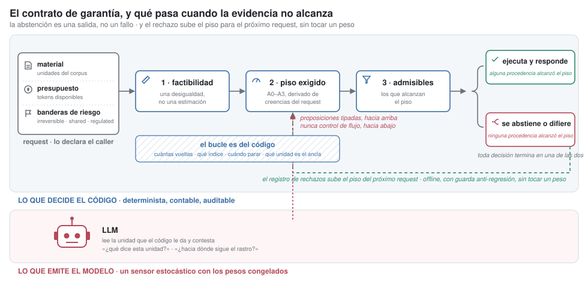

# Hardness Over Hope: Policy-as-Code and Deterministic Governance in LLM Agent Orchestration

## Confinamiento de varianza en agentes LLM mediante un plano de control determinista y plástico

**Versión breve — 2026-08-31** · **Autor**: Ariel Edgardo Levy

> Versión de conferencia. La extensa —trece figuras, tres algoritmos en pseudocódigo, los dos
> teoremas con sus demostraciones completas y el registro por celda— es `paper-es.md`.

---

## Resumen

Un **arnés** de agentes es la estructura de control que envuelve a un LLM y decide qué llamada
viene después: un bucle de razonamiento, una descomposición en sub-tareas, un grafo de
verificar-replanificar. La práctica moderna de arneses arrastra una deficiencia de diseño:
**hereda las propiedades probabilísticas del componente que envuelve**. El arnés está hecho de
llamadas al modelo, así que toda propiedad que se le quiera exigir al sistema
—reproducibilidad, trazabilidad, cobertura— queda condicionada a la salida de algo que no la
tiene.

El caso más claro son las guardas. Un verificador de alucinación implementado como otra llamada
al modelo **padece exactamente la deficiencia que vino a corregir**: verificar con el mismo
material del que se desconfía no produce una garantía, produce una **segunda estimación
correlacionada con la primera**. La forma general, y es la premisa de este trabajo:

> Apilar instancias del componente puede subir una **probabilidad**; no puede producir una
> **propiedad**. §5.4 mide las dos mitades de esa frase: el acuerdo entre paradigmas predice la
> corrección con precisión total a partir de cuatro coincidencias —eso es la probabilidad— y aun
> así no habilita una acción irreversible, porque mueve credencia y nunca procedencia.

Así que la garantía tiene que venir de un componente **de otra clase**. Interponemos entre el
modelo y el flujo un **motor determinista y plástico** que decide sobre creencias tipadas, y le
dejamos al modelo un solo papel: se le pregunta qué dice el material y lo que devuelve se tipa
como proposiciones —«esta cuenta figura a nombre de X»— que entran a una base de creencias, cada
una con la unidad de la que salió. De ahí que se lo llame **sensor**, y **estocástico** porque la
misma pregunta sobre el mismo material puede devolver otra cosa. El motor separa dos funciones
que la práctica corriente colapsa:

```
    decisión  = f(creencias)          f determinista, tipada, auditable
    creencias = g(mundo, sensor)      g estocástica
```

La garantía que eso compra tiene una forma precisa: **misma base de creencias ⟹ misma
decisión**. Es una propiedad de la decisión, se verifica repitiéndola, y se exhibe junto con la
creencia que la disparó. Y `f` es determinista **dentro** de un request y plástica **entre**
requests: lo que aprende son **políticas**, que consolidan offline con guarda anti-regresión en
un artefacto firmado y se ejecutan como código. **El sensor tiene los pesos congelados; el que
aprende es el sistema**, porque la base de creencias acumula el registro de sus propias
decisiones y de ahí se destila la política. La separación sensor/decisor viene de trabajo previo
y §2 declara la deuda; sobre esa base agregamos cinco incrementos. El que da nombre al trabajo:
las reglas escritas a mano
dan determinismo y un andamiaje entrenado extremo a extremo da aprendizaje; **en este trabajo lo aprendido es un artefacto legible cuya instalación pasa por una guarda, así que el sistema aprende sin
dejar de ser auditable.**

Sobre un corpus de análisis forense de hechos, con doce paradigmas medidos bajo condiciones
idénticas y sin juez LLM, contribuimos:

1. **Confinamiento de varianza, definido y medido.** Un agente confina su varianza cuando
   ninguna ramificación de su trayectoria depende del sensor; la Proposición 1 prueba que
   entonces toda discrepancia entre réplicas tiene un nodo responsable. Entre el **17% y el
   34%** de las celdas devuelven resultados distintos a temperatura cero con semilla fija, y
   absorber ramificaciones lleva un paradigma de **`0,33` a `0,89`** en la celda más difícil, y sus
   réplicas pasan a coincidir.
2. **Un verificador sin oráculo ni juez.** El acuerdo entre paradigmas predice la corrección con
   precisión total a partir de cuatro coincidencias, sobre **180 de 180** celdas, y se reproduce
   sobre una segunda familia de modelo contra un criterio registrado antes de correr.
3. **Un resultado negativo con mecanismo.** La interacción tarea×paradigma es el **48% de la
   varianza explicada** —39% del total, si se cuenta el ruido entre réplicas— y el premio neto
   de rutear queda entre **`−0,019` y `−0,034`** en los tres estratos del held-out: `var(γ)`
   grande no es premio de ruteo grande, porque la interacción vive entre los paradigmas que
   nadie elegiría.
4. **Capacidades como abstracción aprendible.** Declaradas desde el código, predicen un paradigma
   nunca visto mejor que la identidad del paradigma, incluso cuando a ésta se le permite ver la
   respuesta.

**Palabras clave**: confinamiento de varianza, agentes LLM, plano de control, procedencia,
predicción selectiva, aprendizaje plástico, capacidades, reproducibilidad

---



**Figura 1.** El request entra por la izquierda y sale por la derecha, y los cuatro pasos del
riel no gastan un token hasta el último. Dos cosas que el resto del paper desarrolla en prosa
están acá dibujadas: **la rama de rechazo** —cuando ninguna procedencia alcanza el piso exigido,
abstenerse es una salida y no un fallo— y **el lazo**, que es la plasticidad: el registro de
rechazos sube el piso del próximo request, offline y con guarda anti-regresión, sin que nadie
toque un peso. La flecha punteada que sube del carril de abajo es la única que cruza la
frontera, y lleva proposiciones tipadas: nunca control de flujo.


# 1. Introducción

Un *arnés* de agentes es la estructura de control que envuelve al modelo: una llamada única, un
bucle de razonamiento, una descomposición, un grafo de verificar-replanificar. Se elige una vez
en tiempo de diseño y se congela en el código, y sobre él se construyen sistemas que firman
números, disparan acciones y contestan a usuarios. **Cualquier otra capa de un sistema de
producción da tres propiedades por sentadas, y en un agente hay que construirlas.**

**1. El flujo de control vive en el código.** El modelo es aleatorio y va a seguir siéndolo; lo
que un arnés decide es **cuánto del sistema depende de esa aleatoriedad**. Delegarle
ramificaciones —qué buscar después, cuántas vueltas dar, cuándo parar— vuelve aleatoria la
trayectoria misma. Es una decisión de arquitectura, y su precio está medido: entre el **17% y el
34%** de las celdas cambian de resultado entre réplicas a temperatura cero con el mismo prompt y la misma
semilla (§5.2).

**2. Cada valor emitido exhibe de dónde salió.** Una respuesta correcta y una inventada llegan
con la misma cara, así que la fuente tiene que viajar con el valor. Con una base de creencias
tipada se puede exigir que un número esté implicado por evidencia de cierto nivel; el sustituto
es la confianza en que «el modelo suele acertar».

**3. El sistema puede callarse.** En la celda más difícil del corpus, el paradigma que gana lo
hace con **12 correctas, 3 abstenciones y cero respuestas equivocadas**; los demás contestan
siempre y devuelven un número plausible y falso. El banco puntúa la abstención y la
respuesta falsa con el mismo `0,000`: correcto para medir utilidad, ciego precisamente en el eje
que producción necesita.

**Las tres se consiguen en el mismo lugar**: moviendo decisiones de flujo de control desde el
modelo hacia el código, sobre señales del entorno que son contables y verificables. Ese
movimiento es un invariante de trabajo previo (§2); lo que este trabajo hace es construir las
tres propiedades sobre él, medirlas y decir qué cuestan.

## 1.1 La instrucción llega hasta la probabilidad, y una norma pide una propiedad

Hasta ahora el comportamiento determinista se buscó **instruyendo al modelo**: «citá siempre»,
«si no lo sabe, dígalo», «no invente números». Los modelos siguen instrucciones cada vez mejor y
cada generación se acerca más. Pero una instrucción es un **prior sobre la distribución de
salidas**, no una restricción sobre la muestra: seguirla mejor sube la probabilidad, y la probabilidad
tiende a uno sin alcanzarlo.

En un chat la brecha da igual. Una norma pide otra cosa: el Reglamento de IA de la Unión Europea
exige trazabilidad y supervisión humana sobre sistemas de alto riesgo; el artículo 22 del RGPD
condiciona las decisiones automatizadas sobre personas; una auditoría exige exhibir **por qué**
se afirmó algo. Los tres piden una **propiedad del sistema**, y eso se consigue con una
restricción, no con un pedido. **Este trabajo reemplaza la instrucción por una restricción fuera
del modelo.**

## 1.2 Dominio y alcance

**Lo que se evalúa es capacidad de RAG sobre análisis forense de hechos**: preguntas del tipo que
hace un auditor, un analista de cumplimiento o un investigador sobre un conjunto documental. Qué
cuenta figura a nombre de quién, quién le reporta a quién subiendo N escalones, si existe
registro de una transferencia, si alguien debía escalar y no lo hizo.

**El corpus es heterogéneo por construcción, y sus once **modos** son los modos de falla de ese
dominio**, no una muestra de dificultad: hecho único verificable, enumeración independiente,
cadena acoplada, agregación exhaustiva, horizonte desconocido, acción irreversible, vigencia,
plantel declarado, **ausencia**, **presuposición falsa** y escritura compartida. Las dos en
negrita son las que un benchmark de extracción no suele tener y las que un sistema forense
necesita: la respuesta correcta es que el hecho **no está**, o que la pregunta **da por cierto
algo falso**. Sobre eso se apilan tres anchos —5, 20 y 60 unidades— y entidades con variantes de
superficie, anáfora y señuelos: el **36,5%** de las menciones son invisibles a una búsqueda del
nombre completo y el **100%** de los saltos de cadena exige resolver una variante.

**La maquinaria es independiente del dominio.** Sensor estocástico, motor determinista, procedencia
tipada, compuerta aritmética y abstención son propiedades de **cómo se decide**, no de qué se
pregunta. Este registro establece que la separación **funciona y qué cuesta** en un dominio; que
el número transfiera a otro es una predicción. **Fuera de alcance**: un selector validado,
resultados sobre benchmarks públicos, y toda medición fuera del dominio descrito.

---

# 2. Trabajo relacionado

Cada pieza del motor viene de una línea con décadas de trabajo, y **cada línea asume algo sobre
su fuente de creencias que un LLM viola**. Ahí está el aporte: lo que sigue no es una lista de
precursores sino el catálogo de supuestos que hubo que reemplazar.

**Tabla 1 — El linaje, y qué supuesto rompe un sensor estocástico**

| línea | qué aporta | qué asume | qué rompe un LLM |
|---|---|---|---|
| Revisión de creencias, AGM (1985) | qué se retracta al entrar evidencia contradictoria | el postulado de **éxito**: la creencia entrante se acepta | una fuente que puede equivocarse vuelve inadmisible aceptar por defecto; de ahí la compuerta de admisión |
| Mantenimiento de verdad: Doyle (1979), ATMS de de Kleer (1986) | cada creencia exhibe su justificación | que la justificación **existe** y es recuperable | fabrica justificaciones plausibles y bien formadas |
| Procedencia de primera clase: Buneman *et al.* (2001), semianillos de Green *et al.* (2007) | de dónde vino un valor, aparte de cuánto se le cree | que se **deriva** de la operación | no hay operación: hay una emisión, y su procedencia no está en la salida |
| BDI (Rao y Georgeff, 1995) | deliberación separada de ejecución | sensores que **no alucinan** — uno roto se delata por inconsistencia | alucina consistentemente |
| Políticas como datos: Soar (1987), ACT-R | la política es artefacto inspeccionable, no un peso | condiciones de regla **observables** | las condiciones interesantes las emite el sensor, y la clave de la política hereda la varianza del sensor (§5.3) |
| Plasticidad hebbiana (Hebb, 1949) | una asociación entre pares tiene contenido sobre sus marginales | que los eventos asociados son **eventos** | la traza es lo que el sensor pidió, no lo que ocurrió |
| Opción de rechazo (Chow, 1970) | cubrir menos a cambio de errar menos | una **confianza calibrada** | la confianza declarada no está calibrada; §5.4 construye una |
| Argumentación abstracta (Dung, 1995) | una conclusión vale si su prueba sobrevive los ataques | el marco se define sobre una relación de ataque **dada**; instanciarlo exige construirla | el espacio de respuestas plausibles y falsas no es construible, así que la admisión se decide por procedencia y no por supervivencia |

**Qué se hizo con cada supuesto roto.** La procedencia deja de derivarse y pasa a **declararse y
verificarse**: un valor es admisible si el código puede exhibir de qué unidad salió, y si no
puede, no se emite. La confianza deja de leerse del modelo y pasa a **calibrarse contra el
registro**. Y las condiciones de la política pasan a exigirse `COMPUTED`, porque una clave
elicitada convierte la tabla de decisión en una variable aleatoria (§5.3).

**Los vecinos contemporáneos.** La búsqueda automática de workflows (AFlow, ADAS, GPTSwarm)
optimiza offline **un** workflow y no decide por request. Select-then-Solve, FlowBank y
TRACE-Router seleccionan en inferencia con cobertura total, sin filtro de factibilidad, sin
decisión determinista y sin abstención — y el primero motiva el área midiendo que la selección
oráculo por tarea supera al mejor fijo por **17,1pp** sobre seis paradigmas, cuatro modelos
frontera y diez benchmarks, con un ruteador real recuperando un cuarto de la brecha
[arXiv:2604.06753]; **§5.3 mide que en este corpus ese premio no existe, y da el mecanismo.** El
Structured Cognitive Loop [arXiv:2511.17673] gobierna la inferencia probabilística con un runtime
determinista sobre el historial del turno; su garantía es **un modo global único**, y lo que este
trabajo agrega encima es graduarla por solicitud, derivarla de creencias, acotar con ella el
espacio de planes admisibles y calibrar la confianza.

**Este trabajo está inspirado en MINERVA/HADD** (Jaime y Errecalde, 2026) —*arquitectura de
cognición determinista sobre creencias tipadas*, Zenodo 10.5281/zenodo.20003407, con su compuerta
epistémica de admisión en Zenodo 10.5281/zenodo.19791686—, leída completa el 2026-08-26. De ahí
viene la forma general que §3 reconoce como deuda: el LLM confinado a **sensor tipado** que nunca
toma decisiones de flujo de control; una capa de cognición determinista que es **función de la
base de creencias** —«mismo estado ⟹ misma acción», que es la forma de garantía que este paper
usa—; una **compuerta epistémica de admisión** en la frontera de percepción; un **historial de
creencias append-only** que un auditor puede reproducir; y credencia por creencia con calibración
adaptativa. Su alcance es general: generación de metas, selección de planes y control de
ejecución, todos deterministas sobre creencias de estado concreto.

Sobre esa inspiración, **cinco cosas son propias de este trabajo**:

1. **La procedencia pasa de trazabilidad a admisibilidad** — un retículo tipado con semántica de
   admisión, donde una afirmación elicitada es *inadmisible* para una acción irreversible. El
   dispositivo equivalente de la base es la confirmación humana obligatoria, que es un mecanismo
   de consentimiento y no epistémico.
2. **La garantía se gradúa por solicitud**, derivada de creencias sobre el request; antes era
   uniforme, con un umbral de escalación por tenant como único dial adaptativo.
3. **El espacio admisible se acota por nivel**: cada nivel de garantía define qué paradigmas
   admite, donde antes la biblioteca de planes se acotaba globalmente.
4. **Selección de topología, abstención tasada y diferimiento**, fuera del alcance declarado de
   la base y objeto de §5.3 a §5.5.
5. **La consolidación produce la política de control y no el contenido**: el registro de
   decisiones se destila en una política de ruteo y de herramientas (§3). El paso de instalación
   —ediciones a un artefacto ejecutable filtradas por un verificador— **está establecido por
   Kintsugi** [arXiv:2605.09487]; lo que se agrega es qué se consolida y la partición
   proponer/puntuar/promover que lo hace seguro.

Y tres mecanismos más que este paper podría reclamar y no le pertenecen: sondeo con presupuesto
sobre un estado de creencias tipado [arXiv:2606.31422], ediciones de política filtradas por un
verificador [arXiv:2605.09487] y pisos de procedencia sobre acciones [arXiv:2607.01236]. **Cada
uno está establecido por trabajo previo independiente.**

Una **conjunción**, enunciada por lo que excluye: una capa de decisión que (a)
elige **qué topología de control de flujo correr**, por request, de un catálogo —ninguno de los
anteriores rutea entre *paradigmas*—; (b) puede **abstenerse**, con la curva riesgo–cobertura
reportada en vez de la utilidad de lo que eligió contestar; y (c) poda por **aritmética sobre el
presupuesto declarado antes de cualquier inferencia**. Sacando cualquiera de las tres, el resto
queda cubierto.

---

# 3. El motor


Un request declara su material, su presupuesto y sus banderas de riesgo —`irreversible`,
`shared_writes`, `regulated`, **siempre declaradas por el caller y jamás inferidas del texto**—.
El motor decide en cuatro pasos, y los dos primeros no gastan un token:

1. **Factibilidad aritmética.** Cada paradigma declara cuántas unidades necesita leer y cuántas
   llamadas emite; con el material y el presupuesto eso es una desigualdad, no una estimación.
   Los que no entran se podan **antes de la primera inferencia**: en el registro esto poda a
   `direct` en el 94% de las celdas — no falla ahí, **no corre**.
2. **Creencias con procedencia.** Toda proposición entra a una base tipada por un retículo
   `ASSUMED < ELICITED < OBSERVED < COMPUTED`. **La procedencia no es credencia**: dice de dónde
   vino el valor, no cuánto se le cree, y son dos ejes que la práctica corriente colapsa.
3. **Dial de garantía, en cuatro niveles A0–A3.** El nivel exigido se **deriva** de creencias sobre la solicitud y
   acota el espacio de paradigmas admisibles. Una acción irreversible exige piso `COMPUTED` u
   `OBSERVED`: la opinión del modelo no es evidencia admisible para apretar un botón.
4. **Ruteo selectivo con abstención.** Sobre lo que sobrevivió, la política elige — o se abstiene
   y difiere, con la curva riesgo–cobertura reportada.

Cada decisión deja un registro `EXPLAIN` con la creencia que la disparó y su procedencia. El LLM
emite proposiciones; **jamás maneja flujo de control ni decide compuertas**.

> **La política de control es código**: una tabla de condiciones sobre features, versionada,
> firmada y evaluada de forma determinista. Un motor de *policy-as-code* —Open Policy Agent con
> reglas en Rego, o equivalente— es una realización posible de esa tabla, y no es la que este
> trabajo corre: la capa de decisión no depende de ningún motor externo.

**Qué es plástico: el sistema aprende con los pesos del sensor congelados.** El sensor tiene
los pesos congelados: no aprende de este despliegue y dos llamadas idénticas son independientes. Y sin embargo el sistema cambia de comportamiento con la experiencia, por un
mecanismo de tres pasos. **Uno**, cada decisión deja su huella epistémica —la creencia que la
disparó, su procedencia, el paradigma elegido y lo que salió—: no un log de texto, sino la base
de creencias creciendo con la misma estructura tipada que gobierna una decisión en vivo. **Dos**,
la consolidación reproduce ese registro offline —en orden de sorpresa, no cronológico— y emite
una **política**: una tabla de condiciones sobre features, versionada y firmada, que se ejecuta
como código determinista. **Tres**, la política entra sólo si no regresa sobre episodios
retenidos, y una partición nueva arranca por debajo del piso de confianza.

Así que el aprendizaje vive en la base de creencias y en la política que se destila de ella,
nunca en pesos — y eso resuelve una tensión que normalmente se paga:

> **Un sistema plástico suele ser opaco, y uno auditable suele ser fijo.** Un artefacto entrenado
> extremo a extremo aprende y no se puede leer; una tabla de reglas escrita a mano se lee y no
> aprende. Poner el aprendizaje en la base de creencias da las dos: lo aprendido es un artefacto
> **legible, diffeable, versionado y revertible**, y su instalación pasa por una guarda.

Seis superficies: **ruteo** (qué paradigma admite una **región** —una celda de la partición de features que la política usa como clave—), **herramientas** (qué índice sirve a
una consulta según su clase), **pares de herramientas** (qué asociación `tool_i → tool_j`
predice, que un histograma marginal no captura), **handoff** (cómo repartir el alcance),
**comportamiento** (el piso de garantía sube donde el registro muestra que las aserciones del
modelo se rechazan) y **credencia** (calibración **por proposición**, no un interruptor global).
Las dos últimas cambian lo que el sistema *promete*, no lo que elige: un modelo puede estar bien
calibrado sobre cardinalidad y ser inútil sobre acoplamiento, y una política de confianza global
no puede representar eso. **La plasticidad es una propiedad del diseño**; este corpus sólo
permite mirar la primera superficie.

---

# 4. Teoría

## 4.1 Confinamiento de varianza

**Definición 1** (Trayectoria). Sea `q` un request y `M` el material declarado. Una *trayectoria*
`T(q, M)` es la secuencia ordenada de nodos visitados: cada nodo es un par ⟨unidad leída, llamada
emitida⟩.

**Definición 2** (Punto de ramificación delegado). Un nodo `nᵢ ∈ T` es *delegado* si la identidad
de `nᵢ₊₁` es función de la salida del sensor. Se escribe
`d(T) = |{nᵢ ∈ T : nᵢ es delegado}|`.

La distinción es entre **qué se extrae** de un nodo y **cuál es el nodo siguiente**. Un agente
que le pregunta al modelo «¿qué dice esta unidad?» no delega ramificación; uno que le pregunta
«¿dónde busco ahora?» sí.

**Definición 3** (Confinamiento). La varianza de un agente está *confinada* sobre `(q, M)` si
`d(T(q, M)) = 0`: la secuencia de nodos es una función determinista de `q` y `M`, y el sensor
sólo determina el **contenido** atribuido a cada nodo.

**Proposición 1** (Localización). Si la varianza está confinada, entonces para dos ejecuciones
cualesquiera `T₁` y `T₂` sobre el mismo `(q, M)` se cumple `T₁ = T₂` como secuencia de nodos, y
toda discrepancia entre sus salidas es atribuible a un nodo identificable.

*Demostración.* Por inducción sobre la longitud. El nodo inicial es función de `q` y `M` por
hipótesis. Dado `nᵢ` idéntico en ambas ejecuciones, `nᵢ₊₁` es función de `(q, M, n₁…nᵢ)` y no del
sensor, porque `d(T) = 0` excluye la dependencia; luego `nᵢ₊₁` coincide. Las dos secuencias son
iguales. Una discrepancia de salida exige entonces que algún nodo haya recibido contenido
distinto, y ese nodo es el testigo. ∎

**Lo que compra.** Sin confinamiento, dos réplicas que difieren pueden diferir porque **leyeron
material distinto**, y la causa se reparte sobre una historia entera. Con él, la discrepancia
siempre tiene un nodo responsable — y una discrepancia localizable es depurable, auditable y
corregible, mientras una repartida no.

**Alcance de la Proposición 1.** El confinamiento no reduce la varianza del sensor ni mejora la calidad de
la respuesta: reordena dónde puede manifestarse. Que además suba la utilidad (§5.2) es un
resultado de este corpus, no una consecuencia de la Proposición 1.

**Consecuencia observable.** Para `k` réplicas de una celda, `pass^k = P(las k aciertan)`. No es
`pass@k`: éste mide «al menos un acierto en `k` intentos» y **crece** con `k`; `pass^k` mide «los
`k` acertaron todos» y **decrece**. El nombre y la métrica vienen de `tau2-bench` (Sierra, 2025), que la introdujo
para agentes multi-turno.

## 4.2 El valor de seleccionar es una identidad contable

Sea `p⋆` el fallback y `p_1 … p_k` los especialistas, con `Δ_j(t) = u(t,p_j) − u(t,p⋆)`. Partir el
espacio de tareas **en tres** por brazo — el empate no es un tecnicismo:

```
S₊ʲ = { Δ_j > 0 }   ganancia    π_j = Pr[S₊ʲ]
S₀ʲ = { Δ_j = 0 }   empate      τ_j = Pr[S₀ʲ]
S₋ʲ = { Δ_j < 0 }   pérdida     ν_j = Pr[S₋ʲ]
```

y, **condicionadas a lo efectivamente ruteado**, `α_j = Pr[rutear a p_j | S₊ʲ]`,
`G_j = E[Δ_j | rutear a p_j, S₊ʲ]`, `β_j = Pr[rutear a p_j | S₋ʲ]` y
`L_j = E[−Δ_j | rutear a p_j, S₋ʲ]`.

**Teorema 1.** Para todo `k ≥ 1`, `V(r) − V(p⋆) = Σⱼ ( π_j α_j G_j − ν_j β_j L_j )` *exactamente*,
sin ningún supuesto de independencia.

*Demostración.* `V(r) − V(p⋆) = E[Δ_{r(t)}(t)·1{r(t) ≠ p⋆}]`. Descomponiendo por destino queda
`Σⱼ Pr[rutear a p_j]·E[Δ_j | rutear a p_j]`, y partiendo cada esperanza según el signo de `Δ_j`:
la parte de `S₊ʲ` pesa `π_j α_j` con media `G_j`, la de `S₋ʲ` pesa `ν_j β_j` con media `−L_j`, y
**`S₀ʲ` aporta exactamente cero** porque ahí `Δ_j = 0`. ∎

Dos decisiones lo vuelven exacto. Condicionar `G` y `L` a los subconjuntos *ruteados* elimina
todo supuesto de independencia entre dónde vive la ganancia y dónde el ruteador elige ir. Y
descomponer **por destino** en vez de por un único «especialista» lo hace valer para un catálogo:
mandar una tarea a un brazo apenas peor no es el mismo evento que mandarla al peor de doce.

**Corolario (precisión sobre cobertura).** Cuando `p⋆` es casi óptimo en regiones amplias, `G` es
chico y `L` grande, así que la condición exige `β → 0` incluso a costa de `α`. El recall no es el
objetivo.

> **Es una identidad contable, no un resultado empírico, y se usa como instrumento.** No afirma
> que rutear convenga: descompone el valor de rutear en términos medibles por separado, y por eso
> permite que una evaluación de ruteo sea **falsable**. Un teorema presentado como evidencia del
> sistema sería el error que §2 señala en la literatura.

---

# 5. Resultados

**Tres términos, una vez cada uno.** Una **celda** es un par tarea × paradigma, que es la unidad
de medición. Un **modo** es una de las once clases de falla del corpus (§1.2). Y la **etiqueta de
diseño** es el modo del que salió una tarea: se conoce al construir el corpus y no al decidir, así
que en §5.3 funciona como cota superior y nunca como señal.

**Régimen.** Doce paradigmas sobre condiciones idénticas —mismo corpus, mismo modelo, misma
superficie de herramientas, misma decodificación— con `repeat = 3` sobre **78 tareas**, **121,4M
tokens**, **cero errores de infraestructura**, **sin juez LLM**. Cada panel declara el subconjunto tarea × paradigma del que sale;
cada comparación, su piso de ruido por celda. El corrector se audita automáticamente sobre toda
respuesta de utilidad cero: de **567** ceros, **ninguno** presenta señal fuerte de defecto de
emparejamiento.

Cinco preguntas, con criterio de decisión fijado **antes** de mirar el dato: **PI1** cuánta
varianza de trayectoria hay y si confinarla cambia el resultado; **PI2** si elegir paradigma
captura brecha neta positiva; **PI3** si existe una señal disponible al decidir que explique la
interacción; **PI4** si el acuerdo entre paradigmas predice corrección sin oráculo ni juez;
**PI5** si las capacidades declaradas transfieren a un paradigma no visto.

## 5.1 El plantel

**Tabla 2 — Los doce paradigmas, con sus denominadores**

| brazo | aplica | u | u × aplica | pass^3 | tok/celda | USD/1k celdas | serie |
|---|---:|---:|---:|---:|---:|---:|---:|
| **`react`** | 100% | **0,850** | **0,850** | **0,734** | 108.137 | 22 | **1,35 s** |
| `dag_strategy` | 100% | 0,830 | 0,830 | 0,703 | 105.293 | 22 | 2,87 s |
| `reflection` | 100% | 0,808 | 0,808 | 0,688 | 133.574 | 27 | 1,76 s |
| **`rewoo`** | 100% | 0,678 | 0,678 | 0,531 | **10.840** | **2** | **0,77 s** |
| `supervisor` | 100% | 0,591 | 0,591 | 0,406 | 64.079 | 13 | 2,66 s |
| `gist_reader` | 100% | 0,584 | 0,584 | 0,516 | 23.075 | 5 | 0,91 s |
| `handoff` | 96% | 0,583 | 0,557 | 0,438 | 131.310 | 27 | 2,04 s |
| `pointer_chase` | 96% | 0,515 | 0,492 | 0,359 | 9.787 | 2 | 1,38 s |
| `graph_traverse` | 56% | 0,511 | 0,288 | — | 21.356 | 4 | — |
| `streaming_scan` | 12% | 0,750 | 0,090 | — | 26.380 | 5 | — |
| `extract_compute` | 12% | 0,583 | 0,070 | — | 26.184 | 5 | — |
| **`direct`** | **6%** | **0,917** | 0,055 | — | 22.822 | 5 | — |

`aplica` es qué fracción de las celdas **ofrecidas** a ese brazo pasa la compuerta de
factibilidad, y `u` promedia sólo las que pasan, con `λ = 0`, el peso del costo en la utilidad.
`pass^3` y `serie` salen del rectángulo de **64 tareas × 8 brazos** —el 82% de las filas medidas— porque exigen que todos los brazos hayan corrido las mismas tareas con tres réplicas.

> **Dos advertencias de lectura, y las dos son sobre denominadores.** Primero: el `pass^3` de
> esta tabla y el de §5.2 son **rectángulos distintos y no se deben cruzar** — el de esta tabla sale de las 64
> tareas comunes a los ocho brazos, allá del subconjunto donde los cuatro brazos comparados
> corrieron sus tres réplicas, que es más chico y más fácil. De ahí que `react` figure con
> `0,734` en esta tabla y `0,797` en §5.2. Segundo: las cuatro correcciones de §5.2, que llevan
> `pointer_chase` de `0,33` a `0,89` en la celda de cadenas acopladas, son **posteriores a esta
> corrida** y tocan 3 de las 78 tareas; **no se propagaron a esta tabla**, y el brazo figura en esta tabla
> con su número de campaña. Una tabla que mezclara dos versiones del mismo brazo sin declararlo
> sería el defecto que §2 señala en la literatura.

Tres regularidades que sólo se ven con las columnas juntas. **`u` y `u × aplica` son dos números y ninguno
reemplaza al otro**: `direct` es el mejor del plantel donde su mecanismo corre —`0,917`— y aporta
`0,055` porque corre en el 6% de las celdas; en el 94% restante **no corre**, y eso lo decide la
aritmética antes del primer token. **`pass^3` siempre está por debajo de `u` y la
distancia no es proporcional**: varianza que vive *dentro* de una celda, invisible para cualquier
piso de ruido calculado entre brazos. **El margen está en el costo, no en la calidad**: entre
`react` y `rewoo` hay `0,172` de utilidad, un factor **11×** de costo y **1,8×** de latencia. En
utilidad los brazos se separan por centésimas; en lo que cuestan, por órdenes de magnitud.

## 5.2 PI1 — La varianza de trayectoria, y confinarla

```
brazo            pass@1   pass^3    caída   inestables
react             0,875    0,797   −0,078          17%
dag_strategy      0,874    0,763   −0,112          20%
rewoo             0,718    0,576   −0,142          27%
supervisor        0,637    0,441   −0,196          34%
```

**Entre el 17% y el 34% de las celdas cambian de resultado entre réplicas**, con `t = 0`, semilla fija y el mismo
prompt. La varianza de una llamada y la de una trayectoria son cantidades
distintas: sobre una llamada la varianza del sensor se manifiesta como un token distinto y el
resultado se mueve de forma acotada; sobre una trayectoria, una elección distinta en el paso uno
cambia **qué documento se lee en el paso dos**, y de ahí en adelante las dos réplicas ya no
comparan la misma evidencia. La varianza no se promedia: se **ramifica**.


**La intervención.** La celda más difícil —cadenas acopladas, donde cada salto exige resolver una
variante de superficie— tenía un brazo en `0,33`. Cuatro correcciones, **todas de flujo de control
y ninguna de prompt**: leer los saltos exigidos de la propia pregunta con una forma de token
cerrada; resolver el ancla por código cuando el sujeto viene declarado; tipar el crudo del sensor
a entidad antes de usarlo; y elegir el hit por posición de primera mención en vez de por orden del
índice.

**Resultado: de `0,33` a `0,89`**, empatando al mejor brazo de la celda. Y la cuarta corrección
prueba el punto por sí sola: **con el mismo prompt y los mismos resultados de búsqueda**, la
réplica 0 elegía el ancla correcta y recorría la cadena entera (`u = 1,000`) mientras las réplicas
1 y 2 elegían otra y sacaban `0,000`. Una decisión de flujo delegada al sensor suprime el determinismo
de la trayectoria.

**Y la varianza no crece con el número de ramificaciones.** La conjetura ingenua sería
`pass^k ≈ pass@1 · q^d`. El registro la refuta: la correlación entre `d` y la caída de `pass^3` es
`r = −0,24`. **Importa cuál se absorbe**, y eso convierte el diseño de un arnés en un problema tratable
—encontrar la ramificación que decide el resultado— en vez de una búsqueda sobre topologías.

## 5.3 PI2 y PI3 — Por qué no hay premio de ruteo aunque la interacción sea enorme

Descomponiendo `u(tarea, brazo) = μ + α(tarea) + β(brazo) + γ + ε` sobre un panel de **59 tareas ×
8 brazos** (76% de las filas medidas), con criterio de recorte mecánico y en un solo lugar del código:

```
α  dificultad de la tarea     0,0632    41%
β  calidad del brazo          0,0160    10%
γ  INTERACCIÓN                0,0736    48%
ε  ruido entre réplicas       0,0351
```

γ descontado el ruido da `0,0619`, con **señal/ruido 5,30**. Bajo el argumento habitual, correspondería rutear.


**PI3, con la corrección que casi nunca se hace.** La figura ordena diez señales por cuánto de γ
explican, con su propio nulo por permutación sobre cada barra. Varias lo superan — y esa
comparación es exactamente la falacia que el nulo existía para evitar, porque **se probaron nueve
candidatas y se eligió la mejor**. La vara correcta es la línea punteada: el **máximo de los nueve
nulos en cada permutación**. Sólo `cardinalidad × término literal` la cruza, con `0,309` y `p`
corregido `< 0,001`, y captura dos tercios del techo que marca la **etiqueta de diseño** —el modo del que la tarea salió—,
que está en el gráfico como **cota superior**, no como candidata: es la etiqueta de diseño del corpus y no se conoce al decidir.

**PI2: `var(γ)` grande ≠ premio de ruteo grande.** El premio es `E[max_p u] − max_p E[u]`, y γ
puede ser enorme porque los brazos **malos** son malos en lugares distintos. Esa estructura es
real, es predecible, y su **valor de ruteo es cero**: no hay razón para preferir el brazo que pierde por poco al que
pierde por mucho. Lo único cobrable es la interacción entre los brazos que competirían — los
tres a menos de `0,05` del mejor fijo:

```
gamma real estimado          0,0046      señal/ruido  0,38
oráculo entre contendientes  0,932
mejor fijo                   0,875
premio máximo               +0,058
piso de ruido               +0,065
premio NETO                 −0,008
```

> **El piso de ruido, que es la cantidad de la que depende todo veredicto negativo de este
> paper.** Un oráculo toma un **máximo** sobre estimaciones ruidosas de utilidad por tarea, y un
> máximo sobre estimaciones ruidosas está sesgado hacia arriba: `E[max_p û_p] > max_p E[u_p]`
> **incluso cuando todos los paradigmas son idénticos**. Así que toda brecha de oráculo medida
> contiene una componente de ruido, y reportarla entera exagera el premio.
>
> La estimación es directa y no modelada: se toman las `k` réplicas del **mismo** paradigma sobre
> cada tarea, se las trata como si fueran `k` paradigmas distintos, y se calcula la brecha de
> oráculo sobre ellas. **Cada punto del resultado es ruido por construcción**, porque los
> «paradigmas» son la misma cosa. En el held-out el piso se reporta como el p95 sobre
> remuestreos de **tareas** —la tarea es la unidad de muestreo, no la fila—. Implementación en
> `app/metrics.py`, y los deltas se computan sobre valores sin redondear, así que una resta de
> las cifras impresas puede diferir en la última posición.

Y **ninguna señal separa a los tres contendientes entre sí**: todas con `p > 0,29`. Sólo la **etiqueta de diseño**
lo logra (`p = 0,007`), y ésa no se conoce al decidir. El 48% de interacción es real y vive
entre los brazos que nadie elegiría; **reportar `var(γ)` como evidencia de que rutear conviene
mide la estructura equivocada.**

**Y la clave de la política hereda la varianza del sensor.** El vocabulario de región que la
política usa como clave tiene cuatro ejes `COMPUTED` y uno `ELICITED`; medido entre dos familias
de modelo, **el 27% de las tareas cambia de región** según qué modelo las sensó. Una política cuya
clave depende del sensor no es una tabla determinista: es una variable aleatoria con nombre de
tabla. De ahí la exigencia de que las condiciones de la política sean `COMPUTED`.

**Fuera de muestra.** El held-out —mundo con semilla nueva, generado y verificado
independientemente— corre por el mismo camino de código: **26 tareas × 12 paradigmas × 3
réplicas**, 927 filas, **48,5M tokens**, cero errores de infraestructura. Tres estratos
acumulativos:

```
                     base+w4      + w16      + w48
tareas del panel          12         18        24
oráculo por tarea      0,972      0,981     0,931
mejor fijo             0,833      0,813     0,802
brecha observada      +0,139     +0,168    +0,128
piso de ruido (p95)   +0,167     +0,187    +0,162
brecha NETA           −0,028     −0,019    −0,034
```

**Negativa en los tres.** Y el piso de ruido **sube** al agregar tareas (`+0,167 → +0,187`), lo que
contradice la intuición de que más muestra lo baja: el piso de un premio de **máximo** no es el
error de una media — crece con la dispersión del plantel, no decrece como `1/√n`.

## 5.4 PI4 — El acuerdo entre paradigmas es un verificador

Con doce brazos corriendo la misma tarea, cuántos coinciden es una señal gratuita: ya se pagó por
producirla.

```
k brazos coinciden    celdas    P(la respuesta es correcta)
        0                208               0,424
        1                 36               0,389
        2                 24               0,600
        3                 64               0,812
       ≥ 4               180               1,000
```

**180 de 180 celdas correctas con `k ≥ 4`**, sobre igualdad exacta de la cadena normalizada. La
curva tiene un **umbral** en 4 y no una pendiente suave. Dos salvedades: `1,000` sobre 180 casos
tiene cota inferior de Wilson al 95% en `0,980`, así que lo afirmable es «≥ 0,98», y **el 4 es
el punto donde la perfección aparece en este registro**, no un umbral derivado.

**Tres controles, y uno sale en contra.** *No marca dificultad*: el efecto sobrevive dentro de cada
modo del corpus, así que no es «las tareas fáciles tienen consenso». *No depende del largo*: la
correlación entre acuerdo y largo de respuesta no explica la curva. *No abarata* — las 56
configuraciones de cascada probadas **suben** el costo. Ese tercer control sale en contra de una
lectura optimista y se reporta.

**Qué es y qué no autoriza.** Mueve **credencia**, nunca **procedencia**: que cuatro brazos
coincidan no convierte una afirmación elicitada en observada, y por lo tanto **no habilita una
acción irreversible**. Es una regla de abstención, y su lugar es el dial de garantía, donde decide
cuándo una respuesta no necesita verificarse contra el documento. Contra un criterio registrado antes de
correr, el efecto se replica sobre una segunda familia de modelo, y el rectángulo de esa réplica
hay que declararlo porque es chico: **374 filas contra las 3.519 de la familia
principal**, un décimo, y sobre un subconjunto de celdas y no la grilla entera — el modelo de la
segunda familia cuesta diez veces la entrada, así que se corrió donde hacía falta. El **umbral** se
mueve entre familias; el **fenómeno** se sostiene.

## 5.5 PI5 — Lo aprendible es la capacidad, no la identidad del paradigma


Diez capacidades declaradas desde el código —qué payload admite por llamada, si puede
replanificar, si garantiza cobertura, si puede abstenerse por prueba faltante— con evidencia
apuntando a la línea que las implementa. La prueba es dejar **un brazo** afuera, no una tarea: un
modelo con la identidad del paradigma no puede decir nada de un brazo que no vio —no tiene
parámetro para él, y es un límite estructural, no de ajuste—. Uno con capacidades sí, porque el
brazo nuevo trae su vector declarado del código.

```
modelo                                          MAE
media global                                  0,364
dificultad de la tarea sola                   0,257
CAPACIDADES                                   0,233
identidad del brazo (viendo al que falta)     0,339
```

Las capacidades ganan **6 de 8 pliegues**. La cuarta fila se incluyó como techo esperado y **no lo es**: sale peor que capacidades **pese a hacer trampa**, porque ignora α —el 41% de la varianza—.
Saber qué brazo es, sin saber qué pregunta es, predice mal. Ese fracaso es parte del argumento:
**la identidad del paradigma no es una buena representación ni cuando se la deja mirar la
respuesta.**

**El efecto no cruza su nulo.** Contra capacidades barajadas, `p = 0,065`. Queda como resultado
**sugestivo y no establecido**: ocho brazos son ocho puntos, y con esa `n` la prueba no puede
decidir. Lo que la sentenciaría son más brazos, no más tareas. **Y el catálogo identifica un hueco sin requerir
mediciones**: ningún paradigma del plantel junta cobertura garantizada con abstención por prueba
faltante, que es lo que una pregunta de ausencia exige. Eso es una especificación, no una
observación.

---

# 6. Amenazas a la validez

§4 no depende del corpus: la Proposición 1 y el Teorema 1 se comprueban sobre distribuciones
sintéticas de respuesta conocida en `tests/test_science.py` y `tests/test_consolidation.py`,
**573 aserciones chequeadas por máquina**. Las amenazas que siguen tocan §5.

**Interna.** El régimen en-ventana es casi tautológico donde el corpus mide 16k tokens: leer todo
es correcto y lo más barato. El régimen fuera de ventana está medido a 483k con `repeat = 3`; el
claim hasta 1,27M descansa en el barrido de factibilidad a costo cero, sin corrida completa. La
amenaza del muestreo no es la temperatura —los despliegues de razonamiento la rechazan—
sino que `tools` y un `reasoning_effort` distinto de `none` no se combinan en esta familia, y la
diferencia es total: `0,000` contra `1,000` sobre la misma tarea. Toda fila corre con
`reasoning_effort = none`, que es un régimen declarado y no un default.

**Y hay un confundente de PI1 que este montaje no puede separar.** Las celdas inestables se
miden con `t = 0`, semilla fija y el mismo prompt, así que la varianza observada tiene dos
fuentes posibles: la ramificación delegada al sensor, que es la que el paper estudia, y el
**no-determinismo del stack de servicio** —agrupamiento dinámico de requests, orden de
reducción en punto flotante, versión del kernel— que produce logits distintos para entradas
idénticas sin que el cliente pueda verlo. La Proposición 1 no depende de cuál domine: con
`d(T) = 0` la trayectoria es fija cualquiera sea la fuente del jitter. Lo que sí depende es
atribuir el `17–34%` a la ramificación, y separarlo exige un servidor de un solo request por
lote, que este montaje no tuvo.

**Externa.** El corpus es sintético: el ground truth es exacto y se re-deriva independientemente,
y los parámetros estructurales son diales, pero **la distribución de tareas reales sobre esos
diales es desconocida**. Además, una rama de la propia partición no se pudo ejercitar y es
estructural: el problema se parte según `v`, la disponibilidad de un detector barato en runtime, y
**todos los corpus caen del lado `v = 1`** — corregir sin juez significa corregir por coincidencia
exacta, eso necesita una respuesta de referencia, y el mismo campo se leía como detector. La forma
general es una advertencia sobre toda una clase de experimento: **un benchmark que establece
corrección por coincidencia exacta contra una referencia tiene un detector barato en cada tarea
por construcción, y por lo tanto no puede ejercitar la rama `v = 0` de su propia partición.**

**De constructo.** La superficie de acciones es arquitectura declarada y **no está ejercitada**.
Las doce herramientas del inventario leen el mundo, escriben el estado del propio agente o leen su
contabilidad: **todas son internas al proceso**. Seis tareas llevan `irreversible = True`
y esas banderas sí levantan el dial, pero la tarea que etiquetan es una clasificación sobre
documentos con la etiqueta de una acción encima. La compuerta que existe para lo irreversible nunca
tuvo un acto irreversible que filtrar. El balance exacto: **§4 se afirma para agentes en
general y está verificado como tal; §5 se afirma para extracción de respuesta exacta sobre
documentos y se midió ahí; la superficie de acciones está diseñada, tipada, probada en unidad y
sin medir.**

**Reproducibilidad.** Una semilla sola no fija un corpus: cuando el algoritmo de generación
cambió, la misma semilla produjo un mundo distinto. Los manifiestos estampan versión de generador,
analizador léxico y superficie de herramientas, y el cargador levanta si un archivo las mezcla.

---

# 7. Conclusión

**Una sola máquina —sensor estocástico, creencia tipada, regla determinista, registro— y cuatro
afirmaciones medidas sobre ella.** Las cuatro miden la misma frontera
—lo que el modelo emite contra lo que el código decide— desde cuatro lados. Confinamiento dice
**dónde** puede aparecer la varianza; ruteo, **qué se gana eligiendo**; consenso, **cuándo hace
falta verificar**; capacidades, **qué se predice de un paradigma que todavía no existe**.

Dos tienen mecanismo enunciado, y es lo que transfiere fuera de este corpus. En confinamiento: la
varianza no crece con el número de ramificaciones, **importa cuál se absorbe**. En ruteo:
`var(γ)` grande no es premio grande porque la interacción vive entre los paradigmas que nadie
elegiría, y el Teorema 1 es el instrumento que lo separa **antes** de construir un router. Los
otros dos son especificaciones más que observaciones: el consenso no abarata y no era para eso —es
una **regla de abstención**—, y el catálogo de capacidades nombra un hueco sin correr nada.

**Lo que sigue.** Cinco de las seis superficies plásticas siguen sin corpus que las mire; las dos
que cambian lo que el sistema *promete* gobiernan la abstención y no la elección, y piden un
corpus donde la evidencia sea insuficiente en algunas tareas y suficiente en otras. El nulo de
capacidades lo cruzan más paradigmas, no más tareas. Y la superficie de acciones exige
herramientas que cambien algo fuera del proceso.

**Una corrección gratis para cómo se evalúan agentes.** Un banco que reporta `pass@1` sin `pass^k`
no distingue un sistema que acierta de uno con el que se puede contar, y la diferencia llega a
`0,196` en este registro. Uno que reporta varianza de interacción como evidencia de que rutear
conviene mide la estructura equivocada. Ninguna de las dos correcciones cuesta un token.

---

# Referencias

Los trabajos se identifican por su identificador persistente. Los marcados con **★** se leyeron
completos en la fecha indicada; de los demás se verificó lo que este paper les atribuye.

**★ Jaime y Errecalde (2026). MINERVA/HADD.** *Arquitectura de cognición determinista sobre
creencias tipadas.* Zenodo 10.5281/zenodo.20003407 (leído 2026-08-26). Y su compuerta epistémica de admisión (EVR):
Zenodo 10.5281/zenodo.19791686. **Es la base de la que §3 toma sus invariantes (§2).**

**★ Select-then-Solve.** arXiv:2604.06753 (leído 2026-08-26). Selección de paradigma por tarea
sobre seis paradigmas, cuatro modelos frontera y diez benchmarks.

**SCL / Soft Symbolic Control.** *Structured Cognitive Loop.* arXiv:2511.17673. Gobernanza
determinista sobre inferencia probabilística, en un modo global único.

**EnvProbe.** *Ask the World Before Acting: Budgeted Environment Probing for World-Model
Calibration.* arXiv:2606.31422.

**Kintsugi.** *Learning Policies by Repairing Executable Knowledge Bases.* arXiv:2605.09487.
**Establece el paso de instalación filtrada por verificador** que §2 le cede.

**ProvenanceGuard.** *Safeguarding LLM Agents from Misalignment through Provenance Analysis.*
arXiv:2607.01236.

**Survey.** *From Agent Traces to Trust: A Survey of Evidence Tracing and Execution Provenance in
LLM Agents.* arXiv:2606.04990.

**tau2-bench.** Sierra, 2025. `github.com/sierra-research/tau2-bench`. Origen de `pass^k`.

**El linaje clásico de la Tabla 1.** Alchourrón, Gärdenfors y Makinson (1985), *On the logic of
theory change*. — Doyle (1979), *A truth maintenance system*. — de Kleer (1986), *An
assumption-based TMS*. — Buneman, Khanna y Tan (2001), *Why and where: a characterization of data
provenance*. — Green, Karvounarakis y Tannen (2007), *Provenance semirings*. — Rao y Georgeff
(1995), *BDI agents: from theory to practice*. — Laird, Newell y Rosenbloom (1987), *SOAR: an
architecture for general intelligence*. — Hebb (1949), *The Organization of Behavior*. — Chow
(1970), *On optimum recognition error and reject tradeoff*. — Dung (1995), *On the acceptability
of arguments and its fundamental role in nonmonotonic reasoning, logic programming and n-person
games*.

**Marco normativo.** Reglamento (UE) 2024/1689 de Inteligencia Artificial, arts. 12 y 14
(trazabilidad y supervisión humana). — Reglamento (UE) 2016/679 (RGPD), art. 22 (decisiones
individuales automatizadas).
