# Determinism before selection: what is learnable in LLM agent orchestration

**Draft 0.2 — 2026-08-30**
**Author**: Ariel Edgardo Levy
**Status**: working draft. The theory is machine-verified; empirical measurements come from
**78 tasks × 12 paradigms × 3 replicates** over a corpus with real entities (121.4M tokens).
Every empirical claim carries its sample size. What is still missing is a valid held-out
measurement; that is declared where it matters.
Destination: arXiv cs.LG (primary), cs.AI (cross-list).

---

## Abstract

This work began by asking **which orchestration paradigm to pick per task** and ends with a
different answer than it sought. Over a complete record — 78 tasks × 12 paradigms × 3
replicates, with no LLM judge and an audited grader — **routing on quality has no net prize**:
`−0.008` against the best fixed paradigm, and the mechanism of that failure is more
informative than the number. What does stand, and what this paper argues, is two claims about
**determinism** and one about **what is learnable**.

**First: the interaction exists, it is enormous, and it is not billable.** Decomposing
`u = μ + α(task) + β(arm) + γ + ε`, the interaction γ explains **48%** of variance at
signal-to-noise `5.30`, and one signal predicts it — `cardinality × literal term`, capturing
two thirds of the ceiling and **surviving selection correction** against the maximum of nine
permutation nulls. And the net prize is still negative, because **large `var(γ)` ≠ large
routing prize**: γ is enormous because the *bad* arms are bad in different places. Restricted
to arms that would actually compete, real γ falls to `0.0046` at signal-to-noise `0.38`.
Reporting interaction variance as evidence that routing pays measures the wrong structure. The
result replicates at the level of families declared from code: `+0.079` against a `+0.065`
noise floor, with no signal predicting which family wins.

**Second: determinism is the scarce resource, and it is recoverable.** `pass^k` — succeeding
on all three replicates — drops between `0.078` and `0.196` per arm, with **17% to 34% of
cells unstable** at temperature zero, fixed seed and identical fingerprint. No arm reaches
per-decision reproducibility above `0.983`. But it is recovered by **taking control decisions
away from the model and giving them back to code**: four structural corrections — none of
phrasing — took one arm from `0.33` to `0.89` on the coupled-chain cell *and* made its
replicates agree. The decisive intervention is a single design line: with the same fingerprint
and the same search results, letting the model choose a walk's anchor gave
`1.000 / 0.000 / 0.000`; letting code choose it gives `1.000` three times. **The naive
conjecture that non-determinism compounds with the number of decisions is false** (`r = −0.24`,
`n = 8`): which decision matters, not how many.

**Third: what is learnable is capability, not paradigm identity.** The earlier attempt to map
question ontology → paradigm name was refuted (`−0.087`). We propose the missing link —
ontology → **required capabilities** → arms that have them — with ten capabilities declared
from code, each with its evidence. The correct test is **leave-one-arm-out**, not
leave-one-task-out: a model keyed on paradigm identity has no parameter for an arm it never
saw; one keyed on capabilities does. Measured, capabilities predict an unseen arm better than
task difficulty alone (`MAE 0.233` vs `0.257`, winning 6 of 8 folds) and better than arm
identity even when the latter *sees* the held-out arm (`0.339`). Against a shuffled-capability
null it gives `p = 0.065`: **suggestive, not established**, and eight arms are eight points.

Three earlier results survive as support: **feasibility is arithmetic** and prunes topologies
before a token is spent; the **Selection Value Theorem** partitions the problem by
verifiability rather than task type; and the **tool surface** governs variance usually
attributed to topology.

We contribute the theory, a measurement layer whose axes are explicitly checked against the
2024-2026 agent-benchmark literature, a corpus generator with exact ground truth and
surface-variant entities, a capability catalogue declared from code, and failure analysis of
twelve topologies. We do **not** yet contribute a selector validated on held-out data.

**Keywords**: LLM agents, determinism, orchestration, DAG patterns, selective prediction,
plastic learning, capabilities, agent evaluation

---

## How a request is decided

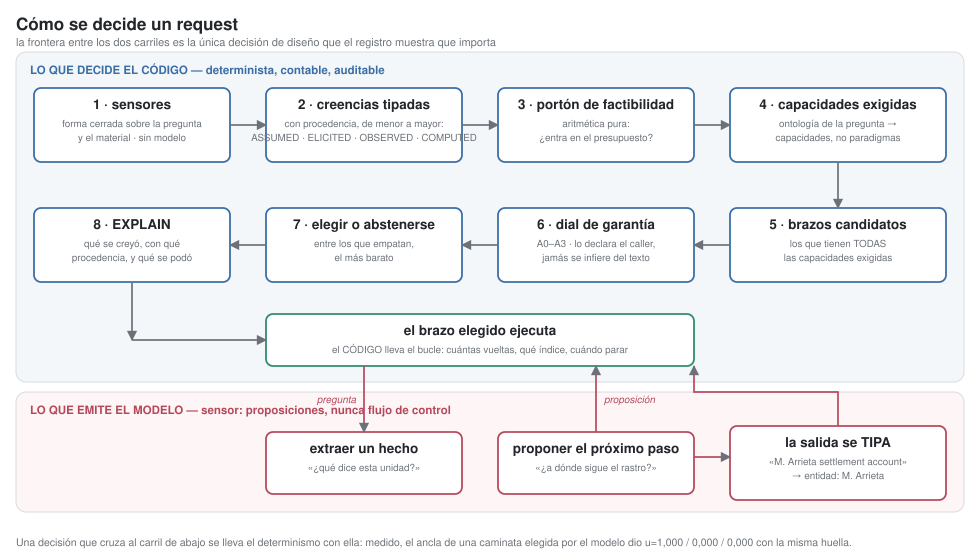

The figure is the paper's argument in one image. The upper lane is deterministic and
auditable: closed-form sensors, typed beliefs with provenance, an arithmetic gate, the
capabilities the question requires, and only then a choice among capable arms — or an
abstention. The lower lane is the model, and it **only emits propositions**: what a unit says,
where a trail leads. It never decides how many turns to take, which index to use, or when to
stop.

**Every decision that crosses into the lower lane takes determinism with it**, and that is
measured, not argued. The guard closing the loop — typing the sensor's output before using it —
dates from 2026-08-30 and came from a concrete case: the model emitted
`'M. Arrieta settlement account'`, and that tail dragged the query into classifying as prose,
sending it to the wrong index. **The rule was right and the input was dirty.**

| what code decides | what the model emits |
|---|---|
| how many turns to take (from the length declared in the question) | what this unit says |
| which index to use (lexical for a named entity, hybrid for prose) | where the trail leads next |
| which unit is the anchor, and which is the chain's terminus | what fact the reading contributes |
| whether there is enough evidence to answer, or to abstain | the wording of the answer |


# 1. Introduction

## 1.1 A measured prize that nobody captures

An LLM agent's *paradigm* — the control structure wrapped around the model, such as a
single call, a reasoning loop, a decomposition, or a verify-replan graph — is normally
chosen once at design time and frozen in code. Recent work measures what that costs.
Across six paradigms, four frontier models and ten benchmarks (~18,000 runs), oracle
per-task selection beats the best fixed paradigm by **17.1pp** on average, with individual
swings as large as +44pp and −15pp depending on the pairing [Select-then-Solve,
arXiv:2604.06753].

The same work shows the prize is not being collected. A trained embedding router recovers
roughly a quarter of the gap. Zero-shot self-routing — asking the model to pick its own
paradigm — recovers *negative* value: two models fall below their own single-paradigm
baselines, one to 27.5%.

So: the prize is large, the best published attempt captures a minority of it, and the naive
attempt is worse than not trying. That pattern invites the conclusion that better selectors
are needed. We argue it invites a different one.

## 1.2 Three claims that precede the learning problem

**Feasibility is arithmetic, and it is free.** Before asking which topology is *best*, one
can ask which can *run*. That question is answerable from quantities the task already
declares. A learned policy that spends episodes discovering that map-reduce loses on
500-unit tasks is learning arithmetic the hard way; the cap was computable before the first
token.

**Selection pays only under a precise condition.** A router that must always choose has no
degree of freedom over its false-positive rate and therefore pays for every misroute. We
formalise when selection beats a fixed fallback and show that the optimal operating point
generally involves abstaining on most requests — which is not a weaker router but a
different objective.

**Much of what is attributed to topology is attributable to tools.** In our measurements
the paradigms that use retrieval tools span a fifty-fold cost range while those that do not
span 1.2×. A benchmark that does not report the quality of its tool surface is not
comparing topologies; it is comparing one retriever wrapped seven ways.

## 1.3 What this draft does and does not establish

Established: the theory (§5), machine-checked against synthetic distributions with known
answers; a feasibility layer (§4) validated across four corpus scales; a corpus generator
whose ground truth is re-derived independently from the documents (§6).

Preliminary: every empirical number in §7 and §8 is n=1 per cell on one corpus with one
model. Replicate variance on the most elaborate topology was measured at up to 3.93× in
cost, so magnitudes are indicative. The *mechanisms* are more robust than the magnitudes,
because they rest on tool-usage traces rather than on effect sizes.

Not established: a validated selector, any result on public benchmarks, and any claim about
a regime other than exact-answer extraction over document collections.

**Structurally untested, which is stronger than "not established" and was found by
measurement.** §5.2 partitions the problem on `v`, the availability of a cheap runtime
detector, and sends `v = 1` to a cascade and `v = 0` to a router. **Every corpus in this
record sits on the `v = 1` side.** Not by choice: grading without a judge means grading by
exact match, exact match needs a gold answer, and the same field was read as the runtime
detector — so 25 of 26 tasks per corpus declared `v = 1`. The cascade rule fires at a higher
priority than the selection rule, so on two independent held-out corpora **the selection
rule never fired at all**, and both routing verdicts are measurements of the cascade.

The general form is a caution about a whole class of experiment, not about this one:

> A benchmark that establishes correctness by exact match against a reference **holds a
> cheap detector on every task by construction**, and therefore cannot exercise the
> `v = 0` branch of its own partition. Being gradeable implies being verifiable.

Whether selection pays where verification is genuinely impossible is, on this record,
**open** — and it needs a corpus whose detector availability is declared per task rather
than inherited from the answer key.

---

# 2. Related work

## 2.1 Automatic workflow search

AFlow reformulates workflow optimisation as search over code-represented workflows with
MCTS over operators [arXiv:2410.10762]; ADAS and GPTSwarm search related spaces. These
produce **one** workflow per benchmark, offline. Our concern is per-request selection among
a fixed set, and — before that — which members of the set can run at all.

## 2.2 Inference-time paradigm selection

Select-then-Solve trains a lightweight embedding router to pick a paradigm per task
[arXiv:2604.06753]. FlowBank builds a portfolio offline and selects per query
[arXiv:2606.11290]. TRACE-Router routes at the granularity of a task trace rather than a
request [arXiv:2607.22465]. Uno-Orchestra learns a joint decomposition-and-dispatch policy
[arXiv:2605.05007].

All of these operate at **coverage one**: every task receives a paradigm. §5.1 argues that
this is the binding constraint rather than model capacity, and none of them reports a
risk-coverage curve. Two details of Select-then-Solve, verified against the full paper
rather than its abstract (2026-08-26): its oracle is an *uncorrected empirical maximum* per
task, and its own limitations note that the benchmark sample is fixed with no re-sampling
across seeds — which is precisely the upward bias our noise-floor protocol (§6.1) is built
to discount. And the deferral machinery exists next door without having crossed over:
ReDAct defers individual decisions to a larger model on a calibrated uncertainty threshold
[arXiv:2604.07036]; uncertainty-decomposition routing unifies abstention and routing with
distribution-free guarantees, for classifiers [arXiv:2605.07805]; and compositional
meta-routing trains an interpretable router over textual features and names a learned
confidence gate with fallback to static routing as unevaluated future work
[arXiv:2608.00106]. Nobody applies abstention to paradigm selection (searched 2026-08-26);
the window is visibly closing.

## 2.3 Cost models for workflows

GLOW predicts agentic workflow performance from graph and language features
[arXiv:2512.15751]; Cost-Aware Optimization for Agentic Query Execution draws the analogy
to classical query optimisation explicitly [arXiv:2606.03152]. We take the analogy as
settled and do not claim it. Our addition is upstream: a hard feasibility filter that a
cost model does not replace, because an infeasible plan has no cost.

## 2.4 Symbolic governance over probabilistic inference

The Structured Cognitive Loop introduces Soft Symbolic Control, a governance mechanism
over probabilistic inference [arXiv:2511.17673]. This is the closest related work to §6.2,
and read in full (2026-08-26) its governance splits in two: *Regulation*, a persistent
natural-language metaprompt whose enforcement the paper itself notes depends on how well
the LLM interprets instructions, and *Control*, a deterministic runtime applying fixed hard
rules to the turn's execution history — duplicate calls, error counts, cycle depth — not to
propositional content. Control does carry a per-action risk classification (cache a safe
read, block a repeated critical call, freeze for human authorisation), but that is a static
class on individual actions inside one fixed loop. It operates as a **single global mode**:
it does not graduate assurance per request, derive the required level from beliefs about
the request, restrict the admissible plan space by level, or calibrate model-stated
confidence. Those four are what we add — over a belief base the symbolic layer decides on,
rather than a metaprompt the model is asked to obey.

Nearby in the belief layer itself: Nous caps belief reliability by channel provenance
[arXiv:2606.22030], MemIR types memory by provenance to prevent source collapse
[arXiv:2605.25869], Eywa promotes facts only after validators pass against immutable
evidence [arXiv:2605.30771], and HEP makes hypothesis evolution auditable — though all
validated evidence moves belief equally, with no provenance hierarchy gating promotion
[arXiv:2607.09195]. The garden-of-forking-paths problem — agents that propose and score
hypotheses on the same data — is diagnosed empirically in [arXiv:2607.01507] without a
mechanism; §6.3's propose/score partition is one.

MINERVA/HADD is the closest antecedent of the belief layer itself, and read in full
(2026-08-26) it supplies **mechanism, not vocabulary** [Zenodo 10.5281/zenodo.20003407].
The HADD invariants already contain: the LLM confined to a typed sensor that never makes
control-flow decisions; a deterministic cognition layer that is a pure function of the
belief base — "same state → same action", which is the guarantee form §6.2 adopts; an
epistemic admission gate on beliefs at the perception boundary (the EVR gate, specified in
a companion paper [Zenodo 10.5281/zenodo.19791686]); an append-only belief history an
auditor can replay; per-belief numeric confidence with adaptive calibration (EMRE); and
the Kautz Type-2 framing. Its scope is general — goal generation, plan selection and
execution control are all deterministic over beliefs about concrete state — within a
pre-verified plan library and a fixed topology.

What HADD does not have is what §6.2 adds: provenance as a **typed hierarchy with
admissibility semantics** rather than a traceability field; the rule that elicited
assertions are inadmissible for irreversible actions (HADD's nearest device is mandatory
human confirmation, a consent mechanism, not an epistemic one); assurance **graduated per
request** — HADD's guarantee is uniform, its only adaptive dial a per-tenant escalation
threshold; the admissible **pattern space bounded by level** — HADD bounds its plan
library globally; and **measured** calibration (EMRE learns confidence but never measures
it — no ECE, no reliability diagrams). Paradigm selection, abstention and deferral are
outside HADD's scope entirely.

**Delegation contracts and attested identity.** The nearest neighbour on the routing side
is the *provenance paradox* in multi-agent routing [arXiv:2603.18043], and it is close
enough that the overlap has to be stated rather than left for a reviewer. Its result is
that routing on **self-reported** quality selects the worst delegates and performs worse
than random (0.55 against 0.68), and its remedy is deterministic governance: delegation
contracts that bound authority through explicit objectives, budgets and failure policies,
plus a **claimed-versus-attested** identity model so routing consumes verified metrics
instead of claims. It is empirical, with simulated delegates and real models, and the
attested arm reaches near-optimal routing.

Two things follow, and one of them narrows what we may claim.

*It corroborates the sensor discipline from an adversarial direction.* Our reason for
refusing the model's self-assessment as an admissible input is epistemic — an assertion
about its own sufficiency has no provenance above `ELICITED`. Theirs is adversarial — a
delegate has an incentive to inflate. The two arrive at the same prohibition, and
`claimed`/`attested` is close to `ELICITED`/`OBSERVED` restricted to one proposition.

*It occupies "provenance + routing + contracts" as a phrase, so the conjunction must be
stated by what it excludes.* Their provenance is a property of a **delegate's quality
claim**; ours is an ordering over **evidence types**, and the ordering is what a rule
reads. They report no lattice, no floor on irreversible actions, and no risk-coverage
curve — they measure routing accuracy. What remains ours is the conjunction of: a
provenance **lattice over evidence**, a **floor that gates irreversible actions** on it,
abstention priced as a **measured risk-coverage curve**, and the same calculus applied
across feasibility, control and content. Any single term of that has prior art.

## 2.5 Selective prediction and learning to defer

Our theory is an application of an established framework. Chow's rule gives optimal
rejection; Mozannar and Sontag give a consistent surrogate for deferral to an expert
[PMLR v119]; Verma and Nalisnick add calibrated one-vs-all deferral [arXiv:2202.03673];
Mohri and colleagues give principled multi-expert formulations. We contribute the
application to paradigm selection and the specific corollaries in §5.1, not the framework.

## 2.6 Agents that learn without weight updates

Experiential memory approaches — ExpeL, experiential reflective learning, MemSkill, R²-Mem
— accumulate insights, rules or memory entries. Sleep-time compute shifts inference to idle
time and reports ~1/5 the tokens at inference [Letta]; SCM and related work add
biologically-inspired consolidation [arXiv:2604.20943, arXiv:2605.26099]. All consolidate
*content*. §6.3 consolidates the *control policy*, and the claim survives a dated search
(2026-08-26) only as a conjunction, so we state it as one: the policy is learned from the
agent's own episodes, consolidated offline, into a versioned deterministic artifact
executed outside the LLM, over structural task features. Each conjunct has a strong
neighbour. Trace2Policy distills control from *expert* traces into rule bases that are
injected back *as prompt text* [arXiv:2606.10457]; declarative policy compilation gives
orchestration policies exactly the artifact form we want — deterministic, auditable,
versioned — but *human-authored* rather than learned [arXiv:2603.27299]; compositional
meta-routing learns an interpretable router offline, over textual rather than structural
features [arXiv:2608.00106]. None learns its own control policy into such an artifact.

## 2.7 Evaluation and judges

We deliberately use no LLM judge. A large-scale study across 21 models and 541,000
judgments reports reliability without validity, and that raw agreement overstates
discriminative ability [arXiv:2606.19544]. RAGAS-style metrics exhibit position, verbosity
and self-enhancement bias, and the recommended mitigation is repeated runs with spread
inspection. Since our effect sizes are single-digit percentage points and judge variance is
of the same order — and since verbosity bias would systematically favour the expensive
paradigms whose value is in question — a judge would introduce a bias aligned with the
hypothesis. §6.1 explains the alternative.

On failure attribution, MemFail isolates memory-system failures into summarisation,
storage, retrieval and reasoning modes, and can attribute an error to one of them only
because the intermediate operations are recorded [arXiv:2605.26667] — convergent with
§8.4's requirement, though their attribution itself runs on an LLM judge where ours runs
on deterministic tool traces. Their headline is also ours in miniature: scaling retrieved
memories or model strength yields little and sometimes degrades, task-dependently.

## 2.8 Positioning

| | coverage | deterministic decision | auditable | feasibility filter | abstention |
|---|---|---|---|---|---|
| AFlow / ADAS / GPTSwarm | offline, single workflow | no | no | no | n/a |
| Select-then-Solve | 1.0 | no | no | no | no |
| FlowBank | 1.0 | no | no | no | no |
| TRACE-Router | 1.0 | no | no | no | no |
| SCL | global mode | yes | yes | no | no |
| **This work** | **selective** | **yes** | **yes** | **yes** | **yes** |

---

# 3. Preliminaries

A **task** `t` supplies a question, a set of *units* (documents), a declared token budget,
and flags for irreversibility and shared-state writes. A **paradigm** `p ∈ P` is a control
structure that may call tools and must emit an answer. **Quality** `q(t,p) ∈ [0,1]` is set
F1 against an exact oracle. **Cost** `c(t,p)` is total tokens over every call the paradigm
makes.

The **best fixed paradigm** is `p⋆ = argmax_p E_t[u(t,p)]`. The **oracle** is
`E_t[max_p u(t,p)]`, and the **oracle gap** is their difference. Utility is
quality net of a cost preference:

```
u(t,p) = q(t,p) − λ · (c(t,p) / min_{p'} c(t,p') − 1)
```

Normalising by the cheapest paradigm on that task makes λ interpretable — the quality one
will trade for one extra multiple of the minimum cost — and λ=0 recovers pure quality
exactly. **No single λ is chosen**: raw quality and raw cost are stored unmodified and the
trade-off is applied at analysis time, so results are reported as a function of λ rather
than under an assumption about it.

The seven paradigms are Direct, CoT, ReAct, Map-Reduce, Plan-Execute, Reflection, and a DAG
with verify-replan over a shared blackboard. Five mirror the Select-then-Solve grid so
numbers can be checked against theirs; Map-Reduce is added because it should win on high
cardinality, and the DAG because a comparison that omits the most elaborate available
topology is stacked in favour of the simple ones.

---

# 4. Feasibility is arithmetic

## 4.1 The check

Whether `p` can run `t` depends on quantities `t` already declares. With `n` units, content
`C` tokens, budget `B`, and an allowance `A = 0.6·B` that leaves room for the conversation:

| paradigm | binding constraint | infeasible when |
|---|---|---|
| Direct, CoT | one prompt holding every unit | `C > A` |
| Map-Reduce | one call per unit, then a reduce over all partials | `n > 80` or `n·f > A` |
| DAG | sub-questions × iterations × replans | projected calls > 200 |
| ReAct, Reflection | own iteration cap; reads selectively | never |

where `f` is the projected size of one finding. No model call, no statistics, no learning.

## 4.2 It separates two failure modes that are routinely conflated

Applied to **168 tasks across five corpora** from the same generator, each task carrying
its own declared budget:

| corpus | tokens/unit | units/task | max content | Direct, CoT | Map-Reduce |
|---|---|---|---|---|---|
| gold_v2 | 232 | 60 | 16k | 39/39 | 39/39 |
| gold_v3 | 2,147 | 60 | 152k | 12/39 | 39/39 |
| gold_wide | 264 | 500 | 135k | 20/32 | **18/32** |
| gold_deep | 7,161 | 60 | **483k** | 2/26 | **26/26** |
| gold_xl | 2,499 | 500 | 1,272k | 8/32 | 18/32 |

Feasible tasks over total. The four remaining paradigms are feasible in **168/168**.

Aggregated over paradigms, the admissible plan space contracts monotonically with scale —
**273/273 cells on gold_v2, 186/224 on gold_wide, 134/182 on gold_deep, 162/224 on
gold_xl**: from 100% admissible down to 72%, entirely by arithmetic and before any token is
spent. A selector operating without this layer would have to learn that quarter of the
space is unreachable, one failed episode at a time.

**The decisive pair is gold_wide against gold_deep.** gold_deep carries 3.6× more content,
and Map-Reduce moves from 18/32 feasible to **26/26** while Direct and CoT collapse to
2/26. Total size does not predict Map-Reduce's feasibility; **cardinality does**. At 483k
tokens over 60 units it runs, because it never holds them together. At 135k over 500 units
it does not: 501 calls, and a reduce concatenating 500 findings. Treating its limit as a
context limit leads to discarding it exactly where it works.

The same accumulation bound applies to the DAG's blackboard, which renders every finding
into every sub-agent prompt.

**How hard the read-everything constraint bites is easy to underestimate.** In gold_deep a
*single-unit* task is infeasible for Direct, because one document is 8,075 tokens against
an allowance of 4,800. The constraint is not "the corpus is large" but "the smallest
addressable piece already does not fit", and no amount of selective reading changes that
for a paradigm whose only move is to read.

**A second reading worth stating plainly.** The four selective paradigms are feasible in
every one of the 168 tasks. That is a real property — they cap their own iterations and
read on demand — but it also bounds what this layer can do. Feasibility constrains only
paradigms that either hold material in context or fan out per unit; **it offers no
protection against a selective paradigm spending its way through a 1.27M-token corpus**.
That protection has to come from a budget, not from arithmetic over the corpus, and §7.2
shows why it is needed: the selective paradigms are exactly the ones whose cost varies
fifty-fold.

## 4.3 Why this belongs in front of the learning problem

Feasibility is deterministic, free, and upstream of everything else. It prunes the plan
space before any selection, learned or otherwise. **The corollary for production is that
knowing the length and declining is not a degradation** — it is the difference between a
bounded system and a runaway.

\1

**Measured, and the distinction is not academic.** On four gold_deep cells, Direct was
pruned on three and ran on one, where it scored 1.000. Recorded as wrong answers those
three would make Direct's mean 0.250 — the worst paradigm in the table. Recorded as
infeasible, the statement is the accurate one: *best where it can run, unavailable where it
cannot.* The same layer that protects the study from a false conclusion is the layer a
production system needs to decline instead of failing.

---

# 5. Theory

**Neighbouring work read on 2026-08-28, and what it takes from the claim.** Four papers
were outstanding. Three of them occupy, individually, mechanisms this paper had been
treating as its own.

| work | what it occupies |
|---|---|
| **EnvProbe** — *Ask the World Before Acting: Budgeted Environment Probing for World-Model Calibration* (arXiv 2606.31422) | a **budgeted probing operator whose only purpose is to repair a structured belief table**. That is our probe, mechanism for mechanism |
| **Kintsugi** — *Learning Policies by Repairing Executable Knowledge Bases* (arXiv 2605.09487) | **verifier-gated edits to a typed executable artefact**, with failures diagnosed and localised into candidate edits. That is our consolidation plus its promotion guard |
| **ProvenanceGuard** — *Safeguarding LLM Agents from Misalignment through Provenance Analysis* (arXiv 2607.01236) | misalignment as **whether a proposed tool call is supported by traceable evidence in context**. That is our provenance floor on actions |

And the area is populated enough to have been surveyed: *From Agent Traces to Trust: A
Survey of Evidence Tracing and Execution Provenance in LLM Agents* (arXiv 2606.04990).

**So the honest position is narrower than we had it.** Budgeted probing into a typed belief
state, verifier-gated policy edits, and provenance floors on actions are each established.
None of the three is ours to claim, and saying so costs less than being told.

What remains is a **conjunction**, stated by what it excludes: a decision layer that (a)
chooses **which control-flow topology to run**, per request, from a catalog of them — none
of the three routes among *paradigms*; (b) can **abstain**, with the risk–coverage curve
reported rather than the utility of what it chose to answer; and (c) prunes by **arithmetic
on the declared budget before any inference**. Remove any one and the remainder is covered
by the work above.

**And one of the four supports us, from a place we cannot reach.** *Trace2Policy: From
Expert Behavior Traces to Self-Evolving Decision Agents* (arXiv 2606.10457) reports a
22-day production deployment over 3,349 resolved cases and finds that **across five model
scales, the variance attributable to rule version exceeds that attributable to model
choice**. Independent, at production scale, and the closest thing to external corroboration
this line of work has: the structure decides more than the model does.

---

## 5.1 The Selection Value Theorem

Let `p⋆` be the fallback and `p_1 … p_k` the specialists. Let `Δ_j(t) = u(t,p_j) − u(t,p⋆)`.
For each arm, partition the task space **in three** — the third part is not a technicality,
and §5.1.1 shows what collapsing it costs:

```
S₊ʲ = { Δ_j > 0 }   strict gain    π_j = Pr[S₊ʲ]
S₀ʲ = { Δ_j = 0 }   tie            τ_j = Pr[S₀ʲ]
S₋ʲ = { Δ_j < 0 }   strict loss    ν_j = Pr[S₋ʲ]
```

and let, **conditioned on what was actually routed**,

```
α_j = Pr[r → p_j | S₊ʲ]      G_j = E[  Δ_j | r → p_j , S₊ʲ ]
β_j = Pr[r → p_j | S₋ʲ]      L_j = E[ −Δ_j | r → p_j , S₋ʲ ]
```

**Theorem 1.** For every `k ≥ 1`,

```
V(r) − V(p⋆)  =  Σⱼ ( π_j · α_j · G_j  −  ν_j · β_j · L_j )
```

*exactly*, with no independence assumption. Hence selection beats the best fixed paradigm iff
`Σⱼ π_j α_j G_j > Σⱼ ν_j β_j L_j`.

*Proof.* `V(r) − V(p⋆) = E[Δ_{r(t)}(t)·1{r(t) ≠ p⋆}]`. Decomposing by destination gives
`Σⱼ Pr[r→p_j]·E[Δ_j | r→p_j]`, and splitting each conditional expectation by the sign of
`Δ_j`: the `S₊ʲ` part carries weight `π_j α_j` with mean `G_j`, the `S₋ʲ` part carries
`ν_j β_j` with mean `−L_j`, and **`S₀ʲ` contributes exactly zero** because `Δ_j = 0` there. ∎

Two choices make this exact rather than approximate. Conditioning `G` and `L` on the
*routed* subsets removes any independence assumption between where gain lives and where the
router chooses to go. Decomposing **by destination** rather than by a single "specialist"
makes it hold for a catalogue: with `k` arms, misrouting has a *destination*, and sending a
task to a slightly worse arm is not the same event as sending it to the worst of twelve.

**Corollary 1 (precision over coverage).** When `p⋆` is near-optimal over wide regions, `G`
is small and `L` large, so the condition demands `β → 0` even at the cost of `α`. Recall is
not the objective.

### 5.1.1 Ties are not misroutes

`S` is defined by a *strict* inequality, so ties fall outside it. An earlier statement of
this theorem defined `β` over the complement of `S₊`, which charged a router for routing on
a tie — an act that costs exactly nothing. Constructed: a router that routes only where it
gains or ties, and never where it loses, records **β = 0.714 with zero harm done**.

The product `β·L` was still correct, because `L` absorbed the zero. But `β` alone stopped
being the misroute *rate*, and Corollary 2 uses `β` and `L` separately. Defining `β` over
`S₋` restores the reading a reader expects, and leaves Theorem 1 untouched: ties contribute
zero to both sides.

This is not a corner case in any catalogue where several paradigms solve the same task. In
ours, one arm is the cheapest at a tie in 46 of 96 cells.

### 5.1.2 The impossibility threshold, and the loss it must be measured against

Define, per arm,

```
L̄_j = E[ −Δ_j | S₋ʲ ]     the task distribution's mean loss   (independent of the router)
ρ_j = L_j / L̄_j           the router's LOSS SELECTIVITY       (ρ_j := 1 when β_j = 0)
```

**Corollary 2.** The router loses to always-fallback iff
`Σⱼ π_j α_j G_j < Σⱼ ν_j β_j ρ_j L̄_j`, and for a single arm

```
β_max(ρ) = π · α · G / ( ν · ρ · L̄ )
```

| `ρ` | the router | the threshold |
|---|---|---|
| **ρ = 1** | **blind to loss magnitude** — its mistakes are distributionally representative | the classical statement, and there it is exact |
| ρ < 1 | avoids the expensive mistakes | **relaxes** |
| ρ > 1 | anti-calibrated: fails where it hurts most | **tightens** |

**Why the parameter is necessary, and not a refinement.** Stated with the distributional
loss alone, the threshold is not an impossibility. Three tasks suffice: a gain of `+0.10` at
probability `0.10` routed; a loss of `−0.001` at `0.45` routed; a loss of `−1.00` at `0.45`
*not* routed. Then `β = 0.500` exceeds `β_max = 0.0222` by 23×, and the router still captures
`+0.00955`. A router that errs *often but cheaply* is exactly what a well-built selective
router produces.

Nor can the realised loss simply be substituted: a perfect router realises no loss, so the
threshold would report infinity and appear to impose no constraint at all — the objection
that motivated the distributional form in the first place. **Both objections are correct.**
They dissolve together once the realised loss enters as a *factor of the loss* rather than
as the *denominator of a threshold*: when `β = 0` the whole term vanishes before `ρ` is
consulted.

**Corollary 2b.** A router obliged to choose controls neither `β` nor `ρ`. A selective one
controls both — and `ρ` is the cheaper lever: lowering `β` requires being right more often;
lowering `ρ` only requires declining where the bet is expensive. This gives Corollary 1 a
mechanism rather than only an inequality, and `ρ` is recoverable from any record that
reports potential and realised loss.

### 5.1.3 Optimal coverage

Let `V(c)` be captured value at coverage `c`, admitted by lowering a confidence threshold.
Then `dV/dc = E[Δ | task marginal at c]`, and therefore:

**(a)** `V` is unimodal **iff** `c ↦ E[Δ | marginal at c]` is non-increasing — that is, iff
the confidence signal orders tasks by *expected gain*. **Calibration alone does not give
this.** Calibration constrains the probability of gaining; the value depends on its
magnitude. Constructed, with `Pr[correct | κ] = κ` exactly in every group: three groups with
`E[Δ]` of `+0.008`, `−0.170`, `+0.593` at confidences `0.90`, `0.60`, `0.30` produce a
captured-value curve that goes **up, down, and up again**, with its optimum at **full
coverage**.

**(b)** Without any assumption: the optimal coverage is `< 1` whenever some task with
`Δ_{r(t)}(t) < 0` would be routed at full coverage. This is what the argument requires, and
it follows in one line — removing a negative term increases the sum.

**Corollary 3.** We claim (b). Claiming unimodality claims more than the design needs, and
concedes a counterexample.

### 5.1.4 The oracle-gap identity, and its scope

With a single specialist, the oracle gap equals `π·G`, which lets a published router's
implied `β` be recovered from its headline numbers. **With `k` arms it does not factor**: the
gap is `E[maxⱼ Δ_j⁺]`, which is not `π_j·G_j` for any fixed pair. The 17.1pp reported for a
published suite may be read as `π·G` only where that work reports a *pair*; over a grid, the
implied-`β` reading is unavailable.

### 5.1.5 What Theorem 1 is, and what it is not

It is an *identity*: an exact algebraic decomposition, true by construction. It cannot be
falsified by any measurement, and nothing in this paper should be read as having confirmed
it. What is empirical is only whether its terms satisfy the inequality on a given
distribution — a question about a router, not about the theorem.

Theorem 1 and the three corollaries are verified in `tests/test_science.py` against
distributions whose terms are known by construction. The identity was additionally checked
over 4,000 random distributions with `k` from 1 to 4 — 3,269 of them containing ties —
with maximum discrepancy `1.67 × 10⁻¹⁶`. Corollaries 2 and 3 are stated in their corrected
form above; the counterexamples that forced the correction are reproduced there.

**And the distinction matters here because the terms were never separated.** Across both
held-out corpora the router's decision margin was **0 on every task**, so the risk–coverage
curve collapses to a single point at the origin: **AURC 0.000** against a ceiling of
**+0.400**. A router that never abstains has no `α` and no `β` distinct from
always-fallback, so the identity holds vacuously — with both terms measured on a coverage
the router did not choose.

> **The work a reader might credit to §5.1 is done by §5.2.** The selection theorem supplies
> the accounting; every falsifiable claim this record actually settled is about cascade
> dominance and detector sensitivity. Presenting them in this order is a presentation
> choice, not a claim of priority — and the honest reading is that the selection branch of
> the partition below has still not been exercised.

**One observation ties the three corrections together.** `π`, `α` and `β` answer *whether*
the router is right; `G`, `L` and `ρ` answer *how much it costs when it is not*. Each place
the earlier statement failed — the threshold, the ties, the unimodality — is a place where
those two axes were treated as one.

## 5.2 Cascade dominance, and its measured correction

A **router** that errs pays `L`, a quality loss: a worse answer is delivered and nothing
recovers it. A **cascade** that errs pays `cost(p_1)`, a cost loss: the cheap attempt is
wasted and the good answer still arrives after escalation.

With detector sensitivity `s`, and writing the router's regret for a single arm — the
two-arm case of Theorem 1, which is the comparison a cascade replaces:

```
regret(router)  = ν·β·ρ·L̄
regret(cascade) = E[ladder cost] + (1−s)·L
```

**A correction we owe to measurement.** An earlier statement of this result gave the cost
term as `cost(p_1)`. That is false. When no rung satisfies the detector the cascade runs the
*whole ladder*: in our synthetic study it captured 100% of the gap at **4.4×** the cost of
the best fixed paradigm. The bound is the expected ladder cost, and the pattern requires a
budget cap.

**Detector sensitivity is the critical variable, and a weak detector is catastrophic rather
than merely suboptimal.** At `s = 0.6` the captured fraction measured **−5.98**: a missed
failure leaves the cascade halted on a cheap rung with a bad answer. This is the structural
analogue of Corollary 2 — as a router with high `β` loses, a cascade with low `s` loses, and
loses harder.

**Corollary (the verifiability partition).**

```
v = 1  (a cheap oracle exists)  ->  cascade; no router needed
v = 0  (no oracle)              ->  route, under the discipline of Theorem 1
```

Prediction is only necessary where verification is impossible. If this holds, much of the
routing literature is solving the wrong problem in the verifiable regime.

**And the partition has a sharp methodological consequence we paid to learn.** The `v = 0`
branch is the one that needs a router, and it is precisely the branch an exact-match
benchmark cannot contain: gold is what makes grading judge-free, and gold is a detector. In
this record the conflation was literal — one field served as both — and the result is that
two pre-registered routing predictions, on two independent held-out corpora, were answered
by the cascade rule while the selection rule was never evaluated. The numbers are real; what
they measure is the `v = 1` branch.

Separating the two is not a tuning change. It requires a corpus that **declares detector
availability per task** on grounds independent of the answer key — for us, whether verifying
is cheaper than solving — and it moves the cascade from firing on 22 of 26 tasks to firing
on 2.

---

## 5.3 Soundness of the assembler

The three results that follow are **structural**: none depends on a corpus, a model, or a
run. They are stated here because the machinery §6 describes exists to make statements of
this shape possible, and without them provenance is bookkeeping — recorded, displayed, and
buying nothing anyone can name.

Let `T` be a template with slots `S = {s₁ … sₙ}`, `B` an assignment of slots to
propositions, `Γ` a belief base and `φ` a provenance floor.

**Theorem 2 (soundness of the assembler).** If `fill(T, B, Γ, φ)` emits a string `R`, then
for every slot `sᵢ ∈ S` there exists `βᵢ ∈ Γ` such that

1. `βᵢ` is the **current** belief on the proposition `B` assigns to `sᵢ`;
2. `rank(provenance(βᵢ)) ≥ rank(φ)`;
3. the substring of `R` at `sᵢ`'s position is exactly `str(value(βᵢ))`.

And `R` contains no substring originating anywhere but `T` or those values.

In one line: **if the assembler emits, every number it emitted is entailed by the belief
base at the floor demanded.** Not "probably". Not "barring hallucination".

*Proof.* By construction, and it turns on one line. `fill` walks `slots_of(T)` — the slots
the template actually uses, extracted from the template rather than declared alongside it —
and for each performs exactly three checks: it resolves the assigned proposition, requests
the current belief, and compares provenance rank against the floor. Any failure records a
reason and continues without emitting. The substitution then happens **after** the refusal
list is confirmed empty, so `values` holds one entry per slot of `T`, each from a current
belief that passed the floor; and the substitution replaces slot patterns while leaving the
rest of the template — fixed text written by the code — untouched. The three conditions
correspond one-to-one with the three guards, and there is no fourth path by which a value
reaches the output. ∎

**It fails closed and it fails WHOLE, which is a decision rather than a consequence.** If a
single slot misses the floor, no partial version is emitted. Emitting *"the account balance
is ___"* is not more honest than emitting an invented number: it is the same act in better
handwriting, and it invites the reader to complete what the contract refused.

**Four limits, stated inside the theorem rather than in a footnote.**

| limit | what it means |
|---|---|
| **the scope is the slot, not the sentence** | *"the balance does NOT exceed {x}"* with a correct `x` is **sound and false**. This is not an implementation defect: it is the boundary of the entire family, and a red-team measures it rather than assuming it |
| **provenance is of the record, not of the world** | `COMPUTED` means someone computed it and entered it. The theorem **transports** confidence from the floor to the output; it does not create it. A lying sensor is emitted with impeccable provenance |
| **current, not historical** | the guarantee is about the belief state **at assembly time**, not about everything ever believed |
| **`str()` is part of the theorem** | condition 3 says `str(value)`, not "the value". The assembler does not format, because formatting would begin to decide something about the number |

Verified exhaustively rather than by chosen cases: over the cartesian product of the four
provenance levels by the refusal conditions — a small space, and therefore one that can be
walked in full.

## 5.4 The ratchet's native bound

The learned assurance floor only rises. An earlier draft bounded it by importing a theorem
about **variance under oscillation**; that was not a loose citation but a **category
error** — a monotone bounded sequence has variance tending to zero by construction, so the
bound held vacuously and said nothing. What a ratchet needs bounded is not how much it
oscillates but how much **accumulated damage** it can do before it stops, and that is a
count.

Levels are `EXPLORATORY < STANDARD < ACCOUNTABLE < CERTIFIED`, and the learned ceiling is
the third: `CERTIFIED` is out of reach deliberately, because that level restricts which
patterns are admissible and a statistic about evidence quality is not evidence about
certifiability.

**Proposition 4 (bounded total damage).** Over `R` regions, the total number of hardening
events **in the system's entire lifetime** is `≤ 2R`, whatever the number of consolidation
cycles.

*Proof.* Monotonicity: each region's floor is a non-decreasing sequence in a finite totally
ordered set, so it changes at most as many times as there are levels above its base.
Nothing probabilistic is required. ∎

**Proposition 5 (the replication guard is strong far from the threshold and weak near it).**
With `q` the region's true refusal rate and two **disjoint** task splits:

| `q` | one split | **both** | ≈ |
|---:|---:|---:|---:|
| 0.10 | 0.0050 | **0.000025** | 1 in 39,613 |
| 0.25 | 0.1138 | 0.01295 | 1 in 77 |
| 0.40 | 0.4059 | 0.16477 | **1 in 6** |
| 0.45 | 0.5230 | 0.27358 | **1 in 4** |

That is said rather than hidden, and it matters less than it appears for two structural
reasons. Near the threshold a false positive is nearly indistinguishable from a true one —
a region whose true `q` is 0.45 **does** refuse almost half the time. And Proposition 4
bounds the accumulated damage regardless.

> **The monotonicity that makes the borrowed variance theorem inapplicable is exactly what
> bounds the damage of its own false-positive rate.** The property that breaks the borrowed
> bound is the property that makes it unnecessary.

**And what it costs is measured, which corrects how Proposition 4 reads.**

| level | admissible arms | coverage | `u`(best fixed) |
|---|---:|---:|---:|
| A0 · A1 · A2 | 5 | 100% | 0.6101 |
| **A3** | **2** | **40%** | **0.4221** |

The ratchet is **free up to A2 and costs everything in one step at A3**: the only priced
transition removes **60% of the catalogue and 31% of the utility**. "At most two rises"
invites imagining damage that accumulates slowly; what is measured is the opposite — **a
single transition is priced, and there it is abrupt**. The other two are free because they
do nothing. And the mean hides who pays: one region loses **−0.5000** while the corpus mean
is 0.0000.

## 5.5 Who sets the dial

The question looks like governance and is design. If the caller picks the assurance level,
a caller in a hurry lowers it; if the system picks, the caller cannot ask for more rigour
than the system believes necessary. **Neither.**

```
effective level = max( requested , belief floor , learned floor )
```

| source | produced by | may |
|---|---|---|
| **requested** | the caller, in the request | **raise**, never lower |
| **belief floor** | `required_floor(Γ)` over the request's `COMPUTED` beliefs | **raise**, and cannot be disabled |
| **learned floor** | `θ.floors[region]`, inside the signed bundle | **raise**, and only once promoted |

**Proposition 6.** `max` is the **only** composition under which every source can only
harden. Under `min` or an average, adding a source could soften the result — and then a new
source would be a **risk** rather than a guarantee.

**Why the caller may raise but not lower.** A caller knows things the system does not: that
this request feeds a regulatory filing, that the result is published, that an auditor is
watching. None of that is in the material. What it may not do is ask for **less**, because
the floor derives from properties of the request itself — `irreversible` raises to A3,
`shared_writes` to A2, and both enter as `COMPUTED` beliefs **declared by the caller, never
inferred from text**. A caller able to lower the floor could declare an irreversible action
and then ask for it to be treated as exploratory, which is exactly the combination the floor
exists to prevent.

**A fourth source, which is not a level but a degradation.** A2 admits `ELICITED` beliefs,
but only once calibration has been earned; admitting them before nullifies the level's
purpose. So resolution does not lower the level: it **hardens the provenance floor within
the level**. Same idea as the `max`, applied to the other axis.

**And it is evaluated by marginalising over its positions, not by fixing one** — reporting
metrics at a fixed dial reports a policy, not a system. Marginalising produced a finding
about the dial itself:

> **Three of the four positions are indistinguishable.** A0, A1 and A2 all declare
> `admissible_patterns = None`, so **the dial does not restrict the catalogue until A3**.
> Two of its three transitions do nothing in that dimension, and the entire difference is
> paid at one step.

What distinguishes A1 from A2 lives on other axes — signed θ, belief logging, composition
depth, and the provenance floor — so the dial is not inert there; it is inert **in the
dimension that table measures**. Saying which is which is the point of marginalising.

## 5.6 What the theory does not assume, and why that is the claim

Everything in §5.1–§5.5 is stated over a catalogue of arms, a utility, a belief base and a
provenance lattice. **Not one of the five results mentions retrieval, documents, or
question answering.** That is not an accident of drafting and it is not a caveat: it is the
claim. What is being described is a decision layer over *actions the system can take*, and
paradigm routing over a document corpus is the instance we could measure without a judge.

The distinction the layer actually turns on is not *what kind of task* but **what is known
when**. A rule may govern only if it can be evaluated at decision time; a value may be
emitted only if a current belief carries it at the demanded provenance; a level may only be
raised. Those three are properties of the decision, not of the domain.

**The same machinery, stated over four surfaces.** The theorems above are the general form;
the columns are what instantiating them requires.

| surface | the sensor emits | the rule decides | the record keeps |
|---|---|---|---|
| **content** | numbers with provenance | emit or refuse, per slot (§5.3) | which belief filled which slot |
| **data** | a proposed query, its grain, its temporal resolution | admit the query or demand elicitation | the query, and what it was checked against |
| **actions** | a proposed tool call and its preconditions | the provenance floor on irreversibility (§5.5) | an idempotency ledger |
| **governance** | a candidate policy edit | the promotion guard on held-out episodes (§6.3) | the diff between two signed bundles |

Selection among control-flow topologies is the **first** column instantiated over a
retrieval catalogue. It is the case we measured, not the extent of what is claimed.

**And the untested branch of the theory and the untested surface are the same place.** §5.2
partitions the problem on `v`, the availability of a cheap detector, and §1.3 records that
every corpus here sits on `v = 1` **by construction**, because gold is what makes grading
judge-free and gold *is* a detector. So the `v = 0` branch — the branch that needs a router
at all — cannot be reached by any benchmark that grades by exact match.

Where is `v = 0`, then? Predominantly on the action surface. Checking *whether a file was
written* is cheap; checking *whether this was the right refund to issue* is not, and no
answer key exists to make it cheap. The domain this record does not measure is the domain
where the theory's central partition finally has two sides.

> **So the ambition is stated rather than hedged.** The theory is domain-general by
> construction and is machine-checked as such — over synthetic distributions with known
> answers, not over corpora. The measurements are retrieval-only, and §9 states exactly
> which tools existed and which never did. A reader should take §5 as claimed for agents in
> general and §7–§8 as claimed for exact-answer extraction, and should hold us to the gap
> between them rather than to a narrower promise we did not make.

---

# 6. Design

## 6.1 Measurement without a judge

Every task carries a set-valued oracle, so quality is set F1 after normalisation. §2.7 gives
the reason: the effect is single-digit percentage points and judge variance is of the same
order, so a judge would not merely add noise but a bias — verbosity bias favours the long
answers that the expensive paradigms produce, which is precisely the comparison under test.

An empty oracle is a legitimate and important question — *list every X* where no X exists —
and it tests whether a paradigm invents items. It is graded by requiring an explicit
statement of emptiness; silence scores zero, because a paradigm that returned nothing
because it crashed must not score as one that looked and reported finding nothing.

## 6.2 Beliefs, provenance, and per-request assurance

Full determinism is unavailable for an LLM, and pursuing it by excluding the model from the
decision discards information the model has. The inversion is HADD's (§2.4): the model is a
**sensor** that emits typed propositions, a deterministic symbolic layer decides over the
belief base, and the guarantee takes the only shape it can have:

> not *"the same prompt yields the same answer"* — false, always
> but *"the same belief base yields the same decision"* — HADD's decision stability,
> with the base recorded

What this section adds is the **epistemology of the belief itself**. In HADD, provenance is
a traceability field; here it carries the decision weight as a typed hierarchy: `COMPUTED`
(a pure function, credence 1.0) > `OBSERVED` (measured by executing a probe) > `ELICITED`
(the model asserted it, subject to calibration) > `ASSUMED`. A rule may demand a minimum
provenance, so an irreversible action can be restricted to computed and observed evidence:
*a model's opinion that an action is safe is not admissible evidence for taking it.*

Assurance is then a property **of the request**, not of the system. A global mode makes all
traffic pay for the strictest request. Four levels graduate the provenance floor, whether θ
may learn online, whether the run is replayable from cache, and **which patterns are
admissible** — the certified level excludes topologies whose control flow is unbounded, not
because they are worse (they are often better) but because their failure modes are not
enumerable. The floor is derived from beliefs about the request: a caller may ask for more
and never for less. The derivation itself learns, offline: a request category whose
elicited assertions are repeatedly refused by the gate is a category whose floor rises —
rejection statistics are evidence about the request class, and consuming them closes the
loop without ever adjusting anything inside a request.

Three properties make that safe to run, and each is enforced rather than intended.

**The event is typed, not parsed.** A refusal carries why it happened as a value — the
provenance held against the provenance the rule demanded — so the statistic counts the
event. Counting it by matching substrings of the explanation would measure the phrasing,
and the phrasing is prose that gets reworded. Only refusals for insufficient PROVENANCE
count: a belief refused for low credence, or for holding the wrong value, is the system
working, and says nothing about the evidence regime of the class.

**The guard is replication, not utility.** The record is split by task; one half proposes
the regions whose floor should rise, and the floor is installed only if the other half —
requests the proposal never saw — says the same thing independently. Utility would be the
wrong criterion here and rejecting it is not a concession: raising a floor makes the
system demand measured evidence where it would have acted on an assertion, which costs
tokens and can only lower measured utility in the short run. A governance floor scored by the utility it produces is a governance floor
that never rises.

**The raise is bounded and monotone.** It stops at accountable and never reaches
certified, because certified also restricts which patterns may run and a statistic about
evidence quality is not evidence about certifiability — a floor that learns must not be
able to disqualify a topology. And it never falls on its own: the absence of refusals
after a floor rises is what the floor was installed to produce, so reading that absence as
grounds to lower it again would be an oscillation built into the design.

The learned floors ride on the signed policy bundle, so nothing can raise a request's
level except through the same promotion path θ takes. Verified: a region whose refusals
replicate across the split has its floor installed; a region that qualifies on the
proposing half alone does not.

Credence and effect size must not be conflated. A learned margin is a *certain* belief about
a *large* effect — credence 1.0, value 0.9 — and encoding the magnitude as credence reports
a computed fact as an uncertain one, destroying the distinction the layer exists for.

## 6.3 Consolidation of the control policy

Learning is offline and copy-on-write. Episodes are replayed in order of *surprise* rather
than chronology, removing the recency bias the online update has by construction; statistics
are downscaled and unused entries pruned; and an abstraction stage searches for feature
partitions that separate paradigms better than the current binning.

Two disciplines make this safe. A candidate policy is installed only if it does not regress
on held-out episodes. And the record is split three ways *by task* — one part proposes
partitions, one scores them, one is touched only by the promotion guard — because searching
many partitions against one holdout is how detecting a truth becomes confabulating one. A
discovered partition enters with zero episodes, below the confidence floor, and cannot drive
a decision until it has earned evidence: **a dream is a hypothesis, not a fact.**

Verified: given a record where utility is independent of every attribute, no partition
survives validation.

## 6.4 The tool surface is part of the topology

Choosing *which* retrieval modality, at *what* granularity, in *what* sequence, with how
much *batching* is the agent's own business — it is the topology. A harness offering one
blunt search and one read has pre-decided all four and then measures what remains.

Four tools at three granularities, with lexical and dense exposed separately alongside the
fused entry point:

| tool | returns | measured size, 3 units |
|---|---|---|
| `search` | summaries | 312 chars |
| `keyword_search` | highlights `<< >>` | 937 |
| `semantic_search` | full text | 3,502 |
| `read` | full text, batched | 3,501 |

**11× between summarising and reading**, and that difference is invisible when every search
returns a fixed-size excerpt. Fusing lexical and dense into a single hybrid tool was a
specific mistake: hybrid is the right default, but exposing only the fused view means the
agent can never request exact matching for an identifier — and the answers in two of our
cells *are* identifiers.

Retrieval quality is **implemented** as a variable with nine arms: hybrid (BM25 + dense,
RRF fusion), HyDE, a reranked hybrid, lexical, semantic, three degraded simulations at
stated recall and precision, and an oracle. The simulations are deterministic functions of
`(task, query, unit)`, so retrieval quality **can be** a controlled dial rather than another
noise source.

**Every measurement in this paper holds it fixed at hybrid**, so the results below are
results at one point of that dial. The one observation from another point — dense alone
beating hybrid on the coupled cell — came from a probe, not from the grid. Vectors are cached by content hash, so
after a first pass fusion is local arithmetic.

**A finding against the received view**: on the coupled cell, dense alone measured recall
0.75, hybrid 0.50, lexical 0.25. RRF averages ranks, so a badly performing component drags a
good one down. "Hybrid is always better" does not hold when one component is far below the
other.

## 6.5 The harness is a fitting procedure, not only an instrument

The model is **frozen and never learns**. What is fitted is the decision layer, and it is
fitted **on the record of the cross product**: zero new calls, counterfactual replay over
rows already paid for.

```
domain corpus  ──►  cross product (task × paradigm × replica)
                              │
                              ▼
                    offline consolidation
                              │
              ┌───────────────┴───────────────┐
              ▼                               ▼
      fitted decision layer            the model, UNTOUCHED
```

That gives the harness a second reading the rest of this paper does not use: it is not only
the instrument that measures the paradigms, it is **the fitting procedure for the layer that
chooses them**. The same cross product that produces the number produces the policy.

**A machine-learning experiment in which the learner is not the model.** There is no
gradient; there are per-region statistics over recorded episodes, with a promotion guard.
And so the fitted artefact is **legible and diffable** — two versions of the policy are
compared as code, not as weights.

**What is fitted, exactly** — the inventory is read off the signed bundle and the
consolidation cycle rather than off an intention, and two rows are the point:

| fitted | what it is | state |
|---|---|---|
| `stats` | per `(region, paradigm)`: win rate and Hebbian weight | **executed**; the weight is **not read by the router** — proven unable to improve an argmax |
| `floors` | the per-region assurance floor, learned from **typed refusal** statistics | **executed**, with replication guard and ceiling at `ACCOUNTABLE` (§5.4) |
| `model_stats` | the same per `(region, model)`: the second policy | **executed** |
| `trusts_elicited` | calibration of elicited credence, computed from the belief log | **executed**, and travelling **signed inside the bundle** rather than as a parameter |
| `clauses` | certified acquisition clauses | **executed**; **none currently promotes** — net benefit does not clear the noise floor at the decision λ |
| ordering associations | ordered tool pairs, reinforced **by outcome** | **measured** (`p = 0.0078`) and **read by no consumer** |
| the handoff split | which units each sub-agent sees | **not fitted**: a fixed stride by index |

The last two rows are where learning exists as a measurement and not yet as a mechanism.
Saying so is worth more than implying they already work.

**Four disciplines make it a fit rather than an illusion.** An episode is a *cell*, not a
replica — counting replicas separately is pseudo-replication, and computing "was best" over
raw trials lets a lucky replica collect reinforcement its paradigm's mean never earned. The
record is split three ways *by task* (§6.3), and the final split is single-use, spent
*before* answering. And the partition axes are **typed by when they are known**: a rule may
govern only if it can be evaluated at decision time, so partitioning on `truth_coupling`
(the extractor's oracle) or on `iterations` (post-execution) discovers a rule that cannot be
applied. The type says so; it is not discovered when wiring it.

**And the fourth is what does *not* enter.** A row that is not a measurement must not
become an episode, and the classes are distinct: an exhausted 429 is infrastructure; a cell
pruned arithmetically **never executed**, so the `0.0` it carries is a filler rather than a
reading; a row without a region has no bin to be learned in. Measured on the current
campaign, **39 of 180 episodes — 21.7% — came from cells that never ran**, and the bias is
not random: it lands on the expensive arms, which are exactly the ones pruning reaches. Two
pairs reported `u = 0.667` while measuring **1.000 where they actually executed**, and
fifteen pairs carried `u = 0.000` at `n = 2–3` **with no execution behind the number**.

The count is worse than the mean. Episodes are what crosses the confidence floor, so a pair
could **earn confidence from cells where its arm never ran**. Nothing had crossed yet — the
campaign is young — but fifteen pairs were on that path, carrying zeros no execution
supports. Infeasibility is not lost: its consumer is the feasibility gate, which prunes
*before* selection; feeding it into the policy as well counts one fact twice, in a channel
that cannot represent it.

**And the symmetric error matters as much.** A wrong answer, an empty answer from an arm
that *did* run, and a literal `Unknown` from the model are all **measurements** — the arm
executed and failed, which is precisely what the policy must learn. A filter that also
discarded failures would leave a policy trained only on successes, which is the fastest way
to learn that everything works.

### The transfer claim, and its measured refutation

The reading completes with a conditional — *if the corpus is representative of the domain,
the fitted layer should transfer*. That is falsifiable, and this record has already falsified
it once.

> **P15.** On a world the policy had never seen — seed 47, 390 cells, zero infrastructure
> errors — per-request routing lost to the best fixed paradigm by **−0.087**, beyond the
> noise floor, while reproducing every decision 26/26 from its recorded belief base.

**The mechanism is the finding, not the number.** The region vocabulary **has no horizon
axis**, so tasks that punish a fixed choice were indistinguishable from tasks that reward
it. The policy routed against its own recorded verdict because **no label ever told it which
case it was in**. Sensitivity check: repairing the learning's validity — per-episode
aggregation, clean holdout — leaves the number identical, so the refutation is not an
artefact of the procedure.

That sharpens the condition into something checkable:

> **Representativeness must be stated on the axes the region vocabulary distinguishes.**
> "Representative of the domain" is not enough. A corpus that varies along a dimension the
> feature map does not look at produces episodes the policy cannot separate — and the policy
> then learns an average over two populations. The condition is checkable on a corpus
> *before* running it, because the region is a deterministic function of the features.

### One consequence that can be asserted today

**More inference does not buy more fit.** Consolidation is replay over the record, so the
cost of learning is **zero calls**: what quota buys is *episodes*, and fitting is free over
whatever episodes exist. That separates two decisions usually taken together — how much to
measure is governed by statistical power, how much to train by nothing at all.

And it is observable while a campaign runs. On the current campaign, **516 rows yield 141
episodes over 6 regions, 57 `(region, paradigm)` pairs with evidence and 27 at `n ≥ 3`** —
read off the record between two batches, at no additional cost. Statistical power is fixed
by the **corpus**, not by quota: a pair collects one episode *per task* in its region, so
crossing the evidence floor takes that many tasks. Spending more adds tasks, and they count
only if they land in the right region.

---

# 7. Preliminary measurements

> **All numbers in §7 and §8 are n=1 per cell**, on one synthetic corpus, with one model
> (`gpt-5-chat`), under hybrid retrieval. Replicate variance on the DAG topology was
> measured at up to 3.93× in cost. Magnitudes are indicative; mechanisms rest on
> tool-usage traces and are more robust.

## 7.1 The aggregate over four feature cells

| paradigm | mean quality | total tokens | cost range | hallucinated units |
|---|---|---|---|---|
| **Direct** | **0.938** | **46,101** | 1.2× | 0 |
| CoT | 0.938 | 46,272 | 1.2× | 0 |
| ReAct | 0.688 | 116,524 | **27.6×** | 0 |
| Reflection | 0.688 | 126,254 | 6.9× | 0 |
| Map-Reduce | 0.438 | 62,321 | 1.2× | 0 |
| DAG | 0.438 | **439,319** | 24.5× | 0 |
| Plan-Execute | 0.250 | 123,175 | 2.0× | **78** |

The simplest paradigm wins on quality and is simultaneously cheapest; the most elaborate
returns less than half the quality for 9.5× the cost.

**This is governed by a validity threat we state rather than bury**: on this corpus every
task fits in one prompt, and in that regime reading everything is optimal and the ordering is
close to tautological. §4 exists to escape it, and §9 records that the escape is built but
not yet measured.

## 7.2 Tool quality governs the variance that topology is credited with

| group | cost range |
|---|---|
| do not use tools (Direct, CoT, Map-Reduce) | **1.2×** |
| use tools (ReAct, Reflection, Plan-Execute, DAG) | **50×** |

Tool quality does not shift the mean; it governs the variance — and asymmetrically. The
readers are expensive and stable; the searchers are cheap-or-ruinous, and which face the coin
shows is decided by retrieval. A paradigm costing between 2,877 and 251,374 tokens depending
on whether search worked is not something one can budget for.

**Implication**: a benchmark that does not report the quality of its tool surface is not
measuring topologies. It is measuring its retriever wrapped seven ways.

## 7.3 An A/B on three accounting signals, and what a replicate did to it

Same corpus, same retriever, same four cells; the only difference is the tool surface,
recorded as a variable per row.

The three paradigms that use no tools were **identical to the token** across arms. That
control is what makes the rest attributable; without it any difference could be run noise.

A third arm added four working-memory tools (`note`, `notes`, `plan`, `advance`) and
produced a result we did not plan for. **The model barely called them**: across 28 rows,
one note, one compaction and zero plans. On a corpus where everything fits in one prompt
there is no context pressure, so a working-memory tool has no work to do — exposing a
capability is not the same as providing one.

That arm is therefore a null result on the tools at small `n` — 28 rows, on the corpus
where working memory has least to do — and something more useful: an accidental
**replicate** of the accounting surface.

As a replicate it says what the aggregate hides. **Reproducibility is per-task, not
global.** On three of the four cells, 10 of 10 quality values are identical across the
pair. On the fourth — the three-hop chain — 2 of 4 flipped, and both flipped by the full
unit. The instability is not spread thinly across the study; it is concentrated in the
hardest task, where the outcome is bimodal. Cost was reproducible nowhere: mean spread
2.05×, maximum 5.43× at *identical* quality.

That converts the A/B from a list of effects into a list of effects with an attribution
test. An effect that moves only the coin-flip cell is not attributable; one that moves a
reproducible cell is.

| paradigm | Δ reported | cells moved | attributable | verdict |
|---|---|---|---|---|
| DAG | +0.500 | c3 (unstable), c5 (stable) | **+0.250** | half survives |
| Reflection | +0.250 | c3 (unstable) only | **0.000** | **withdrawn** |
| ReAct | +0.000 | none | 0.000 | null, confirmed |
| Plan-Execute | −0.139 | c2, c5 (both stable) | **−0.139** | survives |

**We withdraw the Reflection result.** It came entirely from the cell that flips on its
own, and at n=1 it is indistinguishable from noise.

**The DAG's cost result survives, and it is the strongest thing here.** Total cost fell
**3.05×** against a replicate spread of 1.62× on the same measure, and it fell exactly
where the mechanism predicts: the two runaway cells, 251k → 51k and 143k → 10k, both
carrying stall warnings. The other two cells did not fall at all. So telling an iterative
loop that its retriever has stopped producing is worth a 3× cost reduction with the
mechanism visible in the trace — while the quality gain that accompanied it is half what
we first reported.

**Plan-Execute's degradation survives, and on reproducible cells**: +0.444 on one and a
full −1.000 on another. Our own analysis had called coverage accounting "the
highest-leverage addition" for this paradigm. It made it worse. Knowing the answer is
incomplete is useless when the architecture cannot complete it: the sub-agents have
finished by the time synthesis learns units are missing. **A diagnostic without the
capacity to act is worse than none** — and this is the one A/B effect that both moved
stable cells and contradicted our prediction.

**A second-order effect we did not predict.** `read_all` reduced the cost of a full read by
7.6× and raised ReAct's net cost by 27%: it cheapened the *act*, and therefore the
*decision*, of reading everything.

**One cell did not run.** Two rows recorded zero tokens and an empty answer — not a wrong
answer but an absent one. They are excluded from every figure above rather than scored as
zero, since a paradigm that never executed must not be pooled with one that answered
badly. Both belong to the cells marked *sin-correr* in the artefacts.

## 7.4 The two-regime study, with replicates

> Second study, run 2026-08-26 with predictions P1–P5 registered beforehand (harness
> README). Matched task sets on `gold_v2` (in-window, ~18k tokens) and `gold_deep`
> (out-of-window, ~483k), `repeat = 3`, per-cell stability tracked. 126 + 158 valid
> rows. Two heavy out-of-window cells (`react`/`reflection`/`dag` on c2-w48 and c5-w48)
> carry fewer trials than the rest; their means below are marked † and should be read
> with that smaller `n`.

The feasibility sweep, first, because it costs nothing: at 135k tokens the arithmetic
prunes read-everything on 12 of 32 tasks; at 483k on **24 of 26**; at 1.27M on 24 of 32 —
and at that scale the pruning reaches `map_reduce` on 18–20 tasks, whose projected spend
exceeds the declared budget (P1, confirmed). In-window, nothing is pruned. The regime
claim is arithmetic, not measurement.

**In-window (per-cell mean utility / mean tokens; flips = cells whose utility changed
across replicates):**

| paradigm | C2 | C3 | C4 | C5 | flips | cost median (spread) |
|---|---|---|---|---|---|---|
| `direct` | 0.75 / 13k | **1.00** / 11k | 1.00 / 13k | **1.00** / 11k | **0/6** | **10.5k (1×)** |
| `react` | 0.75 / 25k | 0.67 / 63k | 1.00 / **3k** | 1.00 / 61k | 3/6 | 23.8k (**70×**) |
| `map_reduce` | 0.75 / 16k | **0.00** / 14k | 1.00 / 16k | **0.00** / 16k | 0/6 | 15.1k (1×) |
| `plan_execute` | **0.00** / 27k | **0.00** / 11k | **0.00** / 32k | 0.33 / 29k | 1/6 | 19.0k (12×) |
| `reflection` | 0.83 / 31k | 0.44 / 40k | 1.00 / 8k | 0.67 / 113k | 3/6 | 21.2k (27×) |
| `dag_strategy` | 0.75 / 27k | 0.33 / 77k | 1.00 / 6k | 0.67 / 66k | 3/6 | 33.1k (**82×**) |

**Out-of-window (same convention; `direct` infeasible except on the small tasks):**

| paradigm | C2 | C3 | C4 | C5 | flips | cost median (spread) |
|---|---|---|---|---|---|---|
| `direct` | INFEASIBLE | INFEASIBLE | INFEASIBLE | 1.00 / 23k* | 0/8 | 22.9k (1×) |
| `react` | 0.97† / 61k | **1.00** / 14k | 1.00 / 18k | 1.00† / 40k | **0/7** | **14.6k** (40×) |
| `map_reduce` | 0.95 / 107k | **0.00** / 276k | 1.00 / 29k | **0.00** / 23k | 1/8 | 28.7k (15×) |
| `plan_execute` | 0.62 / 88k | 0.33 / 18k | 0.33 / 80k | 0.33 / 94k | **4/8** | 34.4k (52×) |
| `reflection` | 1.00† / 106k | 1.00 / 50k | 1.00 / 17k | 1.00† / 89k | 0/7 | 30.0k (47×) |
| `dag_strategy` | 1.00† / 50k | **0.67** / 86k | 1.00 / 14k | 1.00† / 26k | 1/7 | 21.0k (59×) |

\* only on tasks whose own evidence fits: pruning is per task, not per corpus.

Three findings the first study could not see:

**The ranking inverts with the regime, per prediction and beyond it.** In-window, the
readers dominate on quality, cost and stability at once. Out-of-window they do not exist,
and the paradigms the first study ranked last — `react`, `reflection`, `dag` — hold the
top of the table. `plan_execute` is the exception in both regimes: no winning region,
and out-of-window it is the least stable thing measured (4 of 8 cells flipped).

**`map_reduce`'s coupled-cell zero is structural, and now measured at two scales** (P3,
confirmed): 0.00 in-window and 0.00 out-of-window, deterministically — its failures do
not even flip. §8.3 carries the cost half of this.

**Stability lives where retrieval does not decide.** In-window, the tool-using paradigms
flipped 3 of 6 cells each while the readers flipped none. Out-of-window, `react` flipped
none of 7 — with no read-everything competitor, its search actually has a job it can
finish — and the instability migrated to `plan_execute`. Variance is not a property of a
paradigm; it is a property of *who is being asked to decide when to stop*.

## 7.5 The elaborate topology against the general fallback

The question this study exists to answer in place of the withdrawn field report: does the
most elaborate topology beat the general fallback? The measured answer is that the
question is regime-shaped — and that where it matters most, the differentiator is not the
topology.

In-window, `dag_strategy` is the worst purchase measured: the widest cost spread (82×,
3.1k to 251k on identical task sets), a 0.33 on the coupled cells that `direct` solves
for 11k, and 3 of 6 cells flipping between replicates. Out-of-window it transforms:
perfect utility on C2, C4 and C5 at costs that rival or beat `react`'s†.

Except on the deep coupled chain, where it produced the single worst row of the study:
**395,960 tokens over 35 iterations for a zero**, on a task `react` solves at 10–14k with
utility 1.0 across all three replicates. This run used the **basic** surface — no
accounting signals — and the trace shows the §8.2 mechanism at scale: the verifier keeps
finding the answer incomplete, the replan keeps widening, and nothing in the environment
says *stop*. §7.3 measured that the signals cut exactly this loop by 3.05×. Together the
two results say something sharper than "DAG loses": **the elaborate topology is viable
out-of-window only under externally imposed accounting — the intelligence of the loop is
not what was missing.**

## 7.6 Two paradigms enter by registered prediction — one survives

Against the two failure roots §8 identifies that no existing paradigm attacks cheaply, we
added two paradigms with predictions registered before running (P6–P7, harness README)
and screened them on the out-of-window discriminating tasks.

**`rewoo`** — every tool call planned in one pass with explicit dataflow placeholders,
executed without the model in the loop, one solving call; two LLM calls total, no history
resend [ReWOO, arXiv:2305.18323]. Both registered predictions held, the first
beyond its stated bound: quality identical to `react` on independent coverage (0.88 on
C2, 1.00 on C4) at **3–8% of react's cost** on the same cells (prediction said ≤50%), and
utility 0.00 on the coupled and unknown-horizon cells — a plan that cannot observe cannot
discover the hop that depends on a prior result. Its utilities were identical across
replicates in all four tasks. A textbook Theorem-1 specialist: large G inside a sharply
bounded region, total failure outside it.

**`gist_reader`** — a deterministic per-unit gist table in one prompt, then targeted
batched full reads. **Its headline prediction was falsified**: u ≥ 0.75 was predicted on
three cells and reached on one (C5: 1.00 at 8k where `react` pays 20–103k); on bulk
coverage and exact aggregation the 312-character gists do not carry the datum (0.29 on
C2, 0.00 on C4) — precisely the summary-failure mechanism the secondary prediction named.
Its cardinality bound also behaved as registered: the gist table goes infeasible by
arithmetic on 400-unit tasks, recorded free. The paradigm stays measured and
unpromoted. We report it at the same length as the success on purpose: the registered
prediction discipline is only worth having if a falsification costs a paragraph rather
than a retraction.

## 7.7 The surface decides more than the topology, measured twice

Two manipulations of the tool surface, on the same arms and the same tasks, both with the
same shape of result.

**Offering shared state.** A blackboard is the obvious coordination affordance for
multi-agent topologies, and the only non-retrieval capability in this record: `post` writes
a finding that survives context compaction, `board` reads what every agent posted. Offered
across twelve paradigms and 46 executed cells, out of **125 tool calls the model made,
`post` was called once and `board` never** — 0.8%. Meanwhile the *same object*, written by
the code and rendered into each sub-agent's prompt, belongs to the best fixed paradigm on
the held-out world.

**Offering a way to read everything at once.** Exposing a read-all tool to one arm on the
same tasks made it **1.57× cheaper in tokens at identical utility** — `+0.000` across 63
paired cells. The tool was invoked in **3 of 63 cells**, and units read went *down*. The
saving came from elsewhere: re-read characters fell from 2,836,465 to 322,094, **8.8×**.
The arm read less and repeated itself less, at the same quality.

> **In both cases the effect is in the offer, not the use.** What an agent is offered
> changes what it does, largely independently of what it calls — and a benchmark that scores
> tools by invocation rate measures the wrong variable.

**And per-call tracing shows where the money goes**, which no aggregate row could: the first
turn of a loop costs 607 prompt tokens and the eighth costs 67,233, **110×**. Across the
arm, **99% of input spend is the conversation being sent again**. Token cost grows with the
square of the turns while coverage grows linearly — a property of the transport, not of the
model. The provider's cache absorbs about half of that repetition at a tenth of the price,
so the same fact reads as **1.57× in tokens and 1.36× in dollars**; a cost result without
its unit is not reportable.

---

## 7.8 What a selection engine needs in order to work

The literature reports the prize in paradigm selection as a gap and pursues it with better
selectors. The completed record lets us state, instead, the conditions a selection engine
must meet before a selector is worth building — and where this one stands against each.

### The arms must separate by more than the measurement separates itself

Decomposing the variance of utility over 1,284 measured rows:

| source | variance | share |
|---|---:|---:|
| total | 0.2469 | |
| between **tasks** | 0.1153 | 47% |
| between **paradigms** | **0.0311** | 13% |
| between **replicates** of one cell | **0.0311** | 13% |
| **task × paradigm interaction** (residual) | 0.0694 | **27%** |

> **The fourth row was missing, and we add it because without it the table does not close**:
> 47 + 13 + 13 = 73%, not 100%. The residual is the interaction — the term §7.11 later
> measures with the full method on a different panel (48% there, with different `n` and net of
> noise). Its being large **does not contradict** what follows: §7.11.3 shows that
> interaction, restricted to the arms that would actually compete, falls to `0.0046`.

**0.0311 against 0.0311** — equal to four decimal places. A router chooses a paradigm, so it
can only compete for the share the paradigm explains; the task's share is not movable by any
policy and the replicate share is noise by construction. Here the signal a router selects on
is exactly the size of the noise it is measured against.

**This is checkable before spending anything**, and cheaply: the decomposition needs
replicates and several arms, not a full cross product. It should be the first question asked
of a corpus, and we asked it last.

### The axis it segments on must be recoverable from the request

A selection engine partitions requests and learns per partition, so the partition has to be
computable at decision time. Ours is not, and the demonstration is a counterexample rather
than a correlation. Two cells:

| | `C5_unknown_horizon` | `C8_currency` |
|---|---|---|
| every computable field of the request | identical | identical |
| assigned region | `*/no_oracle/loose/chain` | the same |
| **correlation of coverage with utility** | **+0.331** | **−0.373** |

`C5` asks which individual has *contradictory* city information **across** the supplied
units — the contradiction is visible only after reading them all. `C8` asks for the
domicile **currently** on file — the answer is the most recent among competing records, so
reading more supplies more stale candidates. **What decides is a property of what the
question means, and no feature map over the declared request separates them.**

That is also why the prize is small and concentrated: of 43 tasks carrying all nine general
arms, **35 have no gap at all** — the best fixed arm already *is* the oracle — and **5 have
a unique best arm**, three of them won by an arm that averages 0.440 over the corpus and
0.917 inside that cell. **Selection is not won by picking the generally good arm; it is won
by knowing when the generally bad arm is right**, and a router's error budget is
correspondingly tiny.

### The objective must contain the prize

Classifying the tasks by what kind of decision they actually present:

| kind | tasks | quality gap | cost ratio |
|---|---:|---:|---:|
| arms differ in quality | 16 (35%) | 0.568 | 11.2× |
| most arms tie | 21 (46%) | 0.181 | **57.0×** |
| nobody solves it | 9 (20%) | 0.000 | **51.3×** |

**In 66% of tasks there is nothing to choose on quality, and arms that return the same
answer differ 50× in cost.** The engine ranks by mean utility alone; cost is measured,
stored, and never read when choosing. So the prize that exists in this corpus is one the
objective cannot express.

**And folding cost into the objective does not fix it**, which we tested before proposing
it. Ranking by `u − λ·cost` *lowers* the between-arm signal for every moderate `λ`, and only
recovers at `λ = 1` where one is no longer routing on quality at all. The reason is
measurable: **cost is noisier between replicates than quality is** — cost varies more than
2× between replicates of the same cell in 99 of 428 cells, against a mean utility spread of
0.141. The same variance that makes cost worth optimising is what makes it hard to learn.

### And when those conditions fail, the engine must decline

Fitted over 428 episodes across 8 regions, **two regions carry two or more arms above the
evidence floor** — the first in this project — with margins of **0.0417 and 0.0381** against
a per-cell noise floor of **0.1407**. At the configured threshold the policy opines nowhere.

That is the correct behaviour and it is worth stating as a positive result. There is no
abstention threshold that would help: any value below 0.14 has the policy deciding on
differences smaller than the spread between two runs of the same cell. **The engine is not
failing to decide — it is being handed bins in which the correct answer is "it does not
matter", and it says so instead of guessing.**

> **The engine works; the corpus and the vocabulary do not support what it is being asked to
> decide.** Those are separable claims, and separating them is what the four conditions
> above are for. A negative selection result that does not report them cannot distinguish
> "selection does not pay" from "this setup cannot see it."

---

## 7.9 The complete homogeneous run: twelve paradigms over all 78 tasks

The preceding sections measured over 41 of the corpus's 78 tasks, and what was missing was
not random: **21 of the 32 unmeasured tasks were from the widest band**, 60 units and
~483,000 tokens of material each. That is precisely the regime where topologies should
separate — where reading everything is impossible and exhaustive coverage cannot be paid for
— so every earlier conclusion was bounded to the narrow regime without saying so.

This section closes the corpus. Twelve paradigms × 78 tasks × 3 replicates, one model, the
same conditions throughout. No infrastructure failures.

## 7.9 The twelve paradigms, in one table

The sections that follow measure each arm from a different angle — coverage, degradation with
width, reliability, latency, delegated decisions — and each has its own table. This one joins
them, because **five tables nobody cross-references are less useful than one that declares its
denominators**.

| brazo | aplica | u | u × aplica | pass^3 | tok/celda | USD/1k celdas | serie | ley de costo |
|---|---:|---:|---:|---:|---:|---:|---:|---|
| **`react`** | 100% | **0.850** | **0.850** | **0.734** | 108,137 | 22 | **1.35 s** | vueltas |
| `dag_strategy` | 100% | 0.830 | 0.830 | 0.703 | 105,293 | 22 | 2.87 s | vueltas |
| `reflection` | 100% | 0.808 | 0.808 | 0.688 | 133,574 | 27 | 1.76 s | vueltas |
| **`rewoo`** | 100% | 0.678 | 0.678 | 0.531 | **10,840** | **2** | **0.77 s** | estructural |
| `supervisor` | 100% | 0.591 | 0.591 | 0.406 | 64,079 | 13 | 2.66 s | vueltas |
| `gist_reader` | 100% | 0.584 | 0.584 | 0.516 | 23,075 | 5 | 0.91 s | vueltas |
| `handoff` | 96% | 0.583 | 0.557 | 0.438 | 131,310 | 27 | 2.04 s | alcance |
| `pointer_chase` | 96% | 0.515 | 0.492 | 0.359 | 9,787 | 2 | 1.38 s | vueltas |
| `graph_traverse` | 56% | 0.511 | 0.288 | — | 21,356 | 4 | — | estructural |
| `streaming_scan` | 12% | 0.750 | 0.090 | — | 26,380 | 5 | — | estructural |
| `extract_compute` | 12% | 0.583 | 0.070 | — | 26,184 | 5 | — | estructural |
| **`direct`** | **6%** | **0.917** | 0.055 | — | 22,822 | 5 | — | estructural |

**There are two denominators.** `aplica`, `u`, `u × aplica`, `tok/celda` and `USD` come from
the whole record: `aplica` is what fraction of the cells **offered** to that arm passes the
arithmetic feasibility gate, and `u` averages only those that pass. `pass^3` and `serie` come
from the **64-task × 8-arm** rectangle — 82% of those measured — because they require every
arm to have run the same tasks with three replicates each; the four arms with no value are the
ones feasibility prunes in nearly every cell. Every `u` uses `λ = 0`: pure quality, with cost
in its own column.

**Four things visible only with the columns side by side:**

1. **`u` and `u × aplica` are two numbers and neither replaces the other.** `direct` is the
   best in the roster where its mechanism runs — `0.917` — and contributes `0.055` over the
   corpus because it runs in 6% of cells. It does not fail in the other 94%: it **does not
   run**, and arithmetic decides that before the first token.
2. **`pass^3` always sits below `u`, and the gap is not proportional.** `react` loses `0.116`
   and `supervisor` `0.185`. That difference is variance living *inside* a cell, invisible to
   any noise floor computed between arms.
3. **The dollar column is not the token column rescaled.** Input and output are billed 6×
   differently, and the arms differ in exactly that ratio — `handoff` and `reflection` cost the
   same in dollars with 2,264 tokens per cell between them.
4. **The margin is in the last column, not the first.** Between `react` and `rewoo` there is
   `0.172` of utility, a factor of **11×** in cost and **1.8×** in serial latency. On utility
   the arms separate by hundredths; on what they cost, by orders of magnitude.

> **`pointer_chase` appears here with its campaign number.** The four corrections in §7.10.4 —
> which take it from `0.33` to `0.89` on the coupled-chain cell — postdate this run and touch 3
> of 78 tasks, so their effect on the corpus aggregate is inside the noise and **was not
> propagated to this table**. We say so here rather than in a footnote because a table mixing
> two versions of the same arm without declaring it is exactly the defect this paper audits
> elsewhere.

### 7.9.1 An arm is measured twice, and the two numbers differ

| arm | applies | u where it applies | u × coverage | tokens/cell |
|---|---:|---:|---:|---:|
| `react` | 100% | **0.850** | **0.850** | 108,137 |
| `dag_strategy` | 100% | 0.830 | 0.830 | 105,293 |
| `reflection` | 100% | 0.803 | 0.803 | 133,574 |
| `rewoo` | 100% | 0.669 | 0.669 | **10,840** |
| `gist_reader` | 100% | 0.584 | 0.584 | 23,075 |
| `supervisor` | 100% | 0.581 | 0.581 | 64,079 |
| `handoff` | 96% | 0.583 | 0.557 | 131,310 |
| `pointer_chase` | 96% | 0.515 | 0.492 | 9,787 |
| `graph_traverse` | 52% | 0.511 | 0.266 | 21,356 |
| `streaming_scan` | 12% | 0.750 | 0.090 | 26,380 |
| `extract_compute` | 12% | 0.583 | 0.070 | 26,184 |
| `direct` | **6%** | **0.917** | **0.055** | 22,822 |

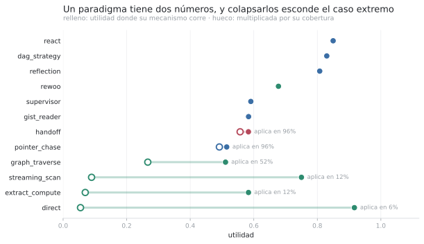

**A paradigm has two numbers, and collapsing them hides the case that matters.** `direct` is
the best arm in the roster where its mechanism runs — 0.917 — and that mechanism runs on
**6%** of cells, because the feasibility arithmetic prunes it the moment the material does
not fit. Over the corpus it contributes 0.055. Reporting a single number forces you to
falsify one of the two claims.

Coverage is not a property of the arm but of the **intersection** between its mechanism and
the task distribution, which is why it is decided before spending: `direct`,
`streaming_scan` and `extract_compute` do not fail on the remaining 88–94% — **they do not
run**.

### 7.9.2 Degradation with width separates what the mean utility merges

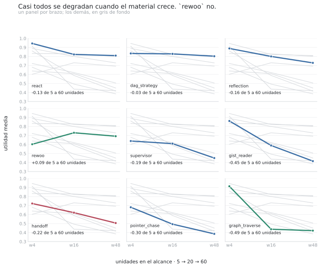

The axis is the three declared widths — **5, 20 and 60 units**. Tasks without a width
suffix are **excluded**: they group cells of 1, 8, 9 and 60 units, so they are not the narrow
end of anything, and including them turned the axis into something that is not ordered.

| arm | w4 (5 u.) | w16 (20 u.) | w48 (60 u.) | Δ |
|---|---:|---:|---:|---:|
| `react` | 0.94 | 0.82 | **0.81** | −0.13 |
| `dag_strategy` | 0.83 | 0.83 | **0.80** | **−0.03** |
| `reflection` | 0.89 | 0.80 | 0.71 | −0.18 |
| **`rewoo`** | 0.60 | 0.73 | 0.66 | **+0.06** |
| `handoff` | 0.72 | 0.62 | 0.51 | −0.22 |
| `supervisor` | 0.64 | 0.59 | 0.43 | −0.20 |
| `gist_reader` | 0.86 | 0.59 | 0.42 | −0.45 |
| `pointer_chase` | 0.68 | 0.49 | 0.39 | −0.30 |
| `graph_traverse` | 0.91 | 0.44 | 0.42 | **−0.49** |

**All of them degrade except one.** `graph_traverse` loses 0.49 and `gist_reader` 0.45 going
from 5 to 60 units — the 180-character gist and the entity index stop discriminating once
there are sixty candidates. **`rewoo` is the only exception, and it rises**: `+0.06`. That is
not luck — it is the only arm whose cost is not a function of scope.

An average over widths would have called `gist_reader` better than `rewoo` on 0.584 against
0.669, and would have hidden that one collapses exactly where the other holds.

### 7.9.3 Three cost classes, and they are not the catalogue's

Fitting `log(cost)` against `log(scope)` per arm, and separately asking what better explains
the cost — the scope or the number of turns — yields a taxonomy that **cuts across** the
control-flow one:

| class | arms | what defines it |
|---|---|---|
| **scope** | `handoff` | `R² = 0.77` against scope, exponent 0.73. Cost is set by how much material each call carries |
| **turns** | `react`, `reflection`, `dag_strategy`, `supervisor`, `gist_reader`, `pointer_chase` | cost is set by how often it iterates, and that is **endogenous**: it spends until something stops it |
| **structural** | `rewoo`, `direct`, `graph_traverse`, `extract_compute`, `streaming_scan` | neither: cost is fixed by the shape of the pattern |

The datum that forces these classes apart from the declared ceilings: **`handoff` has a
ceiling of 12 calls and spends 131,310 tokens; `dag_strategy` has one of 160 and spends
105,293.** Nearly the same, with a factor of 13 between the ceilings.

> Counting calls to bound effort is counting containers to bound weight.

And an operational consequence: the **turns** class is the only one a stopping rule can act
on. Measured in the same record, 46.5% of `react`'s searches surface no new unit at all,
with streaks of up to 14.

### 7.9.4 The capability space

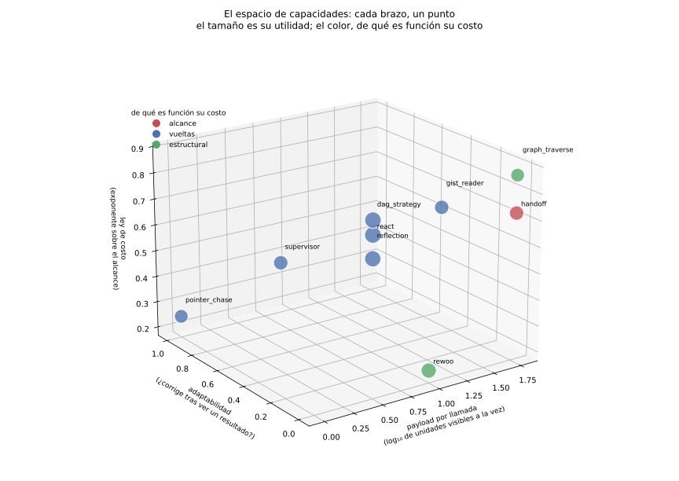

The control-flow taxonomy — "plan-execute", "supervisor", "chain" — does not predict
performance. What does predict it is which **capabilities** each topology hands the model,
and there are three:

| axis | what it is | where it comes from |
|---|---|---|
| **payload per call** | how many units the model sees at once | read off the code |
| **adaptivity** | can it revise the plan after seeing a result? | read off the code |
| **cost law** | what its cost is a function of | measured |

The first two are read off the code, which is why they **place an arm that has never been
run** — something a table of results cannot do.

The case that validates them is the contradiction question, where the answer is a relation
between two units and no single unit contains it:

| capabilities | utility |
|---|---:|
| payload ≥ 2 units **and** adaptivity | **0.71 – 0.91** |
| payload only | 0.13 |
| neither | 0.00 – 0.40 |

`handoff` **reads both relevant units and scores 0.067**, because each sub-agent sees its
half and no single call ever holds the pair: the capability is not "read them" but "hold
them together". And `rewoo` scores 0.133 even though it *can* hold them together, because it
lacks the other one — choosing **which** two requires seeing a result before asking for the
next.

In the figure, `react`, `dag_strategy` and `reflection` land at essentially the same point.
That is not a defect of the drawing: **they are the same arm for the purpose of deciding**,
which is why their utilities sit within 0.05 of each other.

### 7.9.5 Where the margin is

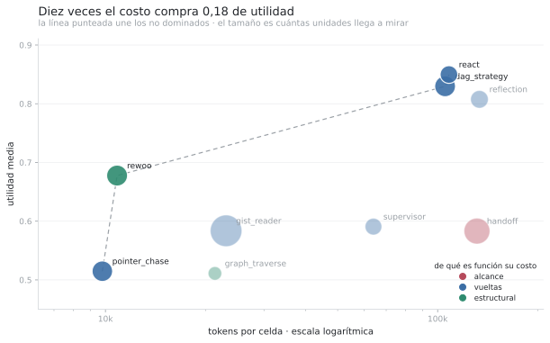

In the widest band, `react` scores 0.81 at 108,137 tokens per cell and `rewoo` 0.66 at
10,840: **+0.15 of utility for a factor of 10 in cost**. And the cost is almost entirely
input — 96.4% to 100.9% depending on the arm, with output between 0% and 3.6% — which says
that **paradigms do not differ in what they generate but in what they drag into the prompt**.
That is the same claim the cost law makes, measured from another direction.

### 7.9.6 The cost law, drawn

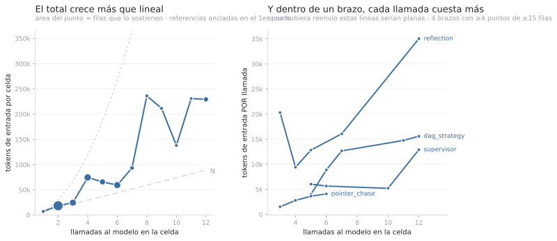

El paper afirma desde el principio que el costo de un bucle de herramientas crece como `N²`
y la cobertura como `N`, porque **la conversación se reenvía entera en cada vuelta**. Hasta
acá lo sostenían dos números sueltos —«≤2 llamadas dan 9.779 tokens, ≥8 dan 136.432»— y esos
dos son compatibles con crecimiento lineal si uno no mira el resto.

**Hacen falta dos paneles y no uno**, porque un total creciente no distingue «cada llamada
cuesta lo mismo y hay más llamadas» de «cada llamada cuesta más». El panel derecho separa las
dos: si no hubiera reenvío, **esas líneas serían planas**.

| brazo | 3-5 llamadas | 11-12 llamadas | factor |
|---|---:|---:|---:|
| `dag_strategy` | 4.002 | 15.592 | **3,9×** |
| `supervisor` | 6.052 | 12.910 | 2,1× |
| `pointer_chase` | 1.544 | 4.107 | 2,7× |
| `reflection` | 9.410 | 35.030 | 3,7× |

**El panel derecho va POR BRAZO, y la primera versión de esta figura no.** Agregado sobre
todos, el costo por llamada zigzaguea —7.411, 18.654, 29.528, 13.815, 19.113— porque distintos
brazos dominan distintos conteos de llamadas y sus alcances difieren en un orden de magnitud:
«más llamadas» y «qué brazo» quedan mezclados, y **el zigzag era la mezcla, no el fenómeno**.
Condicionado por brazo el trazo sube monótono en los cuatro que tienen puntos suficientes.

No se estima ningún exponente ni se reporta un `R²`: las curvas `N` y `N²` del panel izquierdo
están ancladas en el primer punto para que el ojo compare, y el hallazgo es cualitativo. Con
`n` desparejo por punto —de 26 a 540 filas— un exponente ajustado tendría más precisión
aparente que evidencia.

## 7.10 Where it fails, and what fixes it

The preceding sections compare arms. This one opens one up: **why the simplest arm wins,
what variance the mean hides, and what happens when a control decision is taken away from
the model.** All three are answered over the same record, without spending another token.

### 7.10.1 The funnel: `react` does not win by searching

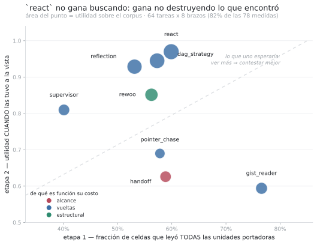

A cell's utility is the product of two things that fail for different reasons:

    u  ≈  P(saw ALL the bearing units)  ×  P(answered correctly | it saw them)

| arm | u | **saw** | **u \| saw** | u \| did not | units read |
|---|---:|---:|---:|---:|---:|
| `react` | 0.843 | 60% | **0.970** | 0.708 | 7.8 |
| `dag_strategy` | 0.822 | 57% | 0.945 | 0.720 | 11.6 |
| `gist_reader` | 0.611 | **77%** | **0.594** | 0.667 | 28.8 |
| `supervisor` | 0.577 | 40% | 0.778 | 0.479 | 6.8 |

**`react` does not see more than anyone** — 60%, while `gist_reader` sees 77%. Its whole
advantage is in the second stage: with the material in view it scores 0.970, and
`gist_reader` scores 0.594, *worse than when it had not seen everything*. Paired by task,
`Δsaw` is small or negative and `Δ(u|saw)` carries the entire gap.

> **The mechanism:** every intermediate representation smaller than the material is a loss
> that is not recovered downstream. A 180-character gist, a window recut for a sub-agent, an
> entity index — all three throw information away *before* knowing which part was needed.
> `react` has none.

Simplicity is not an aesthetic virtue here: it is the **absence of a lossy channel**, and
that is measurable.

### 7.10.2 `pass^k`: the mean hides the half that matters

> **`pass^k` is NOT `pass@k`, and means nearly the opposite.** In the code literature
> `pass@k` measures "at least one success in `k` attempts" and **increases** with `k`.
> `pass^k` measures "all `k` attempts succeeded" and **decreases** with `k`. The name comes
> from `tau2-bench`; we keep it for consistency with that literature and flag it here because
> the typographic resemblance invites reading the table backwards.

Everything above is `pass@1` — the mean over replicates — and it answers "how often does it
get it right". `pass^k` answers **"can it be relied on to get it right"**, which for a system
promising "same belief base ⟹ same decision" is the half that matters.

| arm | pass@1 | **pass^3** | drop | unstable cells |
|---|---:|---:|---:|---:|
| `react` | 0.875 | **0.797** | −0.078 | 17% |
| `dag_strategy` | 0.874 | 0.763 | −0.112 | 20% |
| `rewoo` | 0.718 | 0.576 | −0.142 | 27% |
| `supervisor` | 0.637 | 0.441 | **−0.196** | **34%** |

**Between 17% and 34% of cells change result across replicates**, at `t=0`, with a fixed seed
and the same fingerprint. That **corrects an earlier claim of ours**: determinism verified
with one call per model is true *per call* and false *per trajectory* — a tool loop amplifies
any deviation, because a different choice at step one changes everything after it.

No between-arm noise floor shows this variance: it lives **inside** a cell.

### 7.10.3 The C3 case: the failure mode was not the one it looked like

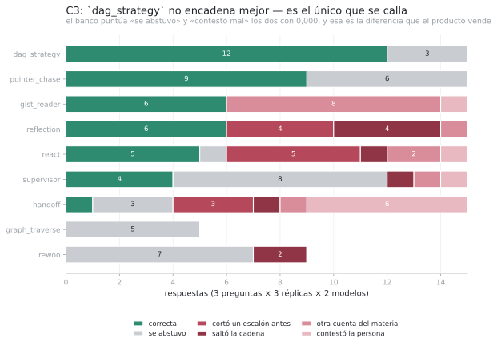

`C3_coupled_chain` asks the agent to walk N steps up a reporting line over 60 units and
report a field of the last one. The chain is deliberately mined: **every unit on the path
carries a field of the same type sitting next to the name that anchors it**, the link runs
through anaphora ("The above-named", "That person"), and the hop's destination is abbreviated
(`A. Vallejos` points to `Agustina Vallejos`).

Classifying answers by mode rather than by score inverts the diagnosis. The dominant mode is
not skipping the chain (2 cases) but **cutting it one step short** (7): arms return the field
of an intermediate hop, which is in plain view and indistinguishable from the correct one.
And `dag_strategy`, which wins the cell, **does not chain better**: 12 correct, 3 abstentions,
and **zero wrong answers**. The others answer anyway.

> The bench scores "abstained" and "answered wrong" both at 0.000. That is correct for
> measuring utility and **blind on exactly the axis the decision layer exists to govern.**

### 7.10.4 Replacing a model decision with a deterministic sensor

On that diagnosis `pointer_chase` was fixed — the arm whose mechanism *is* chain-following
and which scored 0.33 on C3. Four corrections, **all of control flow or typing, none of
phrasing**:

1. **A belief rule: a named entity is searched with the lexical index, not the hybrid one.**
   A dense vector encodes *what a text is about*, and sixty documents on the same template
   are about the same thing; a proper name is precisely the part that is **not** semantic,
   and fusing the dense branch in adds noise to the only signal that discriminates. Measured:
   the hybrid returns the wrong unit for `Ramiro Herrera` and leaves `M. Arrieta` outside the
   top 5; the lexical index puts them first and third.
2. **A sensor's output is typed before it is used.** The model emitted
   `'M. Arrieta settlement account'`, and that tail dragged the query into classifying as
   prose: **the rule was right and the input was dirty.**
3. **A hop to a unit that does not name whoever is being chased is not a hop**, and among
   tied candidates the one that names them **earlier** wins — a document *about* an entity
   names it earlier than one that merely references it in passing. This is resolved with
   predicates returning a boolean or a position, never text: they cost no tokens.
4. **The anchor is hop zero, and code resolves it.** It was a model call, and that was where
   the last control-flow decision remained with the sensor.

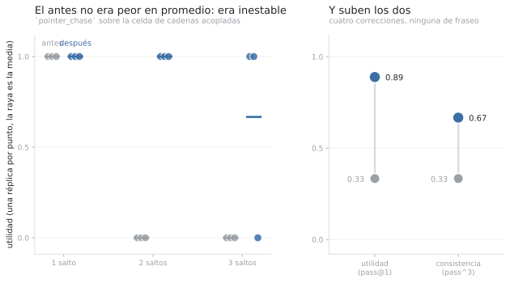

The left panel plots **every replicate separately**, and it shows what a mean hides: the
"before" was not worse on average but **unstable** — the same question, the same fingerprint
and the same search results yielded 1.000 or 0.000 depending on the replicate. The right panel
shows both axes moving together, which is the whole claim.

**Result: `pointer_chase` goes from 0.33 to 0.89 on C3**, tying the cell's best arm. And
correction (4) proves the point on its own: **with the same fingerprint and the same search
results**, replicate 0 picked the right anchor and walked the whole chain (u=1.000) while
replicates 1 and 2 picked another and scored 0.000. A control decision left in the sensor
takes determinism with it.

> **The hypothesis, and it is falsifiable:** replacing a model control decision with a
> deterministic sensor over an environment signal improves **utility and determinism at the
> same time**. `pass^k` is the metric that was missing to measure the second effect, and
> without it half the improvement was invisible.

Declared and unresolved: the replicate that still fails **abstains** rather than answering
wrong, which is the intended behaviour and which the bench scores the same as an error.

### 7.10.5 A measured axis that no decision looks at

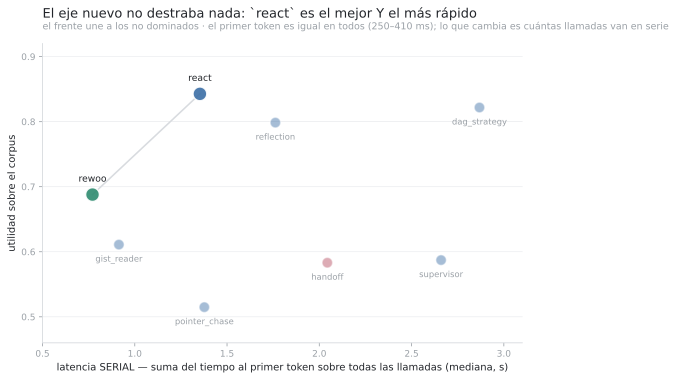

There are **two clocks**, and confusing them invalidates the number. Wall time is useless:
63-67% of `react` and `dag_strategy` rows sit under half a second because they are replays
from the on-disk cache — that measures how fast the bench re-reads, not how fast the system
answers. What does work comes from the provider, inside each response's `usage` object, which
is why the cache preserves it: it is the latency of the call that was actually made.

| arm | u | first token | **serial latency** | u per second |
|---|---:|---:|---:|---:|
| `react` | 0.843 | 265 ms | **1.35 s** | 0.62 |
| `dag_strategy` | 0.822 | 410 ms | 2.87 s | 0.29 |
| `rewoo` | 0.677 | 304 ms | **0.77 s** | **0.88** |
| `supervisor` | 0.577 | 360 ms | 2.66 s | 0.22 |

**Time to first token is practically identical across arms** — 250 to 410 ms; it is one call
to the same model. What varies by 3.6× is **serial** latency: the sum over all calls, that is,
the part no amount of tokens-per-second can shorten because each call waits for the previous
one. It is the `turn-driven` cost law billed in user time rather than in tokens, and it is an
axis **no routing decision looks at today**.

And it unlocks nothing, which is the thing to say: `react` is simultaneously the highest-utility
and the lowest serial-latency arm among the contenders. The only arm that buys time is `rewoo`
— 1.8× faster — and it costs 0.165 of utility. That is an explicit trade, not a free lunch:
only someone with a declared latency ceiling should take it.

### 7.10.6 Does non-determinism compound with each decision? The simple form is false

The previous section invites a general conjecture, and it is worth writing down because **the
record refutes its naive form**:

> If an arm delegates `d` control decisions to the model, and each one comes out the same
> across replicates with probability `q`, then `pass^k ≈ pass@1 · q^d`. More decisions in the
> sensor ⟹ less determinism, multiplicatively.

It is countable: `d` is measured as iterations per cell, and `pass^3` is already there. Over
the panel's eight arms:

| arm | decisions | pass@1 | pass^3 | implied `q` |
|---|---:|---:|---:|---:|
| `dag_strategy` | 8.9 | 0.822 | 0.703 | 0.983 |
| `supervisor` | 8.6 | 0.587 | 0.406 | 0.958 |
| `reflection` | 5.9 | 0.798 | 0.688 | 0.975 |
| `react` | 4.3 | 0.843 | 0.734 | 0.968 |
| `pointer_chase` | 3.8 | 0.515 | 0.359 | 0.909 |
| `rewoo` | 2.0 | 0.688 | 0.531 | 0.879 |
| `gist_reader` | 1.9 | 0.611 | 0.516 | 0.913 |

**The correlation between decision count and `pass^3` drop is `r = −0.24` at `n = 8`** — weak,
and with the **opposite** sign to what the conjecture predicts: arms with more decisions lose
*less*. The explanation the data itself suggests is that a decision adds not only variance but
also **a chance to correct**: an adaptive arm that turns wrong can turn back, and a two-call
arm cannot. The two effects nearly cancel in this corpus.

What does hold, and is more useful than the original conjecture, is two things:

1. **`q` is bounded away from 1 for every arm.** The maximum is `0.983` (`dag_strategy`) and
   the minimum `0.879` (`rewoo`). None of the measured architectures recovers per-decision
   reproducibility, so **every trajectory with delegated decisions loses determinism**, and
   the question is not whether but how much.
2. **Which decision is removed matters more than how many.** The evidence here is not
   correlational but interventional: removing **one** decision — the anchor — took
   `pointer_chase` from disagreeing replicates (1.000 / 0.000 / 0.000) to agreeing ones,
   touching nothing else. Eight points of correlation do not compete with that.

> Non-determinism is not spread evenly across a trajectory's decisions. Counting decisions
> does not predict; identifying **which one** decides the outcome does.

This is a declared limitation of the analysis, not a result: with eight arms and one corpus,
the correlational side here can decide almost nothing. What carries it is the intervention.

## 7.11 Why there is no routing prize, even though the interaction is enormous

This is the corpus's central result, and it is negative with a precise mechanism. The usual
argument for routing — "there is a lot of task-by-method interaction, so choosing per task
must pay" — **does not hold**, and this record shows exactly where it breaks.

### 7.11.1 There is interaction, and it is large

Decomposing `u(task, arm) = μ + α(task) + β(arm) + γ(interaction) + ε` over the 59-task ×
8-arm panel:

| component | variance | % |
|---|---:|---:|
| α — task difficulty | 0.0632 | 41% |
| β — arm quality | 0.0160 | 10% |
| **γ — interaction** | **0.0736** | **48%** |
| ε — replicate noise | 0.0351 | |

γ net of noise is **0.0619**, at **signal-to-noise 5.30**. Under the usual argument, this is
where one should route.

### 7.11.2 And a signal explains it, surviving selection correction

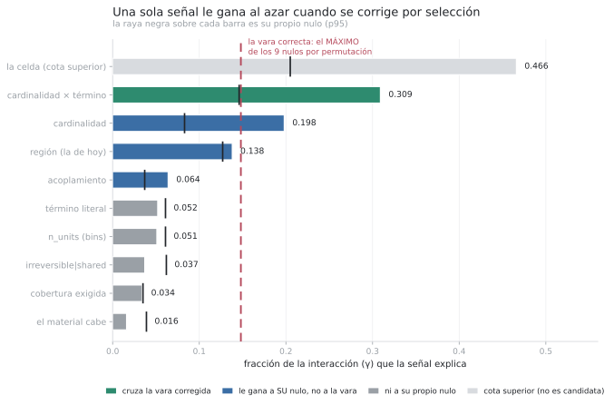

The figure ranks ten signals by how much of γ they explain, with **each one's own permutation
null** drawn as a black tick on its bar. Several beat that tick — and that comparison is
precisely the fallacy the null existed to prevent, because **nine candidates were tried and
the best was picked**. The correct bar is the dashed line: the **maximum of the nine nulls in
each permutation**.

Only `cardinality × literal term` crosses it, at 0.309 with corrected `p < 0.001`, capturing
**two thirds of the ceiling** set by `the cell` — which appears as an **upper bound**, not a
candidate: it is the corpus's design label, unknown at decision time, and no real signal can
beat it.

### 7.11.3 And the net prize is negative

**Large `var(γ)` ≠ large routing prize.** The prize is `E[max_p u] − max_p E[u]`, and γ can be
enormous because the **bad** arms are bad in different places. That structure is real, it is
predictable, and it is **worth nothing**: nobody will pick the arm that loses narrowly over
the one that loses badly.

The only billable part is the interaction **among arms that would actually compete**.
`gist_reader` contributes 20% of `var(γ)` and `rewoo` 15%; the three leaders, 6-7% each.
Restricted to those three — the ones within 0.05 of the best fixed arm:

```
estimated real gamma       0.0046      signal-to-noise  0.38
oracle among contenders    0.932
best fixed arm             0.875
maximum prize             +0.058
noise floor (bootstrap)   +0.065
NET prize                 −0.008
```

And **no signal separates the three contenders from each other**: all with `p > 0.29`. Only
`the cell` does (`p = 0.007`), and that is not known at decision time.

> The 48% interaction is real and lives **among the arms nobody would choose**. Reporting
> `var(γ)` as evidence that routing pays measures the wrong structure.

### 7.11.4 Nor at the family level

A natural reply is that the signals may not separate individuals but might separate **groups**:
a router that picks a family and then takes the cheapest member is a different router with a
different prize. We tested it, declaring the families **from the code** — by when an arm
decides its next call — and not from the outcome:

| family | arms | mean u |
|---|---|---:|
| `adaptive` | `react`, `reflection` | 0.818 |
| `fixed-plan` | `dag_strategy`, `rewoo` | 0.750 |
| `lossy-channel` | `gist_reader`, `handoff`, `pointer_chase`, `supervisor` | 0.571 |

Valuing a family by its **maximum** would cheat twice — it grants a per-task choice the family
router cannot make, and it rewards the largest family by pure max-selection bias — so each
family is represented by its best-mean arm, chosen **once** over the whole panel.

```
adaptive          wins 54 of 64 tasks  (84%)
fixed-plan                 5 of 64      (8%)
lossy-channel              5 of 64      (8%)

prize for routing FAMILIES   +0.079   (noise floor +0.065)
prize for routing ARMS       +0.110
```

**And here the subtraction the paper just taught must be done**, because both prizes exceed
the floor: `+0.079 - 0.065 = +0.014` for families and `+0.110 - 0.065 = +0.045` for arms. Both
nets are **positive**, and neither is billable — for a different reason than in 7.11.3:

> there the prize did not exist; **here it exists and there is nothing to grab it with.** A
> prize is what an oracle would capture, and an oracle is not a policy: **no signal predicts
> the winning family.** The best, `cardinality`, yields mutual information `0.092` and **does
> not survive selection correction** (`p = 0.365`).

A prize with no signal predicting it is an upper bound, not a result.

> **It fails not because the signals are weak but because there is no boundary to cross.** A
> family that wins 84% of the time is not a cluster to route across — it is a default.

### 7.11.5 What this corpus does reward

On quality the decision has no prize. On **cost at equal utility**, the same record yields a
large saving at a loss inside the noise, and unlike the quality prize it **survives
out-of-sample evaluation** (leave-one-task-out):

| signal | utility vs best fixed | saving |
|---|---:|---:|
| `cardinality × term` | −0.017 | **42%** |
| `region` | −0.110 | 74% |
| `n_units` | +0.000 | 1% |

It is a trade, not an improvement, and it must be stated that way. An earlier measurement of
ours on a smaller panel gave `+0.008` of utility at 69% saving — a free lunch — and **it
disappeared once the record was complete**. The question "which paradigm gives the best
answer" is exhausted in this corpus; the question "which is the cheapest one giving an
indistinguishable answer" is not.

## 7.12 What is learnable: capability, not paradigm identity

`P15` was refuted by mapping question ontology → **paradigm name**: it lost `−0.087` against
the best fixed arm. The previous section explains why that prize did not exist; this one
proposes the missing link and **submits it to the test that can kill it**.

    question ontology  →  capabilities it REQUIRES  →  arms that have them

Ten capabilities declared **from code**, each with the measurement that justifies it and the
site where it can be seen. The last four were uncovered by solving the coupled-chain cell, and
none of them is visible from the control-flow taxonomy.

**And the catalogue finds a gap without running anything**: no arm in the roster combines
`COBERTURA_GARANTIZADA` with `ABSTIENE_SIN_PRUEBA`, which is exactly what an absence question
requires. That is what declaring capabilities buys over measuring paradigms — it predicts about
an arm that does not exist yet.

### 7.12.1 The test is leave-one-ARM-out, not leave-one-task-out

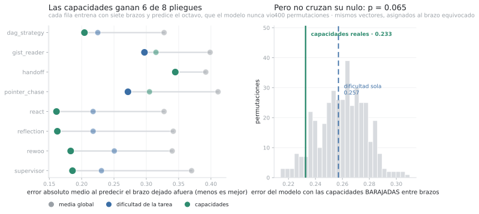

The asymmetry is the point: **a model keyed on paradigm identity can say nothing about an arm
it never saw** — it has no parameter for it, a structural limit rather than a fitting problem.
One keyed on capabilities can, because a new arm brings its declared vector from the code.

| model | MAE predicting the held-out arm |
|---|---:|
| global mean | 0.364 |
| task difficulty alone | 0.257 |
| **capabilities** | **0.233** |
| arm identity *(seeing the held-out arm)* | 0.339 |

Capabilities win **6 of 8 folds** and lower the error against task difficulty alone. The fourth
row was meant as a ceiling and **is not one**: it does worse than capabilities **despite
cheating**, because it ignores α — task difficulty, 41% of variance. Knowing which arm it is,
without knowing which question it is, predicts poorly. That failure is part of the argument:
**paradigm identity is not a good representation even when allowed to peek at the answer.**

### 7.12.2 And it does not cross its null, so it stands as a suggestion

The correct null is not the global mean: it is **shuffling capabilities between arms**. Same
vectors, same number of features, same structure, assigned to the wrong arm. If the model with
real capabilities cannot beat that, what it measures is the ability to **fit**, not to
**transfer**.

```
MAE with REAL capabilities      0.2327
MAE of the null (shuffled)      mean 0.2599 · p5 0.2299
p = 0.065
```

**It does not cross.** It stands as a **suggestive, not established** result, and it must be
said that way: eight arms are eight points, and at that `n` the test cannot decide. What would
settle it is more arms, not more tasks — a concrete prediction about which run is worth doing.

**And the table already carries its own counterexample.** `EXIGE` declares that a coupled chain
requires `RESOLVER_REFERENCIA` and `LARGO_GOBERNADO_POR_CODIGO`, and under that rule the only
candidate is `pointer_chase`. Yet `dag_strategy` scores `0.89` on that cell **with neither**: it
gets there by another route, using `VERIFICA_Y_REPLANIFICA` to persist and `ABSTIENE_SIN_PRUEBA`
to refuse when it did not arrive. `EXIGE` lacks a way to express **alternative routes** — today
it is a conjunction, and reality admits "A and B, or else C and D". We leave it as a conjunction
with the counterexample written down, because a table that patches itself to hide its own
counterexample stops being falsifiable.

## 7.13 Emergent knowledge: consensus between paradigms verifies

This result was not sought. The bench runs eight arms on the same question and always compared
them **against the oracle**, never **against each other** — and the record held eight answers
per task that nobody had looked at together.

    Does agreement between paradigms predict correctness, with no oracle and no judge?

### 7.13.1 The curve

| k arms agree | cells | P(the answer is correct) |
|---:|---:|---:|
| 0 | 208 | 0.424 |
| 1 | 36 | 0.389 |
| 2 | 24 | 0.600 |
| 3 | 64 | 0.812 |
| **4** | 20 | **1.000** |
| 5 | 42 | **1.000** |
| 6 | 70 | **1.000** |
| 7 | 48 | **1.000** |

**180 of 180 cells correct at `k ≥ 4`**, on exact equality of the normalised string. And it is
not a smooth slope: there is a **threshold** at 4.

### 7.13.2 Three controls, and one goes against us

**Does agreement merely mark "easy task"?** No. Across the **same 27 tasks** where a consensus
exists:

```
arms INSIDE the consensus            n=180   u = 1.000
arms OUTSIDE, on those SAME tasks    n= 36   u = 0.100
```

On the same question, being inside or outside the consensus is the whole difference: it
**discriminates within the task**, not between tasks.

**Is it an artefact of comparing short strings?** Also no. It holds across all four declared
cardinalities, including enumerative (1.000 on n=28 with consensus, 0.555 without).

**Does it make things cheaper?** **No, and we report it anyway.** It is the obvious commercial
reading — a cheap committee, escalating only on disagreement — and all 56 two- and three-arm
cascades were tested: **none saves**. The committee is paid on every task and the expensive arm
is still paid on most, so the total rises. **Consensus is not a cheap router.**

### 7.13.3 What it is, and what it does NOT authorise

It is a **total-precision, partial-coverage correctness detector** — 27 of 64 tasks — which is
exactly the shape of an abstention rule: it does not say which arm to use, it says **when
verification is unnecessary**.

**And there is a temptation to cut off at the root.** The natural reading is "if four arms
agree, the belief moves up a level". **No.** The provenance ladder — `ASSUMED < ELICITED <
OBSERVED < COMPUTED` — classifies **how something was obtained**, not **how much confidence** it
deserves. Four agreeing paradigms are still the model talking: **voting does not touch the
document**, so nothing can be promoted to `OBSERVED` by consensus. Allowing it would be exactly
the failure the ladder exists to prevent — a majority of the sensor promoting itself to the rank
of a computed fact.

What it does authorise is moving **credence** within `ELICITED`, which in the decision layer is
a separate field from provenance. And there the table above **is the calibration curve**:
`0.42 · 0.39 · 0.60 · 0.81 · 1.00`. The belief module declares as an open risk that "elicited
credences may be miscalibrated… until calibration data exists". This is calibration data.

> **provenance = where it came from · credence = how much it is believed.** Consensus moves the
> second and cannot touch the first, and confusing them turns a useful detector into a licence
> for the model to accredit itself.

### 7.13.4 The missing experiment, and why the number is not enough without it

**The eight arms are not independent**: they share model, corpus and retriever. Their agreement
is diversity of **procedure**, not statistically independent evidence, so none of this can be
read as a vote of independent experts. What was measured is that **different control
trajectories converge when they are right and diverge when they are not**.

Whether that is the mechanism — rather than an artefact of sharing the model — is what remains
to be shown. The experiment that would decide it is repeating the measurement with a different
model underneath, and **it has not been run**. Until then this is a finding about this corpus
with this model, not a property of paradigms.

## 7.15 Out of sample: the held-out set's first stratum

Everything above is **in sample**. The product's declared success criterion is different — a
positive net oracle gap on data the system never saw — and until this draft **it did not exist
as a valid measurement**: the only run of the held-out corpus sat in an archive predating the
tokeniser change, with no `analyzer`, no fingerprint and no region vocabulary stamped, i.e. not
replayable.

**This was fixed by running the held-out set through the SAME code path as the campaign.** The
runner took a corpus argument instead of hard-coding one, and that matters more than it looks:
the previous script ran 5 arms × 4 tasks × 2 replicates with different logic. **A held-out set
measured with a different harness does not measure generalisation — it measures two harnesses.**

### 7.15.1 What ran, and what it decided

First stratum: **14 tasks × 12 paradigms × 3 replicates**, 500 rows, **16.0M tokens**, 75
minutes, zero infrastructure errors. The rectangle lands at **12 tasks × 8 arms** — 86% of
those measured — under the same mechanical criterion as the rest of the paper.

| arm | u |
|---|---:|
| `gist_reader` | 0.833 |
| `dag_strategy` | 0.806 |
| `react` | 0.806 |
| `supervisor` | 0.806 |
| `reflection` | 0.778 |
| `pointer_chase` | 0.750 |
| `rewoo` | 0.648 |
| `handoff` | 0.472 |

```
per-task oracle        0.972
best fixed arm         0.833
observed gap          +0.139
noise floor (p95)     +0.167
NET gap               −0.028
```

**The gap sits below its own noise floor.** Out of sample, routing on quality has no prize
either — the same verdict as §7.11 (`−0.008` in sample), reached by an independent path on a
corpus with a different cell mix.

### 7.15.2 A reading we nearly published, and why it is wrong

Looking only at the `w4` sub-stratum — 6 tasks — the best fixed arm came out as `gist_reader`
at `0.944` against `react`'s `0.722`, and the tempting conclusion was that **"the best fixed
paradigm is not stable across corpora"** — a strong, sellable claim.

Over the full stratum's 12 tasks that reading collapses: the top four sit at
`0.833 · 0.806 · 0.806 · 0.806`, **tied within noise**. The winner did not change: there is no
winner. The difference between the two readings was looking at 6 tasks instead of 12, and the
full stratum was available all along.

> It is the same error this paper audits in others and has already made in its own record: **a
> smaller panel does not give a weaker answer, it gives a different one.**

### 7.15.3 What is missing, with its price

The held-out set has three strata and only the first closed. The other two are planned and not
run, declared with their cost so that running them is an explicit decision:

| stratum | tasks | mean material | cells | tokens | cost | time |
|---|---:|---:|---:|---:|---:|---:|
| `base` + `w4` | 14 | 91k | 500 | **16.0M** | run | 75 min |
| `w16` | 6 | 150k | 216 | ~11.2M | ~USD 2.25 | ~53 min |
| `w48` | 6 | 451k | 216 | ~33.4M | ~USD 6.68 | ~159 min |

**The third is not merely bigger**: all 6 `w48` tasks cross the long-context threshold, so they
pay **double tariff on the whole request**. It is §7.7's cliff applied to our own run.

**And §7.15.1's conclusion is bounded to one width.** §7.9.2 showed paradigms degrade very
differently with material — from `−0.03` to `−0.49` depending on the arm — so a held-out set
measured at a single width says nothing about the others. What this draft can sustain is "no
net routing prize out of sample **in the narrow stratum**", and no more than that.


# 8. Failure mechanisms

These rest on traces rather than magnitudes, and they are what we would defend.

## 8.1 Decomposition destroys sequential dependency

Both decomposing topologies fail both coupled cells, and both **with the evidence read**.
The DAG spent 251,374 tokens on the three-hop chain, read 4 of 4 chain units, and scored
zero. A chain is sequential by definition — hop 2 cannot be formulated before hop 1 is
answered — so splitting it into parallel sub-questions leaves the blackboard holding the
right units without the structure that orders them. This is a property of decomposing, not
a coincidence of two implementations.

## 8.2 Iterative loops amplify retrieval failure rather than absorbing it

On the two-hop cell the DAG issued 31 keyword searches, read **zero** relevant units, and
spent 142,694 tokens. After the third search the retriever had already demonstrated it would
not find the target; the verify-replan loop read that as *search again*.

This inverts a design intuition. Verification loops are added *for* robustness; here the loop
is the amplification mechanism. Without it the failure would have cost 10k tokens rather than
143k.

## 8.3 One failure no tool can fix

Map-Reduce fails both coupled cells and reads zero relevant units in all four, because by
construction it views each unit in isolation. A chain and a cross-unit comparison are
unresolvable that way however many times they are examined.

The fix is not a better tool but a refusal: coupling is a declared property of the task,
so the feasibility layer can exclude the paradigm before any token is spent — which is
cheaper than any amount of learning that it loses.

**And the price of that failure scales with the corpus while the failure does not.** The
same paradigm, on the same cell, at two unit sizes:

| corpus | units | calls | relevant units read | cost | quality |
|---|---|---|---|---|---|
| gold_v2 | 48 | 49 | **0** | 13,931 | 0.000 |
| gold_deep | 48 | 49 | **0** | **276,355** | 0.000 |

Identical cardinality, identical call count, identical zero — and **19.8× the cost**. Thirty
times more text per unit bought exactly thirty times more of nothing, because the obstacle
was never the amount of evidence. This is the sharpest argument we have for deciding before
running rather than after: a paradigm whose limitation is structural does not fail more
loudly at scale, only more expensively, and an approach that learns from outcomes pays that
bill every episode until it has learned what arithmetic could have told it for free.

## 8.4 Attribution requires the trace

The tool-usage trace separates *never saw the evidence* from *saw it and reasoned wrongly*.
Without it a zero is a mystery; with it, it is a diagnosis. "The searching topology lost" is
uninterpretable when the searcher never reached a relevant unit — that is a statement about
the tool surface, and only a failure with the evidence in hand is evidence about the control
structure.

---

# 9. Limitations and threats to validity

**The in-window regime is near-tautological, and §7.4 is the escape — partially walked.**
The corpus behind §7.1–7.3 is 16k tokens at its widest, so read-everything is both correct
and cheapest there. The out-of-window regime is now measured at 483k with `repeat = 3`
(§7.4–7.5), and the regime claim across 135k/483k/1.27M rests on the zero-cost feasibility
sweep. Still open: no full run at 1.27M (only its feasibility arithmetic), and two heavy
out-of-window cells still short of full replication (marked † in §7.4).

**And one item left that list by being answered, in the direction that costs us.** The
held-out world with a fresh seed — generated and independently verified — has now run its
registered transfer test, P8. **Two of its five predictions do not transfer**, so by its own
registered decision rule the per-cell verdicts below are **corpus-local**: claims about
seed-7 worlds, each carrying a per-world caveat. The refutation does not rest on the cells
nobody solved — on the two cells where another arm reaches a perfect score, the general
fallback returns 0.667 and 0.000.

**Replicates exist now, and the noise is per-cell.** The first study's accidental
replicate (§7.3) and the second study's `repeat = 3` agree: reproducibility is per-task —
readers flip nothing, tool-users flip the cells where retrieval decides, and cost was
reproducible nowhere (mean spread 2.05×, maximum 5.43× at identical quality in the first
study; the same concentration pattern in the second). Quality deltas are therefore
reported with their per-cell flip counts, never as bare means. The formal per-cell noise
floor and the net oracle gap (`Study.noise_floor`, decisions against the net gap) are
computed at the final analysis over the completed grid — pending the re-run cells.

**Models: three, and the sampling knob turned out to be the wrong worry.** The first grid ran on
`gpt-5-chat`, which rejects an explicit temperature, so sampling was at the model default —
reported at the time as the principal threat. Measured since across `gpt-5.4-nano`,
`gpt-5.6-luna` and `gpt-5.6-terra`: the reasoning deployments reject `temperature` outright, and
`terra` at its own default is the **most** reproducible of the three. The live constraint is a
different one and it is structural: on the `5.6` family, `tools` and a non-`none`
`reasoning_effort` cannot be combined in Chat Completions, and the difference that makes is
total — 0.000 against 1.000 on the same task. Every campaign row therefore runs at
`reasoning_effort = none`, which is a declared regime rather than a default.

**Synthetic corpus.** Ground truth is exact and independently re-derived, and structural
parameters are dials rather than hopes — but the distribution of real tasks over those dials
is unknown. Public benchmarks are required for external validity and are not yet used.

**Latency is not comparable.** The DAG runs sequentially here where it would run concurrent
waves; and once workers contend, per-row wall-clock stops measuring latency. Quality and
token counts remain exact.

**The action surface is declared architecture and is not exercised — stated with the
inventory, because a reader will otherwise find it.** §5.5 gates irreversible actions on a
provenance floor and §5.6 claims the machinery over four surfaces. One of those four has
never run. The complete tool inventory across every corpus and all fifteen registered
paradigms is twelve tools:

| what they do | which |
|---|---|
| read the world | `search` `keyword_search` `semantic_search` `read` `read_all` |
| write the agent's own state | `note` `notes` `plan` `advance` `post` `board` |
| read its own accounting | `coverage` |

**Not one of the twelve changes anything outside the process.** No file is written, no
message sent, no row updated. Six tasks of seventy-eight carry `irreversible = True` and
three carry `shared_writes = True`, and those flags do raise the assurance dial — but the
task they label is *"decide whether this engagement should be escalated for freezing; answer
'escalate' or 'no escalation'"*, graded by exact match against a key. It is a classification
over documents wearing the label of an action. There is no tool that freezes an account, so
the floor that exists to gate irreversibility has never had an irreversible act to gate.

We state this as a threat rather than resolving it because resolving it is a different
experiment, and because the honest form of an ambitious claim is the ledger that goes with
it: **§5 is claimed for agents in general and machine-checked as such; §7–§8 are claimed for
exact-answer extraction over documents and measured there; the action surface is designed,
typed, tested in unit form, and unmeasured.** The nearest thing to evidence about a non-
retrieval capability is the blackboard result in §7.7, and it is a null.

**Novelty claims are verified as conjunctions, not as parts.** The two anchor works were
read in full on 2026-08-26: every number cited from Select-then-Solve checks out against
its body, and the concession to SCL stands. The remaining claims — control-policy
consolidation (§6.3), provenance-gated proposition discovery, abstention in paradigm
routing — survive dated searches only as conjunctions whose individual conjuncts each have
a published neighbour (§2.2, §2.4, §2.6). A field moving this fast can close any of them
in months; the searches are dated so a reader can re-run them.

**Reproducibility caveat.** A seed alone does not pin a corpus. When the generation algorithm
changed, the same seed produced a different world; manifests now stamp a generator version and
results across versions must not be pooled.

---

# 10. Conclusion

The prize in paradigm selection is real and measured, and the literature is pursuing it with
selectors that must always choose. We argue that three things belong in front of that
problem. Feasibility is arithmetic and prunes the space for free, separating a cardinality
bound from a context bound that are routinely conflated. Selection pays only under a
condition we can state and check, and the condition implies abstaining most of the time.
And the variance that topology choice is credited with is largely governed by the tool
surface: fifty-fold among tool-using paradigms against 1.2× among those that read.

Our strongest measured result is not about topologies at all. Telling an iterative
topology that its retriever had stopped producing cut its cost 3.05× against a replicate
spread of 1.62×, with the fall localised in exactly the two runaway cells the mechanism
predicts. An unplanned replicate also forced us to withdraw one reported effect and halve
another, which is the discipline working rather than failing. The three largest cost failures we found were not fixed by
better topologies or better models but by accounting signals that did not exist.

What we do not have is a validated selector, a noise floor, or any measurement in the regime
where reading everything is impossible. The harness for all three is built and the protocol
is registered in advance, including the decision rule for the outcome in which no selector
beats the fallback — which would be a result, and is stated as publishable before the data
is in.

---

# Appendix A — Artefacts

| artefact | contents |
|---|---|
| the null control | prompt-only scaffolding is retained in the registry and **never executed**: dominated by `direct` in every measured cell, at equal utility and never cheaper. It is evidence that scaffolding by phrasing buys nothing, not an arm |
| `PATTERNS.md` | pattern catalogue: 10 structural patterns, 4 control patterns, 15 anti-patterns, with applicability stated over the feature vector |
| `ANALYSIS.md` | the failure analysis of §8 in full, per paradigm and per cell |
| `GATE.md` | eight binary publication criteria and their current verdict |
| `PLAN.md` | revision history of the thesis, including two superseded framings and why |
| `D:\Apps\MAPO\lab` | the harness: **15 registered paradigms**, of which 12 run the campaign, 5 retrieval arms, 4 tool surfaces, 4 assurance levels, 12 tools, corpus generator with independent verifier, **573 machine-checked assertions** (521 + 52 across two suites) |

Seven of the fifteen anti-patterns in the catalogue are errors made and measured in the
course of this work, including two that contradicted our own published predictions.
