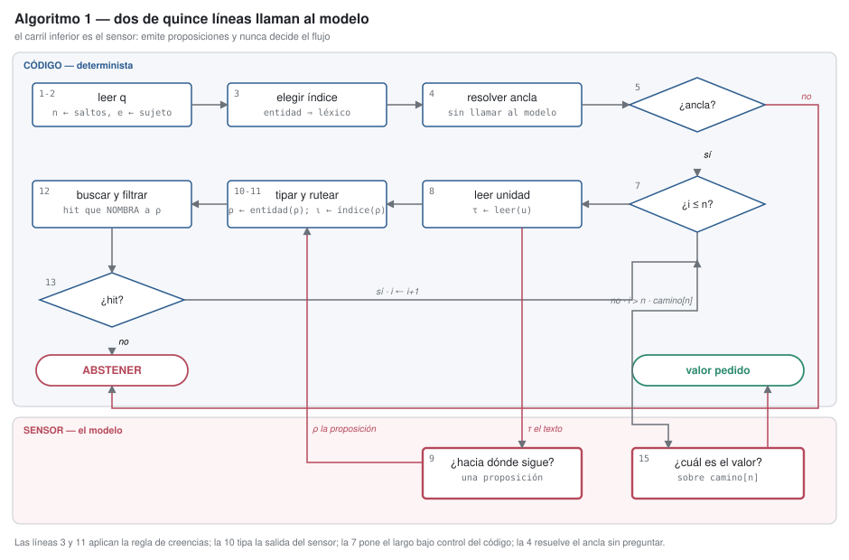

# Un motor determinista y plástico sobre un sensor estocástico

**Borrador 0.2 — 2026-08-30**
**Autor**: Ariel Edgardo Levy
**Estado**: borrador de trabajo. La teoría está verificada por máquina; las mediciones
empíricas son de **78 tareas × 12 paradigmas × 3 réplicas** sobre un corpus con entidades
reales (121,4M tokens). Toda afirmación empírica lleva su tamaño de muestra. Lo que aún **no**
hay es una medición válida sobre datos held-out; está declarado donde corresponde.
Destino: arXiv cs.LG (primario), cs.AI (cross-list).

> **Ésta es la única versión mantenida.** La redacción inglesa quedó congelada en
> `historico/paper-en-congelado.md`, anterior a este borrador y superada por él.

---

## Resumen

Un LLM es un sensor estocástico. Un arnés de agentes le delega, además de leer documentos, el
**flujo de control** —qué buscar después, cuántas vueltas dar, cuándo parar— y con eso queda
gobernado por la estocasticidad del modelo: la trayectoria misma pasa a ser una variable
aleatoria. Este trabajo invierte el gobierno. Interpone un **motor determinista** que decide el
flujo y deja al modelo como sensor subordinado, y de esa inversión salen dos propiedades que un
arnés no tiene: **reproducibilidad** y **trazabilidad**.

El motor separa dos funciones que la práctica corriente colapsa:

```
    decisión  = f(creencias)          f determinista, tipada, auditable
    creencias = g(mundo, sensor)      g estocástica
```

`f` es determinista **dentro** de un request y plástica **entre** requests: aprende offline,
copy-on-write, con guarda anti-regresión. Reglas escritas a mano son deterministas y no
aprenden; un andamiaje entrenado extremo a extremo aprende y no se audita. **La conjunción es
lo nuevo, y las garantías del sistema vienen del envoltorio y no de lo envuelto.**

**La varianza de trayectoria es grande y se confina.** `pass^k` —acertar en las `k` réplicas—
cae entre `0,078` y `0,196` por paradigma: **17% a 34% de las celdas dan resultados distintos**
a temperatura cero, semilla fija y la misma huella. Ningún paradigma medido supera `0,983` de
reproducibilidad por ramificación. Absorber esas ramificaciones en el motor lleva un paradigma
de `0,33` a `0,89` en la celda más difícil **y** hace coincidir sus réplicas. La intervención
se aísla: con la misma huella y los mismos resultados de búsqueda, que el modelo elija el ancla
de una caminata da `1,000 / 0,000 / 0,000`; que la elija el motor da `1,000` en las tres. La
conjetura de que la varianza crece con el número de ramificaciones **es falsa** (`r = −0,24`,
`n = 8`): importa cuál se absorbe, no cuántas.

**El acuerdo entre paradigmas verifica sin oráculo ni juez.** `P(correcta | k coinciden)` sube
`0,42 · 0,39 · 0,60 · 0,81` y llega a `1,000` en `k ≥ 4` sobre **180 de 180 celdas**. Supera
los tres controles que lo podían refutar: no marca dificultad de tarea —en las mismas tareas,
los paradigmas fuera del consenso rinden `0,100`—, no depende del largo de la respuesta
—vale en las cuatro cardinalidades—, y **no abarata**: las 56 cascadas de dos y tres paradigmas
suben el costo. Se reproduce sobre una segunda familia de modelo contra un criterio registrado
antes de correr. Es un detector de precisión total y cobertura parcial: una regla de
abstención. Mueve la **credencia** y nunca la procedencia — votar no toca el documento.

**Elegir paradigma por tarea no paga, y el mecanismo del fracaso es el aporte.** La interacción
tarea×paradigma explica el **48%** de la varianza con señal/ruido `5,30`, y una señal la
predice sobreviviendo corrección por selección. El premio neto es `−0,008` en muestra y
`−0,034` sobre un corpus held-out de 26 tareas corrido por el mismo camino de código:
**`var(γ)` grande no es premio de ruteo grande**, porque la interacción vive entre los
paradigmas que nadie elegiría. Restringida a los que compiten, `γ` real cae a `0,0046`.

**Lo aprendible es la capacidad, no la identidad del paradigma.** Diez capacidades declaradas
desde el código predicen un paradigma nunca visto mejor que la dificultad de la tarea sola
(`MAE 0,233` contra `0,257`) y mejor que la identidad del paradigma aun cuando a ésta se le
permite ver el paradigma retenido (`0,339`). Contra el nulo de capacidades barajadas: `p = 0,065`.

**Contribuimos** la teoría con dos teoremas verificados por máquina, un motor de decisión con
tres algoritmos publicados, un banco cuyos ejes se contrastan contra la literatura de
evaluación de agentes 2024-2026, un generador de corpus con verdad exacta y entidades con
variantes de superficie, y el análisis de fallas de doce paradigmas sobre 121,4M tokens.

**Palabras clave**: agentes LLM, motor determinista, orquestación, patrones DAG, predicción
selectiva, aprendizaje plástico, capacidades, reproducibilidad, trazabilidad

## Cómo se decide un request


La figura es el argumento del paper en una imagen. El carril de arriba es determinista y
auditable: sensores de forma cerrada, creencias tipadas con procedencia, un portón aritmético,
las capacidades que la pregunta exige, y recién ahí una elección entre los brazos capaces —o
una abstención—. El carril de abajo es el modelo, y **sólo emite proposiciones**: qué dice una
unidad, hacia dónde sigue un rastro. Nunca decide cuántas vueltas dar, qué índice usar ni
cuándo parar.

**Toda decisión que cruza al carril de abajo se lleva el determinismo con ella**, y eso está
medido, no argumentado. La guarda que cierra el ciclo —tipar la salida del sensor antes de
usarla— es del 2026-08-30 y salió de un caso concreto: el modelo emitía
`'M. Arrieta settlement account'` y esa cola arrastraba la consulta a clasificarse como prosa,
mandándola al índice equivocado. **La regla era correcta y la entrada estaba sucia.**

| lo que decide el código | lo que emite el modelo |
|---|---|
| cuántas vueltas dar (del largo declarado en la pregunta) | qué dice esta unidad |
| qué índice usar (léxico para entidad nombrada, híbrido para prosa) | hacia dónde sigue el rastro |
| qué unidad es el ancla, y cuál el término de la cadena | qué hecho aporta lo leído |
| si hay evidencia suficiente para responder, o si hay que abstenerse | la redacción de la respuesta |


# 1. Introducción

## 1.1 Tres propiedades que un arnés de agentes no tiene

Un *arnés* de agentes es la estructura de control que envuelve al modelo: una llamada única,
un bucle de razonamiento, una descomposición, un grafo de verificar-replanificar. Se elige una
vez en tiempo de diseño y se congela en el código, y sobre él se construyen sistemas que
firman números, disparan acciones y contestan a usuarios. **Le faltan tres propiedades que
cualquier otra capa de un sistema de producción da por sentadas.**

**Expone su flujo de control a un sensor estocástico.** El modelo es aleatorio y va a seguir
siéndolo; lo que un arnés decide es **cuánto del sistema depende de esa aleatoriedad**.
Delegarle ramificaciones —qué buscar después, cuántas vueltas dar, cuándo parar— vuelve
aleatoria la trayectoria misma. Es una decisión de arquitectura, no una propiedad del modelo, y
su costo está medido: entre el **17% y el 34%** de las celdas cambian de resultado entre
réplicas a temperatura cero con la misma huella (§7.2.2).

**No dice de dónde.** Una respuesta correcta y una inventada salen del mismo lugar y con la
misma cara. Sin una base de creencias tipada no hay forma de exigir que un número emitido esté
implicado por evidencia de cierto nivel, y la promesa se degrada a «el modelo suele acertar».

**No sabe callarse.** En la celda más difícil de nuestro corpus, el paradigma que gana lo hace
con **12 correctas, 3 abstenciones y cero respuestas equivocadas**; los demás contestan igual y
devuelven un número plausible y falso (§7.2.3). El banco puntúa las dos con `0,000`, que es
correcto para medir utilidad y ciego justo sobre el eje que un sistema de producción necesita.

Este trabajo construye las tres, las mide, y dice qué cuestan. **La tesis es que las tres se
consiguen en el mismo lugar**: moviendo decisiones de flujo de control desde el modelo hacia el
código, sobre señales del entorno que son contables y verificables.

### Y de paso, una expectativa que el registro no confirma

La motivación habitual para trabajar sobre arneses es que **elegir el paradigma por tarea
paga**. Trabajo reciente lo mide sobre seis paradigmas, cuatro modelos frontera y diez
benchmarks (~18.000 corridas): la selección oráculo por tarea supera al mejor paradigma fijo
por **17,1pp** en promedio [Select-then-Solve, arXiv:2604.06753]. El mismo trabajo muestra que
el premio no se cobra —un ruteador sobre embeddings recupera un cuarto de la brecha, y el
auto-ruteo zero-shot recupera valor *negativo*—, y eso invita a concluir que hacen falta
mejores selectores.

**Nuestro registro dice otra cosa, y es un resultado y no una limitación.** Sobre un corpus
propio con 78 tareas × 12 paradigmas × 3 réplicas, el premio **neto** del ruteo por calidad es
`−0,008` contra el mejor fijo, y §7.3 muestra el mecanismo: la interacción tarea×paradigma
existe y es enorme —48% de la varianza— pero **vive entre los paradigmas que nadie elegiría**.
Restringida a los que competirían, se desvanece. No hacen falta mejores selectores: hace falta
medir el premio con el estimador correcto antes de construir uno.

## 1.2 Tres afirmaciones que preceden al problema de aprendizaje

**La factibilidad es aritmética, y es gratis.** Antes de preguntar cuál topología es
*mejor*, se puede preguntar cuál puede *correr*. Esa pregunta se responde con cantidades
que la tarea ya declara. Una política aprendida que gasta episodios descubriendo que
map-reduce pierde en tareas de 500 unidades está aprendiendo aritmética por el camino
difícil; el tope era computable antes del primer token.

**La selección paga sólo bajo una condición precisa.** Un ruteador que debe elegir siempre
no tiene ningún grado de libertad sobre su tasa de falsos positivos y por lo tanto paga
cada error de ruteo. Formalizamos cuándo la selección le gana a un fallback fijo y
mostramos que el punto de operación óptimo generalmente implica **abstenerse en la mayoría
de las solicitudes** — lo que no es un ruteador más débil sino un objetivo distinto.

**Mucho de lo que se le atribuye a la topología es atribuible a la superficie.** Entre el
paradigma más caro y el más barato del plantel hay un factor **11× de costo** y `0,17` de
utilidad: en calidad se separan por centésimas y en lo que cuestan, por órdenes de magnitud
(§7.1). Y lo que gobierna esa diferencia no es la estructura de control sino **cuánto material
arrastra cada uno al prompt** — el costo es de 98,6% a 100,0% de entrada en todos ellos. Un
benchmark que no reporta la calidad de su superficie de herramientas no está comparando
topologías: está comparando un retriever envuelto de doce maneras.

## 1.3 Alcance de las afirmaciones

**Establecido**: la teoría (§5), verificada por máquina contra distribuciones sintéticas de
respuesta conocida; un portón de factibilidad (§4) validada sobre cuatro escalas de corpus;
un generador de corpus cuyo ground truth se re-deriva de forma independiente a partir de
los documentos (§6).

**Medido**: todo §7, sobre una campaña homogénea de **78 tareas × 12 paradigmas × 3
réplicas** —121,4M tokens, cero errores de infraestructura, sin juez LLM y con el corrector
auditado— más un held-out corrido por el mismo camino de código y una réplica del hallazgo de
consenso sobre una **segunda familia de modelo**. Cada panel declara su rectángulo y cada
comparación su piso de ruido.

**Fuera de alcance**: un selector validado; ningún resultado sobre benchmarks públicos; ninguna
afirmación sobre otro régimen que no sea extracción de respuesta exacta sobre colecciones de
documentos; y el tercer estrato del held-out —el de mayor alcance, que es donde los paradigmas
más se separan— sin correr.

**Estructuralmente no puesto a prueba**, que es más fuerte que «no establecido» y salió de
medir. §5.2 parte el problema según `v`, la disponibilidad de un detector barato en runtime,
y manda `v = 1` a una cascada y `v = 0` a un ruteador. **Todos los corpus de este registro
caen del lado `v = 1`.** No por elección: corregir sin juez significa corregir por
coincidencia exacta, la coincidencia exacta necesita una respuesta de referencia, y el mismo
campo se leía como el detector de runtime — así que 25 de 26 tareas por corpus declaraban
`v = 1`. La regla de cascada dispara con prioridad más alta que la de selección, así que
sobre dos corpus held-out independientes **la regla de selección no disparó nunca**, y los
dos veredictos de ruteo son mediciones de la cascada.

La forma general es una advertencia sobre toda una clase de experimento, no sobre éste:

> Un benchmark que establece corrección por coincidencia exacta contra una referencia
> **tiene un detector barato en cada tarea por construcción**, y por lo tanto no puede
> ejercitar la rama `v = 0` de su propia partición. Ser corregible implica ser verificable.

Si la selección paga donde verificar es genuinamente imposible queda, en este registro,
**abierto** — y necesita un corpus cuya disponibilidad de detector se declare por tarea en
vez de heredarse de la clave de respuestas.

---

# 2. Trabajo relacionado

## 2.1 Búsqueda automática de workflows

AFlow reformula la optimización de workflows como búsqueda sobre workflows representados
como código, con MCTS sobre operadores [arXiv:2410.10762]; ADAS y GPTSwarm buscan en
espacios afines. Estos producen **un** workflow por benchmark, offline. Nuestro interés es
la selección por solicitud dentro de un conjunto fijo y — antes de eso — qué miembros del
conjunto pueden correr siquiera.

## 2.2 Selección de paradigma en tiempo de inferencia

Select-then-Solve entrena un ruteador liviano sobre embeddings para elegir un paradigma por
tarea [arXiv:2604.06753]. FlowBank construye un portafolio offline y selecciona por consulta
[arXiv:2606.11290]. TRACE-Router rutea a granularidad de traza de tarea y no de solicitud
[arXiv:2607.22465]. Uno-Orchestra aprende una política conjunta de descomposición y despacho
[arXiv:2605.05007].

Todos operan a **cobertura uno**: toda tarea recibe un paradigma. §5.1 sostiene que ésa es
la restricción vinculante, más que la capacidad del modelo, y ninguno reporta una curva de
riesgo-cobertura. Dos detalles de Select-then-Solve, verificados contra el paper completo y
no contra su abstract (2026-08-26): su oráculo es un *máximo empírico sin corregir* por
tarea, y sus propias limitaciones anotan que la muestra es fija, sin re-muestreo entre
seeds — exactamente el sesgo hacia arriba que nuestro protocolo de piso de ruido (§6.1)
existe para descontar. Y la maquinaria de deferral existe al lado, sin haber cruzado:
ReDAct difiere decisiones individuales a un modelo más grande sobre un umbral calibrado de
incertidumbre [arXiv:2604.07036]; el ruteo por descomposición de incertidumbre unifica
abstención y ruteo con garantías distribution-free, para clasificadores [arXiv:2605.07805];
y el meta-ruteo composicional entrena un ruteador interpretable sobre features textuales y
nombra un confidence gate con fallback a ruteo estático como trabajo futuro sin evaluar
[arXiv:2608.00106]. Nadie aplica abstención a la selección de paradigmas (buscado
2026-08-26); la ventana se está cerrando a la vista.

## 2.3 Modelos de costo para workflows

GLOW predice performance de workflows agénticos a partir de features de grafo y de lenguaje
[arXiv:2512.15751]; Cost-Aware Optimization for Agentic Query Execution hace explícita la
analogía con la optimización clásica de consultas [arXiv:2606.03152]. Tomamos la analogía
como establecida y no la reclamamos. Nuestro aporte está aguas arriba: un filtro duro de
factibilidad que un modelo de costo no reemplaza, porque **un plan infactible no tiene
costo**.

## 2.4 Gobernanza simbólica sobre inferencia probabilística

El Structured Cognitive Loop introduce Soft Symbolic Control, un mecanismo de gobernanza
sobre inferencia probabilística [arXiv:2511.17673]. Es el trabajo más cercano a §6.2, y
leído completo (2026-08-26) su gobernanza se parte en dos: *Regulation*, un metaprompt
persistente en lenguaje natural cuya efectividad el propio paper anota que depende de qué
tan bien el LLM interprete instrucciones, y *Control*, un runtime determinista que aplica
reglas duras fijas al historial de ejecución del turno — llamadas duplicadas, conteo de
errores, profundidad de ciclos — no al contenido proposicional. Control sí carga una
clasificación de riesgo por acción (cachear una lectura segura, bloquear una llamada
crítica repetida, congelar para autorización humana), pero es una clase estática sobre
acciones individuales dentro de un único loop fijo. Opera como **un modo global único**: no
gradúa la garantía por solicitud, no deriva el nivel requerido de creencias sobre la
solicitud, no restringe el espacio de planes admisibles por nivel, y no calibra la
confianza declarada por el modelo. Esas cuatro cosas son lo que agregamos — sobre una base
de creencias sobre la que decide el motor simbólica, no un metaprompt que se le pide al
modelo obedecer.

Cerca, en el motor de creencias misma: Nous acota la confiabilidad de una creencia por la
procedencia del canal [arXiv:2606.22030], MemIR tipa la memoria por procedencia para
impedir el colapso de fuentes [arXiv:2605.25869], Eywa promueve hechos sólo cuando pasan
validadores contra evidencia inmutable [arXiv:2605.30771], y HEP hace auditable la
evolución de hipótesis — aunque toda evidencia validada mueve la creencia por igual, sin
jerarquía de procedencia que gatee la promoción [arXiv:2607.09195]. El problema del jardín
de senderos que se bifurcan — agentes que proponen y puntúan hipótesis sobre los mismos
datos — está diagnosticado empíricamente en [arXiv:2607.01507] sin un mecanismo; la
partición proponer/puntuar de §6.3 es uno.

MINERVA/HADD es el antecedente más cercano de el motor de creencias misma, y leído completo
(2026-08-26) aporta **mecanismo, no vocabulario** [Zenodo 10.5281/zenodo.20003407]. Los
invariantes HADD ya contienen: el LLM confinado a sensor tipado que nunca toma decisiones
de flujo de control; una capa de cognición determinista que es función pura de la base de
creencias — "mismo estado → misma acción", que es la forma de garantía que §6.2 adopta —;
una compuerta epistémica de admisión de creencias en la frontera de percepción (el EVR
gate, especificado en un paper companion [Zenodo 10.5281/zenodo.19791686]); un historial
de creencias append-only que un auditor puede reproducir; credencia numérica por creencia
con calibración adaptativa (EMRE); y el encuadre Kautz Tipo-2. Su alcance es general — la
generación de metas, la selección de planes y el control de ejecución son todos
deterministas sobre creencias de estado concreto — dentro de una librería de planes
pre-verificada y una topología fija.

Lo que HADD no tiene es lo que §6.2 agrega: la procedencia como **jerarquía tipada con
semántica de admisibilidad** y no como campo de trazabilidad; la regla de que las
afirmaciones elicitadas son inadmisibles para acciones irreversibles (el dispositivo más
cercano de HADD es la confirmación humana obligatoria — un mecanismo de consentimiento, no
epistémico); la garantía **graduada por solicitud** — en HADD la garantía es uniforme, y
su único dial adaptativo es un umbral de escalación por tenant; el espacio de **patrones
acotado por nivel** — HADD acota su librería de planes globalmente; y la calibración
**medida** (EMRE aprende confianza pero nunca la mide — sin ECE, sin diagramas de
confiabilidad). La selección de paradigma, la abstención y el deferral quedan enteramente
fuera de su alcance.

**Contratos de delegación e identidad atestiguada.** El vecino más cercano del lado del
ruteo es la *paradoja de la procedencia* en ruteo multi-agente [arXiv:2603.18043], y está
lo bastante cerca como para que la superposición se diga en vez de dejársela a un revisor.
Su resultado es que rutear sobre calidad **auto-reportada** selecciona a los peores
delegados y rinde peor que al azar (0,55 contra 0,68), y su remedio es gobernanza
determinista: contratos de delegación que acotan la autoridad con objetivos, presupuestos y
políticas de falla explícitos, más un modelo de identidad **reclamada contra atestiguada**
para que el ruteo consuma métricas verificadas y no reclamos. Es empírico, con delegados
simulados y modelos reales, y el brazo atestiguado llega a ruteo casi óptimo.

De ahí salen dos cosas, y una de ellas achica lo que podemos afirmar.

*Corrobora la disciplina del sensor desde una dirección adversarial.* Nuestra razón para
rechazar la auto-evaluación del modelo como entrada admisible es epistémica — una
afirmación sobre su propia suficiencia no tiene procedencia por encima de `ELICITED`. La de
ellos es adversarial: un delegado tiene incentivo a inflar. Las dos llegan a la misma
prohibición, y `reclamada`/`atestiguada` se parece a `ELICITED`/`OBSERVED` restringido a
una sola proposición.

*Ocupa «procedencia + ruteo + contratos» como frase, así que la conjunción hay que
enunciarla por lo que excluye.* Su procedencia es una propiedad del **reclamo de calidad de
un delegado**; la nuestra es un orden sobre **tipos de evidencia**, y ese orden es lo que
una regla lee. No reportan retículo, ni piso sobre acciones irreversibles, ni curva
riesgo-cobertura — miden exactitud de ruteo. Lo que queda nuestro es la conjunción de: un
**retículo de procedencia sobre evidencia**, un **piso que gatea acciones irreversibles**
con él, la abstención tasada como **curva riesgo-cobertura medida**, y el mismo cálculo
aplicado a factibilidad, control y contenido. Cualquier término suelto de eso tiene
antecedentes.

## 2.5 Predicción selectiva y aprender a diferir

Nuestra teoría es una aplicación de un marco establecido. La regla de Chow da el rechazo
óptimo; Mozannar y Sontag dan un surrogate consistente para diferir a un experto
[PMLR v119]; Verma y Nalisnick agregan deferral one-vs-all calibrado [arXiv:2202.03673];
Mohri y colegas dan formulaciones multi-experto principiadas. Contribuimos la aplicación a
la selección de paradigmas y los corolarios específicos de §5.1, no el marco.

## 2.6 Agentes que aprenden sin actualizar pesos

Los enfoques de memoria experiencial — ExpeL, aprendizaje reflexivo experiencial, MemSkill,
R²-Mem — acumulan insights, reglas o entradas de memoria. Sleep-time compute corre inferencia
en tiempo ocioso y reporta ~1/5 de los tokens en inferencia [Letta]; SCM y trabajo afín
agregan consolidación de inspiración biológica [arXiv:2604.20943, arXiv:2605.26099]. Todos
consolidan **contenido**. §6.3 consolida la **política de control**, y la afirmación
sobrevive una búsqueda fechada (2026-08-26) sólo como conjunción, así que la enunciamos
como tal: la política se aprende de los episodios propios del agente, se consolida offline,
en un artefacto determinista versionado que se ejecuta fuera del LLM, sobre features
estructurales de la tarea. Cada conjunto tiene un vecino fuerte. Trace2Policy destila
control desde trazas de *expertos* a bases de reglas que se reinyectan *como texto de
prompt* [arXiv:2606.10457]; la compilación declarativa de políticas le da a las políticas
de orquestación exactamente la forma de artefacto que queremos — determinista, auditable,
versionada — pero *escrita por humanos*, no aprendida [arXiv:2603.27299]; el meta-ruteo
composicional aprende un ruteador interpretable offline, sobre features textuales y no
estructurales [arXiv:2608.00106]. Ninguno aprende su propia política de control hacia un
artefacto así.

## 2.7 Evaluación y jueces

Deliberadamente **no usamos juez LLM**. Un estudio a gran escala sobre 21 modelos y 541.000
juicios reporta confiabilidad sin validez, y que el acuerdo crudo sobreestima la capacidad
discriminativa [arXiv:2606.19544]. Las métricas estilo RAGAS exhiben sesgo de posición, de
verbosidad y de auto-preferencia, y la mitigación recomendada es corridas repetidas con
inspección de dispersión. Como nuestros tamaños de efecto son de un dígito de puntos
porcentuales y la varianza del juez es del mismo orden — y como el sesgo de verbosidad
favorecería sistemáticamente a los paradigmas caros cuyo valor está justamente en cuestión —
un juez introduciría **un sesgo alineado con la hipótesis**. §6.1 explica la alternativa.

Sobre atribución de fallos, MemFail aísla los fallos de sistemas de memoria en modos de
resumen, almacenamiento, recuperación y razonamiento, y puede atribuir un error a uno de
ellos sólo porque las operaciones intermedias quedan registradas [arXiv:2605.26667] —
convergente con el requisito de §7.2.3, aunque su atribución corre sobre un juez LLM donde la
nuestra corre sobre trazas deterministas de herramientas. Su titular es también el nuestro
en miniatura: escalar las memorias recuperadas o la fuerza del modelo rinde poco y a veces
degrada, dependiendo de la tarea.

## 2.8 Posicionamiento

| | cobertura | decisión determinista | auditable | filtro de factibilidad | abstención |
|---|---|---|---|---|---|
| AFlow / ADAS / GPTSwarm | offline, un workflow | no | no | no | n/c |
| Select-then-Solve | 1,0 | no | no | no | no |
| FlowBank | 1,0 | no | no | no | no |
| TRACE-Router | 1,0 | no | no | no | no |
| SCL | modo global | sí | sí | no | no |
| **Este trabajo** | **selectiva** | **sí** | **sí** | **sí** | **sí** |

---

# 3. Preliminares

Una **tarea** `t` aporta una pregunta, un conjunto de *unidades* (documentos), un
presupuesto declarado de tokens, y flags de irreversibilidad y escritura de estado
compartido. Un **paradigma** `p ∈ P` es una estructura de control que puede llamar
herramientas y debe emitir una respuesta. La **calidad** `q(t,p) ∈ [0,1]` es F1 de conjuntos
contra un oráculo exacto. El **costo** `c(t,p)` es el total de tokens sobre cada llamada que
el paradigma hace.

El **mejor paradigma fijo** es `p⋆ = argmax_p E_t[u(t,p)]`. El **oráculo** es
`E_t[max_p u(t,p)]`, y la **brecha del oráculo** es su diferencia. La utilidad es calidad
neta de una preferencia de costo:

```
u(t,p) = q(t,p) − λ · (c(t,p) / min_{p'} c(t,p') − 1)
```

Normalizar por el paradigma más barato en esa tarea hace a λ interpretable — la calidad que
uno está dispuesto a cambiar por un múltiplo extra del costo mínimo — y λ=0 recupera calidad
pura exactamente. **No se elige ningún λ**: la calidad y el costo crudos se guardan sin
modificar y el trade-off se aplica en tiempo de análisis, de modo que los resultados se
reportan como función de λ y no bajo un supuesto sobre λ.

**El plantel son doce paradigmas**, y se agrupan por **de qué es función su costo** —que es
lo que predice quién sobrevive cuando el material crece— y no por su nombre de familia:

| ley de costo | paradigmas | qué los define |
|---|---|---|
| **estructural** | `direct`, `rewoo`, `graph_traverse`, `extract_compute`, `streaming_scan` | número fijo de llamadas, pase lo que pase |
| **por vueltas** | `react`, `reflection`, `dag_strategy`, `supervisor`, `gist_reader`, `pointer_chase` | el costo escala con cuántas veces vuelven al modelo |
| **por alcance** | `handoff` | el costo escala con cuánto material hay |

Cinco existen para cotejar contra grillas publicadas. Los otros siete entran cada uno contra
un modo de falla concreto: `rewoo` porque planifica todo de antemano y su costo no depende del
alcance; `dag_strategy` porque una comparación que omite la topología más elaborada disponible
está sesgada a favor de las simples; `handoff` y `supervisor` porque reparten alcance entre
sub-agentes de dos maneras distintas; `gist_reader`, `pointer_chase` y `graph_traverse` porque
cada uno interpone una representación intermedia más chica que el material —un resumen, un
puntero, un índice de entidades— y §7.2.1 mide qué cuesta eso.

**La ingeniería de prompts no es un paradigma y no está en el plantel de decisión.** Un brazo
que sólo cambia el fraseo quedó como control nulo: en toda celda medida da la misma utilidad
que la llamada directa y nunca cuesta menos. Los paradigmas se distinguen por **estructura de
control de flujo**, jamás por redacción, y esa regla es lo que hace que las mejoras de §7.2.4
sean transferibles en vez de anecdóticas.

---

# 4. La factibilidad es aritmética

**Algoritmo 3.** El portón, entero. No hay ninguna llamada al modelo y no hay ningún parámetro
aprendido: es una desigualdad sobre cantidades que la tarea ya declara.

```
ALGORITMO 3  Portón de factibilidad
────────────────────────────────────────────────────────────────────────────────
Entrada : tarea t con unidades U, presupuesto Β tokens, plantel P
Salida  : P′ ⊆ P, los que PUEDEN correr

 1  N ← |U|                                    ▷ cardinalidad
 2  C ← Σ_{u ∈ U} tokens(u)                    ▷ contenido total
 3  A ← Β − reserva_de_conversación(t)         ▷ lo disponible de verdad
 4  P′ ← ∅
 5  for cada p ∈ P do
 6      según ley_de_costo(p):
 7          alcance     : coste ← C
 8          estructural : coste ← C / ramas(p)
 9          vueltas     : coste ← unidad_máxima(U) · techo_de_llamadas(p)
10      if coste ≤ A then P′ ← P′ ∪ {p}
11  return P′
────────────────────────────────────────────────────────────────────────────────
```

**La línea 6 es la que separa dos modos de falla que se confunden de rutina**: a un paradigma
que reparte por unidad lo acota `N` y no `C`, y a uno que lee todo lo acota `C` y no `N`. Un
corpus con pocas unidades enormes poda a los primeros; uno con muchas unidades chicas, a los
segundos. Sin la línea 6 los dos casos se reportan como «no alcanzó el contexto».

> **Los corpus de esta sección son la escalera de escala, no el corpus de medición.**
> `gold_v2`, `gold_wide` y `gold_deep` existen para barrer cuatro órdenes de magnitud de
> material —16k a 1,27M tokens— y mostrar que el portón de factibilidad se comporta como su
> aritmética predice en los cuatro. Los resultados de §7 corren sobre otro corpus, con
> entidades reales y variantes de superficie. **La factibilidad no depende del modelo ni del
> corpus**: es una desigualdad sobre cantidades declaradas, y por eso se puede validar en un
> lugar y aplicar en otro.

## 4.1 El chequeo

Que `p` pueda correr `t` depende de cantidades que `t` ya declara. Con `n` unidades,
contenido `C` tokens, presupuesto `B`, y una asignación `A = 0,6·B` que deja lugar para la
conversación:

| paradigma | restricción vinculante | infactible cuando |
|---|---|---|
| Direct, CoT | un prompt con todas las unidades | `C > A` |
| Map-Reduce | una llamada por unidad, más un reduce sobre todos los parciales | `n > 80` o `n·f > A` |
| DAG | sub-preguntas × iteraciones × replanificaciones | llamadas proyectadas > 200 |
| ReAct, Reflection | tope propio de iteraciones; lee selectivamente | nunca |

donde `f` es el tamaño proyectado de un hallazgo. Sin llamada al modelo, sin estadística,
sin aprendizaje.

## 4.2 Separa dos modos de falla que se confunden de rutina

Aplicado a **168 tareas sobre cinco corpus** del mismo generador, cada tarea con su propio
presupuesto declarado:

| corpus | tokens/unidad | unidades/tarea | contenido máx | Direct, CoT | Map-Reduce |
|---|---|---|---|---|---|
| gold_v2 | 232 | 60 | 16k | 39/39 | 39/39 |
| gold_v3 | 2.147 | 60 | 152k | 12/39 | 39/39 |
| gold_wide | 264 | 500 | 135k | 20/32 | **18/32** |
| gold_deep | 7.161 | 60 | **483k** | 2/26 | **26/26** |
| gold_xl | 2.499 | 500 | 1.272k | 8/32 | 18/32 |

Tareas factibles sobre el total. Los otros cuatro paradigmas son factibles en **168/168**.

Agregado sobre paradigmas, el espacio de planes admisibles se contrae monótonamente con la
escala — **273/273 celdas en gold_v2, 186/224 en gold_wide, 134/182 en gold_deep, 162/224 en
gold_xl**: de 100% admisible a 72%, íntegramente por aritmética y antes de gastar un token.
Un selector que opere sin esta capa tendría que aprender que ese cuarto del espacio es
inalcanzable, un episodio fallado a la vez.

**El par decisivo es gold_wide contra gold_deep.** gold_deep lleva 3,6× más contenido, y
Map-Reduce pasa de 18/32 factibles a **26/26** mientras Direct y CoT se derrumban a 2/26. El
tamaño total no predice la factibilidad de Map-Reduce; **la cardinalidad sí**. Con 483k
tokens en 60 unidades corre, porque nunca las tiene juntas. Con 135k en 500 unidades no: 501
llamadas, y un reduce que concatena 500 hallazgos. Tratar su límite como un límite de
contexto lleva a descartarlo exactamente donde funciona.

El mismo tope de acumulación aplica al blackboard del DAG, que renderiza cada hallazgo
dentro de cada prompt de sub-agente.

**Cuán fuerte muerde la restricción de leer-todo es fácil de subestimar.** En gold_deep una
tarea de **una sola unidad** es infactible para Direct, porque un documento son 8.075 tokens
contra una asignación de 4.800. La restricción no es "el corpus es grande" sino "la pieza
más chica que se puede direccionar ya no entra", y ninguna cantidad de lectura selectiva
cambia eso para un paradigma cuyo único movimiento es leer.

**Una segunda lectura que conviene decir en voz alta.** Los cuatro paradigmas selectivos son
factibles en las 168 tareas. Es una propiedad real — acotan sus propias iteraciones y leen a
demanda — pero también acota lo que esta capa puede hacer. La factibilidad restringe sólo a
los paradigmas que retienen material en contexto o se abren por unidad; **no ofrece ninguna
protección contra un paradigma selectivo gastando a través de un corpus de 1,27M tokens**.
Esa protección tiene que venir de un presupuesto, no de aritmética sobre el corpus, y §7.2
muestra por qué hace falta: los selectivos son justamente los que varían cincuenta veces en
costo.

## 4.3 Por qué esto va delante del problema de aprendizaje

La factibilidad es determinista, gratis, y aguas arriba de todo lo demás. Poda el espacio de
planes antes de cualquier selección, aprendida o no. **El corolario para producción es que
saber el largo y declinar no es una degradación** — es la diferencia entre un sistema acotado
y uno desbocado.

**Medido, y la distinción no es académica.** Sobre cuatro celdas de gold_deep, Direct quedó
podado en tres y corrió en una, donde sacó 1,000. Registradas como respuestas equivocadas,
esas tres dejarían su media en 0,250 — de mejor a peor del plantel, por un artefacto de
registro. Registradas
como infactibles, el enunciado es el correcto: *el mejor donde puede correr, no disponible
donde no.* La misma capa que protege al estudio de una conclusión falsa es la que un sistema
en producción necesita para declinar en lugar de fallar.

---

# 5. Teoría

**Vecinos leídos el 2026-08-28, y lo que le sacan a la afirmación.** Quedaban cuatro
papers. **Tres ocupan, cada uno por su lado, mecanismos que este paper venía tratando como
propios.**

| trabajo | qué ocupa |
|---|---|
| **EnvProbe** — *Ask the World Before Acting: Budgeted Environment Probing for World-Model Calibration* (arXiv 2606.31422) | un **operador de sondeo con presupuesto cuyo único propósito es reparar una tabla de creencias estructurada**. Es nuestra sonda, mecanismo por mecanismo |
| **Kintsugi** — *Learning Policies by Repairing Executable Knowledge Bases* (arXiv 2605.09487) | **ediciones a un artefacto ejecutable tipado, gateadas por un verificador**, con las fallas diagnosticadas y localizadas en ediciones candidatas. Es nuestra consolidación con su guarda de promoción |
| **ProvenanceGuard** — *Safeguarding LLM Agents from Misalignment through Provenance Analysis* (arXiv 2607.01236) | la desalineación como **si una llamada propuesta está sostenida por evidencia trazable en el contexto**. Es nuestro piso de procedencia sobre las acciones |

Y el área está lo bastante poblada como para tener **survey**: *From Agent Traces to Trust:
A Survey of Evidence Tracing and Execution Provenance in LLM Agents* (arXiv 2606.04990).

**Así que la posición honesta es más angosta de lo que la teníamos.** Sondeo con presupuesto
sobre un estado de creencias tipado, ediciones de política gateadas por verificador, y pisos
de procedencia sobre acciones están **cada uno establecido**. Ninguno de los tres es nuestro
para reclamar, y decirlo cuesta menos que que nos lo digan.

Lo que queda es una **conjunción**, enunciada por lo que excluye: una capa de decisión que
(a) elige **qué topología de control de flujo correr**, por request, de un catálogo de ellas
— ninguno de los tres rutea entre *paradigmas*; (b) puede **abstenerse**, con la curva
riesgo–cobertura reportada en vez de la utilidad de lo que eligió contestar; y (c) poda por
**aritmética sobre el presupuesto declarado antes de cualquier inferencia**. Sacando
cualquiera de las tres, el resto queda cubierto por el trabajo de arriba.

**Y uno de los cuatro nos apoya, desde un lugar al que no llegamos.** *Trace2Policy: From
Expert Behavior Traces to Self-Evolving Decision Agents* (arXiv 2606.10457) reporta un
despliegue en producción de 22 días sobre 3.349 casos resueltos, y encuentra que **a lo
largo de cinco escalas de modelo, la varianza atribuible a la versión de la regla supera a
la atribuible a la elección de modelo**. Independiente, a escala de producción, y lo más
parecido a corroboración externa que tiene esta línea: **la estructura decide más que el
modelo**.

---

## 5.1 El Teorema del Valor de Selección

Sea `p⋆` el fallback y `p_1 … p_k` los especialistas. Sea `Δ_j(t) = u(t,p_j) − u(t,p⋆)`.
Para cada brazo, partir el espacio de tareas **en tres** — la tercera parte no es un
tecnicismo, y §5.1.1 muestra qué cuesta colapsarla:

```
S₊ʲ = { Δ_j > 0 }   ganancia estricta   π_j = Pr[S₊ʲ]
S₀ʲ = { Δ_j = 0 }   empate              τ_j = Pr[S₀ʲ]
S₋ʲ = { Δ_j < 0 }   pérdida estricta    ν_j = Pr[S₋ʲ]
```

y sean, **condicionadas a lo efectivamente ruteado**,

```
α_j = Pr[rutear a p_j | S₊ʲ]      G_j = E[  Δ_j | rutear a p_j , S₊ʲ ]
β_j = Pr[rutear a p_j | S₋ʲ]      L_j = E[ −Δ_j | rutear a p_j , S₋ʲ ]
```

**Teorema 1.** Para todo `k ≥ 1`,

```
V(r) − V(p⋆)  =  Σⱼ ( π_j · α_j · G_j  −  ν_j · β_j · L_j )
```

*exactamente*, sin ningún supuesto de independencia. Por lo tanto la selección le gana al
mejor paradigma fijo si y sólo si `Σⱼ π_j α_j G_j > Σⱼ ν_j β_j L_j`.

*Demostración.* `V(r) − V(p⋆) = E[Δ_{r(t)}(t)·1{r(t) ≠ p⋆}]`. Descomponiendo por destino
queda `Σⱼ Pr[rutear a p_j]·E[Δ_j | rutear a p_j]`, y partiendo cada esperanza condicional
según el signo de `Δ_j`: la parte de `S₊ʲ` pesa `π_j α_j` con media `G_j`, la de `S₋ʲ` pesa
`ν_j β_j` con media `−L_j`, y **`S₀ʲ` aporta exactamente cero** porque ahí `Δ_j = 0`. ∎

Dos decisiones lo vuelven exacto y no aproximado. Condicionar `G` y `L` a los subconjuntos
*ruteados* elimina todo supuesto de independencia entre dónde vive la ganancia y dónde el
ruteador elige ir. Y descomponer **por destino** en vez de por un único «especialista» lo
hace valer para un catálogo: con `k` brazos, equivocarse tiene un *destino*, y mandar una
tarea a un brazo apenas peor no es el mismo evento que mandarla al peor de doce.

**Corolario 1 (precisión sobre cobertura).** Cuando `p⋆` es casi óptimo en regiones amplias,
`G` es chico y `L` grande, así que la condición exige `β → 0` incluso a costa de `α`. El
recall no es el objetivo.

### 5.1.1 Un empate no es un misruteo

`S` se define con desigualdad *estricta*, así que los empates quedan afuera. Una versión
anterior de este teorema definía `β` sobre el complemento de `S₊`, lo que le cobraba al
ruteador haber ruteado sobre un empate — un acto que no cuesta absolutamente nada.
Construido: un ruteador que rutea sólo donde gana o empata, y nunca donde pierde, registra
**β = 0,714 sin haber hecho un solo daño**.

El producto `β·L` seguía siendo correcto, porque `L` absorbía el cero. Pero `β` sola dejaba
de ser la *tasa* de misruteo, y el Corolario 2 usa `β` y `L` por separado. Definir `β` sobre
`S₋` restituye la lectura que un lector espera, y deja el Teorema 1 intacto: los empates
aportan cero a los dos lados.

No es un caso de borde en ningún catálogo donde varios paradigmas resuelven la misma tarea.
En el nuestro, un brazo es el más barato al empatar en 46 de 96 celdas.

### 5.1.2 El umbral de imposibilidad, y contra qué pérdida se mide

Definir, por brazo,

```
L̄_j = E[ −Δ_j | S₋ʲ ]     la pérdida media de la TAREA        (no depende del ruteador)
ρ_j = L_j / L̄_j           la SELECTIVIDAD DE PÉRDIDA          (ρ_j := 1 cuando β_j = 0)
```

**Corolario 2.** El ruteador le pierde a siempre-fallback si y sólo si
`Σⱼ π_j α_j G_j < Σⱼ ν_j β_j ρ_j L̄_j`, y con un solo brazo

```
β_max(ρ) = π · α · G / ( ν · ρ · L̄ )
```

| `ρ` | qué ruteador es | qué hace el umbral |
|---|---|---|
| **ρ = 1** | **ciego a la magnitud de la pérdida** — se equivoca de forma representativa | el enunciado clásico, y ahí es exacto |
| ρ < 1 | evita las equivocaciones caras | se **afloja** |
| ρ > 1 | anti-calibrado: falla justo donde más duele | se **endurece** |

**Por qué el parámetro es necesario y no un refinamiento.** Enunciado sólo con la pérdida
distribucional, el umbral no es una imposibilidad. Alcanzan tres tareas: una ganancia de
`+0,10` con probabilidad `0,10`, ruteada; una pérdida de `−0,001` con `0,45`, ruteada; y una
de `−1,00` con `0,45`, *no* ruteada. Entonces `β = 0,500` supera `β_max = 0,0222` por 23× y
el ruteador **igual captura `+0,00955`**. Un ruteador que se equivoca *seguido pero barato*
es exactamente lo que produce un ruteo selectivo bien construido.

Tampoco alcanza con sustituir por la pérdida realizada: un ruteador perfecto no realiza
pérdida, así que el umbral reportaría infinito y parecería no imponer restricción alguna —
la objeción que motivó la forma distribucional en primer lugar. **Las dos objeciones son
correctas.** Se disuelven juntas en cuanto la pérdida realizada entra como *factor de la
pérdida* y no como *denominador de un umbral*: con `β = 0` el término entero se anula antes
de que `ρ` se consulte.

**Corolario 2b.** Un ruteador obligado a elegir no controla ni `β` ni `ρ`. Uno selectivo
controla los dos — y `ρ` es la palanca más barata: bajar `β` exige acertar más seguido;
bajar `ρ` sólo exige abstenerse donde la apuesta es cara. Eso le da al Corolario 1 un
mecanismo y no sólo una desigualdad, y `ρ` se recupera de cualquier registro que reporte
pérdida potencial y realizada.

### 5.1.3 Cobertura óptima

Sea `V(c)` el valor capturado a cobertura `c`, admitida bajando un umbral de confianza.
Entonces `dV/dc = E[Δ | tarea marginal en c]`, y por lo tanto:

**(a)** `V` es unimodal **si y sólo si** `c ↦ E[Δ | marginal en c]` es no creciente — es
decir, si y sólo si la señal de confianza ordena las tareas por *ganancia esperada*. **La
calibración sola no da eso.** La calibración restringe la probabilidad de ganar; el valor
depende de su magnitud. Construido, con `Pr[acertar | κ] = κ` exactamente en cada grupo:
tres grupos con `E[Δ]` de `+0,008`, `−0,170` y `+0,593` a confianzas `0,90`, `0,60` y `0,30`
producen una curva de valor capturado que **sube, baja y vuelve a subir**, con su óptimo en
**cobertura total**.

**(b)** Sin ningún supuesto: la cobertura óptima es `< 1` siempre que alguna tarea con
`Δ_{r(t)}(t) < 0` fuera ruteada a cobertura total. Esto es lo que el argumento necesita, y
se sigue en una línea — sacar un término negativo aumenta la suma.

**Corolario 3.** Afirmamos (b). Afirmar unimodalidad afirma más de lo que el diseño
necesita, y regala un contraejemplo.

### 5.1.4 La identidad de la brecha del oráculo, y su alcance

Con un solo especialista, la brecha del oráculo iguala `π·G`, lo que permite recuperar el
`β` implícito de un ruteador publicado a partir de sus números de portada. **Con `k` brazos
no factoriza**: la brecha es `E[maxⱼ Δ_j⁺]`, que no es `π_j·G_j` de ningún par fijo. Los
17,1pp reportados para una suite publicada pueden leerse como `π·G` sólo donde ese trabajo
reporte un *par*; sobre una grilla, la lectura del `β` implícito no está disponible.

### 5.1.5 Qué es el Teorema 1, y qué no es

Es una *identidad*: una descomposición algebraica exacta, verdadera por construcción.
**Ninguna medición puede falsarla**, y nada en este paper debe leerse como que la confirmó.
Lo empírico es sólo si sus términos satisfacen la desigualdad sobre una distribución dada —
una pregunta sobre un ruteador, no sobre el teorema.

El Teorema 1 y los tres corolarios están verificados en `tests/test_science.py` contra
distribuciones cuyos términos se conocen por construcción. La identidad se chequeó además
sobre 4.000 distribuciones al azar con `k` de 1 a 4 —3.269 de ellas con empates— con
discrepancia máxima `1,67 × 10⁻¹⁶`. Los Corolarios 2 y 3 están enunciados arriba en su forma
corregida; los contraejemplos que forzaron la corrección se reproducen ahí.

**Y la distinción importa acá porque los términos nunca se separaron.** En los dos corpus
held-out el margen de decisión del ruteador fue **0 en todas las tareas**, así que la curva
riesgo–cobertura colapsa a un solo punto en el origen: **AURC 0,000** contra un techo de
**+0,400**. Un ruteador que nunca se abstiene no tiene `α` ni `β` distintos de
siempre-fallback, así que la identidad se cumple vacuamente — con los dos términos medidos
sobre una cobertura que el ruteador no eligió.

> **El trabajo que un lector podría acreditarle a §5.1 lo hace §5.2.** El teorema de
> selección aporta la contabilidad; toda afirmación falsable que este registro llegó a
> resolver es sobre dominancia de cascada y sensibilidad del detector. Presentarlos en este
> orden es una decisión de exposición, no una de prioridad — y la lectura honesta es que la
> rama de selección de la partición de más abajo **sigue sin ejercitarse**.

**Una observación une las tres correcciones.** `π`, `α` y `β` responden *si* el ruteador
acierta; `G`, `L` y `ρ` responden *cuánto cuesta cuando no*. Cada lugar donde el enunciado
anterior falló —el umbral, los empates, la unimodalidad— es un lugar donde esos dos ejes se
trataron como uno.

## 5.2 Dominancia de la cascada, y su corrección medida

Un **ruteador** que se equivoca paga `L`, una pérdida de calidad: se entrega una respuesta peor
y nada la recupera. Una **cascada** que se equivoca paga `cost(p_1)`, una pérdida de costo: el
intento barato se desperdicia y la buena respuesta llega de todas formas tras escalar.

Con sensibilidad de detector `s`:

```
regret(ruteador) = ν·β·ρ·L̄
regret(cascada)  = E[costo de la escalera] + (1−s)·L
```

**Una corrección que le debemos a la medición.** Un enunciado anterior de este resultado daba
el término de costo como `cost(p_1)`. Es falso. Cuando ningún escalón satisface al detector, la
cascada corre la escalera *completa*: en nuestro estudio sintético capturó el 100% de la brecha
a **4,4×** el costo del mejor paradigma fijo. El límite es el costo esperado de la escalera, y
el patrón requiere un tope de presupuesto.

**La sensibilidad del detector es la variable crítica, y un detector débil es catastrófico y no
simplemente subóptimo.** Con `s = 0,6` la fracción capturada midió **−5,98**: una falla no
detectada deja a la cascada detenida en un escalón barato con una respuesta mala. Es el análogo
estructural del Corolario 2 — como un ruteador con `β` alto pierde, una cascada con `s` bajo
pierde, y pierde más fuerte.

**Corolario (la partición por verificabilidad).**

```
v = 1  (existe un oráculo barato)  ->  cascada; no hace falta ruteador
v = 0  (no hay oráculo)            ->  rutear, bajo la disciplina del Teorema 1
```

Predecir sólo es necesario donde verificar es imposible. Si esto se sostiene, buena parte de la
literatura de ruteo está resolviendo el problema equivocado en el régimen verificable.

**Y la partición tiene una consecuencia metodológica filosa que pagamos por aprender.** La
rama `v = 0` es la que necesita un ruteador, y es precisamente la rama que un benchmark de
coincidencia exacta no puede contener: el gold es lo que hace que corregir no necesite juez,
y el gold es un detector. En este registro la conflación fue literal —un mismo campo servía
para las dos cosas— y el resultado es que dos predicciones de ruteo preregistradas, sobre
dos corpus held-out independientes, las contestó la regla de cascada mientras la de
selección no se evaluó nunca. Los números son reales; lo que miden es la rama `v = 1`.

Separar las dos no es un cambio de calibración. Requiere un corpus que **declare la
disponibilidad de detector por tarea** sobre bases independientes de la clave de respuestas
—para nosotros, si verificar es más barato que resolver— y mueve la cascada de disparar en
22 de 26 tareas a disparar en 2.

---

## 5.3 Soundness del ensamblador

Los tres resultados que siguen son **estructurales**: ninguno depende de un corpus, de un
modelo ni de una corrida. Están acá porque la maquinaria que describe §6 existe para hacer
posibles enunciados de esta forma, y sin ellos la procedencia es contabilidad — se registra,
se muestra, y no compra nada que alguien pueda nombrar.

Sea `T` una plantilla con ranuras `S = {s₁ … sₙ}`, `B` una asignación de ranuras a
proposiciones, `Γ` una base de creencias y `φ` un piso de procedencia.

**Teorema 2 (soundness del ensamblador).** Si `fill(T, B, Γ, φ)` emite una cadena `R`,
entonces para toda ranura `sᵢ ∈ S` existe `βᵢ ∈ Γ` tal que

1. `βᵢ` es la creencia **vigente** sobre la proposición que `B` asigna a `sᵢ`;
2. `rank(procedencia(βᵢ)) ≥ rank(φ)`;
3. la subcadena de `R` en la posición de `sᵢ` es exactamente `str(valor(βᵢ))`.

Y `R` no contiene ninguna subcadena que provenga de otro lado que no sea `T` o esos valores.

En una línea: **si el ensamblador emite, todo número que emitió está implicado por la base de
creencias al piso pedido.** No «probablemente». No «salvo alucinación».

*Demostración.* Por construcción, y depende de una línea. `fill` recorre `slots_of(T)` —las
ranuras que la plantilla realmente usa, extraídas de ella y no declaradas aparte— y para cada
una hace exactamente tres cosas: resuelve la proposición asignada, pide la creencia vigente y
compara el rango de procedencia contra el piso. Cualquier fallo anota el motivo y sigue, sin
emitir. La sustitución ocurre **después** de comprobar que la lista de rechazos está vacía,
así que `values` tiene una entrada por cada ranura de `T`, todas provenientes de una creencia
vigente que pasó el piso; y la sustitución reemplaza ocurrencias del patrón de ranura dejando
intacto el resto de la plantilla, que es texto fijo escrito por el código. Las tres
condiciones se corresponden una a una con las tres guardas, y no hay un cuarto camino por el
que un valor llegue a la salida. ∎

**Falla cerrada y falla ENTERA, que es una decisión y no una consecuencia.** Si una sola
ranura no llega al piso, no se emite una versión parcial. Emitir *«el saldo de la cuenta es
___»* no es más honesto que emitir un número inventado: es el mismo acto con mejor caligrafía,
e invita al lector a completar lo que el contrato rechazó.

**Cuatro límites, dichos adentro del teorema y no en una nota al pie.**

| límite | qué significa |
|---|---|
| **el alcance es la ranura, no la oración** | *«el saldo NO supera {x}»* con `x` correcto es **sound y falso**. No es un defecto de la implementación: es la frontera de la familia entera, y un red-team la mide en vez de suponerla |
| **la procedencia es del registro, no del mundo** | `COMPUTED` significa que alguien la computó y la asentó. El teorema **traslada** confianza desde el piso hacia la salida; no la crea. Un sensor que miente se emite con procedencia impecable |
| **vigente, no histórica** | la garantía es sobre el estado de creencias **al ensamblar**, no sobre todo lo que alguna vez se creyó |
| **`str()` es parte del teorema** | la condición 3 dice `str(valor)`, no «el valor». El ensamblador no formatea, porque formatear sería empezar a decidir algo sobre el número |

Verificado exhaustivamente y no por casos elegidos: sobre el producto cartesiano de las
cuatro procedencias por las condiciones de rechazo — un espacio chico, y por eso uno que se
puede recorrer entero.

## 5.4 La cota nativa del ratchet

El piso de garantía aprendido sólo sube. Un borrador anterior lo acotaba importando un
teorema sobre **varianza bajo oscilación**; eso no era una cita floja sino un **error de
categoría** — una secuencia monótona y acotada tiene varianza que tiende a cero por
construcción, así que la cota se cumplía vacuamente y no decía nada. Lo que un ratchet
necesita que se le acote no es cuánto **oscila** sino cuánto **daño acumulado** puede hacer
antes de detenerse, y eso es un conteo.

Los niveles son `EXPLORATORY < STANDARD < ACCOUNTABLE < CERTIFIED`, y el techo aprendido es
el tercero: `CERTIFIED` queda fuera de alcance a propósito, porque ese nivel restringe qué
patrones son admisibles y una estadística sobre calidad de evidencia no es evidencia sobre
certificabilidad.

**Proposición 4 (daño total acotado).** Sobre `R` regiones, el número total de eventos de
endurecimiento en **toda la vida del sistema** es `≤ 2R`, sea cual sea la cantidad de ciclos
de consolidación.

*Demostración.* Monotonía: el piso de cada región es una secuencia no decreciente en un
conjunto finito y totalmente ordenado, así que cambia a lo sumo tantas veces como niveles
haya por encima de su base. No hace falta nada probabilístico. ∎

**Proposición 5 (la guarda de replicación es fuerte lejos del umbral y débil cerca).** Con
`q` la tasa verdadera de rechazo de la región y dos splits de tareas **disjuntos**:

| `q` | un split | **ambos** | ≈ |
|---:|---:|---:|---:|
| 0,10 | 0,0050 | **0,000025** | 1 en 39.613 |
| 0,25 | 0,1138 | 0,01295 | 1 en 77 |
| 0,40 | 0,4059 | 0,16477 | **1 en 6** |
| 0,45 | 0,5230 | 0,27358 | **1 en 4** |

Eso se dice y no se esconde, e importa menos de lo que parece por dos razones
estructurales. Cerca del umbral un falso positivo es casi indistinguible de un verdadero —una
región cuyo `q` real es 0,45 **efectivamente** rechaza casi la mitad de las veces—. Y la
Proposición 4 acota el daño acumulado pase lo que pase.

> **La monotonía que vuelve inaplicable el teorema de varianza prestado es exactamente lo que
> acota el daño de su propia tasa de falsos positivos.** La propiedad que rompe la cota
> prestada es la que la hace innecesaria.

**Y lo que cuesta está medido, lo cual corrige cómo se lee la Proposición 4.**

| nivel | brazos admisibles | cobertura | `u`(mejor fijo) |
|---|---:|---:|---:|
| A0 · A1 · A2 | 5 | 100% | 0,6101 |
| **A3** | **2** | **40%** | **0,4221** |

El ratchet es **gratis hasta A2 y cuesta todo de una vez en A3**: la única transición con
precio se lleva **60% del catálogo y 31% de la utilidad**. «A lo sumo dos subidas» invita a
imaginar un daño que se acumula despacio; lo medido es lo contrario — **una sola transición
tiene precio, y ahí es abrupto**. Las otras dos son gratis porque no hacen nada. Y el
promedio esconde a quien paga: una región pierde **−0,5000** mientras la media del corpus es
0,0000.

## 5.5 Quién fija el dial

La pregunta parece de gobernanza y es de diseño. Si el nivel de garantía lo elige el
llamador, un llamador apurado lo baja; si lo elige el sistema, el llamador no puede pedir más
rigor del que el sistema cree necesario. **Ninguna de las dos.**

```
nivel efectivo = max( pedido , piso de creencias , piso aprendido )
```

| fuente | quién la produce | qué puede hacer |
|---|---|---|
| **pedido** | el llamador, en el request | **subir**, nunca bajar |
| **piso de creencias** | `required_floor(Γ)` sobre las creencias `COMPUTED` del request | **subir**, y no se puede desactivar |
| **piso aprendido** | `θ.floors[región]`, dentro del bundle firmado | **subir**, y sólo si está promovido |

**Proposición 6.** `max` es la **única** composición bajo la cual cada fuente sólo puede
endurecer. Con `min` o con un promedio, agregar una fuente podría ablandar el resultado — y
entonces una fuente nueva sería un **riesgo** en vez de una garantía.

**Por qué el llamador sube y no baja.** Conoce cosas que el sistema no: que este request va a
un informe regulatorio, que el resultado se publica, que hay un auditor mirando. Nada de eso
está en el material. Lo que no puede es pedir **menos**, porque el piso sale de propiedades
**del request mismo** — `irreversible` eleva a A3, `shared_writes` a A2, y las dos entran
como creencias `COMPUTED` **declaradas por el caller, nunca inferidas del texto**. Un llamador
que pudiera bajar el piso podría declarar una acción irreversible y después pedir tratarla
como exploratoria, que es exactamente la combinación que el piso existe para impedir.

**Una cuarta fuente, que no es un nivel sino una degradación.** A2 admite creencias
`ELICITED`, pero sólo una vez que la calibración se ganó; admitirlas antes anula el propósito
del nivel. Así que la resolución no baja el nivel: **endurece el piso de procedencia dentro
del nivel**. La misma idea del `max`, aplicada al otro eje.

**Y se evalúa marginalizando sobre sus posiciones, no fijando una** — reportar métricas a un
dial fijo reporta una política, no un sistema. Marginalizar produjo un hallazgo sobre el
propio dial:

> **Tres de las cuatro posiciones son indistinguibles.** A0, A1 y A2 declaran
> `admissible_patterns = None`, así que **el dial no restringe el catálogo hasta A3**. Dos de
> sus tres transiciones no hacen nada en esa dimensión, y toda la diferencia se paga en un
> solo escalón.

Lo que sí distingue A1 de A2 vive en otros ejes —θ firmada, log de creencias, profundidad de
composición, y el piso de procedencia—, así que el dial no es inerte ahí: es inerte **en la
dimensión que esa tabla mide**. Decir cuál es cuál es el punto de marginalizar.

## 5.6 Lo que la teoría no supone, y por qué eso es la afirmación

Todo lo de §5.1–§5.5 está enunciado sobre un catálogo de brazos, una utilidad, una base de
creencias y un retículo de procedencia. **Ninguno de los cinco resultados menciona
recuperación, documentos ni respuesta a preguntas.** No es un accidente de redacción ni una
salvedad: es la afirmación. Lo que se describe es una capa de decisión sobre *acciones que
el sistema puede tomar*, y el ruteo de paradigmas sobre un corpus documental es la instancia
que pudimos medir sin juez.

La distinción sobre la que el motor realmente gira no es *qué clase de tarea* sino **qué se
sabe y cuándo**. Una regla sólo puede gobernar si se la puede evaluar al momento de decidir;
un valor sólo se puede emitir si una creencia vigente lo lleva a la procedencia exigida; un
nivel sólo se puede subir. Las tres son propiedades de la decisión, no del dominio.

**La misma maquinaria, enunciada sobre cuatro superficies.** Los teoremas de arriba son la
forma general; las columnas son lo que instanciarlos exige.

| superficie | el sensor emite | la regla decide | el registro guarda |
|---|---|---|---|
| **contenido** | números con procedencia | emitir o negarse, por ranura (§5.3) | qué creencia llenó qué ranura |
| **datos** | una consulta propuesta, su grano, su resolución temporal | admitir la consulta o exigir elicitación | la consulta, y contra qué se la chequeó |
| **acciones** | una llamada a herramienta y sus precondiciones | el piso de procedencia sobre lo irreversible (§5.5) | un ledger de idempotencia |
| **gobierno** | una edición candidata de la política | la guarda de promoción sobre episodios held-out | el diff entre dos bundles firmados |

La selección entre topologías de control es la **primera** columna instanciada sobre un
catálogo de recuperación. Es el caso que medimos, no el alcance de lo que se afirma.

**Y la rama no probada de la teoría y la superficie no medida son el mismo lugar.** §5.2
parte el problema sobre `v`, la disponibilidad de un detector barato, y §1.3 registra que
todos los corpus de acá caen del lado `v = 1` **por construcción**, porque el gold es lo que
vuelve la calificación libre de juez y el gold *es* un detector. Así que la rama `v = 0` —la
que necesita un router— no la puede alcanzar ningún benchmark que califique por exact-match.

¿Dónde está `v = 0`, entonces? Predominantemente en la superficie de acciones. Chequear *si
un archivo se escribió* es barato; chequear *si éste era el reembolso correcto* no lo es, y
no hay clave de respuestas que lo abarate. El dominio que este registro no mide es el
dominio donde la partición central de la teoría por fin tiene dos lados.

> **Así que la ambición se enuncia en vez de matizarse.** La teoría es general por
> construcción y está verificada como tal —sobre distribuciones sintéticas con respuesta
> conocida, no sobre corpus—. Las mediciones son sólo de recuperación, y §8 dice exactamente
> qué herramientas existieron y cuáles nunca. Un lector debería tomar §5 como afirmado para
> agentes en general y §7–§8 como afirmado para extracción de respuesta exacta, y exigirnos
> la brecha entre las dos en vez de una promesa más angosta que no hicimos.

---

# 6. Diseño

## 6.1 Medir sin juez

Cada tarea trae un oráculo de conjunto, así que la calidad es F1 de conjuntos tras
normalización. §2.7 da la razón: el efecto es de un dígito de puntos porcentuales y la varianza
del juez es del mismo orden, así que un juez no agregaría solamente ruido sino un **sesgo** —
el sesgo de verbosidad favorece las respuestas largas que producen los paradigmas caros, que es
precisamente la comparación bajo prueba.

Un oráculo vacío es una pregunta legítima e importante — *listá todos los X* donde no hay
ningún X — y testea si un paradigma inventa items. Se califica exigiendo un enunciado explícito
de vacuidad; el silencio saca cero, porque un paradigma que no devolvió nada porque se cayó no
debe puntuar igual que uno que buscó y reportó no haber encontrado nada.

## 6.2 Creencias, procedencia y garantía por solicitud

El determinismo pleno no está disponible con un LLM, y perseguirlo excluyendo al modelo de la
decisión descarta información que el modelo tiene. La inversión es de HADD (§2.4): el modelo es
un **sensor** que emite proposiciones tipadas, una capa simbólica determinista decide sobre la
base de creencias, y la garantía toma la única forma que puede tener:

> no *"el mismo prompt da la misma respuesta"* — falso, siempre
> sino *"la misma base de creencias da la misma decisión"* — la estabilidad de decisión de HADD,
> con la base registrada

Lo que esta sección agrega es la **epistemología de la creencia misma**. En HADD la procedencia
es un campo de trazabilidad; acá carga el peso de la decisión como jerarquía tipada: `COMPUTED`
(una función pura, credencia 1,0) > `OBSERVED` (medido
ejecutando una sonda) > `ELICITED` (el modelo lo afirmó, sujeto a calibración) > `ASSUMED`. Una
regla puede exigir una procedencia mínima, así que una acción irreversible puede restringirse a
evidencia computada y observada: *la opinión de un modelo de que una acción es segura no es
evidencia admisible para tomarla.*

La garantía es entonces una propiedad **de la solicitud**, no del sistema. Un modo global hace
que todo el tráfico pague por la solicitud más estricta. Cuatro niveles graduán el piso de
procedencia, si θ puede aprender online, si la corrida es reproducible desde caché, y **qué
patrones son admisibles** — el nivel certificado excluye topologías cuyo flujo de control es no
acotado, no porque sean peores (a menudo son mejores) sino porque sus modos de falla no son
enumerables. El piso se deriva de creencias sobre la solicitud: quien llama puede pedir más y
nunca menos. La derivación misma aprende, offline: una categoría de solicitudes cuyas
afirmaciones elicitadas son rechazadas repetidamente por la compuerta es una categoría
cuyo piso sube — las estadísticas de rechazo son evidencia sobre la clase de solicitud, y
consumirlas cierra el bucle sin ajustar jamás nada adentro de una solicitud.

Tres propiedades lo vuelven seguro de correr, y cada una está impuesta, no pretendida.

**El evento es tipado, no parseado.** Un rechazo lleva su motivo como valor — la
procedencia que se tenía contra la que la regla exigía — de modo que la estadística cuenta
el evento. Contarlo emparejando subcadenas de la explicación mediría el fraseo, y el
fraseo es prosa que se reescribe. Sólo cuentan los rechazos por PROCEDENCIA insuficiente:
una creencia rechazada por credencia baja, o por tener el valor equivocado, es el sistema
funcionando, y no dice nada sobre el régimen de evidencia de la clase.

**La guarda es replicación, no utilidad.** El registro se parte por tarea; una mitad
propone las regiones cuyo piso debería subir, y el piso se instala sólo si la otra mitad
—solicitudes que la propuesta nunca vio— dice lo mismo de manera independiente. La
utilidad sería el criterio equivocado acá, y descartarla no es una concesión: subir un
piso hace que el sistema exija evidencia medida donde habría actuado sobre una
afirmación, lo que cuesta tokens y sólo puede bajar la utilidad medida en el corto plazo. Un piso de gobierno puntuado por la utilidad que
produce es un piso que nunca sube.

**El aumento es acotado y monótono.** Se detiene en accountable y nunca llega a
certified, porque certified además restringe qué patrones pueden correr y una estadística
sobre calidad de evidencia no es evidencia sobre certificabilidad — un piso que aprende no
puede quedar habilitado a descalificar una topología. Y nunca baja solo: la ausencia de
rechazos después de que un piso sube es justamente lo que ese piso se instaló para
producir, así que leer esa ausencia como motivo para bajarlo sería una oscilación puesta
en el diseño.

Los pisos aprendidos viajan en el bundle de política firmado, así que nada puede elevar el
nivel de una solicitud salvo por el mismo camino de promoción que recorre θ. Verificado:
una región cuyos rechazos replican a través de la partición recibe su piso; una región que
califica sólo en la mitad que la propuso, no.

Credencia y tamaño de efecto no deben confundirse. Un margen aprendido es una creencia *certera*
sobre un efecto *grande* — credencia 1,0, valor 0,9 — y codificar la magnitud como credencia
reporta un hecho computado como incierto, destruyendo la distinción para la cual existe el motor.

## 6.3 Consolidación de la política de control

El aprendizaje es offline y copy-on-write. Los episodios se reproducen en orden de **sorpresa** y
no cronológico, lo que elimina el sesgo de recencia que la actualización online tiene por
construcción; las estadísticas se reducen en escala y las entradas sin uso se podan; y una etapa
de abstracción busca particiones de features que separen paradigmas mejor que el binning actual.

Dos disciplinas hacen esto seguro. Una política candidata se instala sólo si no regresa sobre
episodios retenidos. Y el registro se parte en tres **por tarea** — una parte propone
particiones, una las puntúa, una la toca sólo el guardia de promoción — porque buscar muchas
particiones contra un solo holdout es la forma en que detectar una verdad se vuelve confabularla.
Una partición descubierta entra con cero episodios, por debajo del piso de confianza, y no puede
gobernar una decisión hasta haber ganado evidencia: **un sueño es una hipótesis, no un hecho.**

Verificado: dado un registro donde la utilidad es independiente de todo atributo, ninguna
partición sobrevive la validación.

## 6.4 La superficie de herramientas es parte de la topología

Elegir *cuál* modalidad de recuperación, a *qué* granularidad, en *qué* secuencia, con cuánto
*batching* es asunto propio del agente — **es** la topología. Un harness que ofrece una búsqueda
tosca y un read ya decidió las cuatro cosas y después mide lo que queda.

Cuatro herramientas en tres granularidades, con lo léxico y lo denso expuestos por separado junto
al punto de entrada fusionado:

| herramienta | devuelve | tamaño medido, 3 unidades |
|---|---|---|
| `search` | resúmenes | 312 chars |
| `keyword_search` | highlights `<< >>` | 937 |
| `semantic_search` | texto completo | 3.502 |
| `read` | texto completo, en batch | 3.501 |

**11× entre resumir y leer**, y esa diferencia es invisible cuando toda búsqueda devuelve un
extracto de tamaño fijo. Fusionar léxico y denso en una sola herramienta híbrida fue un error
concreto: híbrido es el default correcto, pero exponer sólo la vista fusionada significa que el
agente nunca puede pedir coincidencia exacta para un identificador — y las respuestas de dos de
nuestras celdas *son* identificadores.

La calidad de recuperación está **implementada** como una variable con nueve brazos: híbrido
(BM25 + denso, fusión RRF), HyDE, un híbrido con rerank, léxico, semántico, tres simulaciones
degradadas a recall y precisión declarados, y un oráculo. Las simulaciones son funciones
deterministas de `(tarea, consulta, unidad)`, así que la calidad de recuperación **puede
ser** un dial controlado y no otra fuente de ruido.

**Toda medición de este paper la mantiene fija en híbrido**, así que los resultados de
abajo son resultados en un punto de ese dial. La única observación desde otro punto —el
denso solo ganándole al híbrido en la celda acoplada— salió de una sonda, no de la grilla. Los vectores se cachean
por hash de contenido, así que después de una primera pasada la fusión es aritmética local.

**Un hallazgo contra la visión recibida**: en la celda acoplada, denso solo midió recall 0,75,
híbrido 0,50, léxico 0,25. RRF promedia rangos, así que un componente que anda mal arrastra a uno
que anda bien. "Híbrido siempre es mejor" no se sostiene cuando un componente está muy por debajo
del otro.

## 6.5 El banco es un procedimiento de ajuste, no sólo un instrumento

El modelo está **congelado y no se entera**. Lo que se ajusta es el motor de decisión, y se
ajusta **sobre el registro del producto cruzado**: cero llamadas nuevas, replay
contrafáctico sobre filas ya pagadas.

```
corpus de un dominio  ──►  producto cruzado (tarea × paradigma × réplica)
                                      │
                                      ▼
                           consolidación offline
                                      │
                      ┌───────────────┴───────────────┐
                      ▼                               ▼
              capa de decisión ajustada        el modelo, INTACTO
```

Eso le da al banco una segunda lectura que el resto de este paper no usa: no es sólo el
instrumento que mide los paradigmas, es **el procedimiento de ajuste de el motor que los
elige**. El mismo producto cruzado que produce el número produce la política.

**Un experimento de aprendizaje automático donde el aprendiz no es el modelo.** No hay
gradiente; hay estadísticas por región sobre episodios registrados, con guarda de promoción.
Y por eso el artefacto ajustado es **legible y diffeable** — dos versiones de la política se
comparan como código, no como pesos.

**Qué se ajusta, exactamente** — el inventario sale del bundle firmado y del ciclo de
consolidación, no de una intención, y dos filas son el punto:

| se ajusta | qué es | estado |
|---|---|---|
| `stats` | por `(región, paradigma)`: tasa de victorias y peso Hebbiano | **ejecutado**; el peso **no lo lee el router** — está probado que no puede mejorar un argmax |
| `floors` | el piso de garantía por región, aprendido de estadísticas de **rechazo tipado** | **ejecutado**, con guarda de replicación y techo en `ACCOUNTABLE` (§5.4) |
| `model_stats` | ídem por `(región, modelo)`: la segunda política | **ejecutado** |
| `trusts_elicited` | calibración de la credencia elicitada, computada desde el log de creencias | **ejecutado**, y viaja **firmado adentro del bundle**, no como parámetro |
| `clauses` | cláusulas de adquisición certificadas | **ejecutado**; hoy **ninguna se promueve** — el beneficio neto no supera el piso de ruido al λ de decisión |
| asociaciones de orden | pares ordenados de herramientas, reforzados **por resultado** | **medido** (`p = 0,0078`) y **ningún consumidor lo lee** |
| el reparto del handoff | qué unidades ve cada sub-agente | **NO se ajusta**: es un paso por índice, fijo |

Las dos últimas filas son donde el aprendizaje existe como medición y todavía no como
mecanismo. Decirlo vale más que insinuar que ya funcionan.

**Cuatro disciplinas lo vuelven un ajuste y no una ilusión.** Un episodio es una *celda*, no
una réplica — contarlas por separado es pseudorreplicación, y computar «fue el mejor» sobre
trials crudos deja que una réplica con suerte cobre el refuerzo que la media de su paradigma
nunca ganó. El registro se parte en tres *por tarea* (§6.3), y el mundo final es de un solo
uso, gastado *antes* de responder. Y los ejes de partición están **tipados por cuándo se
conocen**: una regla sólo puede gobernar si se la puede evaluar al momento de decidir, así
que partir sobre `truth_coupling` —el oráculo del extractor— o sobre `iterations`
—posterior a la ejecución— descubre una regla que no se puede aplicar. El tipo lo dice; no
se descubre al cablearla.

**Y la cuarta es lo que *no* entra.** Una fila que no es una medición no puede volverse un
episodio, y las clases son distintas: un 429 agotado es infraestructura; una celda podada
por aritmética **no ejecutó**, así que el `0,0` que lleva es un relleno y no una lectura;
una fila sin región no tiene bin donde ser aprendida. Medido sobre la campaña actual, **39
de 180 episodios —21,7%— venían de celdas que nunca corrieron**, y el sesgo no es aleatorio:
cae sobre los brazos caros, que son justo los que la poda alcanza. Dos pares reportaban
`u = 0,667` midiendo **1,000 donde efectivamente ejecutaron**, y quince pares llevaban
`u = 0,000` con `n = 2–3` **sin una sola ejecución detrás del número**.

Y el conteo es peor que el promedio. Los episodios son lo que cruza el piso de confianza,
así que un par podía **ganar confianza con celdas donde su brazo nunca corrió**. Ninguno
había cruzado todavía —la campaña es joven— pero quince estaban en camino, con ceros que
ninguna ejecución respalda. La infactibilidad no se pierde: la consume su consumidor, que es
el portón de factibilidad, y lo hace *antes* de seleccionar; meterla además en la política
cuenta un mismo hecho dos veces, en un canal que no lo sabe representar.

**Y el error simétrico importa igual.** Una respuesta equivocada, una respuesta vacía de un
brazo que *sí* corrió, y un `Unknown` literal del modelo son todas **mediciones** — el brazo
ejecutó y falló, que es exactamente lo que la política tiene que aprender. Un filtro que
descartara también los fracasos dejaría una política entrenada sólo con éxitos, que es la
forma más rápida de aprender que todo funciona.

### La afirmación de transferencia, y su refutación medida

La lectura se completa con un condicional: *si el corpus es representativo del dominio, la
capa ajustada debería transferir*. Eso es falsable, y este registro ya lo falsó una vez.

> **P15.** Sobre un mundo que la política nunca había visto —seed 47, 390 celdas, cero
> errores de infraestructura— el ruteo por request perdió contra el mejor paradigma fijo por
> **−0,087**, más allá del piso de ruido, **mientras reproducía cada decisión 26/26** desde
> su base de creencias registrada.

**El mecanismo es el hallazgo, no el número.** El vocabulario de región **no tiene eje de
horizonte**, así que las tareas que castigan una elección fija eran indistinguibles de las
que la premian. La política ruteó contra su propio veredicto registrado porque **ninguna
etiqueta le dijo nunca en qué caso estaba**. Chequeo de sensibilidad: reparar la validez del
aprendizaje —agregación por episodio, holdout limpio— deja el número idéntico, así que la
refutación no es un artefacto del procedimiento.

Eso afila la condición hasta volverla chequeable:

> **La representatividad hay que enunciarla sobre los ejes que el vocabulario de región
> distingue.** «Representativo del dominio» no alcanza. Un corpus que varía en una dimensión
> que el mapa de features no mira produce episodios que la política no puede separar — y
> entonces aprende un promedio sobre dos poblaciones. La condición se puede chequear sobre
> un corpus *antes* de correrlo, porque la región es una función determinista de los
> features.

### Una consecuencia que se puede afirmar hoy

**Más inferencia no compra más ajuste.** La consolidación es replay sobre el registro, así
que el costo de aprender es **cero llamadas**: lo que la cuota compra son *episodios*, y el
ajuste es gratis sobre los que haya. Eso separa dos decisiones que se suelen tomar juntas —
cuánto medir lo gobierna la potencia estadística, cuánto entrenar no lo gobierna nada.

Y es observable mientras una campaña corre. Sobre la campaña actual, **516 filas dan 141
episodios sobre 6 regiones, 57 pares `(región, paradigma)` con evidencia y 27 con
`n ≥ 3`** — leído del registro entre dos tandas, sin costo adicional. La potencia estadística
la fija el **corpus**, no la cuota: un par junta un episodio *por tarea* de su región, así
que cruzar el piso de evidencia exige esa cantidad de tareas. Gastar más agrega tareas, y
sólo cuentan si caen en la región justa.

---

# 7. Resultados

> **La campaña homogénea, y es la única fuente de los números de esta sección.** Doce
> paradigmas × 78 tareas × 3 réplicas sobre un corpus con entidades reales, un modelo, mismas
> condiciones, sin juez LLM y con el corrector auditado: 121,4M tokens, cero errores de
> infraestructura. Toda `u` usa `λ = 0` —calidad pura, con el costo en su propia columna— y
> cada panel declara su rectángulo.

## 7.1 Los doce paradigmas, en una tabla

Las secciones que siguen miden a cada brazo por un lado distinto —cobertura, degradación con
el ancho, fiabilidad, latencia, decisiones delegadas— y cada una tiene su tabla. Ésta las
junta, porque **cinco tablas que nadie cruza son menos útiles que una que declara sus
denominadores**.

| brazo | aplica | u | u × aplica | pass^3 | tok/celda | USD/1k celdas | serie | ley de costo |
|---|---:|---:|---:|---:|---:|---:|---:|---|
| **`react`** | 100% | **0,850** | **0,850** | **0,734** | 108.137 | 22 | **1,35 s** | vueltas |
| `dag_strategy` | 100% | 0,830 | 0,830 | 0,703 | 105.293 | 22 | 2,87 s | vueltas |
| `reflection` | 100% | 0,808 | 0,808 | 0,688 | 133.574 | 27 | 1,76 s | vueltas |
| **`rewoo`** | 100% | 0,678 | 0,678 | 0,531 | **10.840** | **2** | **0,77 s** | estructural |
| `supervisor` | 100% | 0,591 | 0,591 | 0,406 | 64.079 | 13 | 2,66 s | vueltas |
| `gist_reader` | 100% | 0,584 | 0,584 | 0,516 | 23.075 | 5 | 0,91 s | vueltas |
| `handoff` | 96% | 0,583 | 0,557 | 0,438 | 131.310 | 27 | 2,04 s | alcance |
| `pointer_chase` | 96% | 0,515 | 0,492 | 0,359 | 9.787 | 2 | 1,38 s | vueltas |
| `graph_traverse` | 56% | 0,511 | 0,288 | — | 21.356 | 4 | — | estructural |
| `streaming_scan` | 12% | 0,750 | 0,090 | — | 26.380 | 5 | — | estructural |
| `extract_compute` | 12% | 0,583 | 0,070 | — | 26.184 | 5 | — | estructural |
| **`direct`** | **6%** | **0,917** | 0,055 | — | 22.822 | 5 | — | estructural |

**Los denominadores, y son dos.** `aplica`, `u`, `u × aplica`, `tok/celda` y `USD` salen del
registro entero: `aplica` es qué fracción de las celdas **ofrecidas** a ese brazo pasa el
portón aritmético de factibilidad, y `u` promedia sólo las que pasan. `pass^3` y `serie` salen
del rectángulo de **64 tareas × 8 brazos** —el 82% de las medidas— porque exigen que todos los
brazos hayan corrido las mismas tareas con tres réplicas cada una; los cuatro brazos sin valor
son los que la factibilidad poda en casi todas las celdas. Toda `u` usa `λ = 0`: calidad pura,
con el costo en su propia columna.

**Cuatro cosas que sólo se ven con las columnas juntas:**

1. **`u` y `u × aplica` son dos números y ninguno reemplaza al otro.** `direct` es el mejor
   del plantel donde su mecanismo corre —`0,917`— y aporta `0,055` sobre el corpus porque
   corre en el 6% de las celdas. No falla en el 94% restante: **no corre**, y eso lo decide la
   aritmética antes del primer token.
2. **`pass^3` siempre está por debajo de `u`, y la distancia no es proporcional.** `react`
   pierde `0,116` y `supervisor` `0,185`. Esa diferencia es varianza que vive *dentro* de una
   celda, invisible para cualquier piso de ruido calculado entre brazos.
3. **La columna de dólares no es la de tokens reescalada.** Entrada y salida se cobran 6×
   distinto, y los brazos se diferencian justo en esa proporción — `handoff` y `reflection`
   cuestan lo mismo en dólares con 2.264 tokens de diferencia por celda.
4. **El margen está en la última columna, no en la primera.** Entre `react` y `rewoo` hay
   `0,172` de utilidad y un factor **11×** de costo y **1,8×** de latencia serial. En utilidad
   los brazos se separan por centésimas; en lo que cuestan, por órdenes de magnitud.

> **`pointer_chase` figura acá con su número de campaña.** Las cuatro correcciones de §7.2.4
> —que lo llevan de `0,33` a `0,89` en la celda de cadenas acopladas— son posteriores a esta
> corrida y tocan 3 de las 78 tareas, así que su efecto sobre el agregado del corpus está
> dentro del ruido y **no se propagó a esta tabla**. Se dice acá y no al pie porque una tabla
> que mezcla dos versiones del mismo brazo sin declararlo es exactamente el defecto que este
> paper audita en otras partes.

### 7.1.1 Un paradigma tiene dos números y colapsarlos esconde el caso que importa

| brazo | aplica | u donde aplica | u × cobertura | tokens/celda |
|---|---:|---:|---:|---:|
| `react` | 100% | **0,850** | **0,850** | 108.137 |
| `dag_strategy` | 100% | 0,830 | 0,830 | 105.293 |
| `reflection` | 100% | 0,803 | 0,803 | 133.574 |
| `rewoo` | 100% | 0,669 | 0,669 | **10.840** |
| `gist_reader` | 100% | 0,584 | 0,584 | 23.075 |
| `supervisor` | 100% | 0,581 | 0,581 | 64.079 |
| `handoff` | 96% | 0,583 | 0,557 | 131.310 |
| `pointer_chase` | 96% | 0,515 | 0,492 | 9.787 |
| `graph_traverse` | 52% | 0,511 | 0,266 | 21.356 |
| `streaming_scan` | 12% | 0,750 | 0,090 | 26.380 |
| `extract_compute` | 12% | 0,583 | 0,070 | 26.184 |
| `direct` | **6%** | **0,917** | **0,055** | 22.822 |


**Un paradigma tiene dos números y colapsarlos esconde el caso que importa.** `direct` es el
mejor del plantel donde su mecanismo corre —0,917— y su mecanismo corre en el **6%** de las
celdas —**12 filas de 201**, y ese número va junto al porcentaje porque «el mejor del plantel»
sobre doce filas es una afirmación de otra clase que sobre doscientas—, porque la aritmética de factibilidad lo poda en cuanto el material no entra. Sobre el
corpus aporta 0,055. Reportar un solo número obliga a elegir cuál de las dos afirmaciones
falsear.

La cobertura no es una propiedad del brazo sino de la **intersección** entre su mecanismo y
la distribución de tareas, y por eso se decide antes de gastar: `direct`, `streaming_scan` y
`extract_compute` no fallan en el 88–94% restante — **no corren**.

### 7.1.2 La degradación con el ancho separa lo que la utilidad media junta


El eje son los tres anchos declarados —**5, 20 y 60 unidades**—. Las tareas sin sufijo de
ancho quedan **fuera**: agrupan celdas de 1, 8, 9 y 60 unidades, así que no son el extremo
angosto de nada y meterlas convertía el eje en algo que no está ordenado.

| brazo | w4 (5 u.) | w16 (20 u.) | w48 (60 u.) | Δ |
|---|---:|---:|---:|---:|
| `react` | 0,94 | 0,82 | **0,81** | −0,13 |
| `dag_strategy` | 0,83 | 0,83 | **0,80** | **−0,03** |
| `reflection` | 0,89 | 0,80 | 0,71 | −0,18 |
| **`rewoo`** | 0,60 | 0,73 | 0,66 | **+0,06** |
| `handoff` | 0,72 | 0,62 | 0,51 | −0,22 |
| `supervisor` | 0,64 | 0,59 | 0,43 | −0,20 |
| `gist_reader` | 0,86 | 0,59 | 0,42 | −0,45 |
| `pointer_chase` | 0,68 | 0,49 | 0,39 | −0,30 |
| `graph_traverse` | 0,91 | 0,44 | 0,42 | **−0,49** |

**Todos se degradan menos uno.** `graph_traverse` pierde 0,49 y `gist_reader` 0,45 al pasar
de 5 a 60 unidades — el gist de 180 caracteres y el índice de entidades dejan de discriminar
cuando hay sesenta candidatos. **`rewoo` es la única excepción**, y sube: `+0,06`. No es
casualidad — es el único brazo cuyo costo no es función del alcance.

Un promedio sobre anchos habría llamado «mejor» a `gist_reader` que a `rewoo` por 0,584
contra 0,669, y habría escondido que uno se desploma exactamente donde el otro se sostiene.

### 7.1.3 Tres clases de costo, y no son las del catálogo

Ajustando `log(costo)` contra `log(alcance)` por brazo, y preguntando por separado qué
explica mejor el costo —el alcance o la cantidad de vueltas— aparece una taxonomía que
**corta transversal** a la de control de flujo:

| clase | brazos | qué la define |
|---|---|---|
| **alcance** | `handoff` | `R² = 0,77` contra el alcance, exponente 0,73. El costo lo fija cuánto material arrastra cada llamada |
| **vueltas** | `react`, `reflection`, `dag_strategy`, `supervisor`, `gist_reader`, `pointer_chase` | el costo lo fija cuántas veces itera, y eso es **endógeno**: gasta hasta que algo lo detiene |
| **estructural** | `rewoo`, `direct`, `graph_traverse`, `extract_compute`, `streaming_scan` | ni una ni la otra: el costo está fijado por la forma del patrón |

El dato que obliga a separar estas clases de los techos declarados: **`handoff` tiene un
techo de 12 llamadas y gasta 131.310 tokens; `dag_strategy` tiene uno de 160 y gasta
105.293.** Casi lo mismo, con un factor 13 de diferencia en el techo.

> Contar llamadas para acotar esfuerzo es contar envases para acotar peso.

Y una consecuencia operativa: la clase **vueltas** es la única sobre la que una regla de
parada puede actuar. Medido en el mismo registro, el 46,5% de las búsquedas de `react` no
traen ninguna unidad nueva, con rachas de hasta 14.

### 7.1.4 El espacio de capacidades


La taxonomía de control de flujo —«plan-ejecuta», «supervisor», «cadena»— no predice
rendimiento. Lo que sí predice es qué **capacidades** le da cada topología al modelo, y son
tres:

| eje | qué es | de dónde sale |
|---|---|---|
| **payload por llamada** | cuántas unidades ve el modelo de una vez | del código |
| **adaptabilidad** | ¿puede corregir el plan tras ver un resultado? | del código |
| **ley de costo** | de qué es función su costo | medida |

Las dos primeras se leen del código, y por eso **ubican a un brazo que todavía no se
corrió** — cosa que una tabla de resultados no puede hacer.

El caso que las valida es la pregunta de contradicción, donde la respuesta es una relación
entre dos unidades y ninguna unidad la contiene:

| capacidades | utilidad |
|---|---:|
| payload ≥ 2 unidades **y** adaptabilidad | **0,71 – 0,91** |
| sólo payload | 0,13 |
| ninguna | 0,00 – 0,40 |

`handoff` **lee las dos unidades relevantes y saca 0,067**, porque cada sub-agente ve su
mitad y ninguna llamada tiene el par: la capacidad no es «leerlas» sino «tenerlas juntas».
Y `rewoo` saca 0,133 aunque *puede* tenerlas juntas, porque le falta la otra — poder elegir
**cuáles** dos exige ver un resultado antes de pedir el siguiente.

En la figura, `react`, `dag_strategy` y `reflection` caen prácticamente en el mismo punto.
Eso no es un defecto del dibujo: **son el mismo brazo para decidir**, y por eso sus
utilidades quedan dentro de 0,05 entre sí.

### 7.1.5 Dónde está el margen


En el ancho mayor, `react` saca 0,81 a 108.137 tokens por celda y `rewoo` 0,66 a 10.840:
**+0,15 de utilidad por un factor 10 de costo**. Y el costo es casi enteramente de entrada
—de **98,6% a 100,0%** según el brazo, con la salida entre 0,0% y 1,4%—, lo cual dice que **los
paradigmas no se diferencian en lo que generan sino en lo que arrastran al prompt**. Es la
misma afirmación que la ley de costo, medida por otro lado.

> **Un brazo queda afuera de ese rango y hay que decirlo**: en `graph_traverse` la suma de
> entrada y salida da `101,9%` del costo registrado. Entrada y salida son las dos particiones
> del mismo total, así que por encima de 100% no hay una tercera categoría: **es un defecto
> de contabilidad de ese brazo**, no una propiedad medida. Se excluye del rango y queda
> anotado como deuda, no como hallazgo.

### 7.1.6 La ley de costo, dibujada


El paper afirma desde el principio que el costo de un bucle de herramientas crece como `N²`
y la cobertura como `N`, porque **la conversación se reenvía entera en cada vuelta**. Hasta
acá lo sostenían dos números sueltos —«≤2 llamadas dan 9.779 tokens, ≥8 dan 136.432»— y esos
dos son compatibles con crecimiento lineal si uno no mira el resto.

**Hacen falta dos paneles y no uno**, porque un total creciente no distingue «cada llamada
cuesta lo mismo y hay más llamadas» de «cada llamada cuesta más». El panel derecho separa las
dos: si no hubiera reenvío, **esas líneas serían planas**.

| brazo | 3-5 llamadas | 11-12 llamadas | factor |
|---|---:|---:|---:|
| `dag_strategy` | 4.002 | 15.592 | **3,9×** |
| `supervisor` | 6.052 | 12.910 | 2,1× |
| `pointer_chase` | 1.544 | 4.107 | 2,7× |
| `reflection` | 9.410 | 35.030 | 3,7× |

**El panel derecho condiciona por brazo, y esa es la única forma de leerlo.** Agregado sobre
todos, el costo por llamada zigzaguea —7.411, 18.654, 29.528, 13.815, 19.113— porque distintos
brazos dominan distintos conteos de llamadas y sus alcances difieren en un orden de magnitud:
«más llamadas» y «qué brazo» quedan confundidos, y el zigzag es esa confusión y no el fenómeno.
Condicionado por brazo el trazo sube monótono en los cuatro que tienen puntos suficientes.

No se estima ningún exponente ni se reporta un `R²`: las curvas `N` y `N²` del panel izquierdo
están ancladas en el primer punto para que el ojo compare, y el hallazgo es cualitativo. Con
`n` desparejo por punto —de 26 a 540 filas— un exponente ajustado tendría más precisión
aparente que evidencia.

## 7.2 Dónde entra la varianza del sensor, y cómo el motor la confina

Las secciones anteriores comparan brazos. Ésta abre uno: **por qué gana el más simple, qué
varianza esconde el promedio, y qué pasa cuando una decisión de control se le saca al
modelo.** Las tres preguntas se contestan sobre el mismo registro, sin gastar un token más.


> **CADA PANEL DECLARA SU RECTÁNGULO, y por eso `u` toma valores distintos según qué se
> compare.** `react` figura con `0,850` en §7.1.1, `0,843` en §7.2.1 y `0,875` en §7.2.2: son
> tres poblaciones distintas, cada una elegida por lo que la pregunta de esa sección exige.
>
> | sección | panel | por qué ése |
> |---|---|---|
> | §7.1.1 | 78 tareas × 12 brazos, cada brazo sobre las celdas donde CORRIÓ | mide cobertura y aporte, que exigen incluir a los brazos podados |
> | §7.2.1 | 64 × 8 (rectángulo completo) | el embudo compara etapas entre brazos: exige que todos hayan corrido las mismas tareas |
> | §7.2.2 y §7.3 | 59 × 8 (rectángulo con ≥3 réplicas) | `pass^3` y la descomposición necesitan las tres réplicas de cada celda |
>
> **La regla del rectángulo se aplica desde un solo lugar** y devuelve también lo descartado:
> un panel que se achica sin declarar cuánto miente por omisión. Toda `u` reportada usa
> `λ = 0` —calidad pura, con el costo en su propia columna— salvo donde se indique lo
> contrario.

### 7.2.1 El embudo: `react` no gana buscando


La utilidad de una celda es el producto de dos cosas que fallan por razones distintas:

    u  ≈  P(vio TODAS las unidades portadoras)  ×  P(contestó bien | las vio)

| brazo | u | **vio** | **u \| vio** | u \| no vio | leídas |
|---|---:|---:|---:|---:|---:|
| `react` | 0,843 | 60% | **0,970** | 0,708 | 7,8 |
| `dag_strategy` | 0,822 | 57% | 0,945 | 0,720 | 11,6 |
| `gist_reader` | 0,611 | **77%** | **0,594** | 0,667 | 28,8 |
| `supervisor` | 0,577 | 40% | 0,778 | 0,479 | 6,8 |

**`react` no ve más que nadie** — 60%, y `gist_reader` ve el 77%. Toda su ventaja está en la
segunda etapa: con el material a la vista da 0,970, y `gist_reader` da 0,594, *peor que
cuando no lo vio todo*. Pareado por tarea, `Δvio` es chico o negativo y `Δ(u|vio)` se lleva
la brecha entera.

> **El mecanismo:** cada representación intermedia más chica que el material es una pérdida
> que no se recupera aguas abajo. Un gist de 180 caracteres, una ventana recortada para el
> sub-agente, un índice de entidades — los tres tiran información *antes* de saber cuál
> hacía falta. `react` no tiene ninguna.

La simplicidad no es acá una virtud estética: es la **ausencia de un canal con pérdida**, y
eso se mide.

### 7.2.2 `pass^k`: el promedio esconde la mitad que importa

> **`pass^k` NO es `pass@k`, y significa casi lo opuesto.** En la literatura de código
> `pass@k` mide «al menos un acierto en `k` intentos» y **crece** con `k`. `pass^k` mide «los
> `k` intentos acertaron todos» y **decrece** con `k`. El nombre viene de `tau2-bench`, que lo
> introdujo para agentes multi-turno por esta misma razón; lo conservamos por consistencia con
> esa literatura y lo señalamos acá porque el parecido tipográfico invita a leer la tabla al
> revés.

Todo lo anterior es `pass@1` —el promedio sobre réplicas— y responde «cuánto acierta».
`pass^k` responde **«se puede contar con que acierte»**, que para un sistema que promete
«misma base de creencias ⟹ misma decisión» es la mitad que importa.

| brazo | pass@1 | **pass^3** | caída | celdas inestables |
|---|---:|---:|---:|---:|
| `react` | 0,875 | **0,797** | −0,078 | 17% |
| `dag_strategy` | 0,874 | 0,763 | −0,112 | 20% |
| `rewoo` | 0,718 | 0,576 | −0,142 | 27% |
| `supervisor` | 0,637 | 0,441 | **−0,196** | **34%** |

**Entre el 17% y el 34% de las celdas cambian de resultado entre réplicas**, con `t=0`,
semilla fija y la misma huella.

> **La varianza de una llamada y la de una trayectoria son cantidades distintas.** Sobre una
> llamada, la varianza del sensor se manifiesta como un token distinto: el resultado se mueve
> poco y de forma acotada. Sobre una trayectoria, una elección distinta en el paso uno cambia
> **qué documento se lee en el paso dos**, y de ahí en adelante las dos réplicas ya no comparan
> la misma evidencia. La varianza no se promedia: se **ramifica**.
>
> Si el sensor decide `d` puntos de ramificación, la trayectoria es una variable aleatoria
> sobre un árbol de profundidad `d`. Con `d = 0` la trayectoria es **fija**, y la varianza del
> sensor entra únicamente como el contenido que extrae de cada nodo: un error acotado y
> localizable en vez de una historia distinta.

Esta varianza es invisible para el instrumento habitual: **vive dentro de una celda**, así que
ningún piso de ruido calculado *entre* brazos la muestra. Por eso hace falta `pass^k`, y por
eso no basta con más réplicas del mismo promedio.

### 7.2.3 En una cadena acoplada, el modo dominante es cortarla un escalón antes


`C3_coupled_chain` pide subir N escalones de una línea de reporte sobre 60 unidades y
reportar un dato del último. La cadena está minada a propósito: **cada unidad del camino
lleva un dato del mismo tipo pegado al nombre que la ancla**, el enlace va por anáfora
(«The above-named», «That person»), y el destino del salto viene abreviado (`A. Vallejos`
apunta a `Agustina Vallejos`).

Clasificar las respuestas por modo, y no por puntaje, invierte el diagnóstico. El modo
dominante no es saltarse la cadena (2 casos) sino **cortarla un escalón antes** (7): los
brazos devuelven el dato de un intermedio, que está a la vista y es indistinguible del
correcto. Y `dag_strategy`, que gana la celda, **no encadena mejor**: hace 12 correctas, 3
abstenciones y **cero respuestas equivocadas**. Los demás contestan igual.

> El banco puntúa «se abstuvo» y «contestó mal» los dos con 0,000. Es correcto para medir
> utilidad y **ciego justo en el eje que el motor de decisión existe para gobernar.**

### 7.2.4 Sustituir una decisión del modelo por un sensor determinista

Sobre ese diagnóstico se corrigió `pointer_chase` —el brazo cuyo mecanismo *es* seguir
cadenas y que sacaba 0,33 en C3—. Cuatro correcciones, **todas de flujo de control o de
tipado, ninguna de fraseo**:

1. **Regla de creencias: una entidad nombrada se busca con el índice léxico, no con el
   híbrido.** Un vector denso codifica *de qué habla* un texto, y sesenta documentos con la
   misma plantilla hablan de lo mismo; el nombre propio es justo la parte que **no** es
   semántica, y fusionarle la rama densa le mete ruido a la única señal que discrimina.
   Medido: el híbrido devuelve la unidad equivocada para `Ramiro Herrera` y deja a
   `M. Arrieta` fuera del top-5; el léxico las pone primera y tercera.
2. **La salida del sensor se tipa antes de usarse.** El modelo emitía
   `'M. Arrieta settlement account'`, y esa cola arrastraba la consulta a clasificar como
   prosa: **la regla era correcta y la entrada estaba sucia.**
3. **Un salto a una unidad que no nombra a quien se persigue no es un salto**, y entre
   candidatos empatados gana el que la nombra **antes** — un documento que trata *sobre* una
   entidad la nombra antes que uno que la referencia de paso. Se resuelve con predicados que
   devuelven un booleano o una posición, nunca texto: no cuestan un token.
4. **El ancla es el salto cero y lo resuelve el código.** Era una llamada al modelo, y ahí
   quedaba la última decisión de flujo en manos del sensor.


El panel izquierdo dibuja **cada réplica por separado**, y ahí se ve lo que un promedio
esconde: el «antes» no era peor en promedio sino **inestable** — la misma pregunta, la misma
huella y los mismos resultados de búsqueda daban 1,000 o 0,000 según la réplica. El panel
derecho muestra los dos ejes moviéndose juntos, que es la afirmación entera.



**Algoritmo 1.** La caminata, con la frontera modelo/código explícita. `SENSOR` es la única
llamada al modelo y devuelve **una proposición**; todo lo demás lo decide el código.

```
ALGORITMO 1  Caminata determinista sobre una cadena de referencias
────────────────────────────────────────────────────────────────────────────────
Entrada : pregunta q, vista del corpus V, plantel de índices I
Salida  : valor pedido, o ABSTENER

 1  n  ← saltos_declarados(q)              ▷ forma cerrada sobre q; ∅ si no declara
 2  e  ← sujeto_declarado(q)               ▷ forma cerrada sobre q
 3  ι  ← índice_para(e)                    ▷ REGLA DE CREENCIAS: entidad ⇒ léxico
 4  u  ← primer_hit_que_nombra(buscar(ι, e, κ), e, ∅)      ▷ ancla = salto cero
 5  if u = ⊥ then return ABSTENER
 6  camino ← ⟨u⟩
 7  for i ← 1 to n do                      ▷ el LARGO lo fija q, no el modelo
 8      τ ← leer(u)
 9      ρ ← SENSOR(τ, «¿hacia dónde sigue el rastro?»)     ▷ ← única llamada
10      ρ ← entidad_en(ρ)                  ▷ se TIPA la salida del sensor
11      ι ← índice_para(ρ)
12      u ← primer_hit_que_nombra(buscar(ι, ρ, κ), ρ, camino)
13      if u = ⊥ then return ABSTENER      ▷ cadena incompleta ⇒ no se responde
14      camino ← camino ⌢ ⟨u⟩
15  return SENSOR(leer(camino[n]), «el valor pedido»)      ▷ ← el CÓDIGO fija cuál
────────────────────────────────────────────────────────────────────────────────
primer_hit_que_nombra(C, ρ, visitadas):
16  A ← {c ∈ C \ visitadas : c menciona ρ en forma COMPLETA}    ▷ ancla
17  M ← {c ∈ C \ visitadas : c menciona ρ en forma ABREVIADA}   ▷ referencia
18  return argmin_{c ∈ (A si A≠∅ si no M)} posición_primera_mención(c, ρ)
```

**Las cuatro líneas que son el aporte.** La 3 y la 11 aplican la regla de creencias: una
entidad nombrada se busca con el índice léxico, porque un vector denso codifica *de qué habla*
un texto y sesenta documentos con la misma plantilla hablan de lo mismo. La 10 tipa la salida
del sensor antes de usarla: el modelo emite prosa, y esa prosa arrastraría la consulta a
clasificarse mal. La 7 pone el largo bajo control del código. Y la 4 resuelve el ancla como
cualquier otro salto, en vez de preguntárselo al modelo.

**Las líneas 16–18 son el desempate**, y son la parte que no es obvia: entre candidatos que
mencionan la entidad, el que la nombra en forma **completa** es el que trata sobre ella y el
que la abrevia sólo la referencia; con empate, gana el que la menciona **antes**. Ambas pruebas
son predicados sobre el índice —devuelven un booleano o una posición, nunca texto— así que no
cuestan un token.

**Resultado: `pointer_chase` pasa de 0,33 a 0,89 en C3**, empatando al mejor brazo de la
celda. Y la corrección (4) prueba el punto por sí sola: **con la misma huella y los mismos
resultados de búsqueda**, la réplica 0 elegía el ancla correcta y recorría la cadena entera
(u=1,000) mientras las réplicas 1 y 2 elegían otra y sacaban 0,000. Una decisión de flujo en
el sensor se lleva puesto el determinismo.

> **La hipótesis, y es falsable:** sustituir una decisión de control del modelo por un sensor
> determinista sobre una señal del entorno mejora **la utilidad y el determinismo a la vez**.
> `pass^k` es la métrica que faltaba para medir el segundo efecto, y sin ella la mitad de la
> mejora era invisible.

Lo que queda declarado y no resuelto: la réplica que todavía falla **se abstiene** en vez de
contestar mal, que es el comportamiento buscado y que el banco puntúa igual que un error.

### 7.2.5 La latencia serial varía 3,6× entre paradigmas y no entra en ninguna decisión


Hay **dos relojes** y confundirlos invalida el número. El tiempo de pared no sirve: el 63-67%
de las filas de `react` y `dag_strategy` están por debajo de medio segundo porque son replays
del caché en disco — eso mide cuánto tarda el banco en releer, no cuánto tarda el sistema en
contestar. Lo que sí sirve viene del proveedor, en el objeto `usage` de cada respuesta, y por
eso el caché lo conserva: es la latencia de la llamada que efectivamente se hizo.

| brazo | u | primer token | **latencia serial** | u por segundo |
|---|---:|---:|---:|---:|
| `react` | 0,843 | 265 ms | **1,35 s** | 0,62 |
| `dag_strategy` | 0,822 | 410 ms | 2,87 s | 0,29 |
| `rewoo` | 0,677 | 304 ms | **0,77 s** | **0,88** |
| `supervisor` | 0,577 | 360 ms | 2,66 s | 0,22 |

**El primer token es prácticamente igual en todos** —250 a 410 ms, es una llamada al mismo
modelo—. Lo que cambia 3,6× es la latencia **serial**: la suma sobre todas las llamadas, o
sea la parte que no se acelera con más tokens por segundo porque cada llamada espera a la
anterior. Es la ley de costo `turn-driven` cobrada en tiempo del usuario en vez de en tokens,
y es un eje que **ninguna decisión del ruteador mira hoy**.

Y no destraba nada, que es lo que hay que decir: `react` es a la vez el de mayor utilidad y
el de menor latencia serial entre los contendientes. El único que compra tiempo es `rewoo`
—1,8× más rápido— y cuesta 0,165 de utilidad. Es un intercambio explícito, no un almuerzo
gratis: sólo lo compra quien tenga un techo de latencia declarado.

### 7.2.6 La varianza de trayectoria no crece con el número de ramificaciones

La sección anterior invita a una conjetura general, y vale la pena escribirla porque **el
registro la refuta en su forma ingenua**:

> Si un brazo delega `d` decisiones de control al modelo, y cada una vuelve a salir igual
> entre réplicas con probabilidad `q`, entonces `pass^k ≈ pass@1 · q^d`. Más decisiones en el
> sensor ⟹ menos determinismo, multiplicativamente.

Es contable: `d` se mide como iteraciones por celda, y `pass^3` ya está. Sobre los ocho brazos
del panel:

| brazo | decisiones | pass@1 | pass^3 | `q` implícita |
|---|---:|---:|---:|---:|
| `dag_strategy` | 8,9 | 0,822 | 0,703 | 0,983 |
| `supervisor` | 8,6 | 0,587 | 0,406 | 0,958 |
| `reflection` | 5,9 | 0,798 | 0,688 | 0,975 |
| `react` | 4,3 | 0,843 | 0,734 | 0,968 |
| `pointer_chase` | 3,8 | 0,515 | 0,359 | 0,909 |
| `rewoo` | 2,0 | 0,688 | 0,531 | 0,879 |
| `gist_reader` | 1,9 | 0,611 | 0,516 | 0,913 |

**La correlación entre número de decisiones y caída de `pass^3` es `r = −0,24` con `n = 8`** —
débil, y con el signo **contrario** al que la conjetura predice: los brazos con más decisiones
pierden *menos*. La explicación que el propio dato sugiere es que una decisión no sólo agrega
varianza sino también **una oportunidad de corregir**: un brazo adaptativo que dobla mal puede
volver, y uno de dos llamadas no. Los dos efectos casi se cancelan en este corpus.

Lo que sí se sostiene, y es más útil que la conjetura original, son dos cosas:

1. **`q` está acotada lejos de 1 para todos.** El máximo es `0,983` (`dag_strategy`) y el
   mínimo `0,879` (`rewoo`). Ninguna arquitectura de las medidas recupera la reproducibilidad
   por decisión, así que **toda trayectoria con decisiones delegadas pierde determinismo**, y
   la pregunta no es si se pierde sino cuánto.
2. **Importa más CUÁL decisión se saca que CUÁNTAS.** La evidencia acá no es correlacional
   sino una intervención: sacar **una sola** decisión —el ancla— llevó a `pointer_chase` de
   réplicas que discrepaban (1,000 / 0,000 / 0,000) a réplicas que coinciden, sin tocar las
   otras. Ocho puntos de correlación no compiten con eso.

> El no-determinismo no se reparte por igual entre las decisiones de una trayectoria. Contar
> decisiones no predice; identificar **cuál** decide el resultado, sí.

Ésta es una limitación declarada del análisis, no un resultado: con ocho brazos y un corpus,
lo correlacional acá no puede decidir casi nada. Lo que la sostiene es la intervención.

## 7.3 Por qué no hay premio de ruteo, aunque la interacción sea enorme

Éste es el resultado central del corpus, y es negativo con un mecanismo preciso. La forma en
que suele argumentarse que rutear conviene —«hay mucha interacción entre tarea y método, así
que elegir por tarea tiene que pagar»— **no se sostiene**, y este registro muestra dónde se
rompe.

### 7.3.1 Hay interacción, y es grande

Descomponiendo `u(tarea, brazo) = μ + α(tarea) + β(brazo) + γ(interacción) + ε` sobre un
panel de **59 tareas × 8 brazos**, que es el 76% de las 78 medidas. El criterio de recorte
es mecánico y está en un solo lugar del código, no se elige por sección: **primero** las
tareas que tienen al menos 7 brazos medidos —lo que impide que una tarea corrida por un
experimento parcial redefina el universo—, **después** los brazos que cubren ≥95% de ésas, y
**al final** las tareas donde están todos. Los cuatro brazos que quedan afuera son los que la
factibilidad poda en casi todas las celdas (`direct`, `streaming_scan`, `extract_compute`) más
`graph_traverse`, que se declara infactible en el 56-59% de las celdas anchas.

> Se declara acá porque ésta es la sección que más insiste en corregir por selección, y un
> recorte sin criterio sería exactamente lo que audita en otros.

| componente | varianza | % |
|---|---:|---:|
| α — dificultad de la tarea | 0,0632 | 41% |
| β — calidad del brazo | 0,0160 | 10% |
| **γ — interacción** | **0,0736** | **48%** |
| ε — ruido entre réplicas | 0,0351 | |

γ descontado el ruido da **0,0619**, con **señal/ruido 5,30**. Bajo el argumento habitual,
acá habría que rutear.

### 7.3.2 Una señal la explica y sobrevive la corrección por selección


La figura ordena diez señales por cuánto de γ explican, con **su propio nulo por permutación**
dibujado como una raya negra sobre cada barra. Varias la superan — y esa comparación es
exactamente la falacia que el nulo existía para evitar, porque **se probaron nueve candidatas
y se eligió la mejor**. La vara correcta es la línea punteada: el **máximo de los nueve nulos
en cada permutación**.

Sólo `cardinalidad × término literal` la cruza, con 0,309 y `p` corregido `< 0,001`, y captura
**dos tercios del techo** que marca `la celda` — que está en el gráfico como **cota superior**,
no como candidata: es la etiqueta de diseño del corpus, no se conoce al decidir, y ninguna
señal real puede superarla.

### 7.3.3 El premio neto es negativo

**`var(γ)` grande ≠ premio de ruteo grande.** El premio es `E[max_p u] − max_p E[u]`, y γ
puede ser enorme porque los brazos **malos** son malos en lugares distintos. Esa estructura es
real, es predecible, y **no vale nada**: nadie va a elegir el brazo que pierde por poco en vez
del que pierde por mucho.

Lo único cobrable es la interacción **entre los brazos que competirían**. `gist_reader` aporta
el 20% de `var(γ)` y `rewoo` el 15%; los tres punteros, 6-7% cada uno. Restringido a esos tres
—los que están a menos de 0,05 del mejor fijo—:

```
gamma real estimado          0,0046      señal/ruido  0,38
oráculo entre contendientes  0,932
mejor fijo                   0,875
premio máximo               +0,058
piso de ruido (bootstrap)   +0,065
premio NETO                 −0,008
```

Y **ninguna señal separa a los tres contendientes entre sí**: todas con `p > 0,29`. Sólo `la
celda` lo logra (`p = 0,007`), y ésa no se conoce al decidir.

> El 48% de interacción es real y vive **entre los brazos que nadie elegiría**. Reportar
> `var(γ)` como evidencia de que rutear conviene mide la estructura equivocada.

### 7.3.4 Y no reaparece agrupando paradigmas en familias

Una respuesta natural es que las señales quizá no separen individuos pero sí **grupos**: un
ruteador que elige familia y después toma el más barato de la familia es otro ruteador, con
otro premio. Se probó, declarando las familias **desde el código** —por cuándo el brazo decide
su próxima llamada— y no desde el resultado:

| familia | brazos | u media |
|---|---|---:|
| `adaptativo` | `react`, `reflection` | 0,818 |
| `plan_fijo` | `dag_strategy`, `rewoo` | 0,750 |
| `canal_con_pérdida` | `gist_reader`, `handoff`, `pointer_chase`, `supervisor` | 0,571 |

Valuar una familia por su **máximo** sería hacer trampa dos veces —le regala una elección por
tarea que el ruteador de familias no puede hacer, y premia a la familia más numerosa por puro
sesgo del máximo—, así que cada familia se representa por su brazo de mejor media, elegido
**una vez** sobre todo el panel.

```
adaptativo          gana en 54 de 64 tareas  (84%)
plan_fijo                       5 de 64       (8%)
canal_con_pérdida               5 de 64       (8%)

premio de rutear FAMILIAS   +0,079   (piso de ruido +0,065)
premio de rutear BRAZOS     +0,110
```

**Y acá hay que hacer la resta que el paper acaba de enseñar**, porque los dos premios
superan el piso: `+0,079 − 0,065 = +0,014` para familias y `+0,110 − 0,065 = +0,045` para
brazos. Los dos netos son **positivos**, y aun así ninguno es cobrable — por una razón
distinta de la de §7.3.3, y por eso hay que decirla:

> allá el premio no existía; **acá existe y no hay con qué agarrarlo.** El premio es lo que
> capturaría un oráculo, y un oráculo no es una política: **ninguna señal predice la familia
> ganadora**. La mejor, `cardinalidad`, da información mutua `0,092` y **no sobrevive la
> corrección por selección** (`p = 0,365`).

Un premio sin señal que lo prediga es una cota superior, no un resultado. La distinción
importa porque las dos secciones concluyen lo mismo por caminos opuestos, y presentarlas
juntas sin la resta invita al lector a pensar que nos contradecimos.

> **No falla porque las señales sean débiles: falla porque no hay frontera que cruzar.** Una
> familia que gana el 84% de las veces no es un cluster que rutear — es un default.

### 7.3.5 Lo que este corpus sí premia

Sobre calidad la decisión no tiene premio. Sobre **costo a utilidad igualada**, el mismo
registro da un ahorro grande con una pérdida dentro del ruido, y a diferencia del premio de
calidad **sobrevive evaluarlo fuera de muestra** (leave-one-task-out):

| señal | utilidad vs mejor fijo | ahorro |
|---|---:|---:|
| `cardinalidad × término` | −0,017 | **42%** |
| `región` | −0,110 | 74% |
| `n_units` | +0,000 | 1% |

Es un intercambio, no una mejora: hay que decirlo así. Una medición previa nuestra sobre un
panel más chico daba `+0,008` de utilidad con 69% de ahorro —un almuerzo gratis— y **con el
registro completo desapareció**. La pregunta «qué paradigma da la mejor respuesta» está
agotada en este corpus; la pregunta «cuál es el más barato que da una respuesta
indistinguible» no.

### 7.3.6 La región de una tarea depende del modelo que la sensó

El vocabulario de región tiene cinco ejes. Cuatro son `COMPUTED` —se calculan del texto de la
pregunta y del material— y uno, el acoplamiento, es `ELICITED`: lo emite el modelo. Sobre las
**26 tareas** medidas con dos familias de modelo:

| eje de la región | procedencia | cambia entre modelos |
|---|---|---:|
| cardinalidad | `COMPUTED` | 0% |
| oráculo disponible | `COMPUTED` | 0% |
| **acoplamiento** | **`ELICITED`** | **27%** |
| continuidad | `COMPUTED` | 0% |
| término literal | `COMPUTED` | 0% |

**Los cuatro ejes computados son idénticos en las 26 tareas; el elicitado cambia en 7.** La
misma pregunta, con el mismo material, cae en regiones distintas según qué modelo la sensó:
`few/oracle/loose/flat/no_lit` con una familia y `few/oracle/mixed/flat/no_lit` con la otra.

**Esto no es ruido de medición: es la clave de la política corriendo aguas abajo del sensor.**
Una política keyed en región hereda la estocasticidad del modelo en su propia clave — dos
corridas del mismo request pueden buscar en dos filas distintas de la tabla. Es el mismo
mecanismo de §7.2 aplicado un nivel más arriba: **una ramificación delegada al sensor, sólo que
la ramificación acá es qué política se consulta.**

> **Una clave de política tiene que ser `COMPUTED`.** Un eje elicitado describe lo que el
> modelo cree sobre la tarea, no la tarea, y usarlo para indexar convierte la tabla de
> decisión en una variable aleatoria.

Y da un mecanismo verificable para el fracaso del ruteo por región que §7.3.3 mide: parte de la
señal que una política de este tipo puede aprender está en un eje que **no se reproduce entre
modelos**, así que lo aprendido sobre un sensor no transfiere a otro aunque el corpus sea el
mismo.

## 7.4 Qué es aprendible: la capacidad, no la identidad del paradigma

`P15` se refutó mapeando ontología de la pregunta → **nombre de paradigma**: perdió `−0,087`
contra el mejor fijo. La sección anterior explica por qué ese premio no existía; ésta propone
el eslabón que faltaba y **lo somete a la prueba que lo puede matar**.

    ontología de la pregunta  →  capacidades que EXIGE  →  brazos que las tienen

Diez capacidades declaradas **desde el código**, cada una con la medición que la justifica y
con el sitio donde se ve: `PAYLOAD_COMPLETO`, `ADAPTA`, `COSTO_NO_ESCALA_CON_ALCANCE`,
`LECTURA_SIN_PERDIDA`, `COBERTURA_GARANTIZADA`, `VERIFICA_Y_REPLANIFICA`,
`RESOLVER_REFERENCIA`, `LARGO_GOBERNADO_POR_CODIGO`, `ELIGE_INDICE_POR_CONSULTA` y
`ABSTIENE_SIN_PRUEBA`. Las cuatro últimas las destapó resolver la celda de cadenas acopladas,
y ninguna es visible desde la taxonomía de control de flujo.

**Y el catálogo encuentra un hueco sin correr nada**: ningún brazo del plantel junta
`COBERTURA_GARANTIZADA` con `ABSTIENE_SIN_PRUEBA`, que es exactamente lo que una pregunta de
ausencia exige. Eso es para lo que sirve declarar capacidades en vez de medir paradigmas —
predice sobre un brazo que todavía no existe.

### 7.4.1 La prueba es dejar un BRAZO afuera, no una tarea


La asimetría es el punto: **un modelo con la identidad del paradigma no puede decir nada de un
brazo que no vio** —no tiene parámetro para él, y es un límite estructural, no de ajuste—.
Uno con capacidades sí, porque el brazo nuevo trae su vector declarado del código.

| modelo | MAE al predecir el brazo dejado afuera |
|---|---:|
| media global | 0,364 |
| dificultad de la tarea sola | 0,257 |
| **capacidades** | **0,233** |
| identidad del brazo *(viendo al brazo dejado afuera)* | 0,339 |

Las capacidades ganan **6 de 8 pliegues** y bajan el error contra la dificultad de la tarea
sola. La cuarta fila la puse creyendo que sería un techo y **no lo es**: sale peor que
capacidades **pese a hacer trampa**, porque ignora α —la dificultad de la tarea, el 41% de la
varianza—. Saber qué brazo es, sin saber qué pregunta es, predice mal. Ese fracaso es parte
del argumento: **la identidad del paradigma no es una buena representación ni cuando se la
deja mirar la respuesta.**

### 7.4.2 El efecto no cruza su nulo de capacidades barajadas

El nulo correcto no es la media global: es **barajar las capacidades entre brazos**. Mismos
vectores, mismo número de rasgos, misma estructura, asignados al brazo equivocado. Si el
modelo con capacidades reales no le gana a ése, lo que mide es la capacidad de **ajustar**, no
la de **transferir**.

```
MAE con capacidades REALES      0,2327
MAE del nulo (barajadas)        media 0,2599 · p5 0,2299
p = 0,065
```

**No cruza.** Queda como resultado **sugestivo y no establecido**, y hay que decirlo así: ocho
brazos son ocho puntos, y con esa `n` la prueba no puede decidir. Lo que la sentenciaría es
más brazos, no más tareas — que es una predicción concreta sobre qué corrida vale la pena.

**Y la tabla ya tiene su propio contraejemplo anotado.** `EXIGE` declara que una cadena
acoplada pide `RESOLVER_REFERENCIA` y `LARGO_GOBERNADO_POR_CODIGO`, y bajo esa regla el único
candidato es `pointer_chase`. Pero `dag_strategy` saca `0,89` en esa celda **sin ninguna de las
dos**: llega por otra ruta, con `VERIFICA_Y_REPLANIFICA` para insistir y `ABSTIENE_SIN_PRUEBA`
para no contestar cuando no llegó. A `EXIGE` le falta expresar **rutas alternativas** —hoy es
una conjunción, y la realidad admite «A y B, o bien C y D»—. Se deja como conjunción y con el
contraejemplo escrito, porque una tabla que se arregla sola para tapar su propio contraejemplo
deja de ser falsable.

## 7.5 El consenso entre paradigmas es un verificador sin oráculo ni juez

Este resultado no se buscó. El banco corre ocho brazos sobre la misma pregunta y siempre los
comparó **contra el oráculo**, nunca **entre sí** — y en el registro había ocho respuestas por
tarea que nadie había mirado juntas.

    ¿El acuerdo entre paradigmas predice la corrección, sin oráculo y sin juez?

### 7.5.1 La curva

| k brazos coinciden | celdas | P(la respuesta es correcta) |
|---:|---:|---:|
| 0 | 208 | 0,424 |
| 1 | 36 | 0,389 |
| 2 | 24 | 0,600 |
| 3 | 64 | 0,812 |
| **4** | 20 | **1,000** |
| 5 | 42 | **1,000** |
| 6 | 70 | **1,000** |
| 7 | 48 | **1,000** |

**180 de 180 celdas correctas con `k ≥ 4`**, sobre igualdad exacta de la cadena normalizada. Y
no es una pendiente suave: hay un **umbral** en 4.

### 7.5.2 Tres controles: no marca dificultad, no depende del largo, y no abarata

**¿El acuerdo sólo marca «tarea fácil»?** No. En las **mismas 27 tareas** donde existe
consenso:

```
brazos DENTRO del consenso        n=180   u = 1,000
brazos FUERA, en esas MISMAS tareas n= 36   u = 0,100
```

Sobre la misma pregunta, estar adentro o afuera del consenso es la diferencia entera:
**discrimina dentro de la tarea**, no entre tareas. Si sólo marcara dificultad, los dos grupos
rendirían igual.

**¿Es un artefacto de comparar cadenas cortas?** Tampoco. Una cuenta se compara fácil y una
enumeración de cuatro ítems no, así que el efecto podría vivir sólo en `singular`. No lo hace:

| cardinalidad | con consenso | sin consenso |
|---|---:|---:|
| `aggregate` | **1,000** (n=34) | 0,267 |
| `boolean` | **1,000** (n=41) | 0,000 |
| `enumerative` | **1,000** (n=28) | 0,555 |
| `singular` | **1,000** (n=77) | 0,532 |

**¿Sirve para abaratar?** **No, y se reporta igual.** Es la lectura comercial obvia —comité
barato, escalar sólo al discrepar— y se probaron las 56 cascadas de dos y tres brazos:
**ninguna ahorra**. El comité se paga en todas las tareas y el brazo caro se paga igual en la
mayoría, así que el total sube. **El consenso no es un ruteador barato.**

**Algoritmo 2.** El verificador, y qué le está permitido tocar de la base de creencias.

```
ALGORITMO 2  Verificación por consenso, sin oráculo ni juez
────────────────────────────────────────────────────────────────────────────────
Entrada : pregunta q, plantel P, umbral k, base de creencias Β
Salida  : Β con la credencia actualizada

 1  R ← ⟨ ejecutar(p, q) : p ∈ P ⟩                      ▷ |P| trayectorias
 2  R ← ⟨ normalizar(r) : r ∈ R, r ≠ ε ⟩                ▷ vacía ≠ abstención
 3  for cada respuesta distinta a ∈ R do
 4      m(a) ← |{ r ∈ R : r = a }| − 1                  ▷ cuántos coinciden
 5  a* ← argmax_a m(a)
 6  if m(a*) ≥ k then
 7      Β ← asentar(Β, a*, procedencia = ELICITED,      ▷ NO sube de nivel
 8                          credencia  = calibración[m(a*)])
 9  else
10      Β ← asentar(Β, a*, procedencia = ELICITED,
11                          credencia  = calibración[m(a*)])
12      marcar_para_verificación(Β, a*)                 ▷ el dial decide si se paga
13  return Β
────────────────────────────────────────────────────────────────────────────────
calibración : m ↦ P(correcta | m coinciden), medida en §7.5.1
```

**La línea 7 es la que hay que leer con cuidado**, y dice lo contrario de lo que uno espera:
la procedencia **no cambia**. El consenso mueve la credencia y nunca el nivel.

### 7.5.3 Qué es, y qué NO autoriza

Es un **detector de corrección de precisión total y cobertura parcial** —27 de 64 tareas—, que
es exactamente la forma de una regla de abstención: no dice qué brazo usar, dice **cuándo no
hace falta verificar**. Hasta acá, la única forma de saber si una respuesta estaba bien era
tener el gold.

**Y hay una tentación que hay que cortar de raíz.** La lectura natural es «si cuatro brazos
coinciden, la creencia sube de nivel». **No.** La escalera de procedencia —`ASSUMED < ELICITED
< OBSERVED < COMPUTED`— clasifica **cómo se obtuvo** algo, no **cuánta confianza** merece.
Cuatro paradigmas de acuerdo siguen siendo el modelo hablando: **votar no toca el documento**,
así que nada puede ascender a `OBSERVED` por consenso. Permitirlo sería exactamente la falla
que la escalera existe para impedir — que una mayoría del sensor se promueva sola al rango de
un hecho computado.

Lo que sí autoriza es mover la **credencia** dentro de `ELICITED`, que en el motor de decisión
es un campo distinto del de procedencia. Y ahí la tabla de arriba **es la curva de
calibración**: `0,42 · 0,39 · 0,60 · 0,81 · 1,00`. El módulo de creencias declara como riesgo
abierto que «las credencias elicitadas pueden estar mal calibradas… hasta que existan datos de
calibración». Éstos son datos de calibración.

> **procedencia = de dónde vino · credencia = cuánto se le cree.** El consenso mueve la
> segunda y no puede tocar la primera, y confundirlas convierte un detector útil en un permiso
> para que el modelo se autoacredite.

### 7.5.4 El efecto se reproduce sobre una segunda familia de modelo

**Los ocho brazos no son independientes**: comparten modelo, corpus y recuperador. Hay dos
mecanismos compatibles con la curva de §7.5.1, y sólo uno la hace utilizable:

  · **convergencia de trayectorias** — estructuras de control distintas llegan al mismo lugar
    cuando ese lugar es el correcto, y se dispersan cuando no. Sería una propiedad de los
    paradigmas, y debería reproducirse con otro modelo debajo
  · **el mismo modelo repitiéndose** — ocho envoltorios alrededor del mismo sensor producen la
    misma salida por la misma razón, y el acuerdo no es evidencia de nada

Se registró la predicción `P29` **antes de correr**, con los tres desenlaces escritos:
`P(correcta | k>=4) >= 0,90` sería convergencia; `<= 0,65` —cerca de la tasa base— sería el
mismo modelo; entre medio no distinguiría. Se corrió sobre **otra familia de modelo**, 23
tareas × 8 brazos × 1 réplica, 209 celdas, cero errores de infraestructura.

| segunda familia de modelo | celdas | `P(correcta)` | cobertura |
|---|---:|---:|---:|
| `k >= 4` | 99 | **1,000** | 14 de 23 tareas |
| `k >= 3` | 115 | **1,000** | 18 de 23 tareas |

**`1,000` contra un criterio de `0,90`: convergencia.** El consenso se reproduce sobre otra
familia, así que la explicación barata —que sea el mismo modelo repitiéndose— queda descartada.
**Y el control dentro de la tarea también se reproduce**: donde hay consenso a `k>=3`, los
brazos que quedan afuera sacan `0,272` (n=29) contra `1,000` de los que están adentro.

### 7.5.5 El umbral es del modelo; el fenómeno no

El umbral se movió, y **hacia abajo**: `k>=4` en el primer modelo, `k>=3` en el segundo. La
guarda registrada en `P29` anticipaba exactamente este caso —«si el umbral se mueve, eso ya es
información»— y lo que dice es que **el número exacto de acuerdos es una propiedad del modelo y
la señal no**. Sobre el modelo mejor hacen falta menos acuerdos para la misma precisión, que es
lo que uno esperaría si la señal fuera convergencia y no coincidencia.

La cobertura también sube: **18 de 23 tareas (78%)** en el segundo modelo contra 27 de 64 (42%)
en el primero. El detector es **más** útil sobre el modelo mejor, no menos — lo cual descarta la
lectura de que el consenso sea una muleta para modelos flojos.

**El umbral se compara sobre planteles del mismo tamaño, y esa condición no es opcional.**
`k` acuerdos no significan lo mismo sobre planteles distintos: `k=4` sobre ocho paradigmas son
4 de 7 otros (57%), sobre doce son 4 de 11 (36%). Comparar el conteo crudo entre corridas con
planteles distintos mide el denominador y no la señal. Las dos lecturas de esta sección están
restringidas a los mismos ocho.

**Lo que sigue sin estar probado.** Dos familias no son la población de los modelos, y las dos
comparten corpus y recuperador. Lo que se descartó es la explicación más barata; no se probó
que valga para cualquier modelo ni para cualquier corpus.

## 7.6 Contra una ventana frontera: qué compra el arnés, y qué no

La objeción obvia a todo lo anterior es que un modelo grande con una ventana enorme lee todo
el material de una vez y se ahorra la orquestación. **Sobre calidad, la objeción es correcta y
nuestros propios datos la respaldan**: el embudo de §7.2.1 muestra que toda representación
intermedia más chica que el material es una pérdida, y una ventana grande es el caso extremo
de *no tener canal con pérdida*. Medido: `direct` —leer todo en una sola llamada— saca
**0,917**, el mejor del plantel donde corre.

El arnés no le compite ahí. Le compite en otros cuatro ejes, y conviene decirlos con número.

### 7.6.1 El precio

Una tarea de la banda ancha lleva **455.476 tokens** de material. Con los aranceles vigentes,
y contando que por encima de 272.000 tokens de entrada se cobra tarifa larga **por el request
entero**:

| leer todo de una | USD por pregunta |
|---|---:|
| ventana de 922k, gama media | 0,18 |
| ventana de 922k, gama alta | 1,82 |
| ventana de 922k, tope de gama | **4,55** |
| **`react` sobre el modelo de la campaña (medido)** | **0,0216** |

**211×.** Y el escalón es un acantilado, no una pendiente: cruzar el umbral por un token
duplica la tarifa del request completo.

### 7.6.2 Lo que no entra, y lo que no es un archivo

El corpus de este trabajo cabe en una ventana de 922k. **Un corpus de producción no.** Y ése
es el caso fácil: el difícil es que **el material no siempre es un texto que se pueda pegar**.
Un arnés extiende el alcance a lugares donde una ventana no llega por definición:

  · **búsqueda externa** — un índice que cambia entre una pregunta y la siguiente, o que vive
    detrás de permisos por usuario. No hay ventana que contenga un índice vivo
  · **corpus sin cota** — cuando el material crece con el negocio, «entra en la ventana» es una
    propiedad que vence. La ley de costo de §7.1.6 dice qué pasa cuando no entra
  · **herramientas con efecto** — una escritura, una transacción, un ticket. Un modelo que lee
    no ejecuta, y lo que gobierna una acción irreversible es una precondición verificada, no
    un contexto grande

**Y hay que tomarlo en cuenta con honestidad**: nada de esto está medido acá. El corpus de este
paper es estático, cabe, y no tiene herramientas con efecto. Son razones por las que un arnés
existe, no resultados de este trabajo.

### 7.6.3 Los tres ejes donde una ventana no ayuda

Éstos sí están medidos, y son la parte que no depende del tamaño del modelo:

**Abstención.** El paradigma que gana la celda de cadenas acopladas lo hace con **12 correctas,
3 abstenciones y cero respuestas equivocadas**; los demás contestan igual y se equivocan. No
gana por razonar mejor: gana porque cuando no llegó, lo dice. Saber *cuándo no contestar* es
una decisión de flujo de control, y §7.2.4 muestra que sacarla del sensor sube la utilidad y
el determinismo a la vez.

**Procedencia.** Un contexto grande no dice **de qué unidad salió un número**. El Teorema 2
—soundness del ensamblador— garantiza que si se emite, todo valor emitido está implicado por
la base de creencias al piso pedido; eso exige una base de creencias tipada, no una ventana.

**Determinismo.** `pass^3` mide 17-34% de celdas inestables con temperatura cero y semilla
fija, y esa varianza **no es del tamaño del modelo**: es la trayectoria componiéndola. Un
modelo más grande con las mismas decisiones delegadas al sensor tiene el mismo problema.

> El arnés no existe para ganarle a un modelo grande en calidad. Existe para que la respuesta
> cueste dos órdenes de magnitud menos, para alcanzar material que ninguna ventana contiene, y
> para poder decir **de dónde salió** y **cuándo no la hay** — que es lo único que un dial de
> garantía puede prometer.

**La comparación directa no está corrida.** Nunca medimos un modelo de ventana frontera sobre
las celdas anchas: el precio de §7.6.1 sale de los aranceles y del tamaño del material, y la
calidad de `direct` sale de las celdas donde la factibilidad lo dejó correr. Es una inferencia
bien apoyada, no una medición, y sería una corrida acotada —18 tareas de banda ancha, unos
USD 82— que decidiría el punto de una vez.

## 7.7 Fuera de muestra: el corpus held-out completo

Todo lo anterior es **en muestra**. El criterio de éxito declarado del producto es otro
—brecha de oráculo neta positiva sobre datos que el sistema nunca vio— y hasta este borrador
**no existía como medición válida**: la única corrida del corpus held-out estaba en un archivo
anterior al cambio de tokenizador, sin `analyzer`, sin huella y sin vocabulario de región
estampados, o sea no replayable.

**El held-out corre por el mismo camino de código que la campaña**, con el corpus como
argumento del runner. Es una condición y no un detalle de implementación: **un held-out medido
con otro arnés no mide generalización, mide dos arneses.**

### 7.7.1 El premio neto es negativo en los tres estratos

**26 tareas × 12 paradigmas × 3 réplicas**, 927 filas, **48,5M tokens**, 135 minutos, **cero
errores de infraestructura**. El rectángulo queda en **24 tareas × 8 paradigmas** —el 92% de
las medidas— bajo el mismo criterio mecánico que el resto del paper.

| paradigma | u |
|---|---:|
| `dag_strategy` | 0,802 |
| `react` | 0,777 |
| `reflection` | 0,722 |
| `supervisor` | 0,666 |
| `gist_reader` | 0,623 |
| `rewoo` | 0,613 |
| `pointer_chase` | 0,498 |
| `handoff` | 0,466 |

```
                     base+w4      + w16      + w48
tareas del panel          12         18        24
oráculo por tarea      0,972      0,981     0,931
mejor fijo             0,833      0,813     0,802
brecha observada      +0,139     +0,168    +0,128
piso de ruido (p95)   +0,167     +0,187    +0,162
brecha NETA           −0,028     −0,019    −0,034
```

**La brecha queda por debajo de su piso de ruido en los tres estratos**, sobre 5, 20 y 60
unidades de alcance. Fuera de muestra el ruteo por calidad no tiene premio, que es el mismo
veredicto de §7.3 —`−0,008` en muestra— por un camino independiente y sobre un corpus con otra
mezcla de celdas.

**El piso de ruido no decrece al agregar tareas, y eso es una propiedad del estimador.** Un
piso construido sobre la media decrece como `1/√n`; éste no es una media. Es
`E[max_p u] − max_p E[u]` bajo remuestreo —el **sesgo del máximo**— y crece con la dispersión
entre paradigmas y con cuántos compiten. Cada ancho nuevo agrega dispersión, así que el piso se
mueve con la composición del panel y no con su tamaño.

> **El piso de un premio de máximo se recomputa, no se proyecta.** Cualquier cálculo de
> potencia que use la intuición de una media subestima el piso justo donde la comparación se
> decide.

### 7.7.2 El plantel no tiene un ganador estable, y eso es el resultado

Sobre el corpus completo los dos primeros quedan en `0,802` y `0,777`, con una brecha de
`0,025` contra un piso de `0,162`. Sobre sub-paneles del mismo corpus el orden entre los
punteros se permuta —tres paneles anidados dan tres punteros distintos— sin que ninguno se
despegue.

> **No es que el mejor paradigma fijo cambie entre corpus: es que no hay uno.** La afirmación
> «el paradigma X es el mejor» exige una separación que este registro no tiene, y un panel más
> chico no la produce — la fabrica, porque el máximo de pocas muestras es sesgado hacia arriba.

Es el mismo mecanismo de §7.3.3 mirado desde otro lado: donde los candidatos empatan, el máximo
por tarea es el sesgo del máximo y no una elección mejor.

### 7.7.3 Costo de la corrida

| estrato | tareas | material medio | celdas | tokens | tiempo |
|---|---:|---:|---:|---:|---:|
| `base` + `w4` | 14 | 91k | 500 | 16,0M | 75 min |
| `w16` | 6 | 150k | 216 | 13,7M | 27 min |
| `w48` | 6 | 451k | 216 | 18,8M | 33 min |
| **total** | **26** | | **932** | **48,5M** | **135 min** |

Las seis tareas de `w48` cruzan el umbral de contexto largo, así que pagan **el doble de
tarifa sobre el request entero**: es el acantilado de §7.7 aplicado a la propia corrida, y la
razón de que el estrato más grande cueste 1,4× lo que su material sugiere.

# 8. Limitaciones y amenazas a la validez

**El régimen en-ventana es casi tautológico, y §7.4 es la escapatoria — parcialmente
recorrida.** El corpus detrás de §7.1–7.3 tiene 16k tokens en su punto más ancho, así que
leer-todo es correcto y lo más barato ahí. El régimen fuera-de-ventana ya está medido a
483k con `repeat = 3` (§7.4–7.5), y el claim de régimen a través de 135k/483k/1,27M
descansa en el barrido de factibilidad a costo cero. Sigue abierto: no hay corrida
completa a 1,27M (sólo su aritmética de factibilidad), dos celdas pesadas fuera de
ventana todavía sin réplica completa (marcadas † en §7.4).

**Y un punto salió de esa lista por haber sido contestado, en la dirección que nos cuesta.**
El mundo held-out con seed nueva —generado y verificado independientemente— ya corrió su
test de transferencia registrado, P8. **Dos de sus cinco predicciones no transfieren**, así
que por su propia regla de decisión registrada los veredictos por celda de más abajo son
**corpus-locales**: afirmaciones sobre mundos seed-7, cada una con salvedad por mundo. La
refutación no se apoya en las celdas que nadie resolvió — en las dos donde otro brazo llega
a puntaje perfecto, el fallback general devuelve 0,667 y 0,000.

**Ya existen réplicas, y el ruido es por celda.** La réplica accidental del primer
estudio (§7.3) y el `repeat = 3` del segundo coinciden: la reproducibilidad es por tarea
— los lectores no dan vuelta nada, los que usan herramientas dan vuelta las celdas donde
decide el retrieval, y el costo no fue reproducible en ninguna parte (dispersión media
2,05×, máxima 5,43× a calidad idéntica en el primer estudio; el mismo patrón de
concentración en el segundo). Por eso todo delta de calidad se reporta con su conteo de
flips por celda, nunca como media pelada. El piso de ruido formal por celda y la brecha
de oráculo neta (`Study.noise_floor`, decisiones contra la brecha neta) se computan en el
análisis final sobre la grilla completa — pendiente de las celdas en re-corrida.

**La perilla del sampleo resultó ser la preocupación equivocada.** Durante un tiempo la
amenaza que encabezaba esta lista era que el modelo no aceptara una temperatura explícita y el
sampleo quedara en su default. Medido sobre las tres familias disponibles: los deployments de
razonamiento
rechazan `temperature` de plano, y `terra` en su propio default es el **más** reproducible de los
tres. La restricción viva es otra y es estructural: en la familia `5.6`, `tools` y un
`reasoning_effort` distinto de `none` no se pueden combinar en Chat Completions, y la diferencia
que eso hace es total — 0,000 contra 1,000 sobre la misma tarea. Así que toda fila de campaña
corre con `reasoning_effort = none`, que es un régimen declarado y no un default.

**Corpus sintético.** El ground truth es exacto y se re-deriva de forma independiente, y los
parámetros estructurales son diales y no esperanzas — pero la distribución de tareas reales sobre
esos diales es desconocida. Hacen falta benchmarks públicos para validez externa y no se usan
todavía.

**La latencia no es comparable.** El DAG acá corre secuencial donde correría en oleadas
concurrentes; y una vez que los workers compiten, el wall-clock por fila deja de medir latencia.
La calidad y los conteos de tokens siguen siendo exactos.

**La superficie de acciones es arquitectura declarada y no está ejercitada — dicho con el
inventario, porque si no lo dice un lector lo encuentra.** §5.5 gatea las acciones
irreversibles con un piso de procedencia y §5.6 afirma la maquinaria sobre cuatro
superficies. Una de esas cuatro nunca corrió. El inventario completo de herramientas, sobre
todos los corpus y los quince paradigmas registrados, son doce:

| qué hacen | cuáles |
|---|---|
| leen el mundo | `search` `keyword_search` `semantic_search` `read` `read_all` |
| escriben el estado del propio agente | `note` `notes` `plan` `advance` `post` `board` |
| leen su propia contabilidad | `coverage` |

**Ninguna de las doce cambia nada fuera del proceso.** No se escribe un archivo, no se manda
un mensaje, no se actualiza una fila. Seis tareas de setenta y ocho llevan
`irreversible = True` y tres llevan `shared_writes = True`, y esas banderas sí levantan el
dial de garantía — pero la tarea que etiquetan es *«decidí si esta relación debe escalarse
para congelamiento; contestá 'escalate' o 'no escalation'»*, calificada por exact-match
contra una clave. Es una clasificación sobre documentos con la etiqueta de una acción
encima. No existe una herramienta que congele una cuenta, así que el piso que existe para
gatear lo irreversible nunca tuvo un acto irreversible que gatear.

Lo enunciamos como amenaza en vez de resolverlo porque resolverlo es otro experimento, y
porque la forma honesta de una afirmación ambiciosa es el balance que la acompaña: **§5 se
afirma para agentes en general y está verificado como tal; §7–§8 se afirman para extracción
de respuesta exacta sobre documentos y se midieron ahí; la superficie de acciones está
diseñada, tipada, probada en unidad y sin medir.** Lo más parecido a evidencia sobre una
capacidad que no es recuperación es el resultado del blackboard en §7.7, y es un nulo.

**Las afirmaciones de novedad están verificadas como conjunciones, no como partes.** Los dos
trabajos ancla se leyeron completos el 2026-08-26: todos los números citados de Select-then-Solve
verifican contra su cuerpo, y la cesión a SCL se sostiene. Las afirmaciones restantes — la
consolidación de la política de control (§6.3), el descubrimiento de proposiciones con compuerta
de procedencia, la abstención en el ruteo de paradigmas — sobreviven búsquedas fechadas sólo como
conjunciones cuyos conjuntos individuales tienen cada uno un vecino publicado (§2.2, §2.4, §2.6).
Un campo que se mueve así de rápido puede cerrar cualquiera de ellas en meses; las búsquedas
están fechadas para que un lector pueda re-correrlas.

**Advertencia de reproducibilidad.** Una semilla sola no fija un corpus. Cuando el algoritmo de
generación cambió, la misma semilla produjo un mundo distinto; los manifiestos ahora estampan
versión de generador y los resultados entre versiones no deben mezclarse.

---

# 9. Conclusión

**El flujo de control de un agente no tiene por qué ser estocástico, y volverlo determinista
compra más que elegir mejor el paradigma.** La interacción entre tarea y paradigma explica el
48% de la varianza con señal/ruido `5,30` y una señal la predice sobreviviendo corrección por
selección — y el premio neto de rutear es `−0,008` en muestra y `−0,034` sobre un corpus
held-out de 26 tareas. `var(γ)` grande no es premio de ruteo grande: la interacción vive entre
los paradigmas que nadie elegiría. **Ese callejón es el que este trabajo deja cerrado con
mecanismo**, y lo que abre está del otro lado de la frontera modelo/código.

**Un motor determinista sobre un sensor estocástico es implementable, y su efecto se mide.**
Absorber cuatro ramificaciones lleva un paradigma de `0,33` a `0,89` en la celda más difícil y
hace coincidir sus réplicas; con la misma huella y los mismos resultados de búsqueda, que el
ancla la elija el modelo da `1,000 / 0,000 / 0,000` y que la elija el motor da `1,000` tres
veces. La varianza de trayectoria no crece con el número de ramificaciones (`r = −0,24`):
**importa cuál se absorbe.** Eso convierte el diseño de un arnés en un problema tratable —
identificar la ramificación que decide el resultado— en vez de una búsqueda sobre topologías.

**El acuerdo entre paradigmas es un verificador desplegable hoy.** Precisión total a partir de
cuatro coincidencias sobre 180 de 180 celdas, reproducido sobre una segunda familia de modelo
contra un criterio registrado de antemano, y con la curva `0,42 · 0,39 · 0,60 · 0,81 · 1,00`
sirviendo directamente de tabla de calibración de credencia. No abarata —las 56 cascadas
probadas suben el costo— y no era para eso: **es una regla de abstención**, y su lugar es el
dial de garantía, donde decide cuándo una respuesta no necesita verificarse contra el
documento.

**Y el catálogo de capacidades predice sobre paradigmas que no existen.** Diez capacidades
declaradas desde el código superan a la identidad del paradigma prediciendo uno nunca visto,
aun cuando a la identidad se le permite mirar la respuesta. El catálogo ya nombra un hueco sin
correr nada: **ningún paradigma del plantel junta cobertura garantizada con abstención por
prueba faltante**, que es exactamente lo que una pregunta de ausencia exige. Eso es una
especificación, no una observación.

## 9.1 Lo que sigue

**La plasticidad está construida y su ganancia no está medida.** `f` aprende offline con
guarda anti-regresión, y este registro no contiene una corrida que compare aprender contra no
aprender sobre el mismo panel. Es el experimento que decide si la segunda mitad de la tesis
—*plástica*— aporta por encima de la primera.

**El nulo de capacidades da `p = 0,065`, y lo que lo cruza son más paradigmas, no más tareas.**
Ocho puntos no deciden una transferencia. La predicción es concreta y barata de ejecutar:
ampliar el plantel, no el corpus.

**Las cuatro superficies.** El motor es el mismo —sensor, creencia tipada, regla con piso de
procedencia, registro— y la selección de paradigma es la primera de cuatro donde se aplica:
**contenido** (números slot-filled desde evidencia computada, citado-o-callado), **datos** (gate
sobre consultas propuestas, resolución de grano y de tiempo), **acciones** (precondiciones por
herramienta, ledger de idempotencia) y **gobierno** (revisión humana selectiva por dial,
publicación con guarda de regresión). El Teorema 2 ya cubre la primera; las otras tres son
instancias del mismo enunciado sobre otros tipos de proposición.

**Y una consecuencia para cómo se evalúan agentes.** Un banco que reporta `pass@1` sin `pass^k`
no distingue un sistema que acierta de uno con el que se puede contar, y la diferencia entre
los dos llega a `0,196` en este registro. Un banco que reporta varianza de interacción como
evidencia de que rutear conviene mide la estructura equivocada. Las dos correcciones son
baratas y ninguna exige gastar un token más.

---

# Apéndice A — Artefactos

| artefacto | contenido |
|---|---|
| el control nulo | el andamiaje por prompt se conserva en el registro y **no se ejecuta nunca**: dominado por `direct` en toda celda medida, a igual utilidad y jamás más barato. Es la evidencia de que andamiar por fraseo no compra nada, no un brazo |
| `PATTERNS.md` | catálogo de patrones: 10 estructurales, 4 de control, 15 anti-patrones, con aplicabilidad enunciada sobre el vector de features |
| `ANALYSIS.md` | el análisis de fallas de §8 completo, por paradigma y por celda |
| `GATE.md` | ocho criterios binarios de publicación y su veredicto actual |
| `PLAN.md` | historia de revisiones de la tesis, incluidos dos encuadres superados y por qué |
| `D:\Apps\MAPO\lab` | el harness: **15 paradigmas registrados**, de los cuales 12 corren la campaña, 9 brazos de recuperación implementados **de los cuales 2 corrieron alguna vez**, 4 superficies de herramientas, 4 niveles de garantía, 12 herramientas, generador de corpus con verificador independiente, **573 aserciones chequeadas por máquina** (521 + 52 en dos suites) |

Siete de los quince anti-patrones del catálogo son errores cometidos y medidos en el curso de este
trabajo, incluidos dos que contradijeron nuestras propias predicciones publicadas.

---

