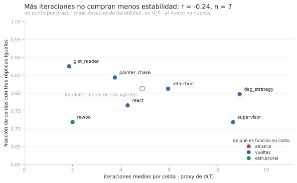
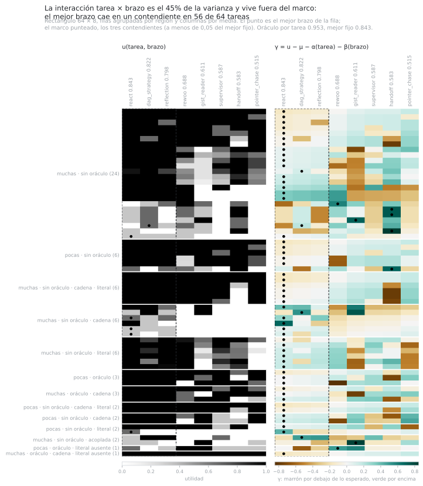
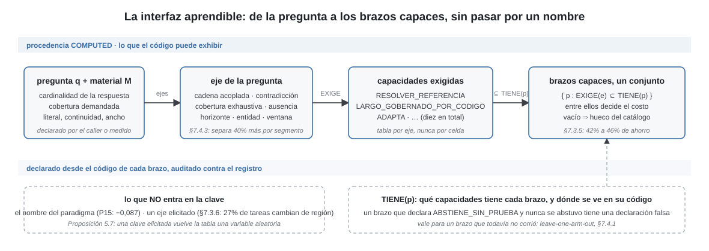
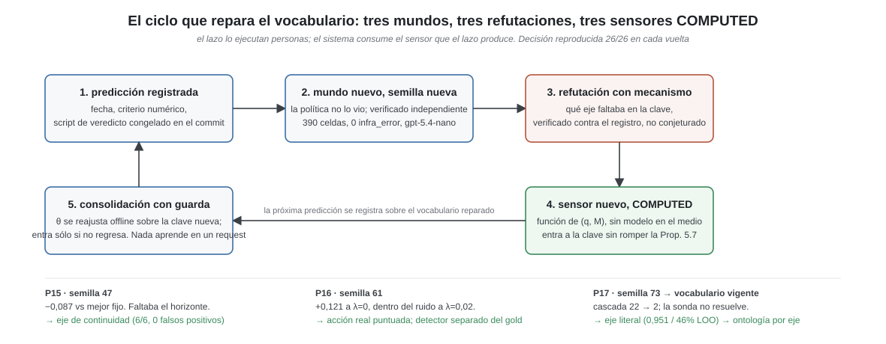

# Hard Guarantees over Hope: Deterministic Control for LLM Agents

## Policy-as-Code, procedencia tipada y ejecución selectiva

Borrador 3.2 (v2 de la tesis), 2026-09-03
Autor: Ariel Edgardo Levy
Estado: borrador de trabajo. Los dos teoremas se demuestran bajo sus premisas y la suite ejecuta
sus identidades e instancias; toda afirmación empírica lleva su tamaño de muestra y su piso de
ruido, y §1.3 declara el alcance.
Destino: arXiv cs.LG (primario), cs.AI (cross-list).

> Ésta es la única versión mantenida. La redacción inglesa quedó congelada en
> `historico/paper-en-congelado.md`, anterior a este borrador y superada por él. El borrador
> 2.0 quedó en `historico/paper-es-borrador-2.0-2026-08-31.md`.

> Las diferencias con los borradores anteriores están en el Apéndice C.

---

## Resumen

Un arnés de agentes es todo lo que rodea a un LLM y lo convierte en un sistema. Arma el prompt y
administra el contexto, qué entra y qué se compacta. Expone herramientas y ejecuta las llamadas
que el modelo pide. Guarda estado entre llamadas y entre rollouts. Impone presupuesto, permisos y
guardas de seguridad, verifica la salida antes de entregarla y registra lo que pasó. Y decide qué
llamada viene después, qué buscar, cuándo reintentar y cuándo parar. Cada una de esas funciones
es una decisión, y cada decisión tiene un dueño: la toma el código o la toma el modelo. Si
depende directamente de una emisión estocástica del modelo, hereda la variación del componente
que el arnés intenta gobernar, y eso vale igual para una guarda, una compactación de memoria,
una vuelta más del bucle o una rama. El motor de este trabajo aplica a cualquiera de esas
decisiones; lo que el banco mide son las que ramifican el flujo, porque son las que fijan de
quién depende la trayectoria. La tesis es una sola: separar un plano de percepción estocástico
de un plano de control determinista. El modelo propone contenido; el código tipa, admite y
decide. Una decisión cuya invariancia se promete no depende de una salida
estocástica no canonizada del modelo.

Formalizamos esa tesis con puntos de ramificación delegados y dos cantidades distintas:
desacuerdo de trayectoria, `V_T`, y desacuerdo de salida, `V_Y`. Bajo un stack determinista, si
ninguna identidad del próximo nodo depende de la aleatoriedad del modelo, entonces `V_T = 0`, la
trayectoria es independiente de esa aleatoriedad y toda discrepancia de salida se localiza en un
nodo común (Proposición 4). La garantía es «misma base de creencias, misma decisión», no «mismo
prompt, misma respuesta».

La arquitectura materializa el principio como `proponer → tipar → verificar/admitir → decidir`:
proposiciones con procedencia y alcance entran a una base de creencias; policy-as-code aplica
factibilidad, piso de garantía y abstención; y políticas consolidadas offline cambian la decisión
sin actualizar los pesos del LLM. Procedencia responde de dónde salió un valor y no si es verdad;
credencia y alcance responden cuánto y sobre qué puede sostener una decisión.

Evaluamos el mecanismo en un benchmark sintético controlado de análisis forense documental: 78
tareas, doce paradigmas y tres réplicas, sin juez LLM. Entre 12% y 28% de las celdas producen
resultados distintos a temperatura cero bajo un stack cuyo no-determinismo de servicio no puede
separarse todavía de la ramificación delegada. En una intervención en muestra, reemplazar una
decisión de ancla del modelo por código lleva un paradigma de `0,33` a `0,89` y eleva `pass^3`
de `0,33` a `0,67`; la transferencia a tareas nuevas queda preregistrada (§6.1, §9.1).

Como evidencia secundaria, representaciones por capacidades predicen un brazo no visto mejor que
la dificultad de la tarea sola, pero no superan a la identidad aditiva ni cruzan su nulo exacto
con ocho brazos (`p = 0,066`). La adaptación de política sin actualizar pesos gobierna 36 de 78
tareas y su guarda frena promociones no separadas del ruido. En costo, la política θ vigente
ahorra 41% frente a la constante con `Δu = +0,058` e IC95 `[−0,014, +0,132]`; es un resultado
parcial, no la validación de un selector. Los resultados empíricos valen para este benchmark y
estos modelos; las propiedades estructurales se enuncian para agentes en general.

Palabras clave: agentes LLM, plano de control determinista, ramificación delegada, procedencia
tipada, policy-as-code, ejecución selectiva, adaptación de políticas, reproducibilidad


**Figura 1.** El contrato de garantía. El request entra como tres cosas que declara quien
llama, apiladas a la izquierda: el material, el presupuesto y las banderas de riesgo. Siguen
tres pasos en fila. Factibilidad (1) es una desigualdad y no una estimación: cada paradigma
declara cuántas unidades lee y cuántas llamadas emite, y los que no entran en el presupuesto se
podan sin gastar un token. Piso exigido (2) deriva el nivel de garantía, A0 a A3, desde
creencias sobre el request y no desde su texto. Admisibles (3) deja pasar sólo a los paradigmas
que alcanzan ese piso. La llave de la derecha abre a las dos únicas salidas: ejecuta y
responde, cuando alguna procedencia alcanzó el piso, y se abstiene o difiere, cuando ninguna lo
alcanzó. Toda decisión termina en una de las dos, y la segunda es una salida y no un fallo. El
lazo punteado que vuelve desde la salida roja hasta el piso exigido es la adaptación de política:
el registro de rechazos sube el piso del próximo request, offline y con guarda anti-regresión,
sin que nadie toque un peso. La caja rayada es el bucle, cuántas vueltas, qué índice, cuándo parar,
qué unidad es el ancla, y está rayada porque el modelo nunca lo toca. En el carril de abajo el
LLM es un sensor estocástico con pesos congelados, y la única flecha que cruza la frontera lleva
proposiciones tipadas hacia arriba, nunca control de flujo hacia abajo. La garantía que la
figura dibuja es «misma base de creencias, misma decisión», y se verifica repitiéndola; «mismo
prompt, misma respuesta» no la puede dar ningún LLM, y el motor no la promete.

# 1. Introducción

## 1.1 Tres propiedades que un sistema de producción exige

Un *arnés* de agentes es lo que rodea al modelo y lo convierte en un sistema: contexto,
herramientas, parseo, estado, verificación, presupuesto y registro. La parte que este trabajo
estudia es su estructura de control, que toma una de pocas formas: una llamada única, un bucle
de razonamiento, una descomposición, un grafo de verificar-replanificar. Se elige una vez
en tiempo de diseño y se congela en el código, y sobre él se sostienen sistemas agentivos que
firman números, disparan acciones y contestan a usuarios. Las demás capas de un sistema de
producción dan tres propiedades por sentadas. Una base de datos ejecuta la misma consulta igual
cada vez, un log dice de dónde salió cada registro, y un validador rechaza la entrada que no
cumple el esquema. En un agente esas tres propiedades hay que construirlas, porque su componente
central no tiene ninguna.

1. El flujo de control vive en el código. Los modelos son aleatorios por naturaleza, y lo
siguen siendo a pesar del trabajo extenso en darles más determinismo: la misma llamada a
temperatura cero, con el mismo prompt y la misma semilla, devuelve una distribución de
respuestas y no una respuesta. Una condición suficiente para que una decisión no herede esa
variación es que sea función de estado independiente de emisiones estocásticas no canonizadas
del modelo. En esta arquitectura ese estado lo computa el código. Delegarle al modelo
ramificaciones (qué buscar después, cuántas vueltas dar, cuándo parar) abre un canal causal desde
su aleatoriedad hacia la trayectoria. En el banco, entre 12% y 28% de las celdas cambian de
resultado entre réplicas a temperatura cero con la misma huella (§6.1.2). Ese rango mide
inestabilidad del sistema completo: el montaje no separa todavía cuánto proviene de la
ramificación y cuánto del stack de servicio (§8.2). El glosario de §3.1 fija los términos del
banco.

2. Cada valor emitido exhibe de dónde salió. Una respuesta correcta y una inventada llegan
con la misma cara, así que la fuente tiene que viajar con el valor. Eso es lo que vuelve
explicable una decisión: se puede mostrar de qué unidad del material salió cada número y qué
regla lo dejó pasar. Un sistema hecho sólo de llamadas al LLM no puede ofrecerlo, porque la
explicación que el modelo da de su propia salida es otra emisión, con la misma cara que la
primera. Con una base de creencias tipada se puede exigir que un número esté implicado por
evidencia de cierto nivel; el sustituto es la confianza en que «el modelo suele acertar».

3. El sistema puede callarse. En el modo más difícil del corpus, las cadenas acopladas medidas
con `terra` (§1.3.2 dice qué modelo corre cada medición), el paradigma que gana lo hace con 8
correctas y 1 abstención sobre 9 celdas, sin una sola respuesta equivocada; y en el mismo modo
sobre `luna` los brazos (así llama el banco a cada paradigma que corre) que fallan se abstienen
más de lo que inventan (§6.1.3). El banco puntúa abstención y error con el mismo
`0,000`, que es correcto para medir utilidad y ciego justo sobre el eje que producción
necesita.

La tesis es que las tres se consiguen en el mismo lugar: separando percepción estocástica y
control determinista, y haciendo que las decisiones invariantes dependan de señales del entorno
contables y verificables. Este trabajo las construye, las mide y dice qué cuestan. La regla se
resume en el **Principio Sensor–Controlador**:

> Un modelo estocástico puede proponer hechos; no debe gobernar directamente decisiones cuya
> invariancia el sistema promete.

La palabra «determinismo» se usa en tres niveles que no son equivalentes:

| propiedad | función | qué significa | estado en este trabajo |
|---|---|---|---|
| trayectoria | `D_T : (q, M) → T` | el mismo request y material visitan los mismos nodos | garantizada bajo `d(T)=0` y stack determinista (§4.1) |
| política | `D_P : B → a` | la misma base de creencias produce la misma acción | garantizada por policy-as-code (§3.4, §4.2) |
| salida | `D_O : (q, M) → y` | el mismo request y material producen la misma respuesta final | no se garantiza |

El paper garantiza `D_P` y caracteriza cuándo vale `D_T`; no promete `D_O`. Esta distinción evita
usar «reproducible» como sinónimo de «el LLM emite siempre lo mismo».

«Aprender» tiene acá un sentido más estrecho que el habitual en cs.LG, y hay que fijarlo antes
de seguir. Aprender significa que el sistema madura: cambia lo que hace con la experiencia, cada
cambio es un artefacto que una persona puede leer y comparar con el anterior, y ningún cambio
rompe la garantía de la decisión. Lo que se acumula son creencias, proposiciones y tablas, nunca
pesos; lo que las gobierna son reglas y medidores (un medidor computa una propiedad de la tarea
desde el request o desde el material, sin llamar al modelo) que se escriben en código y no
aprenden.

Con eso quedan fijadas tres palabras más. Determinismo son esas reglas. *Adaptación de política
sin actualizar pesos* es que las creencias, las proposiciones y las tablas se acumulen solas,
desde lo que el sistema sensa y registra, sin que una persona intervenga en el diseño para cada
cambio; las secciones técnicas conservan *plasticidad* como abreviatura. Explicabilidad es que el
sistema entregue, por decisión, la clave que vio, la creencia que la disparó y la versión firmada
de la tabla que la produjo. §3.5 dice qué es fijo y qué es plástico y por qué la frontera está
donde está; §6.6 mide si el sistema, con esa definición, maduró sobre el registro de la campaña.

### 1.1.1 La instrucción llega hasta la probabilidad; el despliegue exige propiedades

Hasta ahora el comportamiento determinista se buscó instruyendo al modelo: «citá siempre»,
«si no sabés, decilo», «no inventes números». Los modelos siguen instrucciones cada vez mejor y
cada generación se acerca más. Pero una instrucción es un prior sobre la distribución de
salidas, no una restricción sobre la muestra: seguirla mejor sube la probabilidad, y el límite
de esa sucesión queda del lado abierto.

En un chat la brecha puede ser tolerable. En despliegues de mayor riesgo, requisitos como
trazabilidad, registro y supervisión humana motivan propiedades verificables del sistema, y no
alcanzan por sí solos a demostrar cumplimiento regulatorio. Este trabajo no afirma satisfacer el
Reglamento de IA de la Unión Europea ni el RGPD: toma esa necesidad de trazabilidad y control como
motivación técnica, y reemplaza una instrucción al modelo por una restricción fuera de él.

### 1.1.2 Una expectativa de la literatura, y qué mide de verdad

La motivación habitual para trabajar sobre arneses es que elegir entre patrones o paradigmas
es una decisión importante, porque el mismo modelo rinde distinto según la estructura de control
que lo envuelve. La selección oráculo por tarea supera al mejor paradigma fijo por 17,1pp sobre
seis paradigmas, cuatro modelos frontera y diez benchmarks [Select-then-Solve,
arXiv:2604.06753]. El mismo trabajo mide que el premio no se cobra (un ruteador sobre
embeddings recupera un cuarto de la brecha, el auto-ruteo zero-shot recupera valor *negativo*),
y la conclusión habitual es que hacen falta mejores selectores.

El trabajo del banco reordena esa expectativa, y lo hace incorporando un nivel intermedio entre
la pregunta y el paradigma: las capacidades. Los paradigmas son paquetes distintos de
capacidades, y el premio alcanzable aparece sobre los ejes donde las capacidades difieren:
costo, cobertura, abstención. §6.4.1 mide el primero: θ ahorra 41% contra una política constante,
con `Δu = +0,058` e IC95 que cruza cero, evaluada dejando una tarea afuera por vez
(leave-one-task-out). El resultado no alcanza el criterio preregistrado de 50% y se reporta como
parcial.

Sobre la calidad, el eje que los contendientes comparten, el premio apenas se separa del ruido.
Los contendientes son los tres paradigmas cuya utilidad queda pegada a la del mejor fijo. La
brecha de oráculo (lo que ganaría quien eligiera por tarea el mejor paradigma, sobre el mejor
paradigma fijo) entre los tres es `+0,058`, y apenas se separa de su piso de ruido, que es la
brecha que un oráculo mostraría por puro azar, porque un máximo sobre estimaciones ruidosas está
sesgado hacia arriba (`+0,028` neto contra el piso calibrado, `+0,011` contra su p95). §6.3 dice
por qué: los tres tienen las mismas capacidades y son el mismo brazo para decidir. La interacción
tarea×paradigma es grande (39% de la varianza explicada, descontado el ruido) y vive sobre todo
entre los paradigmas que nadie elegiría (§6.2). Sobre los ocho brazos y sobre el held-out el
oráculo sí muestra premio neto, `+0,07` a `+0,15`, y lo que ese premio pide es una clave que lo
vea: ninguna señal por identidad de paradigma lo predice (§6.2.4, §6.5). El banco existe para
que el sistema aprenda qué exige cada request y qué le puede dar cada brazo, y ahí es donde el
premio se cobra.

## 1.2 Consecuencias de una sola tesis

El banco es fuente de episodios, no torneo. Produce un ranking y un registro de qué hizo cada
brazo sobre cada pregunta; el ranking es lo que menos vale, porque sobre calidad los brazos
capaces empatan (§6.2) y el mejor fijo cambia de mundo a mundo (§6.2.8). Lo que se extrae del
registro es el motivo del comportamiento: qué capacidad faltaba donde un brazo falló, qué eje
separaba dos celdas que la región confundía, qué señal contable predice que una trayectoria se
desboca. Por eso una refutación es un episodio y no un fracaso (§6.5).

La factibilidad es aritmética, y es gratis. Antes de preguntar cuál topología es mejor se puede
preguntar cuál puede correr, con cantidades que la tarea ya declara. Una política que gasta
episodios descubriendo que map-reduce pierde en tareas de 500 unidades aprende aritmética por el
camino difícil; el tope era computable antes del primer token.

La selección paga sólo bajo una condición precisa. Un ruteador obligado a elegir siempre paga
cada error de ruteo; §4.3 formaliza cuándo le gana a un fallback fijo, y el punto de operación
óptimo suele implicar abstenerse en la mayoría de las solicitudes. Es un objetivo distinto, no un
ruteador más débil.

Mucho de lo que se atribuye a la topología es de la superficie. Entre el paradigma más caro y el
más barato hay un factor 10× de costo y `0,17` de utilidad, y el costo es de 98,6% a 100,0% de
entrada en todos (§5.2): los paradigmas se diferencian en cuánto material arrastran al prompt, no
en la estructura de control. Un benchmark que no reporta la calidad de su superficie de
herramientas compara un retriever envuelto de doce maneras.

## 1.3 Alcance de las afirmaciones

La teoría, la arquitectura y sus magnitudes tienen alcances distintos. La primera página los
separa para que una cifra local no se lea como propiedad universal:

| afirmación | alcance | estado |
|---|---|---|
| independencia de trayectoria cuando `d(T)=0` | estructural, agentes en general, bajo stack determinista | demostrada; instancia operativa en la suite: cinco brazos del catálogo recorren los mismos nodos bajo dos sensores que responden distinto (§4.1) |
| política determinista sobre clave `COMPUTED` | arquitectura general | demostrada; instancia finita abstracta en la suite (§4.2) |
| contrato de procedencia, alcance y abstención | arquitectura general | implementado; soundness condicionado a sus premisas (Apéndice B.6) |
| inestabilidad, utilidad y costo | RAG forense documental | medido en este benchmark, panel y modelos (§6) |
| representación por capacidades | catálogo y benchmark de este trabajo | evidencia sugestiva; ocho brazos, nulo no cruzado (§6.3) |
| ahorro de θ | objetivo de costo, rectángulo 64 × 8, `luna` | resultado parcial frente a la constante (§6.4.1) |

Establecido: la teoría (§4), demostrada bajo sus premisas y acompañada por chequeos ejecutables
de sus identidades e instancias finitas; una compuerta de factibilidad (§3.3) validada sobre cuatro escalas de corpus;
un generador de corpus cuyo ground truth se re-deriva de forma independiente a partir de
los documentos (§3.5).

Medido: todo §6, sobre una campaña de 78 tareas, 12 paradigmas y 3 réplicas que da 2.511
filas y 123,3M tokens (nueve brazos corrieron 67 tareas y tres, `rewoo`, `handoff` y
`graph_traverse`, las 78; cero errores de infraestructura, sin juez LLM y con el corrector
auditado), más un held-out corrido por el mismo camino de código y una réplica del hallazgo de
consenso sobre una segunda familia de modelo. Todo panel comparativo es el rectángulo mecánico
del registro, 64 tareas × 8 brazos: las tareas que esos ocho brazos corrieron todas con tres
réplicas (§5.3). Cada comparación declara su piso de ruido.

Dos mediciones corren sobre otro modelo. Los tres episodios del ciclo (§6.5) son anteriores a la
campaña y corrieron sobre `gpt-5.4-nano`; §6.5.1 declara qué de ellos transfiere a la campaña y
qué no. La celda de cadenas acopladas de §6.1.3 y §6.1.4 corrió sobre `gpt-5.6-terra`, porque
sobre `nano` daba cero en toda la grilla; §6.1.3 declara los números de `luna` al lado.

### 1.3.1 El dominio

Lo que se evalúa es capacidad de RAG sobre análisis forense de hechos: un sistema que
recibe preguntas del tipo que hace un auditor, un analista de cumplimiento o un investigador
sobre un conjunto documental. Qué cuenta figura a nombre de quién, quién le reporta a quién
subiendo N escalones, si existe registro de una transferencia, si una designación sigue
vigente, si alguien debía escalar y no lo hizo.

Se usa un **benchmark sintético controlado** porque el experimento necesita ausencia conocida,
presuposiciones falsas, cadenas entre documentos y procedencia exacta, propiedades difíciles de
establecer sin ambigüedad en un corpus público. El costo de ese control es validez externa: este
trabajo no muestra todavía que el mecanismo sobreviva fuera del generador (`P37`, §9.1).

El corpus es heterogéneo por construcción, y sus once modos son los modos de falla de ese
dominio, no una muestra de dificultad: hecho único verificable, enumeración independiente,
cadena acoplada, agregación con cobertura exhaustiva, horizonte desconocido, acción
irreversible, vigencia, plantel declarado, ausencia, presuposición falsa y escritura
compartida. Ausencia y presuposición falsa son las dos que un benchmark de extracción no suele
tener y las que un sistema forense necesita: la respuesta correcta es que el hecho no está, o que la
pregunta da por cierto algo que es falso.

Sobre eso se apilan tres anchos (5, 20 y 60 unidades) y entidades con variantes de superficie,
anáfora y señuelos: el 36,5% de las menciones son invisibles a una búsqueda del nombre
completo y el 100% de los saltos de cadena exige resolver una variante.

La maquinaria no depende del dominio. Sensor estocástico, motor determinista, procedencia
tipada, compuerta aritmética y abstención son propiedades de cómo se decide, no de qué se
pregunta; §3.5 las instancia sobre otras tres superficies (datos, acciones, gobierno) con el
mismo enunciado sobre otro tipo de proposición. Lo que este registro establece es que la
separación funciona y qué cuesta en un dominio; que el número transfiera a otro es una
predicción, no un resultado.

Fuera de alcance: un selector de calidad validado; ningún resultado sobre benchmarks
públicos; ninguna medición fuera del dominio descrito arriba; y un clasificador que recupere
los ejes de la ontología desde un request real. Que la ontología separe a los brazos está medido sobre
el registro (§6.3.5). Que se la pueda detectar afuera del corpus es la medición que sigue.

### 1.3.2 Mapa de mediciones

Cada sección empírica corre sobre un corpus, un modelo y un panel, y no son los mismos en
todas; ningún número se lee fuera de su rectángulo.

| sección | corpus | modelo | panel | qué transfiere entre secciones |
|---|---|---|---|---|
| §5.2, §6.1, §6.2.1 a §6.2.5, §6.3, §6.4.1, §6.4.2 | `gold_h1`, 78 tareas, entidades reales | `gpt-5.6-luna` | rectángulo 64 × 8 para toda comparación entre brazos; registro entero para cobertura y aporte | es la campaña, y de acá salen los números del resumen |
| §6.1.3, §6.1.4 | `gold_h1`, modo de cadenas acopladas, 3 tareas | `gpt-5.6-terra` | 9 celdas por brazo | el mecanismo de la intervención; sobre `luna` los números van al lado |
| §6.2.6 a §6.2.8 | `gold_holdout`, 26 tareas, semilla nueva | `gpt-5.6-luna` | rectángulo 24 × 8 | el veredicto fuera de muestra del oráculo |
| §6.4.2 | réplica del consenso | `gpt-5.6-terra` | 200 celdas, réplica 0 | si el consenso es de los paradigmas o del modelo |
| §6.4.3, primera parte | `gold_transfer`, 26 tareas | `gpt-5.4-nano` | 90 celdas, cinco brazos | el mecanismo del recall; las magnitudes no |
| §6.5 | tres mundos de 26 tareas, semillas 47, 61 y 73 | `gpt-5.4-nano` | 390 filas cada uno | el mecanismo de cada refutación y la reproducibilidad; las magnitudes no |
| §6.6 | `gold_h1` | `gpt-5.6-luna` | 616 episodios en seis lotes | la trayectoria de θ |
| §3.4.2, tabla del dial | registro anterior a la campaña | `gpt-5.4-nano` | cinco brazos | el porcentaje que A3 se lleva; los absolutos no |

## 1.4 Organización del paper

§2 ubica el trabajo (el extendido va al Apéndice D). §3 es el motor, abierto con un request real.
§4 es la teoría mínima que el argumento usa (lo auxiliar, en el Apéndice B). §5 es el banco y el
método, dicho una vez. §6 son los resultados en el orden del argumento. §7 discute, §8 acota, §9
concluye y registra las apuestas que siguen.

# 2. Trabajo relacionado

Cuatro vecindades, en el orden en que el argumento las usa: quién elige el paradigma, quién
gobierna la inferencia, de dónde vienen las creencias, y cuándo no contestar. El linaje clásico
línea por línea, los mecanismos con antecedente directo y las líneas que el cuerpo sólo cita
están completos en el Apéndice D.

## 2.1 Selección de paradigma y ruteo

Select-then-Solve entrena un ruteador sobre embeddings para elegir un paradigma por tarea
[arXiv:2604.06753]; FlowBank selecciona por consulta desde un portafolio offline
[arXiv:2606.11290]; TRACE-Router rutea a granularidad de traza [arXiv:2607.22465]; Uno-Orchestra
aprende descomposición y despacho juntos [arXiv:2605.05007]. Todos operan a cobertura uno y
ninguno reporta una curva riesgo-cobertura. El oráculo de Select-then-Solve es un máximo
empírico por tarea sobre una muestra fija sin re-muestreo entre seeds (verificado contra el
paper completo), que es el caso para el que el piso de ruido de §6.2.3 existe.

Rutear entre paradigmas de recuperación por request existe (Adaptive-RAG, Self-RAG, FLARE,
Self-Route, AutoMix), siempre con selector elicitado o entrenado sobre el texto y sin
capacidades declaradas del brazo; y las cascadas de modelos (FrugalGPT, Hybrid LLM, RouterBench,
RouteLLM) deciden entre modelos con el mismo control de flujo y con un detector elicitado. §D.6
los detalla. Lo que este trabajo agrega es exigir que la clave del ruteo sea `COMPUTED` (§4.2),
medir el premio contra un piso de sesgo del máximo, poder no elegir, y la partición por
verificabilidad de §B.5: cuándo la cascada precede a la selección porque existe un detector
barato.

Del lado de la ingeniería, el vecino de §6.3 son las tarjetas de habilidades (Agent2Agent y sus
antecesores): texto `ELICITED` que el agente o su autor escriben sobre sí mismos y que nada
verifica contra la conducta. Una capacidad de §6.3 es un booleano declarado desde el código del
brazo y auditado contra lo corrido, `COMPUTED`, y la tabla de exigencias va del eje de la
pregunta a la capacidad, nunca al nombre. En una búsqueda fechada 2026-09-01 no se encontró
trabajo que declare capacidades de control de flujo desde el código y las someta a
leave-one-arm-out (§D.9).

## 2.2 Gobernanza determinista sobre inferencia probabilística

Es la vecindad más cercana a §3.4. Los dos primeros se leyeron completos el 2026-08-26.

| trabajo | qué aporta | qué agrega este trabajo sobre eso |
|---|---|---|
| SCL / Soft Symbolic Control [arXiv:2511.17673] | gobernanza sobre inferencia probabilística, partida en *Regulation* (un metaprompt persistente) y *Control* (un runtime determinista sobre el historial del turno: llamadas duplicadas, conteo de errores, profundidad de ciclos), más clasificación de riesgo por acción | la garantía graduada por solicitud y derivada de creencias sobre el contenido, el espacio de planes acotado por nivel, y la calibración medida de la confianza |
| MINERVA / HADD, Jaime y Errecalde (2026) [Zenodo 10.5281/zenodo.20003407] | el antecedente de vocabulario más cercano: el LLM confinado a sensor tipado, la cognición determinista sobre la base de creencias («mismo estado → misma acción»), una compuerta de admisión en la frontera de percepción, y el encuadre neurosimbólico de Kautz (Tipo 2, simbólico que envuelve a lo neuronal) [Kautz, 2022]. Es una arquitectura declarada para dominios regulados | la medición de cada invariante con su costo, la procedencia como jerarquía con semántica de admisibilidad, la garantía graduada por solicitud, y la plasticidad de §3.5 |
| Motores de creencias: Nous [arXiv:2606.22030], MemIR [arXiv:2605.25869], Eywa [arXiv:2605.30771], HEP [arXiv:2607.09195] | acotar la confiabilidad por procedencia del canal; tipar la memoria para impedir colapso de fuentes; promover hechos sólo tras validadores contra evidencia inmutable; hacer auditable la evolución de hipótesis | la jerarquía de procedencia que filtra la promoción, y la partición proponer/puntuar de §3.5 como mecanismo para el jardín de senderos que se bifurcan que [arXiv:2607.01507] diagnostica |
| Contratos de delegación e identidad atestiguada [arXiv:2603.18043] | el vecino más cercano del lado del ruteo, y empírico: rutear sobre calidad auto-reportada selecciona a los peores delegados y rinde peor que al azar (`0,55` contra `0,68`); el remedio son contratos que acotan autoridad más identidad reclamada contra atestiguada, y el brazo atestiguado llega a ruteo casi óptimo | la procedencia como orden sobre tipos de evidencia que una regla lee, el piso sobre acciones irreversibles, y la abstención tasada como curva riesgo-cobertura |

La conjunción propia se enuncia por lo que excluye, porque «procedencia + ruteo + contratos» ya
está ocupado como frase: un retículo de procedencia sobre evidencia, un piso que filtra acciones
irreversibles con él, la abstención tasada como curva riesgo-cobertura medida, y el mismo cálculo
sobre factibilidad, control y contenido. Cualquier término suelto tiene antecedentes, y §D.11
dice cuáles y por qué camino llegan a la misma prohibición de la auto-evaluación.

## 2.3 Procedencia y creencias tipadas

Las piezas del motor de creencias vienen de líneas con décadas de trabajo: revisión de creencias
(AGM, 1985), mantenimiento de verdad con justificaciones (Doyle, 1979; de Kleer, 1986),
procedencia de primera clase (Buneman, Khanna y Tan, 2001; los semianillos de Green,
Karvounarakis y Tannen, 2007), la separación entre deliberación y ejecución de BDI (Rao y
Georgeff, 1995) y la política como dato inspeccionable de Soar y ACT-R. Cada línea asume algo
sobre su fuente que un LLM viola: que la creencia entrante se acepta, que la justificación
existe y es recuperable, que la procedencia se deriva de una operación, que un sensor roto se
delata por inconsistencia, que las condiciones de las reglas son observables. Las tres primeras
suposiciones caen a la vez cuando la fuente puede inventar con forma correcta. De ahí la
compuerta de admisión de §3.4, donde una proposición entra sólo con su procedencia declarada, y
la exigencia `COMPUTED` sobre la clave de la política de §4.2. La tabla completa, con qué se hizo
con cada supuesto roto, es §D.8.

Los motores de creencias contemporáneos son la vecindad directa de §3.4 y están en la tabla de
§2.2: Nous, MemIR, Eywa y HEP acotan la confiabilidad por canal, tipan la memoria y promueven
hechos sólo tras validadores. Y tres mecanismos que este trabajo usa tienen antecedente directo,
leído completo, y se acreditan en §D.10: el sondeo con presupuesto sobre una tabla de creencias
tipada (EnvProbe), las ediciones a un artefacto ejecutable filtradas por un verificador
(Kintsugi) y el piso de procedencia sobre acciones propuestas (ProvenanceGuard).

## 2.4 Predicción selectiva y abstención

La opción de rechazo es de Chow (1970) y la curva riesgo-cobertura de El-Yaniv y Wiener. Las dos
asumen una puntuación de confianza calibrada, y la que declara el modelo no lo está, así que
§6.4.2 construye una contra el registro y §D.3 recorre la línea de aprender a diferir. La maquinaria de
deferral existe al lado sin haber cruzado: eDAct [arXiv:2604.07036], el ruteo por descomposición
de incertidumbre [arXiv:2605.07805] y el meta-ruteo composicional, que nombra un confidence gate
como trabajo futuro [arXiv:2608.00106]. Nadie aplica abstención tasada a la selección entre
topologías de control (buscado 2026-08-26 y 2026-09-01).
La argumentación abstracta de Dung (1995) admite una conclusión si su prueba sobrevive a los
ataques disponibles; acá el espacio de respuestas plausibles y falsas no es construible, y la
admisión se decide por procedencia y no por supervivencia (§D.8).

# 3. El motor

## 3.0 Un request, de punta a punta

Antes de las definiciones, una decisión real del registro de la campaña, para que se vea qué
hace cada pieza. La tarea `d1-002-w48` pregunta: *«On what date did Lucia Vallejos transfer the
settlement account to the successor account? Report the date.»* Declara 60 unidades de material,
483 mil tokens en total, un presupuesto de 40 mil tokens, respuesta de cardinalidad singular,
cobertura suficiente, sin acción irreversible y sin oráculo barato. La respuesta correcta es que
no hay ninguna transferencia registrada: la pregunta presupone algo falso.

Primero decide la aritmética, sin gastar un token. Tres de los doce brazos quedan podados
porque necesitan el material entero en una llamada o una llamada por unidad más un reduce que
no entra en el presupuesto: `direct`, `extract_compute` y `streaming_scan`. Nueve pueden correr.

Después se arma la clave, la tupla de ejes con la que la política indexa su tabla (§4.2).
Cuatro de sus cinco ejes son `COMPUTED` desde lo que el request
declara o desde el material: muchas unidades, sin oráculo barato, sin continuidad de clave
entre unidades, y sin un literal entrecomillado en la pregunta. El quinto, el acoplamiento
entre unidades, lo emite el LLM sobre una muestra del material, lleva procedencia `ELICITED`,
y es el eje del que §4.2 se ocupa. La región, el valor que toma la clave, es
`many/no_oracle/loose/flat/no_lit`, la más poblada del corpus, con 24 tareas.

Después el dial, el nivel de garantía del request, de A0 a A3 (§3.4). La tarea no declara acción irreversible ni escritura compartida, el caller no
pidió más, y no hay piso aprendido para la región: el nivel efectivo es A1, el estándar de
producción, y no excluye ningún patrón.

Después la política. θ, la tabla consolidada de §3.5, en su versión 6 y firmada, tiene 24
episodios por brazo en esa región; el mejor par confiado es `dag_strategy` con `0,833` de
utilidad media contra `0,775` del fallback `react` (el brazo por defecto cuando θ no gobierna),
un margen de `0,058` que supera el umbral, así que θ gobierna esa región y
elige `dag_strategy`. Con el objetivo de costo en vez del de calidad, la señal computada elegiría
al más barato que empata en la región, `rewoo`.

Y lo que pasó. Los nueve brazos factibles contestaron que no hay transferencia registrada y
sacaron utilidad `1,000`; lo que los separa es el costo, de 14.641 tokens en `rewoo` a 427.975 en
`react`. El artefacto de la decisión lleva la acción, el brazo, la región, los tres patrones
excluidos y por qué, el nivel del dial, la versión y la firma de θ, y un digest; con eso y la
base de creencias registrada, la decisión se re-deriva sin volver a llamar al modelo. Las
secciones que siguen definen cada una de esas piezas y §6 mide qué cuesta cada una.

### 3.0.1 La figura, y qué decide cada carril


**Figura 2.** Cómo se decide un request, en tres grupos y una fila. En el carril de arriba
decide el código. Sensar: los sensores (1) computan ejes de la pregunta y del material en forma
cerrada, sin modelo, y las creencias tipadas (2) guardan cada proposición con su procedencia,
de `ASSUMED` a `COMPUTED`. Acotar: el portón de factibilidad (3) es aritmética pura, qué
paradigmas entran en el presupuesto; las capacidades exigidas (4) traducen la ontología de la
pregunta a capacidades, no a nombres; los brazos candidatos (5) son los que tienen todas las
exigidas; y el dial de garantía (6) toma el máximo entre el pedido del caller, el piso del
request y el piso aprendido. El caller puede endurecerlo, nunca bajarlo. Decidir:
elegir o abstenerse (7) toma, entre los que empatan, el más barato, y `EXPLAIN` (8) registra
qué se creyó y con qué procedencia. El brazo elegido ejecuta, y dentro de él va rayado el
bucle, cuántas vueltas, qué índice, cuándo parar, porque es del código. En el carril de abajo
el modelo contesta sólo dos preguntas: qué dice esta unidad, y hacia dónde sigue el rastro. Su
salida se tipa antes de usarse. Las dos flechas que cruzan la frontera están rotuladas:
pregunta hacia abajo, proposición hacia arriba.

La figura es el argumento del paper en una imagen, y la frontera entre los dos carriles es su
decisión de diseño principal.

Toda decisión que cruza al carril de abajo puede abrir un canal desde `Z` hacia el control; la
intervención en muestra de §6.1.4 muestra un caso, no una estimación causal general. La guarda
que cierra el ciclo, tipar la salida del LLM antes de usarla, salió
de un caso concreto: el modelo emitía
`'M. Arrieta settlement account'` y esa cola arrastraba la consulta a clasificarse como prosa,
mandándola al índice equivocado. La regla era correcta y la entrada estaba sucia.

| lo que decide el código | lo que emite el modelo |
|---|---|
| cuántas vueltas dar (del largo declarado en la pregunta) | qué dice esta unidad |
| qué índice usar (léxico para entidad nombrada, híbrido para prosa) | hacia dónde sigue el rastro |
| qué unidad es el ancla, y cuál el término de la cadena | qué hecho aporta lo leído |
| si hay evidencia suficiente para responder, o si hay que abstenerse | la redacción de la respuesta |

## 3.1 Preliminares y glosario

Una tarea `t` aporta una pregunta, un conjunto de *unidades* (documentos), un
presupuesto declarado de tokens, y flags de irreversibilidad y escritura de estado
compartido. Un paradigma `p ∈ P` es una estructura de control que puede llamar
herramientas y debe emitir una respuesta. La calidad `q(t,p) ∈ [0,1]` es F1 de conjuntos
contra un oráculo exacto. El costo `c(t,p)` es el total de tokens sobre cada llamada que
el paradigma hace.

El mejor paradigma fijo es `p⋆ = argmax_p E_t[u(t,p)]`. El oráculo es
`E_t[max_p u(t,p)]`, y la brecha del oráculo es su diferencia. La utilidad es calidad
neta de una preferencia de costo:

```
u(t,p) = q(t,p) − λ · (c(t,p) / min_{p'} c(t,p') − 1)
```

Normalizar por el paradigma más barato en esa tarea hace a λ interpretable, la calidad que
uno está dispuesto a cambiar por un múltiplo extra del costo mínimo, y λ=0 recupera calidad
pura exactamente. No se elige ningún λ: la calidad y el costo crudos se guardan sin
modificar y el trade-off se aplica en tiempo de análisis, de modo que los resultados se
reportan como función de λ y no bajo un supuesto sobre λ. Convención de §6: toda `u` reportada
usa `λ = 0`, calidad pura con el costo en su propia columna, salvo donde se indique otro λ.

Dos términos más que §6.2 usa. Sobre un panel de tareas y brazos, la utilidad se descompone
como `u(t, p) = μ + α(t) + β(p) + γ(t, p) + ε`, donde `α` es la dificultad de la tarea, `β` la
calidad del brazo, `γ` la interacción y `ε` el ruido entre réplicas de la misma celda. Una
celda es un par tarea × paradigma y no se usa con otro sentido; las once clases de falla del
corpus (§1.3.1) se llaman modos. Y una región es un elemento de la partición del espacio de
features que la política usa como clave (§4.2, §3.5).

El glosario que el resto del paper usa. La procedencia de
una creencia es cómo se obtuvo, en cuatro niveles ordenados: `COMPUTED` (una función pura del
request y del material, credencia 1,0), `OBSERVED` (medido ejecutando una sonda sobre el
material), `ELICITED` (el modelo lo afirmó, sujeto a calibración) y `ASSUMED`. La credencia es
cuánto se le cree, y es un campo distinto. Una sonda es una acción de la política que lee una
unidad del material para medir una propiedad de la tarea antes de decidir, con un costo
declarado, y devuelve una creencia `OBSERVED` o queda sin resolver. Un episodio es una decisión
registrada con su clave, su brazo, su utilidad y su costo (Definición en §3.5).

Y los términos del banco. Un brazo es un paradigma visto desde el banco, una columna del
registro. Una réplica es una corrida repetida de la misma celda con la misma huella; la campaña
corre tres por celda. El rectángulo es el panel de 64 tareas × 8 brazos sobre el que se hace toda
comparación entre brazos: las tareas que esos ocho corrieron todas con tres réplicas (§5.3). Los
contendientes son los tres brazos cuya utilidad media queda a menos de cinco centésimas del mejor
fijo, `react`, `dag_strategy` y `reflection` (§6.2.3). El piso de ruido es la brecha de oráculo
que brazos idénticos mostrarían por azar, porque el máximo de estimaciones ruidosas está sesgado
hacia arriba; se estima con pseudo-brazos (§6.2.3). `pass^k` es la probabilidad de que las `k`
réplicas de una celda acierten todas (§6.1.2). Un medidor es una función que computa un eje de la
clave desde el request o desde el material, sin llamar al modelo. El dial es el nivel de garantía
de un request, de A0 a A3 (§3.4).

Para una pregunta `q`, material `M` y aleatoriedad del modelo `Z`, `T(q,M,Z)` es la secuencia
de nodos ejecutados y `Y(q,M,Z)` la salida. `V_T` es la probabilidad de desacuerdo entre dos
trayectorias independientes y `V_Y`, la análoga para salidas (§4.2). Son constructos distintos:
una trayectoria fija todavía puede producir contenido variable.

## 3.2 Los doce paradigmas, en una línea cada uno

Un paradigma es una estructura de control, no una variante de prompt. Los tres que gobiernan
los resultados tienen origen publicado: ReAct, el bucle abierto de razonar y llamar
herramientas [arXiv:2210.03629]; Reflexion, borrador, crítica y revisión [arXiv:2303.11366];
ReWOO, plan de dataflow previo y una sola llamada de resolución [arXiv:2305.18323]. Los demás
son implementaciones de este banco contra un modo de falla declarado.

| paradigma | qué hace, operativamente | quién decide la próxima llamada |
|---|---|---|
| `direct` | una llamada con todo el material adentro | nadie; una sola llamada |
| `react` | bucle abierto: el modelo elige la herramienta, lee el resultado, sigue o contesta | el modelo, cada vuelta |
| `reflection` | como `react`, más un ciclo de crítica y revisión de la respuesta | el modelo |
| `dag_strategy` | descompone en sub-preguntas, las ejecuta sobre un pizarrón compartido, verifica y replanifica | el modelo planifica; el código fija topes de iteración y replanificación |
| `rewoo` | planifica todas las llamadas de herramientas de una vez, las ejecuta sin modelo, y resuelve con una llamada | el código, tras el plan |
| `handoff` | agentes con alcance propio sobre partes del material; el código autoriza una transferencia cuando la referencia aparece literal en otro alcance | el código |
| `supervisor` | un orquestador despacha sub-agentes con ventana recortada de ocho unidades, uno por vez, tras ver lo que volvió | el modelo, entre despachos |
| `gist_reader` | una tabla determinista de resúmenes cortos de todas las unidades, y lecturas completas dirigidas desde ella | el modelo elige qué leer; la tabla es del código |
| `pointer_chase` | ancla por búsqueda y sigue una cadena una unidad por salto, con el largo fijado por la pregunta (Algoritmo 2) | el código; el modelo sólo dice hacia dónde sigue el rastro |
| `graph_traverse` | construye un índice de entidades y relaciones y lo recorre | el código, sobre el índice |
| `extract_compute` | extrae registros estructurados de cada unidad y computa la respuesta sobre ellos | el código |
| `streaming_scan` | recorre las unidades en secuencia con un estado acotado que se arrastra | el código |

Un brazo de prompting, `cot`, quedó fuera del plantel por control nulo (abajo), y
`plan_execute` y `map_reduce` se retiraron por dominados antes de la campaña; sus registros
se conservan y no se corren.

El plantel son doce paradigmas, y se agrupan por de qué es función su costo (que es lo que predice quién sobrevive cuando el material crece) y no por su nombre de familia:

| ley de costo | paradigmas | qué los define |
|---|---|---|
| estructural | `direct`, `rewoo`, `graph_traverse`, `extract_compute`, `streaming_scan` | número fijo de llamadas, pase lo que pase |
| por vueltas | `react`, `reflection`, `dag_strategy`, `supervisor`, `gist_reader`, `pointer_chase` | el costo escala con cuántas veces vuelven al modelo |
| por alcance | `handoff` | el costo escala con cuánto material hay |

Cinco existen para cotejar contra grillas publicadas. Los otros siete entran cada uno contra
un modo de falla concreto: `rewoo` porque planifica todo de antemano y su costo no depende del
alcance; `dag_strategy` porque una comparación que omite la topología más elaborada disponible
está sesgada a favor de las simples; `handoff` y `supervisor` porque reparten alcance entre
sub-agentes de dos maneras distintas; `gist_reader`, `pointer_chase` y `graph_traverse` porque
cada uno interpone una representación intermedia más chica que el material (un resumen, un puntero, un índice de entidades) y §6.1.1 mide qué cuesta eso.

La ingeniería de prompts no es un paradigma y no está en el plantel de decisión. Un brazo
que sólo cambia el fraseo quedó como control nulo: en toda celda medida da la misma utilidad
que la llamada directa y nunca cuesta menos. Los paradigmas se distinguen por estructura de
control de flujo, jamás por redacción, y esa regla es lo que hace que las mejoras de §6.1.4
sean transferibles en vez de anecdóticas.

---

## 3.3 La compuerta aritmética de factibilidad

**Algoritmo 1.** La compuerta, entera. No hay ninguna llamada al modelo y no hay ningún parámetro
aprendido: es una desigualdad sobre cantidades que la tarea ya declara.

```
ALGORITMO 1  Portón de factibilidad
────────────────────────────────────────────────────────────────────────────────
Entrada : tarea t con unidades U, presupuesto Β tokens, plantel P
Salida  : P′ ⊆ P, los que PUEDEN correr

 1  N ← |U|                                    ▷ cardinalidad
 2  C ← Σ_{u ∈ U} tokens(u)                    ▷ contenido total
 3  A ← Β − reserva_de_conversación(t)         ▷ lo disponible de verdad
 4  P′ ← ∅
 5  for cada p ∈ P do
 6      según ley_de_costo(p):
 7          alcance     : coste ← C
 8          estructural : coste ← C / ramas(p)
 9          vueltas     : coste ← unidad_máxima(U) · techo_de_llamadas(p)
10      if coste ≤ A then P′ ← P′ ∪ {p}
11  return P′
────────────────────────────────────────────────────────────────────────────────
```

La línea 6 es la que separa dos modos de falla que se confunden de rutina: a un paradigma
que reparte por unidad lo acota `N` y no `C`, y a uno que lee todo lo acota `C` y no `N`. Un
corpus con pocas unidades enormes poda a los primeros; uno con muchas unidades chicas, a los
segundos. Sin la línea 6 los dos casos se reportan como «no alcanzó el contexto».

> Los corpus de esta sección son la escalera de escala, no el corpus de medición.
> `gold_v2`, `gold_wide` y `gold_deep` existen para barrer cuatro órdenes de magnitud de
> material (16k a 1,27M tokens) y mostrar que la compuerta de factibilidad se comporta como su
> aritmética predice en los cuatro. Los resultados de §6 corren sobre otro corpus, con
> entidades reales y variantes de superficie. La factibilidad no depende del modelo ni del
> corpus: es una desigualdad sobre cantidades declaradas, y por eso se puede validar en un
> lugar y aplicar en otro.

### 3.3.1 Validada sobre cuatro órdenes de magnitud

Que `p` pueda correr `t` depende de cantidades que `t` ya declara: `n` unidades, contenido `C`,
presupuesto `B` y una asignación `A = 0,6·B` que deja lugar a la conversación. Direct y CoT son
infactibles cuando `C > A`; Map-Reduce cuando `n > 80` o `n·f > A`, con `f` el tamaño proyectado
de un hallazgo; el DAG cuando las llamadas proyectadas superan 200; ReAct y Reflection nunca,
porque leen selectivamente con tope propio. Aplicado a 168 tareas sobre cinco corpus del mismo
generador, cada una con su presupuesto declarado:

| corpus | tokens/unidad | unidades/tarea | contenido máx | Direct, CoT | Map-Reduce |
|---|---|---|---|---|---|
| gold_v2 | 232 | 60 | 16k | 39/39 | 39/39 |
| gold_v3 | 2.147 | 60 | 152k | 12/39 | 39/39 |
| gold_wide | 264 | 500 | 135k | 20/32 | 18/32 |
| gold_deep | 7.161 | 60 | 483k | 2/26 | 26/26 |
| gold_xl | 2.499 | 500 | 1.272k | 8/32 | 18/32 |

Tareas factibles sobre el total; los otros cuatro paradigmas son factibles en 168/168. Agregado,
el espacio admisible se contrae con la escala de 100% (273/273 celdas en gold_v2) a 72% (162/224
en gold_xl), íntegramente por aritmética y antes de gastar un token. El par decisivo es gold_wide
contra gold_deep: gold_deep lleva 3,6× más contenido y Map-Reduce pasa de 18/32 a 26/26 mientras
Direct y CoT se derrumban a 2/26. El tamaño total no predice la factibilidad de Map-Reduce; la
cardinalidad sí, y tratar su límite como un límite de contexto lleva a descartarlo justo donde
funciona. En gold_deep una tarea de una sola unidad es infactible para Direct, porque un
documento son 8.075 tokens contra una asignación de 4.800: la pieza más chica direccionable ya no
entra.

Y acota lo que esta capa puede hacer. Los cuatro paradigmas selectivos son factibles en las 168
tareas, así que la protección contra un selectivo gastando a través de 1,27M tokens tiene que
venir de un presupuesto, no de aritmética sobre el corpus; §6.1 muestra que son justamente los
que varían cincuenta veces en costo.

Por qué va delante del aprendizaje. Sobre cuatro celdas de gold_deep, Direct quedó podado en
tres y corrió en una, donde sacó 1,000. Registradas como respuestas equivocadas, esas tres
dejarían su media en 0,250, de mejor a peor del plantel, por un artefacto de registro. La misma
capa que protege al estudio de una conclusión falsa es la que un sistema en producción necesita
para declinar en lugar de fallar.

---

## 3.4 Creencias, procedencia y garantía por solicitud

El determinismo de salida no está disponible con un LLM, y perseguirlo excluyendo al modelo de la
percepción descarta información que el modelo tiene. La inversión tiene el vocabulario que §2.2
acredita y el linaje que §D.8 tabula: el LLM sólo emite proposiciones tipadas, una capa simbólica
determinista decide sobre la base de creencias, y la garantía adopta una forma verificable:

> *La misma base de creencias da la misma decisión*, con la base registrada. Es la
> estabilidad de la decisión respecto de esa base. «El mismo prompt da la misma respuesta» es
> falso con un LLM y no se promete.

Lo que esta sección agrega es la epistemología de la creencia misma. En los antecedentes la
procedencia es un campo de trazabilidad; en este trabajo carga el peso de la decisión como
jerarquía tipada. Pero procedencia no es verdad ni credibilidad semántica:

| procedencia | responde | credencia en la implementación | no implica |
|---|---|---:|---|
| `COMPUTED` | una función pura y auditada produjo el valor desde el payload | 1,0 sobre la reproducibilidad del cálculo | que la función modele correctamente el mundo |
| `OBSERVED` | una sonda midió el request o el material | la que sostenga la medición | que la observación sea vigente o completa |
| `ELICITED` | el modelo afirmó la proposición | declarada y sujeta a calibración | evidencia independiente de la emisión |
| `ASSUMED` | el valor es un prior | la declarada | observación del caso actual |

`entity_count(text)` puede ser determinista y equivocarse semánticamente; lo certificado por
`COMPUTED` es qué función produjo el número. Por eso la base transporta por separado
`procedencia`, `credencia` y `alcance ∈ {REQUEST, POPULATION}`. Una regla puede exigir pisos en
esos ejes, y una acción irreversible puede restringirse a evidencia computada u observada sobre
el request: *la opinión de un modelo de que una acción es segura no es evidencia admisible para
tomarla.* El ensamblador tampoco crea verdad: sólo demuestra que una salida está implicada por
una base que satisface el contrato (Apéndice B.6).

La garantía es entonces una propiedad de la solicitud, no del sistema. Un modo global hace
que todo el tráfico pague por la solicitud más estricta. Cuatro niveles graduán el piso de
procedencia, si θ puede aprender online, si la corrida es reproducible desde caché, y qué
patrones son admisibles, el nivel certificado excluye topologías cuyo flujo de control es no
acotado, porque sus modos de falla no son enumerables, aunque a menudo sean mejores. El piso se deriva de creencias sobre la solicitud: quien llama puede pedir más y
nunca menos. La derivación misma aprende, offline: una categoría de solicitudes cuyas
afirmaciones elicitadas son rechazadas repetidamente por la compuerta es una categoría
cuyo piso sube, las estadísticas de rechazo son evidencia sobre la clase de solicitud, y
consumirlas cierra el bucle sin ajustar jamás nada adentro de una solicitud.

Tres propiedades lo vuelven seguro de correr, y las tres están impuestas en código. El evento es
tipado, no parseado: un rechazo lleva su motivo como valor (la procedencia que se tenía contra la
que la regla exigía), y sólo cuentan los rechazos por procedencia insuficiente; una creencia
rechazada por credencia baja o por valor equivocado es el sistema funcionando. La guarda es
replicación, no utilidad: el registro se parte por tarea, una mitad propone las regiones cuyo
piso debería subir y el piso se instala sólo si la otra mitad dice lo mismo; subir un piso sólo
puede bajar la utilidad medida en el corto plazo, así que un piso puntuado por utilidad es un
piso que nunca sube. Y el aumento es acotado y monótono: se detiene en accountable, porque
certified además restringe qué patrones corren y una estadística sobre calidad de evidencia no
es evidencia sobre certificabilidad; y nunca baja solo, porque la ausencia de rechazos tras la
subida es lo que la subida se instaló para producir. Los pisos aprendidos viajan en el bundle
firmado, así que nada eleva el nivel de una solicitud salvo por el camino de promoción de θ. Y
credencia no es tamaño de efecto: un margen aprendido es una creencia certera (1,0) sobre un
efecto grande (0,9), y codificar la magnitud como credencia destruye la distinción para la que
el motor existe.

### 3.4.1 Quién fija el dial

La pregunta parece de gobernanza y es de diseño. Si el nivel de garantía lo elige el
llamador, un llamador apurado lo baja; si lo elige el sistema, el llamador no puede pedir más
rigor del que el sistema cree necesario. Ninguna de las dos.

```
nivel efectivo = max( pedido , piso de creencias , piso aprendido )
```

| fuente | quién la produce | qué puede hacer |
|---|---|---|
| pedido | el llamador, en el request | subir, nunca bajar |
| piso de creencias | `required_floor(Γ)` sobre las creencias `COMPUTED` del request | subir, y no se puede desactivar |
| piso aprendido | `θ.floors[región]`, dentro del bundle firmado | subir, y sólo si está promovido |

**Proposición 1** (`max` es la composición menos restrictiva). Sobre un orden total finito,
`max(x₁, …, xₙ)` es la composición punto a punto mínima entre las que impiden que cualquier
fuente ablande el nivel, es decir, entre las `f` que satisfacen `f(x₁, …, xₙ) ≥ xᵢ` para toda
`i`. Además es idempotente: `max(x, …, x) = x`.

*Demostración.* Toda composición admisible `f` satisface
`f(x₁, …, xₙ) ≥ max(x₁, …, xₙ)` por ser cota superior de cada argumento. `max` alcanza esa cota
en cada tupla, así que es punto a punto mínima; dos mínimos distintos tendrían que ser cada uno
menor o igual que el otro y por antisimetría coincidirían. La idempotencia es inmediata. ∎

Hay composiciones más restrictivas que también impiden ablandar, por ejemplo la constante
`CERTIFIED`; la proposición no las declara imposibles, sino innecesariamente conservadoras. Con
`min` o con un promedio, agregar una fuente podría ablandar el resultado, y entonces una fuente
nueva sería un riesgo en vez de una garantía.

Por qué el llamador sube y no baja. Conoce cosas que el sistema no: que este request va a
un informe regulatorio, que el resultado se publica, que hay un auditor mirando. Nada de eso
está en el material. Lo que no puede es pedir menos, porque el piso sale de propiedades
del request mismo, `irreversible` eleva a A3, `shared_writes` a A2, y las dos entran
como creencias `COMPUTED` declaradas por el caller, nunca inferidas del texto. Un llamador
que pudiera bajar el piso podría declarar una acción irreversible y después pedir tratarla
como exploratoria, que es la combinación que el piso existe para impedir.

Una cuarta fuente, que es una degradación y no un nivel: A2 admite creencias `ELICITED` sólo una
vez que la calibración se ganó, así que la resolución no baja el nivel, endurece el piso de
procedencia dentro del nivel. Y el dial se evalúa marginalizando sobre sus cuatro posiciones,
porque reportar métricas a un dial fijo reporta una política y no un sistema. Marginalizar mostró
que A0, A1 y A2 declaran `admissible_patterns = None`: en la dimensión que esa tabla mide el dial
no restringe el catálogo hasta A3, y toda la diferencia se paga en un solo escalón. Lo que sí
distingue A1 de A2 vive en otros ejes (θ firmada, log de creencias, profundidad de composición,
piso de procedencia).

### 3.4.2 La cota nativa del ratchet

El piso aprendido sólo sube, y lo que hay que acotarle es cuánto daño acumulado puede hacer, no
cuánto oscila: una secuencia monótona y acotada tiene varianza que tiende a cero por
construcción, así que una cota de varianza se cumpliría vacuamente. Se acota un conteo. Los
niveles son `EXPLORATORY < STANDARD < ACCOUNTABLE < CERTIFIED` y el techo aprendido es el
tercero, porque `CERTIFIED` restringe qué patrones son admisibles y una estadística sobre calidad
de evidencia no es evidencia sobre certificabilidad.

**Proposición 2 (daño total acotado).** Sobre `R` regiones, el número total de eventos de
endurecimiento en toda la vida del sistema es `≤ 2R`, sea cual sea la cantidad de ciclos de
consolidación.

*Demostración.* El piso de cada región es una secuencia no decreciente en un conjunto finito y
totalmente ordenado, así que cambia a lo sumo tantas veces como niveles haya por encima de su
base. ∎

**Proposición 3 (la guarda de replicación es fuerte lejos del umbral y débil cerca).** Con `q`
la tasa verdadera de rechazo de la región, ocho tareas por split y umbral de cuatro rechazos para
que un split proponga, la probabilidad de que dos splits disjuntos propongan a la vez es 1 en
39.613 para `q = 0,10`, 1 en 77 para `q = 0,25` y 1 en 4 para `q = 0,45`. Importa menos de lo
que parece: cerca del umbral un falso positivo es casi indistinguible de un verdadero, y la
Proposición 2 acota el daño pase lo que pase. La monotonía que vuelve vacua una cota de varianza
es la que acota el daño de la propia tasa de falsos positivos.

Lo que cuesta está medido sobre el registro `nano` anterior a la campaña, con cinco brazos; el
porcentaje transfiere, los absolutos no:

| nivel | brazos admisibles | cobertura | `u`(mejor fijo) |
|---|---:|---:|---:|
| A0 · A1 · A2 | 5 | 100% | 0,6101 |
| A3 | 2 | 40% | 0,4221 |

El ratchet es gratis hasta A2 y cuesta todo de una vez en A3: la única transición con precio se
lleva 60% del catálogo y 31% de la utilidad, y el promedio esconde a quien paga (una región
pierde −0,5000 con media del corpus 0,0000).

## 3.5 Consolidación de la política de control

El aprendizaje es offline y copy-on-write. Los episodios se reproducen en orden de sorpresa y
no cronológico, lo que elimina el sesgo de recencia que la actualización online tiene por
construcción; las estadísticas se reducen en escala y las entradas sin uso se podan; y una etapa
de abstracción busca particiones de features que separen paradigmas mejor que el binning actual.

Dos disciplinas hacen esto seguro. Una política candidata se instala sólo si no regresa sobre
episodios retenidos. Y el registro se parte en tres por tarea, una parte propone
particiones, una las puntúa, una la toca sólo el guardia de promoción, porque buscar muchas
particiones contra un solo holdout es la forma en que detectar una verdad se vuelve confabularla.
Una partición descubierta entra con cero episodios, por debajo del piso de confianza, y no puede
gobernar una decisión hasta haber ganado evidencia: un sueño es una hipótesis, no un hecho.

Verificado: dado un registro donde la utilidad es independiente de todo atributo, ninguna
partición sobrevive la validación.

Dos términos. Un episodio es una tupla
`(κ, p, u, c)` asentada en el registro: la clave del request al momento de decidir (Definición
5.6), el brazo que corrió, la utilidad que obtuvo y su costo, más la procedencia de cada eje
de la clave. La política consolidada es la función `θ` de la Definición 5 materializada como
tabla de condiciones sobre ejes de la clave, con un episodio mínimo por celda antes de que una
fila pueda gobernar, firmada y versionada. Aprender es, en este paper, producir una `θ` nueva
desde episodios y dejarla entrar sólo si la guarda la deja.

> La política de control es código: una tabla de condiciones sobre features, versionada,
> firmada, con guarda de promoción y evaluada de forma determinista. Ése es el patrón que el
> título llama *policy-as-code*, y es el que este trabajo usa: la política se ejecuta, se firma,
> se compara y se revierte como cualquier otro artefacto de código. El patrón no exige un motor
> externo; la capa de decisión lo implementa sola y no depende de ninguno.

Cómo se llena una fila, en cinco pasos. (1) Los episodios se ordenan por sorpresa, la distancia
entre la utilidad obtenida y la que la política vigente esperaba para esa clave, y se
reproducen en ese orden. (2) Por cada par (región, brazo) se acumulan utilidad media, costo
medio, conteo y tasa de victoria; un par no puede gobernar una decisión hasta tener un mínimo
de episodios, hoy ocho. (3) Una etapa de abstracción propone particiones nuevas de los ejes
existentes que separen brazos mejor que la partición vigente, sobre la parte del registro que
propone; cada candidata se puntúa sobre la parte que puntúa, y sobrevive sólo si su ventaja se
sostiene ahí. (4) Un paso de homeostasis reduce en escala las estadísticas viejas y poda las
entradas sin uso, para que el registro no crezca sin límite ni fije un ganador para siempre.
(5) El bundle candidato se compara con el vigente sobre los episodios retenidos y se instala
sólo si no regresa; se firma, y el piso de garantía por región (§3.4) viaja adentro. Los
cinco pasos están en `app/consolidation.py` y `app/policy.py` y sus tests; ninguno llama al
modelo.

### 3.5.1 El sistema aprende con los pesos del LLM congelados

El LLM tiene los pesos congelados. No aprende de este despliegue, no guarda nada entre
requests, y dos llamadas idénticas no se enteran una de la otra. Y sin embargo el sistema en su
conjunto cambia de comportamiento con la experiencia. Ésa es la propiedad, y sale de un mecanismo de
tres pasos:

1. Cada decisión deja su huella epistémica. Al registro va la creencia que la disparó, su
   procedencia, el paradigma elegido y lo que salió. No es un log de texto: es la base de
   creencias creciendo, con la misma estructura tipada que gobierna una decisión en vivo.
2. La consolidación reproduce ese registro offline (en orden de sorpresa, no cronológico) y
   emite una política: una tabla de condiciones sobre features, versionada y firmada, que se
   ejecuta como código determinista.
3. La política entra sólo si no regresa sobre episodios retenidos, y una partición nueva
   arranca por debajo del piso de confianza: no puede gobernar hasta haber ganado evidencia.

Qué es fijo y qué es plástico, y por qué la frontera está ahí. El diseño tiene dos capas, y la
tesis del paper es la frontera entre las dos:

| capa | quién la cambia | ejemplos | por qué |
|---|---|---|---|
| reglas y medidores | una persona, con versión y test | qué puede medir el sistema (los medidores: cardinalidad, continuidad, literal, la sonda de acoplamiento), el retículo de procedencia y qué nivel exige cada acción, la compuerta aritmética, la composición por `max`, la guarda de promoción, la partición proponer/puntuar/promover | son lo que se audita y lo que se promete; una regla o un sentido que el sistema pudiera darse solo sería uno que nadie puede prometer |
| lo que se acumula | el sistema, desde lo que sensa y registra, sin intervención | las creencias, que entran cuando un medidor las emite, con su procedencia, y de las que la vigente reemplaza a la anterior sin borrarla; las proposiciones mismas, que no están listadas de antemano; la calibración de credencia por proposición; qué brazo admite cada región y con qué evidencia; las particiones de la clave descubiertas sobre los ejes que hay; los pisos de garantía por región | son lo que la experiencia enseña; nadie las define al principio, se acumulan, y cada versión de lo consolidado queda firmada y diffeable |

Nada de la segunda fila lo define nadie por adelantado. Lo que sí exige código es un medidor
nuevo, un eje que el sistema no sabía medir; eso es lo que los episodios de §6.5 agregaron, y por
eso los ejecutaron personas. Así el aprendizaje vive en la base de creencias y en la política que
se destila de ella, nunca en pesos, y eso compra dos cosas que normalmente se pagan una con la
otra:

> Un sistema plástico suele ser opaco, y uno auditable suele ser fijo. Poner el aprendizaje en la
> base de creencias en vez de en pesos da las dos: lo aprendido es un artefacto legible, diffeable,
> versionado y revertible, y su instalación pasa por una guarda. Se puede preguntar *qué* aprendió
> el sistema y contestarlo mostrando dos versiones de una tabla.

La forma hereda del linaje de §D.8: consolidar episodios en reglas ejecutables es el *chunking* de Soar y
ACT-R, y que un par de decisiones tenga contenido propio sobre sus marginales es plasticidad
hebbiana llevada a decisiones. Lo que se agrega es sostenerla cuando quien emite las creencias
puede inventar con forma correcta.

### 3.5.2 Sobre qué superficies

Lo que el motor aprende son políticas, que consolidan offline en un artefacto firmado y
versionado y después se ejecutan como código determinista.

| superficie | qué se aprende |
|---|---|
| ruteo | qué paradigma admite una región de features |
| herramientas | qué índice sirve a una consulta según su clase (§6.1.4) |
| pares de herramientas | qué asociación `tool_i → tool_j` predice, que un histograma marginal no captura |
| handoff | cómo repartir el alcance entre sub-agentes |
| comportamiento | el piso de garantía sube donde el registro muestra que las aserciones del modelo se rechazan |
| credencia | calibración por proposición en vez de un interruptor global de confianza |

Las dos últimas son las que cambian lo que el sistema *promete*, no lo que elige: un modelo
puede estar bien calibrado sobre cardinalidad y ser inútil sobre acoplamiento, y una política
de confianza global no puede representar eso. Qué predictores medidos alimentan hoy a cada
superficie, y con qué procedencia, está en §6.4.3.

### 3.5.3 Una consecuencia afirmable

Más inferencia no compra más ajuste. La consolidación es replay sobre el registro, así que
aprender cuesta cero llamadas; lo que la cuota compra son episodios. Eso separa dos decisiones
que se suelen tomar juntas: cuánto medir lo gobierna la potencia estadística, cuánto entrenar no
lo gobierna nada. Y la potencia la fija el corpus, no la cuota: un par (región, brazo) junta un
episodio por tarea de su región, así que cruzar el piso de evidencia exige esa cantidad de
tareas, y gastar más sólo cuenta si las tareas caen en la región justa.

---

# 4. Teoría mínima

Lo que esta sección enuncia es lo que el argumento usa. §4.1 define la propiedad que da nombre al
trabajo. §4.2 enuncia la única condición formal que la tesis necesita: sobre qué clase de clave
puede aprender una política sin perder la garantía. §4.3 es el instrumento con el que §6.2 midió
que rutear por nombre no tiene premio, una identidad contable que no afirma que rutear convenga.
§4.4 dice sobre qué se afirma todo esto. Los resultados formales auxiliares, los corolarios del
Teorema 1 y el umbral de imposibilidad, la dominancia de la cascada y el soundness del
ensamblador, están en el Apéndice B con sus demostraciones; el cuerpo los cita donde los usa. Los
enunciados se rotulan como teoremas y proposiciones por consistencia con los tests que los
verifican, no porque su demostración sea difícil.

## 4.1 Confinamiento estructural de la estocasticidad

El título de este trabajo nombra una propiedad, así que la propiedad necesita definición antes
que evidencia.

**Definición 1** (Trayectoria y salida). Sea `q` un request, `M` el material declarado y `Z` la
colección de emisiones estocásticas del modelo durante una ejecución. Una *trayectoria*
`T = f(q, M, Z)` es la secuencia ordenada de nodos visitados por el agente; cada nodo es un par
⟨unidad leída, llamada emitida⟩. La salida final es `Y = g(q, M, Z)`. El resto de esta sección
condiciona sobre un stack no-modelo determinista: mismas versiones, índices, cachés y orden de
ejecución. §8.2 declara que el stack empírico no satisface plenamente ese control.

**Definición 2** (Punto de ramificación delegado). Un nodo `nᵢ ∈ T` es un *punto de
ramificación delegado* si la identidad de `nᵢ₊₁` es función de la salida del LLM. Se escribe
`d(T) = |{nᵢ ∈ T : nᵢ es delegado}|`.

La distinción es entre qué se extrae de un nodo y cuál es el nodo siguiente. Un agente
que le pregunta al modelo «¿qué dice esta unidad?» no delega ramificación; uno que le pregunta
«¿dónde busco ahora?» sí.

**Definición 3** (Confinamiento estructural). La estocasticidad de un agente está *confinada*
sobre `(q, M)` si `d(T) = 0`: ninguna identidad del próximo nodo depende de `Z`, y la salida del
LLM sólo determina el contenido atribuido a nodos elegidos por estado independiente del modelo.
Es una condición suficiente de invariancia de trayectoria, no una varianza estadística.

**Definición 3a** (Estocasticidad observable). Para dos ejecuciones independientes con
`Z₁, Z₂` sobre el mismo `(q, M)`, definimos

```
V_T(q, M) = Pr[T(q, M, Z₁) ≠ T(q, M, Z₂)]
V_Y(q, M) = Pr[Y(q, M, Z₁) ≠ Y(q, M, Z₂)].
```

`V_T` mide desacuerdo de trayectoria y `V_Y`, desacuerdo de salida. Que `V_T = 0` no obliga a
`V_Y = 0`: dos corridas pueden visitar los mismos nodos y extraer contenido distinto.

**Definición 3b** (Ramificación delegada de dominio tipado). Un punto de ramificación delegado
`nᵢ` es de *dominio tipado* si la salida del LLM se proyecta, antes de usarse, sobre un conjunto
finito de candidatos `Cᵢ` que el código computa desde el índice y desde `(q, M)`, y `nᵢ₊₁ ∈ Cᵢ`
siempre; de *dominio abierto* si `nᵢ₊₁` puede ser cualquier cosa que el LLM emita. El Algoritmo
2 tiene `d(T) = n` ramificaciones, una por salto, todas tipadas: no cumple la Definición 3 y el
paper no afirma que la cumpla. Lo que las cuatro correcciones de §6.1.4 hicieron fue sacar una
ramificación del LLM (el ancla) y volver tipadas las `n` que quedan. Cuánta varianza compra pasar
de dominio abierto a tipado queda sin formalizar, y §6.1.6 lo mide sin probarlo.

**Proposición 4** (Independencia y localización). Bajo un stack no-modelo determinista, si la
estocasticidad está confinada, entonces `T` es constante respecto de `Z`. Por lo tanto,
`V_T(q, M) = 0` y, para una distribución dada de `Z`, `I(T; Z | q, M) = 0`. Para dos ejecuciones
cualesquiera se cumple `T₁ = T₂` como secuencia de nodos, y toda discrepancia entre sus salidas
es atribuible a un nodo común identificable.

*Demostración.* Por inducción sobre la longitud. El nodo inicial es función de `q` y `M` por
hipótesis. Dado `nᵢ` idéntico en ambas ejecuciones, `nᵢ₊₁` es función de `(q, M, n₁…nᵢ)` y no de
`Z`, porque `d(T) = 0` excluye la dependencia; luego `nᵢ₊₁` coincide para todo par `Z₁, Z₂`.
Así, `T` es constante respecto de `Z`, lo que implica `V_T = 0` e independencia condicional.
Una discrepancia de salida exige entonces que algún nodo común haya recibido contenido distinto,
y ese nodo es el testigo. ∎

La suite ejecuta la proposición sobre el catálogo (`test_science.py` §47b). Dos sensores falsos
responden distinto, otro número y otra unidad cuando se les deja elegir, y la trayectoria es la
secuencia de nodos que la superficie registra: cada lectura que hace el código y cada llamada
del modelo con sus argumentos. Los cinco brazos cuyo flujo fija el código, `direct`, `cot`,
`map_reduce`, `extract_compute` y `streaming_scan`, recorren los mismos nodos y contestan
distinto: `V_T = 0` con `V_Y > 0`. Los tres que delegan la lectura, `react`, `reflection` y
`dag_strategy`, divergen cuando el sensor elige otra unidad, y `react` con la misma elección y
otra respuesta no diverge, que es el recíproco que la proposición no afirma. Y `pointer_chase`,
tras la intervención de §6.1.4, hace la misma búsqueda y la misma lectura bajo los dos
sensores. Es la instancia operativa de la proposición; cuánto `V_T` hay en la campaña real es
otra pregunta (§8.2).

Lo que la proposición compra. Sin confinamiento, dos réplicas
que difieren pueden diferir porque leyeron material distinto, y no hay forma de localizar la
causa: la discrepancia se reparte sobre una historia entera. Con él, la discrepancia siempre
tiene un nodo responsable, y una discrepancia localizable es depurable, auditable y
corregible, mientras una repartida no.

Lo que no afirma. El confinamiento no reduce la variación del LLM, no fuerza `V_Y = 0` ni mejora
la calidad de la respuesta: reordena dónde puede manifestarse. Tampoco dice que `d(T) > 0`
implique `V_T > 0`; una rama delegada puede devolver de hecho siempre el mismo nodo. La
afirmación empírica de §6.1 (que absorber una rama sube la utilidad *además* de estabilizar) es
un resultado en muestra de este corpus y no una consecuencia de la Proposición 4.

**Observación 1** (Qué observa `pass^k`). Para `k` réplicas de una misma celda,
`pass^k = P(todas las k réplicas aciertan)`. Es una métrica de estabilidad del éxito, no una
medición directa de `V_T`: dos trayectorias pueden producir la misma utilidad y una trayectoria
fija puede producir salidas distintas. §6.1.2 reporta `pass^k` al lado de `pass@1` como proxy
coarse de desacuerdo de salida. Con `k = 3` la probabilidad de detectar una celda binaria cuya
réplica se da vuelta con probabilidad `q` es `1 − q³ − (1 − q)³`, que vale 0,27 para `q = 0,10`
y 0,49 para `q = 0,20`; toda fracción de celdas inestables que este paper reporta es una cota
inferior de desacuerdo en utilidad, no una estimación de `V_T`.

## 4.2 La clave de la política y su procedencia

Todo lo que §3.5 llama aprender se ejecuta como una tabla: la política mira una clave y
devuelve una decisión. Esta sección dice de qué depende que esa tabla conserve la garantía de
§4.1, y es la condición que une la tesis formal con la arquitectura y la evidencia secundaria.

**Definición 4** (Clave de la política). Sea `φ` una función que lleva un request `q` y su
material `M` a una tupla de ejes, `κ = φ(q, M, σ)`, donde `σ` es la salida del LLM sobre
`(q, M)`. La *clave* es `κ`, y una *región* es una celda de la partición del espacio de claves.
Un eje de `κ` es `COMPUTED` si es función de `(q, M)` solamente, y `ELICITED` si depende de `σ`.

**Definición 5** (Política). Una *política* `θ` es una función determinista de la clave a una
decisión, `θ(κ) ∈ D`, donde `D` incluye a los brazos del catálogo, la abstención y la sonda.

**Proposición 5** (La procedencia de la clave hereda o rompe el confinamiento). Sea `θ` una
política y `κ = φ(q, M, σ)` su clave.

1. Si todos los ejes de `κ` son `COMPUTED`, entonces `θ(φ(q, M))` es función determinista de
   `(q, M)`, y la decisión de qué brazo correr no es un punto de ramificación delegado en el
   sentido de la Definición 2. La trayectoria completa, decisión incluida, conserva la
   Proposición 4.
2. Si algún eje de `κ` es `ELICITED`, entonces para `(q, M)` fijos la decisión `θ(κ)` es una
   variable aleatoria sobre la distribución de `σ`, aun cuando `d(T) = 0` para cada brazo del
   catálogo. Dos réplicas del mismo request pueden ejecutar brazos distintos, y la discrepancia
   entre sus salidas no tiene nodo responsable dentro de ninguna trayectoria: está antes de
   todas.

*Demostración.* (1) es composición de funciones: `φ` restringida a ejes `COMPUTED` es función de
`(q, M)`, `θ` es función de `κ`, así que `θ ∘ φ` es función de `(q, M)`, y la Definición 2
excluye que sea delegada porque no depende de `σ`. La inducción de la Proposición 4 arranca
entonces un nodo antes, en la elección del brazo, y sigue igual. (2) Si un eje depende de `σ` y
`σ` no es constante sobre `(q, M)`, entonces `κ` no es constante y `θ(κ)` tampoco tiene por qué
serlo; la elección del brazo es entonces una ramificación cuyo siguiente nodo es función de la
salida del LLM, es decir, delegada por la Definición 2, y la Proposición 4 pierde su
hipótesis en el primer paso. ∎

Lo que la proposición compra. Da la forma exacta de la exigencia que §6.2.5 mide: el
vocabulario de región tenía un eje elicitado, el acoplamiento, y ese eje cambió de valor en el
27% de las tareas según qué modelo las sensó, así que la política buscaba en filas distintas de
la tabla para el mismo request. No es un defecto de calibración. Es (2). Y explica por qué cada
medidor que el ciclo de §6.5 agregó tuvo que ser `COMPUTED`: es la forma que esta arquitectura
usa para agregar información a la clave sin volver a (2).

Lo que no afirma. No dice que una clave `COMPUTED` sea informativa. Una clave puede ser
determinista e inútil, y §6.5.2 mide exactamente ese caso: la región no veía el horizonte. La
proposición separa dos preguntas que el diseño suele mezclar, si la tabla es una tabla y si la
tabla sabe algo. La primera es esta sección; la segunda es §6.3 y §6.5.

---

## 4.3 El Teorema del Valor de Selección

> Es una identidad contable, no un resultado empírico, y se usa como instrumento. No
> afirma que rutear convenga: descompone exactamente el valor de rutear en términos que se
> pueden medir por separado, y por eso permite que una evaluación de ruteo sea falsable.
> §B.4 desarrolla la distinción. Un teorema presentado como evidencia del sistema sería el
> error que §2.2 le audita a otros.

Sea `p⋆` el fallback y `p_1 … p_k` los especialistas. Sea `Δ_j(t) = u(t,p_j) − u(t,p⋆)`.
Para cada brazo, partir el espacio de tareas en tres, la tercera parte no es un
tecnicismo, y §4.3.1 muestra qué cuesta colapsarla:

```
S₊ʲ = { Δ_j > 0 }   ganancia estricta   π_j = Pr[S₊ʲ]
S₀ʲ = { Δ_j = 0 }   empate              τ_j = Pr[S₀ʲ]
S₋ʲ = { Δ_j < 0 }   pérdida estricta    ν_j = Pr[S₋ʲ]
```

y sean, condicionadas a lo efectivamente ruteado.

```
α_j = Pr[rutear a p_j | S₊ʲ]      G_j = E[  Δ_j | rutear a p_j , S₊ʲ ]
β_j = Pr[rutear a p_j | S₋ʲ]      L_j = E[ −Δ_j | rutear a p_j , S₋ʲ ]
```

**Teorema 1.** Para todo `k ≥ 1`.

```
V(r) − V(p⋆)  =  Σⱼ ( π_j · α_j · G_j  −  ν_j · β_j · L_j )
```

*exactamente*, sin ningún supuesto de independencia. Por lo tanto la selección le gana al
mejor paradigma fijo si y sólo si `Σⱼ π_j α_j G_j > Σⱼ ν_j β_j L_j`.

*Demostración.* `V(r) − V(p⋆) = E[Δ_{r(t)}(t)·1{r(t) ≠ p⋆}]`. Descomponiendo por destino
queda `Σⱼ Pr[rutear a p_j]·E[Δ_j | rutear a p_j]`, y partiendo cada esperanza condicional
según el signo de `Δ_j`: la parte de `S₊ʲ` pesa `π_j α_j` con media `G_j`, la de `S₋ʲ` pesa
`ν_j β_j` con media `−L_j`, y `S₀ʲ` aporta exactamente cero porque ahí `Δ_j = 0`. ∎

Dos decisiones lo vuelven exacto y no aproximado. Condicionar `G` y `L` a los subconjuntos
*ruteados* elimina todo supuesto de independencia entre dónde vive la ganancia y dónde el
ruteador elige ir. Y descomponer por destino en vez de por un único «especialista» lo
hace valer para un catálogo: con `k` brazos, equivocarse tiene un *destino*, y mandar una
tarea a un brazo apenas peor no es el mismo evento que mandarla al peor de doce.

**Corolario 1 (precisión sobre cobertura).** Cuando `p⋆` es casi óptimo en regiones amplias,
`G` es chico y `L` grande, así que la condición exige `β → 0` incluso a costa de `α`. El
recall no es el objetivo.

### 4.3.1 Un empate no es un misruteo

`S` se define con desigualdad *estricta*, así que los empates quedan afuera. Definir `β` sobre
el complemento de `S₊` le cobraría al ruteador haber ruteado sobre un empate, un acto que no
cuesta nada. Construido: un ruteador que rutea sólo donde gana o empata, y nunca donde pierde,
registra β = 0,714 bajo esa definición sin haber hecho un solo daño.

El producto `β·L` es correcto con cualquiera de las dos definiciones, porque `L` absorbe el
cero. Pero `β` sola deja de ser la *tasa* de misruteo, y el Corolario 2 usa `β` y `L` por
separado. Definir `β` sobre `S₋` restituye la lectura esperada y deja el Teorema 1 intacto: los
empates aportan cero a los dos lados.

No es un caso de borde en ningún catálogo donde varios paradigmas resuelven la misma tarea.
En la auditoría del catálogo anterior a la campaña, sobre 96 tareas de seis corpus del
registro `nano` y `gpt-5-chat`, un brazo era el más barato al empatar en 46 de ellas.

## 4.4 Lo que la teoría no supone, y por qué eso es la afirmación

Todo lo de §4.1 a §4.3 y del Apéndice B está enunciado sobre un catálogo de brazos, una utilidad,
una base de creencias y un retículo de procedencia. Ninguno de los resultados menciona
recuperación, documentos ni respuesta a preguntas, y ésa es la afirmación: lo que se describe es
una capa de decisión sobre acciones que el sistema puede tomar, y el ruteo de paradigmas sobre un
corpus documental es la instancia que pudimos medir sin juez. La distinción sobre la que el motor
gira es qué se sabe y cuándo, no qué clase de tarea es: una regla sólo gobierna si se la puede
evaluar al decidir, un valor sólo se emite si una creencia vigente lo lleva a la procedencia
exigida, un nivel sólo puede subir.

| superficie | el LLM emite | la regla decide | el registro guarda |
|---|---|---|---|
| contenido | números con procedencia | emitir o negarse, por ranura (§B.6) | qué creencia llenó qué ranura |
| datos | una consulta propuesta, su grano, su resolución temporal | admitir la consulta o exigir elicitación | la consulta, y contra qué se la chequeó |
| acciones | una llamada a herramienta y sus precondiciones | el piso de procedencia sobre lo irreversible (§3.4.1) | un ledger de idempotencia |
| gobierno | una edición candidata de la política | la guarda de promoción sobre episodios held-out | el diff entre dos bundles firmados |

La rama no probada de la teoría y la superficie no medida son el mismo lugar. §B.5 parte el
problema sobre `v`, la disponibilidad de un detector barato, y todos los corpus de este registro
caen del lado `v = 1` por construcción, porque el gold que vuelve la calificación libre de juez
es un detector. `v = 0` vive sobre todo en la superficie de acciones: chequear si un archivo se
escribió es barato, chequear si éste era el reembolso correcto no lo es. §4 se afirma para
agentes en general; §6 a §8, para extracción de respuesta exacta sobre documentos. La brecha
entre las dos es el alcance real, declarada en vez de estrechada.

# 5. El banco y el método de medición

La disciplina de medición se dice una vez acá y se cita después. Corpus y modos están en §1.3.1.

## 5.1 Medir sin juez, y el corrector

Cada tarea trae un oráculo de conjunto, así que la calidad es F1 de conjuntos tras
normalización. §5.1.2 da la razón: el efecto es de un dígito de puntos porcentuales y la varianza
del juez es del mismo orden, así que un juez agregaría, además de ruido, un sesgo. El sesgo de
verbosidad favorece las respuestas largas que producen los paradigmas caros, que es precisamente
la comparación bajo prueba.

Un oráculo vacío es una pregunta legítima e importante, *listá todos los X* donde no hay
ningún X, y testea si un paradigma inventa items. Se califica exigiendo un enunciado explícito
de vacuidad; el silencio saca cero, porque un paradigma que no devolvió nada porque se cayó no
debe puntuar igual que uno que buscó y reportó no haber encontrado nada.

### 5.1.1 Validez del corrector

El pitfall más caro de un banco de agentes es que sus ceros sean del corrector y no del
sistema: la auditoría de OpenAI sobre SWE-bench Verified encontró que el 59,4% de las 138 tareas
que su modelo no resolvía de forma consistente tenían defectos materiales en los tests o en el
enunciado, que las volvían muy difíciles o imposibles también para una persona [OpenAI, 2026].
El denominador son esas 138 tareas y no las 500 del benchmark, y el defecto es del dataset y no
del arnés de ejecución; la lección es la misma. Acá el
corrector se audita con una prueba automática que barre toda respuesta con utilidad cero y
marca las que traen señal de defecto de emparejamiento (el oráculo presente en la respuesta sin sobrantes, un rechazo no reconocido, un ítem parcial no acreditado, un número equivalente con otro formato). Sobre 567 ceros, ninguno presenta señal fuerte. La auditoría no prueba
que el corrector sea correcto: prueba que esas cuatro clases de defecto no están.

> La campaña, y es la fuente de los números de esta sección salvo donde se declara otro
> modelo. Doce paradigmas sobre 78 tareas con 3 réplicas: nueve brazos corrieron 67 tareas y
> tres corrieron las 78, 2.511 filas, 123,3M tokens, cero errores de infraestructura, sobre un
> corpus con entidades reales, un modelo, mismas condiciones, sin juez LLM y con el corrector
> auditado. Toda `u` usa `λ = 0` (calidad pura, con el costo en su propia columna). Todo panel
> comparativo es el rectángulo mecánico de `bench.panel` sobre el registro vigente, 64 tareas
> × 8 brazos, sin exclusiones a mano.
>
> Sobre el corrector. El registro se re-puntuó una vez (252 filas cambiaron, en los modos de
> plantel declarado y presuposición); toda tabla de §5 y §6 está recomputada sobre el registro
> re-puntuado, y la auditoría de los 567 ceros de §5.1.1 es posterior a él. Las filas no llevan
> estampada la versión del corrector; es una deuda declarada.

### 5.1.2 Por qué no un juez LLM

Un estudio sobre 21 modelos y 541.000 juicios reporta confiabilidad sin validez
[arXiv:2606.19544], y las métricas estilo RAGAS exhiben sesgo de posición, de verbosidad y de
auto-preferencia. Como los efectos medidos son de un dígito de puntos porcentuales y el sesgo de
verbosidad favorecería a los paradigmas caros cuyo valor está en cuestión, un juez introduciría
un sesgo alineado con la hipótesis. La literatura sobre varianza a temperatura cero, `pass^k` y
atribución de fallos que este método hereda está en §D.7.

## 5.2 Los doce paradigmas, en una tabla

Las secciones que siguen miden a cada brazo por un lado distinto (cobertura, degradación con el ancho, fiabilidad, latencia, decisiones delegadas) y cada una tiene su tabla. Ésta las
junta, porque cinco tablas que nadie cruza son menos útiles que una que declara sus
denominadores.

| brazo | aplica | u | u × aplica | pass^3 | tok/celda | USD/1k celdas | serie | ley de costo |
|---|---:|---:|---:|---:|---:|---:|---:|---|
| `react` | 100% | 0,850 | 0,850 | 0,734 | 108.137 | 22 | 1,35 s | vueltas |
| `dag_strategy` | 100% | 0,830 | 0,830 | 0,703 | 105.293 | 22 | 2,87 s | vueltas |
| `reflection` | 100% | 0,808 | 0,808 | 0,688 | 133.574 | 27 | 1,76 s | vueltas |
| `rewoo` | 100% | 0,678 | 0,678 | 0,531 | 10.840 | 2 | 0,77 s | estructural |
| `supervisor` | 100% | 0,591 | 0,591 | 0,406 | 64.079 | 13 | 2,66 s | vueltas |
| `gist_reader` | 100% | 0,584 | 0,584 | 0,516 | 23.075 | 5 | 0,91 s | vueltas |
| `handoff` | 96% | 0,604 | 0,581 | 0,438 | 120.500 | 27 | 2,04 s | alcance |
| `pointer_chase` | 96% | 0,515 | 0,492 | 0,359 | 9.787 | 2 | 1,38 s | vueltas |
| `graph_traverse` | 52% | 0,511 | 0,266 | | 21.356 | 4 | | estructural |
| `streaming_scan` | 12% | 0,750 | 0,090 | | 26.380 | 5 | | estructural |
| `extract_compute` | 12% | 0,583 | 0,070 | | 26.184 | 5 | | estructural |
| `direct` | 6% | 0,917 | 0,055 | | 22.822 | 5 | | estructural |

Los denominadores son tres. `aplica`, `u`, `u × aplica` y `tok/celda` salen del registro entero
(2.511 filas, cero `infra_error`): `aplica` es qué fracción de las celdas ofrecidas a ese brazo
pasa la compuerta de factibilidad y `u` promedia sólo las que pasan, con `λ = 0`. `pass^3`,
`serie` y `USD` son del cierre de campaña y no se recomputaron tras dos correcciones posteriores
del registro (`handoff`, `graph_traverse`); salen del rectángulo de 64 × 8 porque exigen que
todos los brazos hayan corrido las mismas tareas con tres réplicas, y por eso `react` figura con
`0,734` acá y `0,797` en §6.1.2, que usa un subconjunto más chico y más fácil. `pointer_chase`
lleva su número de campaña: las cuatro correcciones de §6.1.4 son posteriores, tocan 3 de 78
tareas y no se propagaron.

Cuatro cosas que sólo se ven con las columnas juntas. `u` y `u × aplica` son dos números y
ninguno reemplaza al otro: `direct` es el mejor donde corre (`0,917`) y aporta `0,055` porque
corre en el 6% de las celdas, y en el resto no falla, no corre. `pass^3` siempre está por debajo
de `u` y la distancia no es proporcional (`react` pierde `0,116`, `supervisor` `0,185`): es
varianza que vive dentro de una celda, invisible para cualquier piso calculado entre brazos. La
columna de dólares no es la de tokens reescalada, porque entrada y salida se cobran 6× distinto
y los brazos se diferencian justo en esa proporción. Y el margen está en la última columna:
entre `react` y `rewoo` hay `0,172` de utilidad, un factor 10× de costo y 1,8× de latencia
serial.

### 5.2.1 Dos números por brazo, y la degradación con el ancho


**Figura 3.** Bueno donde aplica, contra lo que aporta sobre el corpus. Una barra por brazo,
ordenadas de `direct` a `react`. La parte rellena es `u`, la utilidad media sobre las celdas
donde el mecanismo del brazo corre; la parte hueca es `u × aplica`, esa misma utilidad
multiplicada por la fracción de celdas en que la compuerta de factibilidad lo dejó correr. Los
cuatro brazos de la izquierda tienen la barra rellena alta y la hueca casi vacía, porque
aplican en el 6%, 12%, 12% y 52% de las celdas; los de la derecha aplican en el 96% o el 100%
y las dos partes casi coinciden.

`direct` es el mejor del plantel donde su mecanismo corre (0,917, sobre 12 filas de 201) y aporta
0,055 sobre el corpus, porque la aritmética lo poda en cuanto el material no entra. La cobertura
es una propiedad de la intersección entre el mecanismo del brazo y la distribución de tareas, y
por eso se decide antes de gastar: `direct`, `streaming_scan` y `extract_compute` no fallan en el
88–94% restante, no corren.


**Figura 4.** Cómo se degrada cada brazo cuando el material crece. Un panel por brazo, nueve
en total, con el mismo eje horizontal (5, 20 y 60 unidades en el alcance) y el mismo eje
vertical (utilidad media). En cada panel la línea del brazo va en color y las de los otros
ocho quedan en gris de fondo, para que se vea dónde cae cada uno respecto del resto. El número
de cada panel es la diferencia de utilidad entre 5 y 60 unidades: negativa en ocho brazos,
positiva sólo en `rewoo`.

Sobre todas las filas factibles del registro (36 a 63 por celda; recomputado el 2026-09-01), en
los tres anchos declarados (las tareas sin sufijo de ancho quedan fuera porque agrupan celdas de
1, 8, 9 y 60 unidades y no son el extremo angosto de nada):

| brazo | w4 (5 u.) | w16 (20 u.) | w48 (60 u.) | Δ |
|---|---:|---:|---:|---:|
| `react` | 0,94 | 0,82 | 0,81 | −0,13 |
| `dag_strategy` | 0,83 | 0,83 | 0,80 | −0,03 |
| `reflection` | 0,89 | 0,80 | 0,73 | −0,16 |
| `rewoo` | 0,60 | 0,73 | 0,69 | +0,09 |
| `handoff` | 0,75 | 0,62 | 0,51 | −0,24 |
| `supervisor` | 0,64 | 0,61 | 0,45 | −0,19 |
| `gist_reader` | 0,86 | 0,59 | 0,42 | −0,45 |
| `pointer_chase` | 0,68 | 0,49 | 0,39 | −0,30 |
| `graph_traverse` | 0,91 | 0,44 | 0,42 | −0,49 |

Todos se degradan menos uno. `graph_traverse` pierde 0,49 y `gist_reader` 0,45 al pasar de 5 a
60 unidades, porque el gist de 180 caracteres y el índice de entidades dejan de discriminar con
sesenta candidatos. `rewoo` sube `+0,09` y es el único brazo cuyo costo no es función del alcance.

### 5.2.2 Tres clases de costo, y dónde está el margen

Ajustando `log(costo)` contra `log(alcance)` por brazo, y preguntando qué explica mejor el costo,
aparece una taxonomía transversal a la de control de flujo:

| clase | brazos | qué la define |
|---|---|---|
| alcance | `handoff` | `R² = 0,77` contra el alcance, exponente 0,73. El costo lo fija cuánto material arrastra cada llamada |
| vueltas | `react`, `reflection`, `dag_strategy`, `supervisor`, `gist_reader`, `pointer_chase` | el costo lo fija cuántas veces itera, y eso es endógeno: gasta hasta que algo lo detiene |
| estructural | `rewoo`, `direct`, `graph_traverse`, `extract_compute`, `streaming_scan` | ni una ni la otra: el costo está fijado por la forma del patrón |

`handoff` tiene un techo de 12 llamadas y gasta 120.500 tokens; `dag_strategy` tiene uno de 160
y gasta 105.293. Contar llamadas para acotar esfuerzo es contar envases para acotar peso. Y la
clase vueltas es la única sobre la que una regla de parada puede actuar: el 46,5% de las
búsquedas de `react` no traen ninguna unidad nueva, con rachas de hasta 14.


**Figura 5.** El negocio de cada brazo. Cada punto es un brazo: el eje horizontal son sus
tokens por celda en escala logarítmica, el vertical su utilidad media, y el tamaño del punto
cuántas unidades del material llega a mirar. El color dice de qué es función su costo: del
alcance, de las vueltas, o de la forma del patrón. La línea punteada une a los brazos no
dominados, los que nadie supera a la vez en utilidad y en costo; un brazo debajo de esa línea
tiene un vecino que hace lo mismo por menos. Diez veces el costo compra 0,18 de utilidad.

En el ancho mayor, `react` saca 0,81 a 108.137 tokens por celda y `rewoo` 0,66 a 10.840: +0,15
de utilidad por un factor 10 de costo. El costo es casi enteramente de entrada (98,6% a 100,0%
según el brazo), así que los paradigmas se diferencian en lo que arrastran al prompt, no en lo
que generan. `graph_traverse` queda fuera del rango porque entrada más salida suman 101,9% del
costo registrado: defecto de contabilidad de ese brazo, anotado como deuda.


**Figura 6.** La ley de costo, en dos paneles. El izquierdo pone las llamadas al modelo por
celda contra los tokens de entrada por celda; el área de cada punto es cuántas filas lo
sostienen, y las curvas `N` y `N²` están ancladas en el primer punto para que el ojo compare.
El total crece más que lineal. El derecho pone las mismas llamadas contra los tokens de
entrada por llamada, una línea por brazo, para los cuatro brazos con al menos cuatro puntos
de quince filas. Si cada llamada costara lo mismo, esas líneas serían planas; suben en los
cuatro, porque cada vuelta reenvía todo lo anterior.

El costo de un bucle de herramientas crece como `N²` y la cobertura como `N`, porque la
conversación se reenvía entera en cada vuelta. Hacen falta dos paneles, porque un total
creciente no distingue «más llamadas» de «cada llamada cuesta más»; condicionado por brazo, el
costo por llamada sube monótono en los cuatro que tienen puntos suficientes:

| brazo | 3-5 llamadas | 11-12 llamadas | factor |
|---|---:|---:|---:|
| `dag_strategy` | 4.002 | 15.592 | 3,9× |
| `supervisor` | 6.052 | 12.910 | 2,1× |
| `pointer_chase` | 1.544 | 4.107 | 2,7× |
| `reflection` | 9.410 | 35.030 | 3,7× |

Agregado sobre todos los brazos el costo por llamada zigzaguea, porque distintos brazos dominan
distintos conteos y sus alcances difieren en un orden de magnitud; el zigzag es esa confusión y
no el fenómeno. No se estima exponente ni `R²`: con `n` desparejo por punto (26 a 540 filas) un
ajuste tendría más precisión aparente que evidencia.

## 5.3 Los paneles, y por qué son dos

Toda comparación de este trabajo se hace sobre uno de dos paneles, y la utilidad de un brazo
cambia según cuál. La caja lo fija de una vez; las secciones lo citan.

> DOS PANELES Y NADA MÁS, y por eso `u` toma dos valores según qué se compare. `react` figura
> con `0,850` en el panel de §5.2 y §5.2.1, y con `0,843` en todo lo demás.

| sección | panel | por qué ése |
|---|---|---|
| §5.2, §5.2.1, §5.2.1 | 78 tareas × 12 brazos, cada brazo sobre las celdas donde CORRIÓ | mide cobertura y aporte, que exigen incluir a los brazos podados |
| §6.1 a §6.4.2 | 64 × 8, el rectángulo mecánico | toda comparación entre brazos exige que todos hayan corrido las mismas tareas con tres réplicas; las 64 tareas del rectángulo las tienen |

> La regla del rectángulo se aplica desde un solo lugar, `bench.panel`, sin exclusiones a
> mano, y devuelve también lo descartado: un panel que se achica sin declarar cuánto miente
> por omisión. Toda `u` reportada usa `λ = 0` (calidad pura, con el costo en su propia
> columna) salvo donde se indique lo contrario.

## 5.4 Preguntas de investigación

Las mediciones de §6 contestan ocho preguntas, y cada una tiene un criterio de
decisión fijado antes de mirar el dato. Las predicciones falsables quedaron registradas con
fecha en el cuaderno del laboratorio; en esta tabla se enuncia lo que cada una decide. Las
preguntas van ordenadas por la contribución a la que responden, no por el orden en que se
midieron, y la última columna dice sobre qué modelo y qué registro corre cada una, porque no
es el mismo en todas.

| | contribución | pregunta | criterio | sección | modelo y registro |
|---|---|---|---|---|---|
| **PI1** | la condición estructural | ¿Cuánto desacuerdo de resultado aparece en el régimen con ramificaciones delegadas, y absorber una cambia el resultado? | fracción de celdas con réplicas de utilidad distintas, `pass^k`, y una intervención en muestra sobre una celda con `d > 0`; no se mide `V_T` directamente | §6.1 | `luna`, campaña 78 × 12 × 3; intervención sobre `terra` |
| **PI5** | la interfaz | ¿Las capacidades declaradas transfieren a un paradigma no visto? | error de predicción dejando un paradigma afuera, contra el nulo de capacidades barajadas | §6.3 | `luna`, rectángulo 64 × 8 |
| **PI6** | la interfaz | ¿La ontología de la pregunta separa a los brazos mejor que la partición estructural? | señal/ruido entre brazos dentro de cada segmento, contra el nulo por permutación de cada segmentación | §6.3.5 | `luna`, 64 × 8; tres de siete ejes usan la etiqueta de diseño |
| **PI2** | el ciclo | ¿Hay brecha de oráculo neta de ruido, y alguna política la captura? | brecha observada menos el piso por pseudo-brazos emparejados, con IC pareado, en muestra y sobre held-out | §6.2, §6.2.6 | `luna`, 64 × 8 y held-out 24 × 8 |
| **PI3** | el ciclo | ¿Existe una señal disponible al decidir que explique la interacción tarea×paradigma? | fracción de `γ` explicada, contra el máximo de los nulos por permutación (corrección por selección) | §6.2.2 | `luna`, 64 × 8 |
| **PI7** | el ciclo | ¿Cada refutación del ruteo produjo un medidor nuevo que la siguiente corrida pudo usar, sin romper la reproducibilidad? | por episodio: el eje que faltaba, si es `COMPUTED`, y decisión reproducida desde la base registrada | §6.5 | `nano`, tres mundos de 26 tareas, anteriores a la campaña |
| **PI8** | el premio | ¿Qué aprende la política que pague fuera de muestra, y qué predice el comportamiento de un brazo antes de correrlo? | desempate por costo leave-one-task-out; participación del paradigma en la varianza del recall; efecto de una herramienta ofrecida sobre el releído | §6.4.1, §6.4.3 | `luna` en §6.4.1 y §6.4.3; `nano` en §6.4.3 |
| **PI4** | el premio | ¿El acuerdo entre paradigmas predice corrección sin oráculo ni juez? | `P(correcta ∣ k coinciden)`, con tres controles: dificultad de tarea, largo de respuesta y costo | §6.4.2 | `luna`, con réplica en `terra` |

Dos secciones de §6, §6.5 y §6.4.3, salen del registro anterior a la campaña, sobre
`gpt-5.4-nano`, y no de ella. Se incluyen porque miden algo que la campaña no puede
medir, el ciclo de reparación del vocabulario y su mecanismo, y §6.5.1 dice qué transfiere.

Un término más, además de los del glosario de §3.1. La etiqueta de diseño es el modo del que
salió una tarea: se conoce al construirla y no al decidir, así que en §6.2.2 funciona como cota
superior y nunca como señal disponible.

Régimen de medición: el de la caja de §5.1.1, doce paradigmas sobre condiciones idénticas (mismo
corpus, mismo modelo, misma superficie de herramientas, misma decodificación) con `repeat = 3`,
sin juez LLM, con el corrector auditado y cada panel declarando su rectángulo. Los fallos de
infraestructura se registran como tales y se excluyen de toda estadística.

# 6. Resultados

En el orden del argumento: qué varianza hay y de dónde viene, por qué elegir el paradigma por su nombre no tiene premio, sobre qué sí se aprende, qué paga, cómo se reparó el vocabulario, y si θ maduró.

## 6.1 Inestabilidad observada y ramificación delegada

Primero qué varianza hay, de dónde sale, y qué pasa cuando una decisión de control se le saca al LLM y se le da a un medidor.

### 6.1.1 El embudo: `react` no gana buscando


**Figura 7.** Ver contra usar. Cada punto es un brazo del rectángulo de 64 tareas × 8 brazos.
El eje horizontal es la primera etapa, qué fracción de sus celdas leyó todas las unidades que
portan la respuesta. El vertical es la segunda, la utilidad que sacó cuando las tuvo a la
vista. El área del punto es su utilidad sobre el corpus, y el color, de qué es función su
costo. Lo que uno esperaría es una diagonal: ver más, contestar mejor. `react` no está más a
la derecha que nadie, está más arriba: no gana buscando, gana no destruyendo lo que encontró.

La utilidad de una celda es el producto de dos cosas que fallan por razones distintas:

    u  ≈  P(vio TODAS las unidades portadoras)  ×  P(contestó bien | las vio)

| brazo | u | vio | u ∣ vio | u ∣ no vio | leídas |
|---|---:|---:|---:|---:|---:|
| `react` | 0,843 | 60% | 0,970 | 0,708 | 7,8 |
| `dag_strategy` | 0,822 | 57% | 0,945 | 0,720 | 11,6 |
| `gist_reader` | 0,611 | 77% | 0,594 | 0,667 | 28,8 |
| `supervisor` | 0,587 | 40% | 0,778 | 0,479 | 6,8 |

`react` no ve más que nadie, 60%, y `gist_reader` ve el 77%. Toda su ventaja está en la
segunda etapa: con el material a la vista da 0,970, y `gist_reader` da 0,594, *peor que
cuando no lo vio todo*. Pareado por tarea, `Δvio` es chico o negativo y `Δ(u|vio)` se lleva
la brecha entera.

> El mecanismo: cada representación intermedia más chica que el material es una pérdida
> que no se recupera aguas abajo. Un gist de 180 caracteres, una ventana recortada para el
> sub-agente, un índice de entidades, los tres tiran información *antes* de saber cuál
> hacía falta. `react` no tiene ninguna.

La simplicidad es acá la ausencia de un canal con pérdida, y eso se mide.

### 6.1.2 `pass^k`: el promedio esconde la mitad que importa

> `pass^k` NO es `pass@k`, y significa casi lo opuesto. En la literatura de código
> `pass@k` mide «al menos un acierto en `k` intentos» y crece con `k`. `pass^k` mide «los
> `k` intentos acertaron todos» y decrece con `k`. El nombre viene de τ-bench
> [arXiv:2406.12045], que lo introdujo para agentes multi-turno por esta misma razón, y
> τ²-bench lo continúa; lo conservamos por consistencia con esa literatura y se señala porque
> el parecido tipográfico invita a leer la tabla al revés.

Todo lo anterior es `pass@1` (el promedio sobre réplicas) y responde «cuánto acierta».
`pass^k` responde «se puede contar con que acierte». Complementa la garantía de decisión, pero
no la mide: la garantía condiciona sobre la misma base de creencias y estas réplicas vuelven a
ejecutar también el sensor.

| brazo | pass@1 | pass^3 | caída | celdas inestables |
|---|---:|---:|---:|---:|
| `react` | 0,843 | 0,734 | −0,109 | 23% |
| `dag_strategy` | 0,822 | 0,703 | −0,119 | 20% |
| `rewoo` | 0,688 | 0,531 | −0,157 | 28% |
| `supervisor` | 0,587 | 0,406 | −0,181 | 28% |

Una celda es inestable si las utilidades de sus tres réplicas no son idénticas; una celda con
tres réplicas iguales y parciales es estable bajo esta medición. El rango sobre los ocho brazos
del rectángulo va del 12% (`gist_reader`) al 28% (`rewoo`, `supervisor`). Al menos entre el 12%
y el 28% de las celdas cambian de utilidad entre réplicas, con `t=0`, semilla fija y la misma
huella; «al menos» porque con tres réplicas la potencia para detectar una celda que se da vuelta
una de cada diez veces es 0,27 (Observación 1). Esto observa una versión binaria y agregada de
`V_Y`, no `V_T`; las trazas de nodos necesarias para estimar `V_T` no están comparadas en este
registro.

> La variación de una llamada y la de una trayectoria son cantidades distintas. Sobre una
> llamada, la varianza del LLM se manifiesta como un token distinto: el resultado se mueve
> poco y de forma acotada. Sobre una trayectoria, una elección distinta en el paso uno cambia
> qué documento se lee en el paso dos, y de ahí en adelante las dos réplicas ya no comparan
> la misma evidencia. La varianza no se promedia: se ramifica.
>
> Si la trayectoria delega `d` puntos de ramificación a la salida del modelo, la trayectoria es una variable aleatoria
> sobre un árbol de profundidad `d`. Con `d = 0` la trayectoria es fija, y la varianza del
> LLM entra únicamente como el contenido que extrae de cada nodo: un error acotado y
> localizable en vez de una historia distinta.

La inestabilidad entre réplicas es invisible para el instrumento habitual si se informa sólo el
promedio: vive dentro de una celda, así que ningún piso de ruido calculado *entre* brazos la
muestra. Por eso hace falta `pass^k`. Para atribuirla a divergencia de trayectoria hace falta
además comparar las secuencias de nodos y controlar el stack de servicio; este experimento no lo
hace (§8.2).

### 6.1.3 En una cadena acoplada, el modo dominante es cortarla un escalón antes


**Figura 8.** Modos de falla de C3, el modo de cadenas acopladas. Una barra por brazo, de
`dag_strategy` a `rewoo`, y cada barra son sus respuestas sobre las tres preguntas del modo,
tres réplicas y los dos modelos, `luna` y `terra`. Cada respuesta está clasificada por lo que
hizo, no por su puntaje: correcta, se abstuvo, cortó la cadena un escalón antes, se saltó la
cadena, devolvió otra cuenta del material, o contestó con la persona en vez del dato. El banco
puntúa «se abstuvo» y «contestó mal» los dos con 0,000; la figura los separa, y ahí se ve que
`dag_strategy` no encadena mejor que los demás. Es el único que se calla cuando no llega.

`C3_coupled_chain`, el modo de cadenas acopladas del corpus, pide subir N escalones de una línea
de reporte sobre 60 unidades y
reportar un dato del último. La cadena está minada a propósito: cada unidad del camino
lleva un dato del mismo tipo pegado al nombre que la ancla, el enlace va por anáfora
(«The above-named», «That person»), y el destino del salto viene abreviado (`A. Vallejos`
apunta a `Agustina Vallejos`).

Este modo se midió sobre `gpt-5.6-terra`: sobre `nano`
daba cero en toda la grilla y sobre `luna` el registro tiene dos tareas con seis celdas por
brazo, así que la corrida de este modo se hizo con el modelo mayor, tres tareas, nueve celdas
por brazo. Los números de `luna` van al lado.

Clasificar las respuestas por clase de falla, y no por puntaje, invierte el diagnóstico. La
clase dominante es cortar la cadena un escalón antes (7 casos), y no saltársela (2). Los
brazos devuelven el dato de un intermedio, que está a la vista y es indistinguible del
correcto. Y `dag_strategy`, que gana el modo sobre `terra`, no encadena mejor: hace 8 correctas
y 1 abstención sobre 9 celdas, sin una respuesta equivocada. Sobre `luna`, en seis celdas, hace
4 correctas y 2 ceros, y uno de esos ceros es una respuesta y no una abstención. Los demás
brazos se equivocan menos de lo que la frase «contestan igual» sugería: sobre `luna`, los cinco
ceros de `pointer_chase` y seis de los nueve de `rewoo` son abstenciones explícitas. Lo que
distingue al ganador es que además llega.

> El banco puntúa «se abstuvo» y «contestó mal» los dos con 0,000. Es correcto para medir
> utilidad y ciego justo en el eje que el motor de decisión existe para gobernar.

### 6.1.4 Intervención en muestra: sustituir una ramificación delegada por código

Sobre ese diagnóstico se corrigió `pointer_chase` (el brazo cuyo mecanismo *es* seguir cadenas
y que sacaba 0,33 en este modo sobre `terra`). Cuatro correcciones, todas de flujo de control
o de tipado, ninguna de fraseo. Las cuatro se desarrollaron y se probaron sobre las mismas nueve
celdas de `terra` en que se las mide, en cuatro estados sucesivos del registro (0,333, 0,000,
0,000 y 0,889). Es un ajuste en muestra sobre tres tareas, no una transferencia; lo que transfiere es el
mecanismo, y medirlo sobre celdas nuevas está en §9.1.

1. Regla de creencias: una entidad nombrada se busca con el índice léxico, no con el
   híbrido. Un vector denso codifica *de qué habla* un texto, y sesenta documentos con la
   misma plantilla hablan de lo mismo; el nombre propio es justo la parte que no es
   semántica, y fusionarle la rama densa le mete ruido a la única señal que discrimina.
   Medido: el híbrido devuelve la unidad equivocada para `Ramiro Herrera` y deja a
   `M. Arrieta` fuera del top-5; el léxico las pone primera y tercera.
2. La salida del LLM se tipa antes de usarse. El modelo emitía
   `'M. Arrieta settlement account'`, y esa cola arrastraba la consulta a clasificar como
   prosa: la regla era correcta y la entrada estaba sucia.
3. Un salto a una unidad que no nombra a quien se persigue no es un salto, y entre
   candidatos empatados gana el que la nombra antes, un documento que trata *sobre* una
   entidad la nombra antes que uno que la referencia de paso. Se resuelve con predicados que
   devuelven un booleano o una posición, nunca texto: no cuestan un token.
4. El ancla es el salto cero y lo resuelve el código. Era una llamada al modelo, y ahí
   quedaba la última decisión de flujo en manos del LLM.


**Figura 9.** Una ramificación delegada, resuelta por código en una intervención en muestra. El panel izquierdo muestra la
utilidad de `pointer_chase` sobre las cadenas acopladas, una réplica por punto y la media como
raya, para cadenas de uno, dos y tres saltos, antes y después de las cuatro correcciones. Ahí
se ve lo que un promedio esconde. El «antes» era inestable, no peor en promedio: la misma
pregunta, la misma huella y los mismos resultados de búsqueda daban 1,000 o 0,000 según la
réplica. El panel derecho pone lado a lado utilidad (`pass@1`, de 0,33 a 0,89) y consistencia
(`pass^3`, de 0,33 a 0,67). Suben juntas, y ésa es la afirmación entera: lo que se sacó del
modelo era una decisión de flujo, no un fraseo.


**Figura 10.** Flujo de control del Algoritmo 2, con la frontera dibujada. El carril de arriba
es el código y el de abajo el sensor, y de las quince líneas sólo dos cruzan hacia abajo. El
código lee la pregunta y extrae de ella el número de saltos y el sujeto; elige el índice
(entidad, luego léxico); resuelve el ancla sin llamar al modelo, y si no hay ancla abstiene.
Después entra al bucle, gobernado por el contador de saltos que la pregunta fijó: lee la
unidad, le pide al sensor una sola proposición («¿hacia dónde sigue?»), tipa esa salida a una
entidad, elige índice, busca y filtra al primer hit que nombra a la entidad. Si no hay hit,
abstiene; si lo hay, avanza. Al agotar los saltos le pide al sensor el valor pedido sobre la
última unidad del camino, y el código fija cuál es esa unidad. El sensor sólo emite
proposiciones: nunca decide adónde ir ni cuándo parar.

**Algoritmo 2.** La caminata, con la frontera modelo/código explícita. `SENSOR` es la única
llamada al modelo y devuelve una proposición; todo lo demás lo decide el código.

```
ALGORITMO 2  Caminata determinista sobre una cadena de referencias
────────────────────────────────────────────────────────────────────────────────
Entrada : pregunta q, vista del corpus V, plantel de índices I
Salida  : valor pedido, o ABSTENER

 1  n  ← saltos_declarados(q)              ▷ forma cerrada sobre q; ∅ si no declara
 2  e  ← sujeto_declarado(q)               ▷ forma cerrada sobre q
 3  ι  ← índice_para(e)                    ▷ REGLA DE CREENCIAS: entidad ⇒ léxico
 4  u  ← primer_hit_que_nombra(buscar(ι, e, κ), e, ∅)      ▷ ancla = salto cero
 5  if u = ⊥ then return ABSTENER
 6  camino ← ⟨u⟩
 7  for i ← 1 to n do                      ▷ el LARGO lo fija q, no el modelo
 8      τ ← leer(u)
 9      ρ ← SENSOR(τ, «¿hacia dónde sigue el rastro?»)     ▷ ← única llamada
10      ρ ← entidad_en(ρ)                  ▷ se TIPA la salida del sensor
11      ι ← índice_para(ρ)
12      u ← primer_hit_que_nombra(buscar(ι, ρ, κ), ρ, camino)
13      if u = ⊥ then return ABSTENER      ▷ cadena incompleta ⇒ no se responde
14      camino ← camino ⌢ ⟨u⟩
15  return SENSOR(leer(camino[n]), «el valor pedido»)      ▷ ← el CÓDIGO fija cuál
────────────────────────────────────────────────────────────────────────────────
primer_hit_que_nombra(C, ρ, visitadas):
16  A ← {c ∈ C \ visitadas : c menciona ρ en forma COMPLETA}    ▷ ancla
17  M ← {c ∈ C \ visitadas : c menciona ρ en forma ABREVIADA}   ▷ referencia
18  return argmin_{c ∈ (A si A≠∅ si no M)} posición_primera_mención(c, ρ)
```

Resultado: `pointer_chase` pasa de 0,33 a 0,89 en el modo de cadenas acopladas sobre `terra`,
8 de 9 celdas, empatando al mejor brazo. Y la corrección (4) prueba el punto por sí sola: con la
misma huella y los mismos resultados de búsqueda, la réplica 0 elegía el ancla correcta y
recorría la cadena entera (u=1,000) mientras las réplicas 1 y 2 elegían otra y sacaban 0,000.
Una decisión de flujo en el LLM puede romper la invariancia de trayectoria. Lo que el algoritmo tiene
después de las correcciones son `n` ramificaciones de dominio tipado, y no `d = 0`
(Definición 3b); la que se sacó del LLM es una, el ancla, y ésa es la que hacía discrepar
a las réplicas.

> La hipótesis, y es falsable: sustituir una ramificación de control delegada al modelo por un medidor
> determinista sobre una señal del entorno mejora la utilidad y la estabilidad del resultado a la vez.
> `pass^k` es la métrica que faltaba para medir el segundo efecto, y sin ella la mitad de la
> mejora era invisible.

Lo que queda declarado y no resuelto: la réplica que todavía falla se abstiene en vez de
contestar mal, que es el comportamiento buscado y que el banco puntúa igual que un error. Y
las réplicas no coinciden del todo: 8 de 9, no 9 de 9.

### 6.1.5 La latencia serial varía 3,6× entre paradigmas y no entra en ninguna decisión


**Figura 11.** Latencia serial. Cada punto es un brazo: el eje horizontal es su latencia
serial, la suma del tiempo al primer token sobre todas las llamadas de la celda, en mediana; el
vertical, su utilidad sobre el corpus. El frente une a los no dominados. El tiempo al primer
token es igual en todos, de 250 a 410 milisegundos, porque es una llamada al mismo modelo; lo
que separa a los brazos es cuántas llamadas van en serie. El eje nuevo no destraba nada:
`react` es a la vez el de mayor utilidad y el más rápido entre los contendientes.

Hay dos relojes. El tiempo de pared no sirve, porque el 63-67% de las filas de `react` y
`dag_strategy` son replays del caché en disco; lo que sirve viene del proveedor, en el objeto
`usage` de cada respuesta, y el caché lo conserva.

| brazo | u | primer token | latencia serial | u por segundo |
|---|---:|---:|---:|---:|
| `react` | 0,843 | 265 ms | 1,35 s | 0,62 |
| `dag_strategy` | 0,822 | 410 ms | 2,87 s | 0,29 |
| `rewoo` | 0,688 | 304 ms | 0,77 s | 0,89 |
| `supervisor` | 0,587 | 360 ms | 2,66 s | 0,22 |

El primer token es igual en todos; lo que cambia 3,6× es la suma serial de llamadas, la ley de
costo por vueltas cobrada en tiempo del usuario. No destraba nada: `react` es a la vez el de
mayor utilidad y el de menor latencia entre los contendientes, y el único que compra tiempo es
`rewoo` (1,8×) a 0,165 de utilidad. Sólo lo compra quien tenga un techo de latencia declarado.

### 6.1.6 El desacuerdo de salida no crece con el número de ramificaciones

La conjetura ingenua, `pass^k ≈ pass@1 · q^d` (más decisiones en el LLM, menos estabilidad,
multiplicativamente), puede explorarse sólo con un proxy: el registro tiene iteraciones por
celda, no el conteo semántico `d(T)` de ramificaciones delegadas. Sobre siete de los ocho brazos
del panel (`handoff` no tiene conteo comparable):

| brazo | decisiones | pass@1 | pass^3 | `q` implícita |
|---|---:|---:|---:|---:|
| `dag_strategy` | 8,9 | 0,822 | 0,703 | 0,983 |
| `supervisor` | 8,6 | 0,587 | 0,406 | 0,958 |
| `reflection` | 5,9 | 0,798 | 0,688 | 0,975 |
| `react` | 4,3 | 0,843 | 0,734 | 0,968 |
| `pointer_chase` | 3,8 | 0,515 | 0,359 | 0,909 |
| `rewoo` | 2,0 | 0,688 | 0,531 | 0,879 |
| `gist_reader` | 1,9 | 0,611 | 0,516 | 0,913 |

La correlación entre el proxy y la caída de `pass^3` es `r = −0,24` con `n = 7`: débil, con el
signo contrario al predicho y sin potencia para sostener una ley. Las iteraciones pueden abrir
ramas, corregir errores o no hacer ninguna de las dos, así que el conteo mezcla mecanismos. Los
valores de `q` implícita (`0,879` a `0,983`) describen el ajuste multiplicativo; no prueban que
toda rama delegada cause desacuerdo. El resultado útil es negativo: con estos siete puntos, la
cantidad de iteraciones no predice la estabilidad de salida. La intervención de §6.1.4 sugiere
que importa la identidad de la decisión absorbida, pero sus cuatro cambios y su evaluación en
muestra impiden atribuir el efecto completo sólo al ancla.



**Figura 12.** Estabilidad contra ramificación. Cada punto es un brazo del rectángulo: el eje
horizontal es el proxy de `d(T)` que el registro tiene, las iteraciones medias por celda, y el
vertical la fracción de celdas cuyas tres réplicas dieron la misma utilidad. Si más decisiones
delegadas compraran menos estabilidad, los puntos bajarían hacia la derecha; no lo hacen, y el
título trae la correlación. `handoff` va hueco porque su conteo es de sub-agentes y no compara.
Lo que la figura no puede mostrar es `V_T`: las secuencias de nodos no están comparadas en el
registro (§8.2).

## 6.2 Por qué rutear por nombre no tiene premio, aunque la interacción sea grande

Ésta es la sección que reordenó el programa, y lo hizo con un mecanismo preciso. La forma
en que suele argumentarse que rutear conviene («hay mucha interacción entre tarea y método, así que elegir por tarea tiene que pagar») no se sostiene, y este registro muestra dónde se
rompe. Lo que se sostiene en su lugar lo dice §6.3: los brazos que competirían tienen las mismas
capacidades, y el premio que existe está sobre el costo (§6.4.1), no sobre la calidad.

### 6.2.1 Hay interacción, y es grande

Descomponiendo `u(tarea, brazo) = μ + α(tarea) + β(brazo) + γ(interacción) + ε` sobre el
rectángulo de 64 tareas × 8 brazos, que es el 82% de las 78 medidas. El criterio de recorte
es mecánico y está en un solo lugar del código, `bench.panel`, no se elige por sección: primero
las tareas que tienen al menos 7 brazos medidos (lo que impide que una tarea corrida por un
experimento parcial redefina el universo), después los brazos que cubren ≥95% de ésas, y al
final las tareas donde están todos. Los cuatro brazos que quedan afuera son los que la
factibilidad poda en casi todas las celdas (`direct`, `streaming_scan`, `extract_compute`) más
`graph_traverse`, que se declara infactible en el 56-59% de las celdas anchas.

Varianzas insesgadas (`ddof = 1`), con el ruido de réplica descontado de cada componente
(`ε/3` de γ, `ε/24` de α, `ε/192` de β):

| componente | varianza cruda | % crudo | % descontado el ruido |
|---|---:|---:|---:|
| α, dificultad de la tarea | 0,0759 | 45% | 50% |
| β, calidad del brazo | 0,0158 | 9% | 11% |
| γ, interacción | 0,0754 | 45% | 39% |
| ε, ruido entre réplicas | 0,0563 | | |

Los porcentajes son sobre la varianza explicada (`α + β + γ = 0,1671`); contando `ε` el total es
`0,2235` y γ pesa 34%. Un `45%` sin denominador declarado se lee más grande de lo que es.

γ descontado el ruido da 0,0566, con señal/ruido 3,02. Bajo el argumento habitual,
correspondería rutear.



**Figura 13.** El rectángulo 64 × 8 celda por celda. El panel izquierdo es `u(tarea, brazo)`,
la utilidad de cada tarea con cada brazo, con las filas agrupadas por región y las columnas
ordenadas por la media del brazo, de `react` a `pointer_chase`. El panel derecho es el residuo
γ, lo que queda de esa utilidad una vez descontadas la dificultad de la tarea y la calidad del
brazo: marrón donde el brazo hizo peor de lo que su media y la tarea predicen, verde donde hizo
mejor. En ambos, el punto negro marca el mejor brazo de cada fila y el marco punteado encierra
a los tres contendientes, los brazos a menos de 0,05 del mejor fijo. El punto cae dentro del
marco en 56 de 64 tareas, y el color de γ está casi todo fuera de él: la interacción es grande
y vive entre los brazos que nadie elegiría.

### 6.2.2 Una señal la explica y sobrevive la corrección por selección


**Figura 14.** Qué señal explica la interacción. Una barra por señal candidata, ordenadas por
la fracción de γ que explican: si el material cabe, la cobertura exigida, las banderas de
riesgo, el número de unidades, el término literal, el acoplamiento, la región vigente, la
cardinalidad, y `cardinalidad × término`. La raya negra sobre cada barra es su propio nulo por
permutación al p95. La línea punteada vertical es la vara correcta: el máximo de los nueve nulos
en cada permutación, que es lo que hay que superar cuando se probaron nueve y se eligió la
mejor. La última barra es la celda misma, la etiqueta de diseño, y va como cota superior y no
como candidata, porque no se conoce al decidir. Una sola señal cruza la vara corregida.

La figura ordena las señales por cuánto de γ explican, con su propio nulo por permutación
dibujado como una raya negra sobre cada barra. Varias la superan, y esa comparación es
exactamente la falacia que el nulo existía para evitar, porque se probaron nueve candidatas
y se eligió la mejor. La vara correcta es la línea punteada: el máximo de los nueve nulos
en cada permutación.

Sólo `cardinalidad × término literal` la cruza, con 0,309 y `p` corregido `< 0,001` (2.000
permutaciones, así que ése es el mínimo reportable), y captura dos tercios del techo que marca
la etiqueta de diseño (el modo del que salió la tarea), que está en el gráfico como cota
superior, no como candidata: es la etiqueta de diseño del corpus, no se conoce al decidir, y
ninguna señal real puede superarla. El procedimiento del máximo de los nulos es el maxT de
Westfall y Young [1993].

Una salvedad sobre el `p`. La candidata ganadora se construyó después de que el eje literal se
descubriera midiendo (§6.5.4), así que la familia de hipótesis efectivamente explorada es mayor
que las nueve que la figura muestra, y el `p` corregido es optimista en esa medida.

### 6.2.3 Entre los contendientes el premio apenas se separa del piso; sobre los ocho brazos es neto, y nadie lo captura

`var(γ)` grande ≠ premio de ruteo grande. El premio es `E[max_p u] − max_p E[u]`, y γ
puede ser enorme porque los brazos malos son malos en lugares distintos. Esa estructura es
real, es predecible, y no vale nada: nadie va a elegir el brazo que pierde por poco en vez
del que pierde por mucho.

Lo único cobrable es la interacción entre los brazos que competirían, los tres a menos de
0,05 del mejor fijo: `react`, `dag_strategy` y `reflection`. Sobre el rectángulo:

| | tres contendientes | ocho brazos |
|---|---:|---:|
| oráculo por tarea | 0,901 | 0,953 |
| mejor fijo (`react`) | 0,843 | 0,843 |
| brecha observada | +0,058 | +0,110 |
| IC95 pareado (tareas) | [+0,021, +0,090] | [+0,052, +0,161] |
| piso calibrado (pseudo-brazos, medias), media | 0,030 | 0,042 |
| piso calibrado, p95 | 0,047 | 0,065 |
| piso conservador (`noise_floor`, réplicas sueltas) | 0,069 | 0,052 |
| brecha neta contra el piso calibrado, media | +0,028 | +0,068 |
| brecha neta contra el piso calibrado, p95 | +0,011 | +0,045 |
| brecha neta contra el piso conservador | −0,010 | +0,058 |

Entre los tres contendientes la brecha es chica y apenas se separa del piso: `+0,028` contra
la media del piso calibrado, `+0,011` contra su p95, y negativa contra el estimador
conservador. Sobre los ocho brazos la brecha es neta y positiva con cualquier estimador. Las
dos lecturas conviven y ninguna contradice a la otra: el oráculo que elige entre ocho gana
porque algún brazo malo resuelve una tarea que los buenos no, y el oráculo que elige entre
tres casi no tiene qué elegir.

> El piso de ruido, del que depende todo veredicto de esta sección. Un oráculo toma un máximo
> sobre estimaciones ruidosas, y `E[max_p û_p] > max_p E[u_p]` incluso con paradigmas idénticos:
> es la maldición del optimizador [Smith y Winkler, 2006], y toda brecha de oráculo medida
> contiene una componente de ruido. El estimador es directo: para cada brazo real se construyen
> con sus réplicas tantos pseudo-brazos como brazos compara el panel, cada uno con la media de
> tres réplicas remuestreadas, porque la brecha se computa sobre medias de celda y el piso tiene
> que tener la misma varianza que lo que descuenta; la brecha entre pseudo-brazos es ruido por
> construcción, y se reporta media y p95 sobre 400 corridas. Al lado va `metrics.noise_floor`,
> que usa las tres réplicas sueltas como brazos y es conservador en raíz de tres, y el intervalo
> bootstrap pareado de la brecha misma, que es incertidumbre de muestreo y no de medición. El
> test §60 de la suite verifica los dos sobre un sintético. Y un estimador que parece natural y
> no sirve: remuestrear las réplicas de cada celda real y recalcular la brecha es el bootstrap del
> propio estadístico, cuya media es igual o mayor que la brecha observada por construcción; sobre
> un sintético de premio real `+0,50` devuelve neto `+0,005`. Usarlo vuelve negativo cualquier
> premio.

Y ninguna señal separa a los tres contendientes entre sí: todas con `p > 0,29`. Sólo la
etiqueta de diseño lo logra (`p = 0,007`), y ésa no se conoce al decidir.

> La interacción es real y vive sobre todo entre los brazos que nadie elegiría. Reportar
> `var(γ)` como evidencia de que rutear conviene mide la estructura equivocada. Y reportar la
> brecha de oráculo sobre ocho brazos como premio alcanzable mide un oráculo, no una política:
> §6.2.4 y §6.5 miden qué pasa cuando alguien intenta cobrarla.

### 6.2.4 El premio no reaparece agrupando paradigmas en familias

Un ruteador que elige familia y después toma el más barato de la familia es otro ruteador con
otro premio. Se probó, declarando las familias desde el código (por cuándo el brazo decide su
próxima llamada) y representando cada familia por su brazo de mejor media elegido una vez sobre
todo el panel, porque valuarla por su máximo regalaría una elección por tarea y premiaría a la
familia más numerosa por sesgo del máximo:

| familia | brazos | u media |
|---|---|---:|
| `adaptativo` | `react`, `reflection` | 0,818 |
| `plan_fijo` | `dag_strategy`, `rewoo` | 0,750 |
| `canal_con_pérdida` | `gist_reader`, `handoff`, `pointer_chase`, `supervisor` | 0,571 |

`adaptativo` gana en 54 de 64 tareas (84%), `plan_fijo` en 6 y `canal_con_pérdida` en 4. Con el
piso emparejado al número de brazos que cada oráculo compara:

| oráculo | premio | IC95 pareado | piso calibrado, media | piso, p95 | neto, media | neto, p95 |
|---|---:|---:|---:|---:|---:|---:|
| rutear familias (piso de 3) | +0,079 | [+0,032, +0,121] | 0,027 | 0,047 | +0,053 | +0,032 |
| rutear brazos (piso de 8) | +0,110 | [+0,052, +0,161] | 0,042 | 0,065 | +0,068 | +0,045 |

Los dos netos son positivos, y aun así ninguno es cobrable, por una razón distinta de la de
§6.2.3: allá el premio no existía; acá existe y no hay con qué agarrarlo. Un oráculo no es una
política, y ninguna señal predice la familia ganadora: la mejor, `cardinalidad`, da información
mutua `0,092` y no sobrevive la corrección por selección (`p = 0,365`). Una familia que gana el
84% de las veces no es un cluster que rutear, es un default.

### 6.2.5 La región de una tarea depende del modelo que la sensó

El vocabulario de región vigente tiene cinco ejes. Cuatro son `COMPUTED` (se calculan del
texto de la pregunta y del material) y uno, el acoplamiento, es `ELICITED`: lo emite el
modelo. Sobre las 26 tareas del corpus `gold_transfer` medidas con dos familias de modelo,
`nano` y `luna` (dato del registro anterior a la campaña, sin script que lo reproduzca):

| eje de la región | procedencia | cambia entre modelos |
|---|---|---:|
| cardinalidad | `COMPUTED` | 0% |
| oráculo disponible | `COMPUTED` | 0% |
| acoplamiento | `ELICITED` | 27% |
| continuidad | `COMPUTED` | 0% |
| término literal | `COMPUTED` | 0% |

Los cuatro ejes computados son idénticos en las 26 tareas; el elicitado cambia en 7. La
misma pregunta, con el mismo material, cae en regiones distintas según qué modelo la sensó:
`few/oracle/loose/flat/no_lit` con una familia y `few/oracle/mixed/flat/no_lit` con la otra.

Es la clave de la política corriendo aguas abajo del LLM, no ruido de medición.
Una política keyed en región hereda la estocasticidad del modelo en su propia clave, dos
corridas del mismo request pueden buscar en dos filas distintas de la tabla. Es el mismo
mecanismo de §6.1 aplicado un nivel más arriba: una ramificación delegada al LLM, sólo que
la ramificación es qué política se consulta.

> Una clave de política tiene que ser `COMPUTED`. Un eje elicitado describe lo que el
> modelo cree sobre la tarea, no la tarea, y usarlo para indexar convierte la tabla de
> decisión en una variable aleatoria.

Y da un mecanismo verificable para el fracaso del ruteo por región que §6.2.3 mide: parte de la
señal que una política de este tipo puede aprender está en un eje que no se reproduce entre
modelos, así que lo aprendido sobre un LLM no transfiere a otro aunque el corpus sea el
mismo. Es la Proposición 5 en su caso (2), medida.

Cierre de la sección, y puente. §6.2 mostró tres cosas sobre el ruteo por identidad: que la
interacción es grande y vive entre brazos dominados, que entre los contendientes no hay premio
de calidad ni señal que los separe, y que la clave elicitada le agrega varianza a la tabla. Las
tres tienen la misma causa, que §6.3.1 ya dibujó y §6.3 formaliza: los contendientes caen en el
mismo punto del espacio de capacidades. Son el mismo brazo para decidir. Lo que sigue es qué
pasa cuando la clave deja de ser un nombre y pasa a ser lo que el brazo puede hacer.

### 6.2.6 Fuera de muestra: el corpus held-out completo

Todo lo anterior es en muestra. El criterio de éxito declarado del producto es otro
(brecha de oráculo neta positiva sobre datos que el sistema nunca vio).

El held-out corre por el mismo camino de código que la campaña, con el corpus como
argumento del runner. Es una condición y no un detalle de implementación: un held-out medido
con otro arnés no mide generalización, mide dos arneses.

### 6.2.7 La brecha de oráculo es positiva y neta en los tres estratos, y ninguna política la captura

26 tareas × 12 paradigmas × 3 réplicas, 936 filas de las cuales 282 infactibles, 48,5M
tokens, 135 minutos, cero errores de infraestructura. El rectángulo queda en 24 tareas × 8
paradigmas (el 92% de las medidas) bajo el mismo criterio mecánico que el resto del paper.

| paradigma | u |
|---|---:|
| `dag_strategy` | 0,802 |
| `react` | 0,777 |
| `reflection` | 0,722 |
| `supervisor` | 0,666 |
| `gist_reader` | 0,623 |
| `rewoo` | 0,613 |
| `pointer_chase` | 0,498 |
| `handoff` | 0,466 |

| | base + w4 | + w16 | + w48 |
|---|---:|---:|---:|
| tareas del panel | 12 | 18 | 24 |
| oráculo por tarea | 0,972 | 0,981 | 0,931 |
| mejor fijo | 0,833 | 0,813 | 0,802 |
| brecha observada | +0,139 | +0,168 | +0,128 |
| IC95 pareado (tareas) | [+0,000, +0,194] | [+0,034, +0,222] | [+0,029, +0,221] |
| piso calibrado (8), media | 0,018 | 0,023 | 0,026 |
| piso calibrado (8), p95 | 0,083 | 0,074 | 0,071 |
| brecha neta contra la media | +0,121 | +0,145 | +0,102 |
| brecha neta contra el p95 | +0,056 | +0,094 | +0,057 |
| piso conservador (`noise_floor`) | 0,031 | 0,042 | 0,037 |

La brecha de oráculo supera su piso de ruido en los tres estratos, sobre 5, 20 y 60
unidades de alcance, contra la media del piso calibrado, contra su p95 y contra el estimador
conservador, y su intervalo de muestreo sólo toca el cero en el estrato más chico. Fuera de muestra el oráculo entre ocho brazos
tiene premio, como lo tiene en muestra (§6.2.3, `+0,110` bruto). Y lo que no tiene es quien lo
cobre: los tres intentos de capturarlo con una política por identidad (§6.5) perdieron contra
el mejor fijo o empataron con el fallback, y ninguna señal disponible al decidir predice la
familia ganadora (§6.2.4). El estimador de piso que hace posible esta lectura, y el que no, están
en §6.2.3.

Sobre los tres contendientes del held-out, en cambio, la lectura de §6.2.3 se repite: los dos
primeros quedan en `0,802` y `0,777`, con una brecha de `0,025` que el piso p95 (`0,071`)
cubre entera.

El piso emparejado por número de brazos crece con cuántos brazos compara el oráculo y con la
dispersión de las réplicas, y no decrece con el número de tareas como decrecería el error de
una media. Por eso se recomputa por panel y no se proyecta.

> El piso de un premio de máximo se recomputa, no se proyecta. Cualquier cálculo de
> potencia que use la intuición de una media subestima el piso justo donde la comparación se
> decide.

### 6.2.8 El plantel no tiene un ganador estable, y eso es el resultado

Sobre el corpus completo los dos primeros quedan en `0,802` y `0,777`, con una brecha de `0,025`
contra un piso p95 de `0,071`, y sobre sub-paneles anidados el orden entre los punteros se
permuta sin que ninguno se despegue. El mejor paradigma fijo no cambia entre corpus: no hay uno.
La afirmación «el paradigma X es el mejor» exige una separación que este registro no tiene, y un
panel más chico no la produce, la fabrica, porque el máximo de pocas muestras está sesgado hacia
arriba. La corrida costó 48,5M tokens y 135 minutos (el desglose por estrato va en el Apéndice
A); las seis tareas de `w48` cruzan el umbral de contexto largo y pagan el doble de tarifa sobre
el request entero.

Puente. Este held-out mide el oráculo, no una política: dice que hay premio para quien pueda
elegir el brazo correcto por tarea, y no dice cómo elegirlo. Los tres episodios de §6.5, sobre
otro modelo y con vocabularios anteriores, son los intentos de cobrarlo con una política por
identidad, y los tres perdieron. La diferencia entre §6.2.6 y §6.5 es la diferencia entre un
oráculo y una clave: el primero ve la respuesta, la segunda ve la región.

## 6.3 Qué es aprendible: la capacidad, no la identidad del paradigma

`P15`, la predicción registrada de que rutear por región hacia un nombre de paradigma le ganaría
al mejor fijo, se refutó por `−0,087` (§6.5.2). La sección anterior explica por qué ese premio no
existía; ésta propone el eslabón que faltaba y lo somete a la prueba que lo puede matar.

    ontología de la pregunta  →  capacidades que EXIGE  →  brazos que las tienen

Doce capacidades declaradas desde el código, cada una con la medición que la justifica y el sitio
donde se ve: `PAYLOAD_COMPLETO`, `ADAPTA`, `COSTO_NO_ESCALA_CON_ALCANCE`, `LECTURA_SIN_PERDIDA`,
`CONTEXT_VISION`, `AUTOCOMPACTA`, `COBERTURA_GARANTIZADA`, `VERIFICA_Y_REPLANIFICA`,
`RESOLVER_REFERENCIA`, `LARGO_GOBERNADO_POR_CODIGO`, `ELIGE_INDICE_POR_CONSULTA` y
`ABSTIENE_SIN_PRUEBA`. Las cuatro últimas las destapó resolver la celda de cadenas acopladas.
`CONTEXT_VISION` es que cada llamada ve todo lo que el request leyó hasta ahí, crudo o compactado
(`supervisor` adapta y no la tiene, porque cada sub-agente arranca con ocho unidades; `rewoo`
tiene el payload y no la tiene, porque sus pasos no se ven entre sí), y es lo que la ley de costo
cobra en cada vuelta de `react`. `AUTOCOMPACTA` es que el arnés reduce ese hilo de forma
determinista; está implementada, no corrió en la campaña, y hoy es un hueco del catálogo.

Y el catálogo encuentra otro hueco sin correr nada: ningún brazo junta `COBERTURA_GARANTIZADA`
con `ABSTIENE_SIN_PRUEBA`, que es lo que una pregunta de ausencia exige. Para eso sirve declarar
capacidades en vez de medir paradigmas: predice sobre un brazo que todavía no existe. Es la
apuesta `P31` de §9.1, y el brazo no está construido.

### 6.3.1 El espacio de capacidades


**Figura 15.** El espacio de capacidades. Cada brazo es un punto en tres ejes: cuántas
unidades ve el modelo en una llamada (el payload), si puede corregir el plan tras ver un
resultado (la adaptabilidad), y de qué es función su costo. Los dos primeros se leen del
código, y por eso ubican a un brazo que todavía no corrió; el tercero se mide. `react`,
`dag_strategy` y `reflection` caen prácticamente en el mismo punto, y ésa es la lectura de la
figura: los tres contendientes son el mismo brazo para decidir.

La taxonomía de control de flujo («plan-ejecuta», «supervisor», «cadena») no predice
rendimiento. Lo que sí predice es qué capacidades le da cada topología al modelo, y son
tres:

| eje | qué es | de dónde sale |
|---|---|---|
| payload por llamada | cuántas unidades ve el modelo de una vez | del código |
| adaptabilidad | ¿puede corregir el plan tras ver un resultado? | del código |
| ley de costo | de qué es función su costo | medida |

Las dos primeras se leen del código, y por eso ubican a un brazo que todavía no se
corrió, cosa que una tabla de resultados no puede hacer. El dibujo tiene tres ejes porque son
los que la contradicción y el ancho exigen; la visión de contexto, que cada llamada vea el hilo
entero, es una cuarta propiedad del código y entra al catálogo de §6.3.2, no a esta figura.

El caso que las valida es la pregunta de contradicción, donde la respuesta es una relación
entre dos unidades y ninguna unidad la contiene:

| capacidades | utilidad |
|---|---:|
| payload ≥ 2 unidades y adaptabilidad | 0,71 – 0,91 |
| sólo payload | 0,13 |
| ninguna | 0,00 – 0,40 |

`handoff` lee las dos unidades relevantes y saca 0,067, porque cada sub-agente ve su
mitad y ninguna llamada tiene el par. La capacidad que cuenta es tenerlas juntas, no leerlas.
Y `rewoo` saca 0,133 aunque *puede* tenerlas juntas, porque le falta la otra, poder elegir
cuáles dos exige ver un resultado antes de pedir el siguiente.

En la figura, `react`, `dag_strategy` y `reflection` caen prácticamente en el mismo punto.
Eso no es un defecto del dibujo: son el mismo brazo para decidir, y por eso sus
utilidades quedan dentro de 0,05 entre sí.

### 6.3.2 Definiciones: capacidad, exigencia, brazo capaz



**Figura 16.** La interfaz aprendible en una imagen. El carril de arriba es `COMPUTED` de punta
a punta: los ejes de la pregunta salen de lo que el caller declara o de lo que se mide sobre el
material, la tabla de exigencias va del eje a la capacidad y nunca al nombre, y la salida es un
conjunto de brazos capaces entre los que decide el costo. El carril de abajo es lo que cada
brazo declara desde su código y una auditoría contrasta con lo corrido. Lo que no entra en la
clave está a la izquierda: el nombre del paradigma y cualquier eje elicitado.

**Definición 6** (Capacidad). Una *capacidad* es un predicado booleano sobre el código de un
brazo, `c(p) ∈ {0, 1}`, que se declara con tres cosas: qué es, el sitio del código donde se
ve, y el número medido que se explica con ella y no sin ella. El *catálogo* `C` es el conjunto
de capacidades declaradas; hoy tiene diez.

**Definición 7** (Lo que tiene un brazo). `TIENE(p) = { c ∈ C : c(p) = 1 }`. Es una
propiedad del código y no del registro, así que está definida para un brazo que todavía no
corrió. La auditoría contrasta cada `c ∈ TIENE(p)` con la conducta registrada: un brazo que
declara `ABSTIENE_SIN_PRUEBA` y nunca se abstuvo tiene una declaración falsa.

**Definición 8** (Lo que exige un eje). Para cada eje `e` de la ontología de la pregunta,
`EXIGE(e) ⊆ C` es el conjunto de capacidades sin las cuales el eje no se satisface. Se declara
por eje y no por celda del corpus, porque una celda es un artefacto de este banco y un eje es
una propiedad de la pregunta. Hoy `EXIGE` es una conjunción; §6.3.4 anota el contraejemplo que
pide una disyunción de conjunciones.

**Definición 9** (Brazos capaces). Para una pregunta con ejes activos `E(q, M)`,
`capaces(q, M) = { p : ⋃_{e ∈ E(q, M)} EXIGE(e) ⊆ TIENE(p) }`. Es un conjunto y no un ranking:
entre los capaces decide el costo, la utilidad esperada o lo que la política diga. Si
`capaces(q, M) = ∅`, el catálogo tiene un hueco, y eso es información antes de gastar.

Las cuatro definiciones son `COMPUTED` en el sentido de la Definición 4 siempre que los ejes
de `E(q, M)` lo sean, así que una política keyed en capacidades hereda la Proposición 5 (1).

| brazo | capacidades declaradas |
|---|---|
| `direct` | `PAYLOAD_COMPLETO`, `LECTURA_SIN_PERDIDA`, `COBERTURA_GARANTIZADA`, `CONTEXT_VISION` |
| `react`, `reflection` | `PAYLOAD_COMPLETO`, `ADAPTA`, `LECTURA_SIN_PERDIDA`, `CONTEXT_VISION` |
| `dag_strategy` | las cuatro anteriores más `VERIFICA_Y_REPLANIFICA`, `ABSTIENE_SIN_PRUEBA` |
| `rewoo` | `COSTO_NO_ESCALA_CON_ALCANCE`, `LECTURA_SIN_PERDIDA` |
| `gist_reader` | `COBERTURA_GARANTIZADA`, y el gist es la pérdida |
| `handoff` | `COBERTURA_GARANTIZADA`, y cada sub-agente ve su mitad |
| `supervisor` | `ADAPTA`, con ventana recortada de ocho unidades |
| `pointer_chase` | `ADAPTA`, `RESOLVER_REFERENCIA`, `LARGO_GOBERNADO_POR_CODIGO`, `ELIGE_INDICE_POR_CONSULTA`, `ABSTIENE_SIN_PRUEBA` |
| `graph_traverse` | `RESOLVER_REFERENCIA`, por su índice de entidades, y nada más |
| `extract_compute` | `COBERTURA_GARANTIZADA`, `COSTO_NO_ESCALA_CON_ALCANCE` |
| `streaming_scan` | `COBERTURA_GARANTIZADA` |

Que `react`, `reflection` y `dag_strategy` compartan las tres primeras es lo que §6.2 midió como
empate de calidad entre contendientes, ahora leído desde la tabla.

El eslabón del medio, declarado por eje de la pregunta y no por celda del corpus. Una celda
es un artefacto de este banco; un eje es una propiedad de la pregunta, y por eso la tabla va de
eje a capacidad y nunca a nombre de paradigma:

| eje de la pregunta | capacidades que exige |
|---|---|
| cadena acoplada | `RESOLVER_REFERENCIA`, `LARGO_GOBERNADO_POR_CODIGO`, `ADAPTA` |
| contradicción | `PAYLOAD_COMPLETO`, `LECTURA_SIN_PERDIDA` |
| cobertura exhaustiva | `COBERTURA_GARANTIZADA` |
| ausencia | `COBERTURA_GARANTIZADA`, `ABSTIENE_SIN_PRUEBA`, ningún brazo las junta |
| horizonte desconocido | `ADAPTA` |
| entidad nombrada | `ELIGE_INDICE_POR_CONSULTA` |
| material mayor que la ventana | `COSTO_NO_ESCALA_CON_ALCANCE` |

La función que la consume devuelve el conjunto de brazos capaces, nunca un ganador: entre
los capaces decide el costo, la utilidad esperada o lo que la política diga. Mezclar «puede» con
«conviene» es lo que `P15` hizo mal al mapear ontología a nombre.

### 6.3.3 La prueba es dejar un BRAZO afuera, no una tarea


**Figura 17.** El EDA de capacidades, en dos paneles. El izquierdo tiene una fila por brazo:
cada fila entrena con los otros siete y predice al octavo, que el modelo nunca vio, y muestra
el error absoluto medio de tres predictores, la media global, la dificultad de la tarea sola y
las capacidades. Las capacidades ganan 6 de 8 filas. El derecho es el nulo: el error del mismo
modelo con las capacidades barajadas entre brazos, mismos vectores asignados al brazo
equivocado. El histograma dibuja una muestra de 400 asignaciones para legibilidad; el título usa
las 40.320 permutaciones exactas, con el error real (0,229) y el de la dificultad sola (0,257)
marcados. El error real queda en la cola del nulo sin cruzarla: `p = 0,066`.

La asimetría es el punto: un modelo con la identidad del paradigma no puede decir nada de un
brazo que no vio, porque no tiene parámetro para él; uno con capacidades sí, porque el brazo nuevo
trae su vector declarado del código. El modelo, para que se pueda reproducir: la predicción de
una celda es la dificultad de la tarea (media sobre los siete brazos de entrenamiento) más un
efecto por cada capacidad que el brazo declara, ajustados por mínimos cuadrados con contracción
mínima hacia cero (`_eda_capacidades.py`); once efectos sobre siete brazos por pliegue, y por eso
el nulo de §6.3.4 es obligatorio.

| modelo | MAE al predecir el brazo dejado afuera |
|---|---:|
| media global | 0,364 |
| dificultad de la tarea sola | 0,257 |
| capacidades | 0,229 |
| identidad del brazo sin dificultad de la tarea *(viendo al brazo)* | 0,339 |
| identidad del brazo aditiva: dificultad de la tarea más efecto del brazo *(viendo al brazo)* | 0,225 |

La quinta fila es la que decide: la cuarta compara
un modelo sin término de tarea contra uno con él, y eso no es una comparación. Con el mismo
término de tarea, la identidad que ve al brazo dejado afuera predice mejor que las capacidades
(`0,225` contra `0,229`). Lo que las capacidades tienen que la identidad no tiene es que
existen para un brazo que no corrió; lo que no tienen, hoy, es mejor precisión que saber cuál
es el brazo.

Y por pliegue, porque con ocho puntos la media sola esconde dónde gana y dónde no. El asterisco
marca el mejor de cada fila entre los tres primeros modelos:

| brazo dejado afuera | media global | dificultad de la tarea | capacidades |
|---|---:|---:|---:|
| `dag_strategy` | 0,328 | 0,225 | 0,175 * |
| `gist_reader` | 0,399 | 0,297 * | 0,315 |
| `handoff` | 0,392 | 0,346 | 0,345 * |
| `pointer_chase` | 0,411 | 0,272 * | 0,305 |
| `react` | 0,327 | 0,218 | 0,156 * |
| `reflection` | 0,342 | 0,218 | 0,166 * |
| `rewoo` | 0,340 | 0,251 | 0,183 * |
| `supervisor` | 0,370 | 0,231 | 0,186 * |

Las capacidades ganan 6 de 8 pliegues. Los dos que pierden, `gist_reader` y `pointer_chase`, son
los brazos con el canal con pérdida más marcado: el catálogo describe peor a los brazos que tiran
información antes de saber cuál hacía falta, y eso es una capacidad que falta declarar o una mal
declarada. Y la cuarta fila de la tabla anterior no es un techo: la identidad sin término de
tarea sale peor que capacidades pese a ver al brazo, porque saber qué brazo es sin saber qué
pregunta es predice mal, y ese fracaso es parte del argumento.

### 6.3.4 El efecto no cruza su nulo de capacidades barajadas

El nulo correcto no es la media global: es barajar las capacidades entre brazos. Mismos
vectores, mismo número de rasgos, misma estructura, asignados al brazo equivocado. Si el
modelo con capacidades reales no le gana a ése, lo que mide es la capacidad de ajustar, no
la de transferir.

| | MAE |
|---|---:|
| capacidades reales | 0,2288 |
| nulo de capacidades barajadas, media | 0,265 |
| nulo, p5 | 0,225 |
| `p` exacto | 0,066 |

No cruza. Las 40.320 permutaciones exactas de los conjuntos de capacidades entre los ocho brazos
(`_ontologia_nulo.py`) dan `p = 0,066`: la media del nulo es `0,265` y su p5, `0,225`, por
debajo del `0,229` real. Queda como resultado sugestivo y no establecido: ocho brazos son ocho
puntos, y con esa `n` la prueba no puede decidir. Lo que la sentenciaría son más brazos, no más
tareas.

Y la tabla ya tiene su propio contraejemplo anotado. `EXIGE` declara que una cadena
acoplada pide `RESOLVER_REFERENCIA` y `LARGO_GOBERNADO_POR_CODIGO`, y bajo esa regla el único
candidato es `pointer_chase`. Pero `dag_strategy` saca `0,89` en ese modo sobre `terra` sin
ninguna de las dos: llega por otra ruta, con `VERIFICA_Y_REPLANIFICA` para insistir y `ABSTIENE_SIN_PRUEBA`
para no contestar cuando no llegó. A `EXIGE` le falta expresar rutas alternativas (hoy es una conjunción, y la realidad admite «A y B, o bien C y D»). Se deja como conjunción y con el
contraejemplo escrito, porque una tabla que se arregla sola para tapar su propio contraejemplo
deja de ser falsable.

### 6.3.5 La ontología de la pregunta separa más con menos segmentos

La otra mitad de la interfaz es qué exige la pregunta, y la pregunta que motivó esta medición
fue si la segmentación de la política tenía que ser por ontología en vez de por
estructura del material. Se contestó con el registro ya pagado, sin una llamada nueva. Y antes
del número, la salvedad que gobierna toda la sección: la segmentación ontológica se mide acá
usando la etiqueta de diseño, el modo del que salió cada tarea, que se conoce al construir el
corpus y no al decidir. Lo que sigue establece que hay estructura ontológica; no establece que
se la pueda ver desde un request.

Un eje de la ontología es una propiedad de la pregunta tipada con vocabulario cerrado, nunca
con prosa libre: cardinalidad de la respuesta (singular, enumerativa, agregada), cobertura
demandada (suficiente, exhaustiva), acoplamiento requerido, ausencia, vigencia, contradicción.
Cada eje entra con su modo de falla propio; un eje sin modo de falla no es un eje. Dos ya son
`COMPUTED` desde lo que el caller declara; los demás tienen a `ELICITED` como techo.

Cómo se mide, y con qué control. Por segmento, la varianza entre brazos de sus medias, descontado
el ruido esperado de una media sobre tantas celdas con tres réplicas, agregada ponderando por
tareas y relativa a la partición trivial (`S/R = 1,00`); si un segmento agrupa tareas donde gana
el mismo brazo, la señal sube y el ruido no, que es lo que una política necesita de su clave. El
control es el nulo por permutación de §6.2.2 aplicado a cada segmentación: barajar las etiquetas
de segmento entre las 64 tareas conservando los tamaños, 2.000 veces
(`bench/analysis/_ontologia_nulo.py`, 2026-09-01):

| segmentación | segmentos | `S/R` | nulo, media | nulo, p95 | `p` | exceso sobre el nulo |
|---|---:|---:|---:|---:|---:|---:|
| ninguna, todo junto | 1 | 1,00 | | | | |
| región, sólo el primer eje | 2 | 1,16 | 1,07 | 1,17 | 0,060 | 0,09 |
| región, vocabulario vigente | 13 | 2,59 | 1,83 | 2,12 | < 0,001 | 0,76 |
| cardinalidad × cobertura, declaradas por el caller | 5 | 2,20 | 1,28 | 1,46 | < 0,001 | 0,92 |
| ontología, eje principal | 5 | 2,53 | 1,28 | 1,46 | < 0,001 | 1,25 |
| ontología, contradicción binaria | 2 | 1,31 | 1,07 | 1,18 | 0,002 | 0,24 |
| ontología, horizonte binario | 2 | 1,33 | 1,07 | 1,18 | < 0,001 | 0,26 |
| modo del corpus, etiqueta de diseño | 10 | 3,33 | 1,62 | 1,89 | < 0,001 | 1,71 |

Tres lecturas, y las tres con el nulo al lado. La ontología por eje principal, con cinco
segmentos, extrae casi la misma separación que la región vigente con trece (`2,53` contra
`2,59`) y le saca más al azar que la región (`1,25` contra `0,76` de exceso sobre la media del
nulo), porque un nulo con cinco segmentos espera `1,28` y uno con trece espera `1,83`. Una
clave hecha sólo de lo que el caller declara, cardinalidad de la respuesta por cobertura
demandada, ambas `COMPUTED`, también supera a la región en exceso sobre su nulo (`0,92`) con
cinco segmentos. Y cada eje binario suelto supera su propio nulo. La etiqueta de diseño es el
techo, como en §6.2.2.

El caso que lo vuelve concreto. Dos modos del corpus, horizonte desconocido y vigencia, son
idénticos en los ejes computables del vocabulario de región, caen en la misma región, y tienen
efecto opuesto sobre los brazos. Lo que los separa es un eje que la ontología
ya nombraba y la región no puede ver: si la pregunta pide el valor vigente o el valor a
una fecha. Una política keyed en región promedia sobre las dos poblaciones; una keyed en el
eje, no.

Lo que esto establece y lo que no. Establece que hay estructura ontológica en el corpus, que la
política debería segmentar por ella, y que una clave `COMPUTED` de dos ejes declarados por el
caller ya la captura en parte. No establece que los demás ejes se puedan detectar en un request
real: el eje principal de la tabla usa, para tres de los siete ejes, el modo del que salió la
tarea, que se conoce al construir la tarea y no al decidir. Cardinalidad y cobertura son
`COMPUTED` desde el request; los otros tienen a `ELICITED` como techo, y ése es el siguiente
experimento (§9.1).

## 6.4 Lo que sí paga, y qué predice

Lo anterior dice sobre qué no hay premio. Esto dice dónde sí lo hay: en el costo entre brazos capaces, en el acuerdo entre brazos como verificador, y en los predictores de conducta que el registro entrega.

### 6.4.1 El desempate por costo entre brazos capaces, y con qué clave

Sobre calidad la decisión entre contendientes no tiene premio separable del piso. Sobre costo,
el mismo registro permite comparar una política constante, una regla agrupada fuera de muestra,
θ y una cota oráculo. Los controles no son intercambiables: el oráculo mira la utilidad de la
tarea evaluada; los demás no.

Primero, el baseline simple de `bench/analysis/_predictores.py`, recomputado el 2026-09-03 sobre
el rectángulo mecánico. Agrupa por una señal, aprende en las otras tareas del grupo cuál es el
brazo más barato que empata dentro del ruido y lo aplica a la tarea dejada afuera:

| política o cota | utilidad | tokens por tarea | Δ vs mejor fijo | ahorro vs mejor fijo |
|---|---:|---:|---:|---:|
| mejor fijo, `react` | 0,843 | 112.851 | | 0% |
| señal `cardinalidad × término` | 0,796 | 42.907 | −0,047 | 62% |
| señal `región` | 0,764 | 27.137 | −0,079 | 76% |
| oráculo de costo, no es política | 0,951 | 36.673 | +0,108 | 68% |

La versión vigente ya no reproduce «58% sin pérdida»: el control estático ahorra 62% con una
caída de 0,047. El oráculo muestra margen, no alcanzabilidad. La pregunta «qué paradigma da la
mejor respuesta» está agotada entre contendientes en este corpus; la pregunta «cuál es el más
barato que conserva la utilidad» no.

Segundo, `P34` ejecuta la θ real con piso de ocho episodios y acumulación jerárquica, también en
leave-one-task-out (`_p34_costo.py`, cero llamadas):

| política sobre el objetivo de costo | utilidad | Δ vs constante, IC95 | tokens por tarea | ahorro |
|---|---:|---|---:|---:|
| constante, no aprende | 0,817 | | 120.976 | 0% |
| θ, región completa con eje `ELICITED` | 0,789 | −0,027 `[−0,078, +0,021]` | 58.489 | 52% |
| θ, región `COMPUTED` | 0,770 | −0,047 `[−0,115, +0,022]` | 78.621 | 35% |
| θ, respuesta × término `COMPUTED` | 0,875 | +0,058 `[−0,014, +0,132]` | 71.070 | 41% |

La clave computada nueva es la mejor θ medida: mejora la media y ahorra 41%, pero no cruza el
criterio preregistrado de 50%. La región completa ahorra más usando un eje elicitado que no se
reproduce entre modelos (§6.2.5), así que no conserva la garantía de la clave. El resultado es
evidencia de una decisión de costo aprendible y, a la vez, de que el piso de evidencia actual
deja margen sin capturar.


**Figura 18.** La frontera de costo y utilidad, con las políticas encima. Los círculos son los
ocho brazos fijos del rectángulo, coloreados por la clase de su costo y unidos por la frontera
de Pareto en punteado. Los rombos son las políticas y las cotas de §6.4.1, leídas de los JSON
que las producen: la constante que no aprende, la regla estática por señal, la región, θ sobre
la clave computada y el oráculo de costo, que conoce la respuesta y no es política. Lo que se ve
es que θ queda arriba de su constante y a la izquierda del mejor fijo, y cuánto camino queda
hasta el oráculo.

La apuesta `P34` se corrió el 2026-09-03 sobre esa deuda. Al medir apareció la causa: el eje
`card` de la región es cardinalidad de unidades, mientras la señal útil usa la cardinalidad de
la respuesta que declara el caller, un eje `COMPUTED` que el vocabulario no tenía. Las 14 tareas
de 64 que caen a la constante porque su clave no junta ocho episodios en ningún nivel explican
parte de la brecha; sobre las 50 gobernadas el ahorro sería del orden de 53%. El piso de
evidencia es donde vive la deuda, y bajarlo mirando este número sería ajustar contra el dato que
lo sugirió.

### 6.4.2 El consenso entre paradigmas es un verificador sin oráculo ni juez

Este resultado no se buscó. El banco corre ocho brazos sobre la misma pregunta y siempre los
comparó contra el oráculo, nunca entre sí, y en el registro había ocho respuestas por
tarea que nadie había mirado juntas.

    ¿El acuerdo entre paradigmas predice la corrección, sin oráculo y sin juez?

La idea de votar respuestas es Self-Consistency [arXiv:2203.11171] con votantes heterogéneos. Lo que esta sección agrega
está en tres lugares. Los votantes son estructuras de control de flujo distintas y no
muestras de la misma cadena. El fenómeno se somete a una réplica sobre otra familia de modelo
con el criterio escrito antes de correr (§6.4.2). Y el voto mueve credencia y nunca
procedencia (§6.4.2), así que no habilita lo que un voto en la literatura habilita por
defecto.

#### La curva

| k brazos coinciden | celdas | P(la respuesta es correcta) |
|---:|---:|---:|
| 0 | 208 | 0,424 |
| 1 | 36 | 0,389 |
| 2 | 24 | 0,600 |
| 3 | 64 | 0,812 |
| 4 | 20 | 1,000 |
| 5 | 42 | 1,000 |
| 6 | 70 | 1,000 |
| 7 | 48 | 1,000 |

La tabla es sobre `gpt-5.6-luna`, el modelo de la campaña, y cuenta por celda cuántos otros
brazos del rectángulo dieron la misma respuesta que ella. 180 de 180 celdas correctas con
`k ≥ 4`, sobre igualdad exacta de la cadena normalizada. La curva tiene un umbral en 4 y no una
pendiente suave. Dos salvedades que un `1,000` invita a
saltear: sobre 180 casos la cota inferior de Wilson al 95% es `0,980`, así que lo afirmable es
«≥ 0,98»; y el 4 es el punto donde la perfección aparece en este registro, no un umbral
derivado de nada.


**Figura 19.** Riesgo contra cobertura del consenso como regla de abstención. Cada punto exige
que `k` o más brazos del rectángulo coincidan con la respuesta para dejarla pasar; el eje
horizontal es qué fracción de las celdas pasa y el vertical el riesgo, uno menos la utilidad
media de las que pasaron. A `k ≥ 4` el riesgo es cero y la cobertura cae a la fracción que el
título dice. La curva es sobre la réplica 0 del rectángulo 64 × 8 e igualdad exacta de la
cadena normalizada, y la regla mueve credencia, nunca procedencia.

#### Tres controles: no marca dificultad, no depende del largo, y no abarata

¿El acuerdo sólo marca «tarea fácil»? No. En las mismas 27 tareas donde existe
consenso:

| en las 27 tareas con consenso | celdas | `u` |
|---|---:|---:|
| brazos dentro del consenso | 180 | 1,000 |
| brazos fuera, en esas mismas tareas | 36 | 0,100 |

Sobre la misma pregunta, estar adentro o afuera del consenso es la diferencia entera:
discrimina dentro de la tarea, no entre tareas. Si sólo marcara dificultad, los dos grupos
rendirían igual.

¿Es un artefacto de comparar cadenas cortas? Tampoco. Una cuenta se compara fácil y una
enumeración de cuatro ítems no, así que el efecto podría vivir sólo en `singular`. No lo hace:

| cardinalidad | con consenso | sin consenso |
|---|---:|---:|
| `aggregate` | 1,000 (n=34) | 0,267 |
| `boolean` | 1,000 (n=41) | 0,000 |
| `enumerative` | 1,000 (n=28) | 0,555 |
| `singular` | 1,000 (n=77) | 0,532 |

¿Sirve para abaratar? No, y se reporta igual. Es la lectura comercial obvia (comité barato, escalar sólo al discrepar) y se probaron las 56 cascadas de dos y tres brazos:
ninguna ahorra. El comité se paga en todas las tareas y el brazo caro se paga igual en la
mayoría, así que el total sube. El consenso no es un ruteador barato.

**Algoritmo 3.** El verificador, y qué le está permitido tocar de la base de creencias.

```
ALGORITMO 3  Verificación por consenso, sin oráculo ni juez
────────────────────────────────────────────────────────────────────────────────
Entrada : pregunta q, plantel P, umbral k, base de creencias Β
Salida  : Β con la credencia actualizada

 1  R ← ⟨ ejecutar(p, q) : p ∈ P ⟩                      ▷ |P| trayectorias
 2  R ← ⟨ normalizar(r) : r ∈ R, r ≠ ε ⟩                ▷ vacía ≠ abstención
 3  for cada respuesta distinta a ∈ R do
 4      m(a) ← |{ r ∈ R : r = a }| − 1                  ▷ cuántos coinciden
 5  a* ← argmax_a m(a)
 6  if m(a*) ≥ k then
 7      Β ← asentar(Β, a*, procedencia = ELICITED,      ▷ NO sube de nivel
 8                          credencia  = calibración[m(a*)])
 9  else
10      Β ← asentar(Β, a*, procedencia = ELICITED,
11                          credencia  = calibración[m(a*)])
12      marcar_para_verificación(Β, a*)                 ▷ el dial decide si se paga
13  return Β
────────────────────────────────────────────────────────────────────────────────
calibración : m ↦ P(correcta | m coinciden), medida en §6.4.2
```

La línea 7 es la que hay que leer con cuidado, y dice lo contrario de lo que uno espera:
la procedencia no cambia. El consenso mueve la credencia y nunca el nivel.

#### Qué es, y qué NO autoriza

Es un detector de corrección de precisión total y cobertura parcial (27 de 64 tareas), que es
exactamente la forma de una regla de abstención: no dice qué brazo usar, dice cuándo no hace falta
verificar. La lectura natural, «si cuatro brazos coinciden, la creencia sube de nivel», es falsa:
la escalera de procedencia clasifica cómo se obtuvo algo, no cuánta confianza merece, y cuatro
paradigmas de acuerdo siguen siendo el modelo hablando, así que nada asciende a `OBSERVED` por
votar. Lo que sí autoriza es mover la credencia dentro de `ELICITED`, un campo distinto del de
procedencia, y la tabla de arriba es esa curva de calibración: `0,42 · 0,39 · 0,60 · 0,81 · 1,00`.
Confundir las dos convierte un detector útil en un permiso para que el modelo se autoacredite.

#### El efecto se reproduce sobre una segunda familia de modelo

Los ocho brazos comparten modelo, corpus y recuperador, y hay dos mecanismos compatibles con la
curva: convergencia de trayectorias (estructuras distintas llegan al mismo lugar cuando es el
correcto, y debería reproducirse con otro modelo debajo) o el mismo modelo repitiéndose (ocho
envoltorios del mismo LLM producen la misma salida, y el acuerdo no es evidencia de nada). La
predicción se registró antes de correr, como `P29`, con los tres desenlaces escritos:
`P(correcta | k>=4) >= 0,90` sería convergencia, `<= 0,65` el mismo modelo, entre medio no
distinguiría. Se corrió sobre `gpt-5.6-terra`: 26 tareas, 350 filas, 200 celdas factibles de los
ocho brazos en réplica 0, cero errores de infraestructura. Es un subconjunto y no la grilla,
porque ese modelo cuesta diez veces la entrada, y con una réplica no se puede estimar el piso de
esta corrida. La curva entera, como exigía la predicción:

| `k` brazos coinciden, `terra` | celdas | `P(correcta)` |
|---:|---:|---:|
| 0 | 52 | 0,397 |
| 1 | 16 | 0,500 |
| 2 | 12 | 0,250 |
| 3 | 16 | 1,000 |
| 4 | 20 | 1,000 |
| 5 | 6 | 1,000 |
| 6 | 14 | 1,000 |
| 7 | 64 | 1,000 |

| segunda familia de modelo | celdas | `P(correcta)` | cobertura |
|---|---:|---:|---:|
| `k >= 4` | 104 | 1,000 | 15 de 26 tareas |
| `k >= 3` | 120 | 1,000 | 19 de 26 tareas |

`1,000` contra un criterio de `0,90`: convergencia, y la explicación barata queda descartada. En
`k` bajo la curva no es monótona (`0,500` en `k = 1` sobre 16 celdas, `0,250` en `k = 2` sobre
12) y con esos `n` no se lee nada de ahí. El control dentro de la tarea también se reproduce:
donde hay consenso a `k>=3`, los brazos que quedan afuera sacan `0,263` (n=30) contra `1,000`.

#### El umbral es del modelo; el fenómeno no

El umbral se movió hacia abajo, `k>=4` en el primer modelo y `k>=3` en el segundo, y la guarda de
`P29` anticipaba ese caso: el número exacto de acuerdos es una propiedad del modelo y la señal no.
Sobre el modelo mejor hacen falta menos acuerdos para la misma precisión, y la cobertura sube (19
de 26 tareas contra 27 de 64), así que el detector no es una muleta para modelos flojos. Los
umbrales se comparan sobre planteles del mismo tamaño, porque `k=4` sobre ocho paradigmas son 4
de 7 otros y sobre doce son 4 de 11; comparar el conteo crudo mediría el denominador. Lo que sigue
sin estar probado: dos familias no son la población de los modelos, y las dos comparten corpus y
recuperador. Se descartó la explicación más barata; no se probó que valga para cualquier modelo
ni para cualquier corpus.

### 6.4.3 Predictores del comportamiento, extraídos del registro

Esta sección reporta los predictores que el registro entrega sobre cómo se va a comportar un
brazo antes de correrlo, que es lo que una regla puede consumir. Ninguno se obtuvo con una
llamada nueva.

#### El paradigma determina cuánta evidencia se lee, y eso vale más que el paradigma

Sobre el corpus fuera de ventana donde `P15` corrió (`gold_transfer`, semilla 47, `gpt-5.4-nano`,
cinco brazos, 90 celdas), las celdas que leyeron toda la evidencia portadora dan 0,869 (29 de 90)
y las que no, 0,336 (61 de 90): una brecha de `+0,533`, 2,5 veces la distancia entre el mejor y
el peor brazo del panel (`0,209`), que sobrevive dentro de cada modo con los dos grupos y es
máxima en horizonte desconocido (`+0,721`), el modo donde `P15` más perdió. Quién determina el
recall, con R² ajustado porque 21 grupos sobre 90 celdas esperan 22% bajo el nulo:

| qué lo determina | grupos | R² crudo | R² ajustado |
|---|---:|---:|---:|
| la región, lo que la decisión ve | 5 | 5,2% | 0,8% |
| el paradigma, lo que la decisión elige | 5 | 62,2% | 60,4% |
| la tarea, lo que el mundo aporta | 21 | 10,5% | 0 (por debajo de su nulo) |

El paradigma explica el 60% ajustado; región y tarea nada por encima de su nulo. Fuera de
muestra, entrenando en 119 celdas de otros corpus y probando en estas 90, el error de predecir el
recall es 0,412 con una constante, 0,392 por región, 0,205 por paradigma y 0,183 por región ×
paradigma. Rutear es la palanca principal sobre la variable dominante, y eso reencuadra qué es
rutear: elegir la estructura que va a leer la evidencia, antes que la que razona mejor. Y la
clave de la política casi no ve esa variable (0,8%): es el problema de §6.5.2 llegando por otro
lado. Salvedades: participaciones sobre grupos desbalanceados, el recall es consecuencia del
paradigma y no covariable previa, y los cinco brazos incluyen a `map_reduce`, que no corrió la
campaña. La magnitud se sostiene sola; la causalidad fina no.

#### Ofrecer una herramienta cambia la conducta, aunque no se use

`P30`, registrada antes de correr sobre `gpt-5.6-luna`: ofrecerle a `react` la herramienta de
leer todo el material en una llamada, sobre 21 tareas del ancho medio con tres réplicas, 63
celdas pareadas, haría que la usara y leyera más unidades por llamada. Se refutó al revés, y el
ahorro apareció igual:

| | tokens por celda | llamadas | `u` | caracteres releídos | fracción releída |
|---|---:|---:|---:|---:|---:|
| sin la herramienta | 137.211 | 4,3 | 0,822 | 2.836.465 | 12,6% |
| con la herramienta ofrecida | 87.495 | 4,0 | 0,825 | 322.094 | 1,9% |

`1,57×` más barato en tokens y `1,36×` en dinero, con la utilidad media igual (7 de 63 celdas
cambian, 4 suben y 3 bajan; registro re-puntuado), la herramienta llamada en 3 de 63 celdas, y el
releído 8,8 veces menor. El efecto está en la oferta, no en el uso: con una salida barata a la
vista, el agente dejó de releer lo que ya había leído. La especificación de herramientas es parte
de la política, y su efecto no se mide contando llamadas.

#### El costo de una vuelta es reenvío, medido por llamada

La misma corrida fue la primera con traza por llamada, 273 llamadas. El prompt del turno 1 es
16,3× el del turno 0 (607 tokens), el del turno 2 es 55,3× y el del turno 8, 110,8×. El primer
turno consume 38.238 tokens de 5.503.757, el 1%; el 99% restante es material ya pagado viajando
otra vez. Es la ley `N²` de §5.2.1 medida directo y no inferida de comparar poblaciones. Y el
registro da la señal para una regla de parada: entre réplicas de la misma celda con la misma
utilidad, el 33% de los tokens son evitables (49% en `dag_strategy`, 0% donde el abanico lo fija
el código), y la racha máxima de búsquedas estériles es `1,17` en la réplica barata contra `2,28`
en la cara, sobre 72 pares empatados. Es contable y determinista. La regla que la consume está
registrada como `P20` y no corrió.

#### Qué predice cada uno, en una línea

| predictor | procedencia | qué anticipa antes de correr |
|---|---|---|
| capacidades declaradas (§6.3) | `COMPUTED` del código | si un brazo puede resolver lo que la pregunta exige |
| ley de costo del brazo (§5.2.2) | medida, estable entre corpus | si su costo va a escalar con el material, con las vueltas, o con nada |
| paradigma → recall (§6.4.3) | medida, sobre `nano` | cuánta evidencia va a leer; el paradigma explica el 60% ajustado de esa varianza |
| oferta de herramientas (§6.4.3) | medida | que el releído cae con una salida barata a la vista |
| racha estéril (§6.4.3) | contable en runtime | que la trayectoria se está desbocando, antes de que termine |

Ninguno es un nombre de paradigma. Todos son cosas que una regla puede leer al decidir, y eso
es lo que la interfaz aprendible de §6.3 pide de sus entradas.

## 6.5 El ciclo que reparó el vocabulario

Las secciones anteriores miden a los brazos. Ésta mide el ciclo que reparó el vocabulario sobre
el que la política decide, y el registro que la sostiene es la cronología de predicciones
falsables del laboratorio, cada una fechada antes de correr y con su script de veredicto
congelado en el mismo commit. Tres refutaciones sobre tres mundos que la política nunca había
visto, y cada una produjo un medidor nuevo.

En qué capa ocurre. Un medidor es código, así que agregarlo es diseño y lo hicieron personas:
cada refutación la leyeron el autor y su asistente, diagnosticaron el eje que faltaba y lo
agregaron. Las creencias que esos medidores emiten y las tablas que se llenan con ellas se
acumulan solas, y §6.6 mide eso. Que la etapa de abstracción proponga ejes sola es la apuesta
`P36`, corrida el 2026-09-03 sobre el registro de `P15` con quince estadísticas crudas del
material y sin sensor tipado (`_p36_abstraccion.py`, cero llamadas): ninguna partición
sobreviviente aísla el horizonte desconocido, y la frontera queda donde está. La pista que dejó:
una estadística genérica, la fracción de unidades que contienen algún término de la pregunta,
aísla las seis tareas sin falsos positivos en 8 de 200 particiones del registro, y la etapa no la
retiene. El límite está en la selección sobre 26 tareas, no en el espacio de features.

La consolidación se apoya en un condicional falsable: si el corpus es representativo del dominio,
la capa ajustada debería transferir. Este registro lo falsó una vez, y el mecanismo es el
hallazgo: el vocabulario de región no tenía eje de horizonte, así que las tareas que castigan una
elección fija eran indistinguibles de las que la premian. Eso afila la condición hasta volverla
chequeable antes de correr: la representatividad hay que enunciarla sobre los ejes que el
vocabulario distingue, porque un corpus que varía en una dimensión que el mapa de features no
mira produce episodios que la política no puede separar, y entonces aprende un promedio sobre
dos poblaciones.

### 6.5.1 Régimen de los episodios

Los tres episodios son anteriores a la campaña de §6 y corrieron sobre otro modelo y otros
corpus. Se declara todo lo que difiere:

| episodio | fecha de registro | mundo | modelo | filas | tokens | veredicto congelado antes |
|---|---|---|---|---:|---:|---|
| `P15` | 2026-08-27 | `gold_transfer`, semilla 47 | `gpt-5.4-nano`, `t = 0`, semilla fija | 390 | 14,07M | sí |
| `P16` | 2026-08-27 | `gold_p16`, semilla 61 | `gpt-5.4-nano` | 390 | 13,95M | sí, en el mismo commit |
| `P17` | 2026-08-27 | `gold_p17`, semilla 73, detectores declarados por tarea | `gpt-5.4-nano` | 390 | 12,69M | sí |
| eje literal | 2026-08-30 | rectángulo de la campaña, leave-one-task-out | `gpt-5.6-luna` | 64 × 8 | ninguno nuevo | n/c |

Qué transfiere a la campaña y qué no. Transfiere el mecanismo: que a la clave le faltaba un
eje es una propiedad del vocabulario y del corpus, no del modelo, y el eje de continuidad
separa el horizonte 6 de 6 en tres corpus con cualquiera de los dos modelos porque es función
pura del material. Transfiere la reproducibilidad 26 de 26, que es una propiedad de que la
decisión sea función de la base registrada. No transfieren las magnitudes: `−0,087`, `+0,121`
y el cruce de λ son números de `nano` sobre esos tres mundos, y sobre `luna` la campaña dio su
propia versión del mismo veredicto en §6.2 y §6.2.6. Los dos modelos no se mezclan en ninguna
estadística; el cargador del registro levanta si un archivo los mezcla.

### 6.5.2 Primer episodio: el vocabulario no tenía eje de horizonte

`P15`, mundo con semilla 47, 390 celdas, cero errores de infraestructura. La política ruteó por
región hacia un nombre de paradigma y perdió `−0,087` contra el mejor fijo, más allá del piso de
ruido de `0,057` (estimado sobre las 112 tareas de entrenamiento, no sobre el mundo held-out),
reproduciendo cada decisión 26 de 26 desde su base registrada. Chequeo de sensibilidad: reparar
la validez del aprendizaje (agregación por episodio, holdout limpio) deja el número idéntico.

El mecanismo, verificado contra el registro: las tareas de horizonte desconocido caían en las
mismas regiones que las de cobertura independiente, porque el vocabulario tenía cardinalidad,
oráculo y acoplamiento y ningún eje para «no se sabe cuántos saltos hay». La política mandó ahí
al brazo que gana en cobertura, contra su propio veredicto registrado de que ese brazo falla en
horizonte, porque ninguna etiqueta le dijo en qué caso estaba. Donde el registro sí tenía la
señal, funcionó: `+0,121` sobre cobertura.

Dos incertidumbres. Contra el piso por celda, `−0,087` está fuera de `±0,057` y `P15` falla su
propio test. El intervalo de muestreo sobre 26 tareas, bootstrap pareado con 10.000 remuestreos,
incluye al cero: `[−0,228, +0,037]`, `p = 0,19`. Son ruido de medición y ruido de muestreo, y se
reportan los dos. Puntuando la acción real en vez del primer escalón, el neto queda en `−0,011`
`[−0,121, +0,091]` contra el mejor fijo y `+0,112` `[+0,001, +0,238]` contra siempre-`react`;
bajo Benjamini-Hochberg con `q = 0,05` sobre los cuatro contrastes, ninguno sobrevive.

Lo que produjo el ciclo. Un eje nuevo, la continuidad: recurrencia de una clave literal entre
unidades distintas, función pura del material, `COMPUTED`. Separa el horizonte desconocido 6 de 6
en tres corpus, con cero falsos positivos sobre las celdas de hecho único, enumeración y
cobertura; sobre `gold_transfer` marca también dos de las cuatro tareas de acción irreversible,
que comparten la recurrencia sin ser de horizonte (recontado el 2026-09-03, `P36`). Y una
corrección al método, medida: agregar el eje sin
más fragmentó las regiones por debajo del piso de confianza (de 12 tareas con margen a 0), así que
la política dejó de especializarse; con acumulación jerárquica y retroceso a la región padre, 16
de 26. Un vocabulario más expresivo cuesta potencia estadística, y a este tamaño de registro el
costo se ve.

### 6.5.3 Segundo episodio: la selección por identidad compra calidad sólo a costo cero

`P16`, semilla 61, con el eje nuevo, la acción real puntuada y el costo de escalar cobrado. El
veredicto lo decidió un barrido sobre λ, que estaba preregistrado como la medición:

| λ | neto contra el mejor fijo | neto contra siempre-`react` |
|---:|---:|---:|
| 0,00 | +0,121 | +0,177 |
| 0,02 | −0,404 | +0,000 |
| 0,05 | −1,289 | −0,265 |

Con el costo a cero, rutear por identidad captura `+0,121`. A λ igual a 0,02 el neto es
negativo: la selección por nombre compra calidad sólo cuando los tokens son gratis. Reproducibilidad, de nuevo 26 de 26.
Y una salvedad: el piso de ruido con que se compararon esos
netos se computó a `λ = 0`, y el costo es entre dos y cinco veces más disperso entre réplicas
que la utilidad, así que «dentro del ruido a `λ = 0,02`» no está medido contra el ruido de
`λ = 0,02`. Lo que sí está medido es el signo.

Lo que produjo el ciclo. Que la valuación tiene que puntuar la acción real y cobrar la
escalera, y que en un corpus de coincidencia exacta la cascada precede a la selección en 20 de
las 22 tareas de la cohorte de ruteo de ese mundo (§B.5): la propiedad que hace gradeable a
una tarea es la que hace correcta a la escalación.

El tercer mundo, `P17`, semilla 73, se
generó con detectores declarados por tarea y la cascada bajó de 22 a 2 de 26 (sobre `gold_p17`
bajo el régimen anterior habría disparado en 22); la sonda disparó en 14 y no resolvió ninguna,
así que la decisión fue diferir. Y su número: neto
contra el mejor fijo `−0,146` a `λ = 0` y `−1,04` a `λ = 0,05`; contra siempre-`react`, `0,000`
a `λ = 0`, porque 20 de las 22 tareas de la cohorte terminaron en el fallback y ahí la política
es `react`. Reproducibilidad 26 de 26. La restricción que quedó es una sola y está nombrada: la
evidencia que la sonda devuelve no alcanza el piso de procedencia que tiene que alcanzar.

### 6.5.4 Tercer episodio: el literal, medido contra el eje anterior

El vocabulario vigente agrega un eje: en cuántas unidades aparece el literal que la pregunta
cita. Es hermano de la continuidad (forma de token cerrada, verificada por contención, sin
modelo en el medio) y no es un disparador léxico: la misma pregunta cambia de valor si cambia el
material. No se eligió; se midió. Sobre el rectángulo de la campaña, leave-one-task-out con el
objetivo de costo (§6.4.1), la recomputación vigente de la señal `cardinalidad × término literal`
ahorra 62% con `Δu = −0,047` contra el mejor fijo, mientras θ sobre esa clave ahorra 41% con
`Δu = +0,058` contra la constante. La señal separa costo; no demuestra utilidad equivalente.

Y midiendo se encontró un defecto del medidor que sólo se ve midiendo: una pregunta booleana
cita sus opciones de respuesta, no un término de búsqueda, y esos literales no están en el
material por construcción. La guarda usa la cardinalidad de la respuesta, que el caller
declara. Recomputado con el medidor corregido, el vocabulario sobrevive.

### 6.5.5 Lo que el ciclo establece



**Figura 20.** El lazo, con los tres episodios debajo. Predicción registrada con veredicto
congelado, mundo nuevo, refutación con mecanismo, medidor `COMPUTED`, consolidación con guarda,
y la próxima predicción sobre el vocabulario reparado. Los pasos 3 y 4 los ejecutaron personas;
los pasos 1, 2 y 5 son código. Ésa es la frontera que §8.3 declara.

| episodio | qué faltaba | qué se agregó | procedencia | decisión reproducida |
|---|---|---|---|---:|
| `P15` | eje de horizonte | continuidad entre unidades | `COMPUTED` | 26/26 |
| `P16` | valuación de la acción real | costo de la escalera cobrado; detector separado del gold | | 26/26 |
| `P17` | vía para que la selección dispare | corpus con detector declarado por tarea | `COMPUTED` | 26/26 |
| vocabulario vigente | separación entre brazos capaces | eje literal | `COMPUTED` | |
| §6.3.5 | segmentación que la región no ve | ontología de la pregunta | dos ejes `COMPUTED`, el resto `ELICITED` | |

Uno produjo un medidor `COMPUTED` nuevo, el segundo una corrección de la valuación y el tercero un
corpus con detector declarado; el eje literal salió de una medición comparativa y la ontología es
mayormente `ELICITED`. Ninguno rompió la garantía, porque lo que entró a la clave o al método fue
`COMPUTED` o fue código, nunca una salida del modelo. Y lo que el ciclo produjo es el vocabulario
y el método sobre los que una política puede aprender, no una política sobre paradigmas: la
consolidación aprende sobre el vocabulario que tiene, con guarda y sin tocar un peso; el
vocabulario lo repararon personas. Lo que separa eso de tres ajustes post hoc es la disciplina de
§6.2: el piso por sesgo del máximo, la corrección por selección con el máximo de los nulos, la
partición proponer/puntuar/promover por tarea y las predicciones escritas antes del número.

## 6.6 La trayectoria de maduración de θ

Con la definición de §1.1, aprender se mide en la trayectoria de la propia política mientras
absorbe episodios, no en una curva de utilidad. Sobre el registro de la campaña, los 616
episodios (una celda por par tarea y brazo, media sobre réplicas) se le dieron a θ en seis lotes
por orden de tarea, que es un proxy de llegada porque el registro llegó de una vez; en cada
ciclo se construyó el candidato con la consolidación de §3.5, se lo evaluó con la guarda de
promoción sobre el lote que todavía no había visto, y se lo construyó dos veces para ver si las
tablas coinciden (`bench/analysis/_maduracion.py`, cero llamadas al modelo):

| ciclo | episodios | regiones con evidencia | pares con `n ≥ 8` | tareas que θ gobierna | guarda sobre el lote siguiente | reproducible |
|---:|---:|---:|---:|---:|---|---|
| 1 | 89 | 4 | 0 | 0 de 78 | pasa, sin cambio de decisión | sí |
| 2 | 191 | 6 | 0 | 0 de 78 | pasa, sin cambio | sí |
| 3 | 299 | 8 | 8 | 24 de 78 | pasa, sin cambio | sí |
| 4 | 409 | 12 | 8 | 24 de 78 | pasa, sin cambio | sí |
| 5 | 517 | 12 | 11 | 36 de 78 | no pasa: `+0,018` con IC95 `[−0,042, +0,067]` | sí |
| 6 | 616 | 14 | 11 | 36 de 78 | sin lote posterior | sí |

Cuatro cosas se leen. θ madura: de cuatro regiones sin ningún par confiado a catorce con once
pares sobre el piso de evidencia, y de gobernar cero tareas a 36 de 78, sin que nadie tocara una
regla. Cada ciclo es reproducible: dos construcciones sobre los mismos episodios dan las mismas
tablas y el bundle verifica su firma. La guarda hizo su trabajo una vez, en el ciclo 5, donde el
candidato ganaba `+0,018` con un intervalo que cruza cero y no entró: el θ vigente es el del ciclo
4, con 24 tareas gobernadas, y las 36 del candidato esperan más evidencia. Y lo que θ no hizo
también está en la tabla: en ningún ciclo ganó utilidad separable del ruido sobre lo que no había
visto, que es lo que §6.2 predice para un catálogo cuyos contendientes empatan. Maduró en
evidencia, cobertura y seguridad; no en premio, porque en este corpus no hay premio de calidad
que madurar. El eje donde sí lo hay, el costo, es el que la política todavía no aprende
(§6.4.1), y es la apuesta `P34`.

El artefacto, tal como lo lee un auditor. Lo que sigue es un extracto literal de la política del
ciclo 6, versión 6, firma `4a982dcee85d7093`, para las dos regiones con más tareas del corpus:

```
region many/no_oracle/loose/flat/no_lit            (24 tareas)
    dag_strategy   u= 0.833 w=0.652 n=24   cost=168469.0
    react          u= 0.775 w=0.640 n=24   cost=163152.2
    rewoo          u= 0.747 w=0.450 n=24   cost= 10923.2
    reflection     u= 0.742 w=0.575 n=24   cost=140034.1
    handoff        u= 0.694 w=0.326 n=24   cost=167357.3
    supervisor     u= 0.489 w=0.129 n=24   cost= 57869.5
    pointer_chase  u= 0.484 w=0.272 n=24   cost= 14043.2
    gist_reader    u= 0.472 w=0.272 n=24   cost= 29765.7
    graph_traverse u= 0.458 w=0.268 n=15   cost= 27068.2

region few/no_oracle/loose/flat/no_lit             (12 tareas)
    extract_compute u= 1.000 w=0.549 n=2    cost= 28882.0  (below episode floor -> abstain)
    streaming_scan  u= 1.000 w=0.549 n=2    cost= 29315.0  (below episode floor -> abstain)
    handoff         u= 0.972 w=0.730 n=12   cost= 33337.6
    react           u= 0.944 w=0.571 n=6    cost= 64796.2  (below episode floor -> abstain)
    ...
    rewoo           u= 0.638 w=0.390 n=12   cost=  7265.4
```

Se lee sin explicación: en la región grande el mejor par confiado supera al fallback por
`0,058`, apenas sobre `τ`, y ahí θ gobierna; en la región chica dos brazos tienen utilidad
perfecta y dos episodios, y θ se abstiene de ellos hasta que crucen el piso. Cada decisión que
sale de esta tabla lleva su propio artefacto, `Plan.explain()`: la acción, el brazo, el modelo,
la escalera si hubo cascada, si hubo compuerta, si pidió sonda, qué patrones excluyó el nivel de
garantía y por qué, el veredicto del dial, la versión y la firma de θ, y un digest del conjunto;
con eso y la base de creencias registrada la decisión se re-deriva sin correr el modelo, que es
lo que 26 de 26 significa en §6.5.

# 7. Discusión

## 7.1 Qué cambia para cómo se evalúan agentes

Tres correcciones de este registro valen fuera de él y no cuestan un token.

Reportar `pass^k` al lado de `pass@1`. Un banco que da sólo `pass@1` no distingue un sistema que
acierta de uno con el que se puede contar, y acá la diferencia llega a `0,196`.

No leer la varianza de interacción tarea×paradigma como evidencia de que rutear conviene. Esa
interacción vive entre los brazos que nadie elegiría. El premio de un oráculo es un máximo sobre
estimaciones ruidosas, y hay que descontarlo con un piso que tenga la misma varianza que lo que
descuenta.

No leer el plantel como un torneo. Un banco que ordena sus doce brazos y se queda con el primero
tira lo único que el registro tenía para enseñar, que es qué exige cada pregunta y qué puede
hacer cada estructura.

## 7.2 Contra una ventana frontera: qué compra el arnés, y qué no

La objeción obvia es que un modelo con una ventana enorme lee todo el material de una vez y se
ahorra la orquestación. Sobre calidad la objeción es correcta y este registro la respalda: toda
representación intermedia más chica que el material es una pérdida (§6.1.1), y `direct` saca
0,917 donde corre. El arnés le compite en otros ejes.

El precio. Una tarea de la banda ancha lleva 455.476 tokens de material, y por encima de 272.000
tokens de entrada se cobra tarifa larga por el request entero:

| leer todo de una | USD por pregunta |
|---|---:|
| ventana de 922k, gama media | 0,18 |
| ventana de 922k, gama alta | 1,82 |
| ventana de 922k, tope de gama | 4,55 |
| `react` sobre el modelo de la campaña (medido) | 0,0216 |

211×, y el escalón es un acantilado: cruzar el umbral por un token duplica la tarifa del request
completo. Después, el alcance: un índice vivo detrás de permisos, un corpus que crece con el
negocio, una herramienta con efecto; ninguna ventana los contiene, y nada de eso está medido
acá. Y tres ejes que sí están medidos y no dependen del tamaño del modelo. La abstención: el
brazo que gana las cadenas acopladas lo hace con 8 correctas y 1 abstención, sin una equivocada
(§6.1.3), y saber cuándo no contestar es una decisión de flujo que §6.1.4 muestra que conviene
sacar del LLM. La procedencia: un contexto grande no dice de qué unidad salió un número, y el
Teorema 2 exige una base de creencias tipada, no una ventana. La estabilidad: 12–28% de las
celdas muestran utilidades distintas entre réplicas a temperatura cero en el stack medido. Un
modelo más grande no demuestra por sí solo `V_T = 0` mientras el control siga dependiendo de sus
emisiones; este paper no mide si reduce `V_Y`.

> El arnés no existe para ganarle a un modelo grande en calidad. Existe para que la respuesta
> cueste dos órdenes de magnitud menos, para alcanzar material que ninguna ventana contiene, y
> para poder decir de dónde salió y cuándo no la hay, que es lo único que un dial de garantía
> puede prometer.

La comparación directa no está corrida: el precio sale de los aranceles y la calidad de `direct`
de las celdas donde la factibilidad lo dejó correr. Sería una corrida acotada, 18 tareas de banda
ancha y unos USD 82.

## 7.3 Impacto más amplio

§1.1.1 usa requisitos de trazabilidad y supervisión como motivación técnica, sin afirmar
cumplimiento del Reglamento de IA ni del RGPD. Un sistema así deja cuatro cosas del otro lado. Abstenerse ante
un auditor traslada la decisión a una persona cuando la evidencia no alcanza, y tiene su propio
modo de falla, un registro impecable que se calló en las preguntas que importaban; por eso la
curva riesgo-cobertura se reporta con la utilidad, y un despliegue que exhiba sólo la precisión de
lo contestado oculta el denominador. Un piso de garantía que sube solo, aun con guarda y artefacto
firmado, es una decisión de gobierno que nadie tomó; el diseño la hace legible y falta quien tenga
la obligación de leerla. Si la ontología se recupera con un clasificador elicitado, un error puede
mandar una pregunta de acción irreversible por el camino de una consulta; por eso las banderas de
riesgo las declara el caller y la Proposición 5 exige que lo que gobierna sea `COMPUTED`, y la
ontología elicitada informa el costo, nunca el piso. Y un valor superado encontrado en un
documento real, con procedencia `OBSERVED` correcta, sale con una credencial que una respuesta sin
procedencia no tiene; el Teorema 2 lo deja pasar porque es sound y falso, y eso obliga a que la
vigencia sea un eje de la clave.

---

# 8. Limitaciones y amenazas a la validez

Agrupadas por el tipo de inferencia que ponen en riesgo. Ninguna refuta la Proposición 4 ni los
dos teoremas bajo sus premisas; todas limitan la interpretación de §6.

## 8.1 Validez interna

La campaña mide un solo régimen, el de material fuera de ventana (150k a 455k tokens en los anchos
medio y grande); a 1,27M el paper tiene sólo la aritmética de factibilidad de §3.3. El ruido es
por celda, y el costo es menos reproducible que la utilidad: la dispersión de tokens entre
réplicas de la misma celda llega a 2× y 5× a calidad idéntica, así que toda comparación a `λ > 0`
carga un ruido que el piso a `λ = 0` no ve (§6.5.3). En la familia `5.6`, `tools` y un
`reasoning_effort` distinto de `none` no se combinan en Chat Completions, y la diferencia es
total, 0,000 contra 1,000 sobre la misma tarea; por eso toda fila corre con
`reasoning_effort = none`, régimen declarado y no default. El paper corre sobre dos modelos y
ninguna estadística los mezcla: la campaña y el held-out sobre `gpt-5.6-luna`, los episodios de
§6.5 y el recall de §6.4.3 sobre `gpt-5.4-nano`. Cruza la inferencia cualitativa (que a la clave
le faltaba un eje, que los medidores son `COMPUTED`, que la decisión se reproduce); no cruzan las
magnitudes. Cerrar esa costura es `P33`.

## 8.2 Validez externa

Una rama de la partición no se pudo ejercitar, y el motivo es estructural: corregir sin juez es
corregir por coincidencia exacta, la coincidencia exacta necesita una referencia, y la referencia
es un detector barato, así que todos los corpus caen del lado `v = 1` y la regla de cascada
disparó antes que la de selección en los dos held-out. Un benchmark que establece corrección por
coincidencia exacta no puede ejercitar la rama `v = 0` de su propia partición: ser corregible
implica ser verificable.

El desacuerdo observado tiene un confundente que este montaje no separa: la ramificación
delegada al modelo y el no-determinismo del stack de servicio (agrupamiento dinámico de requests,
orden de reducción en punto flotante, versión del kernel). La Proposición 4 no depende de cuál
domine; atribuir el 12 a 28% a la ramificación sí, y separarlo exige un servidor de un solo
request por lote.

La medición que cerraría esa atribución es factorial y mantiene fijos modelo, prompts,
recuperación, evidencia y máximo de saltos:

| | ramificación en código | ramificación en LLM |
|---|---:|---:|
| serving reproducible y local | A | B |
| serving API ordinario | C | D |

`B − A` estima el efecto de delegar control dentro del mismo stack reproducible; `D − C` verifica
si el efecto sobrevive al stack ordinario. El protocolo debe registrar secuencias de nodos para
estimar `V_T`, además de `V_Y`, `pass^k`, tokens y abstención. No está ejecutado y, por eso, este
paper no hace esa atribución causal. Es `P38` (§9.1).

El corpus es sintético con ground truth re-derivado de forma independiente; la distribución de
tareas reales sobre sus diales es desconocida y no hay benchmarks públicos. Un conjunto externo,
aun pequeño, debe probar que el mecanismo sobrevive fuera del generador antes de reclamar validez
de dominio; es `P37` (§9.1). La ontología se midió
en parte sobre la etiqueta de diseño (tres de los siete ejes del eje principal), y recuperarla
desde un request es `P35`. El leave-one-arm-out tiene ocho puntos y no cruza su nulo (`p` exacto
`0,066`); lo decide `P31`. La transferencia de veredictos por modo entre mundos es parcial: sobre
`gpt-5-chat`, dos de las cinco predicciones de `P8` no transfirieron, y por eso todo veredicto por
modo anterior a la campaña quedó rotulado como local a su mundo; los veredictos de este paper
salen de la campaña y el held-out es su test. Y la latencia no es comparable entre brazos porque
el DAG corre secuencial donde correría en oleadas.

## 8.3 Validez de constructo

La superficie de acciones es arquitectura declarada y no está ejercitada. Las doce herramientas
del inventario leen el mundo (`search` `keyword_search` `semantic_search` `read` `read_all`),
escriben el estado del propio agente (`note` `notes` `plan` `advance` `post` `board`) o leen su
contabilidad (`coverage`); ninguna cambia nada fuera del proceso. Seis tareas llevan
`irreversible = True` y tres `shared_writes = True`, y sí levantan el dial, pero la tarea que
etiquetan es una clasificación calificada por exact-match con la etiqueta de una acción encima:
el piso que filtra lo irreversible nunca tuvo un acto irreversible que filtrar. §4 se afirma para
agentes en general bajo sus premisas; §6 a §8 se afirman para extracción de respuesta
exacta sobre documentos y se midieron ahí.

La plasticidad medida es la de lo que se acumula, creencias y tablas, no la de los sentidos. Quien
lea «plasticidad» como que el sistema descubrió qué sensar lee algo que el registro no sostiene;
lo que sostiene es que la frontera entre lo que aprende el sistema y lo que diseña una persona
está declarada y respetada, y el paso que la movería, `P36`, corrió y no la movió (§6.5).

Las afirmaciones de novedad están verificadas como conjunciones, no como partes, con búsquedas
fechadas (2026-08-26, 2026-09-01) que un lector puede re-correr. Un campo que se mueve así de
rápido puede cerrar cualquiera de ellas en meses.

## 8.4 Reproducibilidad

Una semilla sola no fija un corpus: cuando el generador cambió, la misma semilla produjo otro
mundo. Los manifiestos estampan versión de generador, analizador léxico y superficie de
herramientas, y el cargador levanta si un archivo las mezcla. Las filas no llevan estampada la
versión del corrector; es una deuda declarada.

# 9. Conclusión

Este trabajo sostiene una tesis: un modelo estocástico puede proponer contenido, pero las
decisiones cuya invariancia se promete pertenecen a un plano de control determinista. La
evidencia queda ordenada por fuerza, no como cuatro contribuciones equivalentes:

| nivel | qué se sostiene | evidencia |
|---|---|---|
| formal | bajo stack determinista, `d(T)=0` corta el canal entre `Z` y la trayectoria: `V_T=0`; una clave `COMPUTED` conserva esa propiedad | Proposiciones 4 y 5; §47b de la suite corre cinco brazos del catálogo bajo dos sensores que responden distinto y verifica la misma secuencia de nodos con salidas distintas, más una instancia finita de la clave |
| arquitectónico | `proponer → tipar → verificar/admitir → decidir` separa procedencia, credencia y alcance, aplica pisos y permite abstenerse | motor ejecutable, contratos y Teorema 2 |
| empírico principal | absorber control puede estabilizar y mejorar, pero la intervención actual es en muestra y el 12–28% mide desacuerdo de utilidad, no `V_T` | `pointer_chase`, `terra`, 0,33 → 0,89 y `pass^3` 0,33 → 0,67; §6.1 |
| evidencia secundaria | capacidades permiten extrapolar por estructura, y la política se adapta sin actualizar pesos | leave-one-arm-out sugestivo (`p=0,066`); θ gobierna 36 de 78 tareas; θ de costo ahorra 41% con IC95 que cruza cero |

La condición que une arquitectura y aprendizaje es que una clave de política tiene que ser
`COMPUTED` (Proposición 5, §6.2.5). El determinismo define sobre qué puede aprender la política;
no convierte una clave en informativa ni una computación en verdad. El estimador de piso de
ruido, la corrección por selección y la partición por tarea separan aprender del registro de
confabular sobre él. Sin esa disciplina los tres episodios de §6.5 serían ajustes post hoc.

Dos resultados más quedan medidos y en su lugar. El consenso entre paradigmas es una curva de
calibración de credencia que se reproduce sobre una segunda familia de modelo y no abarata, así
que su lugar es el dial, como regla de abstención.

Sobre el ruteo el registro dice dónde vive el premio. Entre los tres brazos que compiten por la
calidad la brecha de oráculo apenas se separa del piso, porque tienen las mismas capacidades.
Sobre los ocho brazos y en el held-out la brecha es neta y positiva (`+0,07` en muestra, `+0,10`
a `+0,15` held-out), y el eje donde se cobra es el costo: entre brazos capaces, θ sobre una clave
`COMPUTED` ahorra 41% con la utilidad por encima de su constante (§6.4.1). Ese resultado cierra
la pregunta mal formulada, cuál paradigma da la mejor respuesta, y deja la que el sistema puede
aprender, cuál es el más barato que conserva la utilidad.

Limitación actual: la brecha de calidad sigue sin capturarse.

## 9.1 Lo que se apuesta, en orden

Cada capa de evidencia lleva una apuesta que la puede refutar. Las ocho están registradas
en la bitácora del laboratorio el 2026-09-03, antes de correr, con criterio numérico y con lo que
se retira si fallan. El costo va al lado porque decide el orden.

| apuesta | capa | qué se corre | éxito si | si falla, se retira | costo |
|---|---|---|---|---|---:|
| `P31` el brazo de ausencia | secundaria | construir el brazo que junta `COBERTURA_GARANTIZADA` y `ABSTIENE_SIN_PRUEBA` y correrlo sobre las celdas de ausencia del rectángulo, 3 réplicas, `luna` | utilidad en ausencia ≥ mejor brazo del plantel en ausencia + piso p95; y el leave-one-arm-out con nueve brazos da `p` exacto ≤ 0,05 | «las capacidades predicen un brazo que no existe»; la tabla de exigencias está mal declarada y se anota qué capacidad faltó | ~1M tokens |
| `P32` la corrección transfiere | empírica principal | seis tareas de cadena acoplada con semilla nueva, `pointer_chase` corregido y `dag_strategy`, 3 réplicas, `terra` y `luna` | `pointer_chase` con `u ≥ 0,75` y `pass^3 ≥ 0,60` sobre las 18 celdas de `terra` | §6.1.4 se reescribe como ajuste en muestra sobre tres tareas | ~3M tokens |
| `P33` el ciclo sobre el modelo de la campaña | secundaria | `P15`, `P16` y `P17` sobre `luna` | el signo de `P15` se conserva (neto ≤ −piso), la continuidad separa el horizonte ≥ 5 de 6, decisión reproducida 26/26 | lo que faltaba no era el eje sino el modelo, y §6.5 se reescribe | ~40M tokens |
| `P34` la consolidación aprende el costo | secundaria | consolidación con objetivo de costo sobre la clave `COMPUTED` que incluye `cardinalidad × término`, leave-one-task-out sobre el rectángulo | ahorro ≥ 50% con `Δu` cuyo IC95 incluye cero | la brecha es del algoritmo de consolidación, y se diagnostica dónde: partición, piso de episodios u homeostasis | cero tokens |
| `P35` la ontología se recupera del request | secundaria | un clasificador sobre el request recupera el eje principal contra la etiqueta de diseño, 64 tareas, `luna`, una llamada por tarea | precisión ≥ 0,85 | la ontología queda como etiqueta de diseño y la clave se limita a los dos ejes que el caller declara | ~64 llamadas |
| `P36` el sistema propone el eje | secundaria | la etapa de abstracción recibe el registro de `P15` con sus features crudos | propone sola una partición equivalente a la continuidad: separa el horizonte 6 de 6 sin falsos positivos | la reparación del vocabulario queda como método de desarrollo, no como plasticidad | cero tokens |
| `P37` el mecanismo sobrevive fuera del generador | empírica principal | 24 tareas a mano sobre documentos reales, seis por modo (hecho único, ausencia, presuposición falsa, cadena de dos saltos), oráculo derivado a mano, `direct`, `react`, `dag_strategy` y `pointer_chase`, 3 réplicas, `luna` | el brazo ganador por modo en el sintético queda a ≤ piso p95 del ganador externo en 3 de 4 modos, y en ausencia los brazos siguen absteniéndose más de lo que inventan | §6 se rotula como propiedad del corpus sintético y el resumen deja de decir «mecanismo» | ~5M tokens |
| `P38` la atribución causal del 12–28% | empírica principal | el factorial de §8.1: ramificación en código contra en LLM, sobre un servidor local reproducible y sobre la API, 24 tareas, 3 réplicas, secuencias de nodos registradas | `B − A` da `V_T` mayor que el piso por celda en el stack reproducible, y `D − C` conserva el signo | el 12–28% se atribuye al stack y §6.1.2 deja de citarse como evidencia de la Proposición 4 | ~2M tokens de API, más el servidor local |

Las dos de costo cero corrieron el mismo día del registro. `P34` dio parcial: 41% de ahorro con
la utilidad por encima de la constante sobre la clave cardinalidad de la respuesta × término, y
destapó que el vocabulario de región no tiene ese eje (§6.4.1). `P36` dio fracaso: ninguna
partición sobreviviente aísla el horizonte, con la pista de que una estadística cruda lo aísla en
8 de 200 particiones y la selección no la retiene (§6.5). Siguen `P32` y `P31`, que son una
fracción de la campaña y deciden las dos contribuciones que más pesan en el resumen; `P35`
decide si la interfaz sirve afuera del banco; `P33` cierra la única costura de modelo que el
paper tiene y es la más cara.

Quedan además, sin apuesta numérica todavía: el modo de vigencia por clase de falla (297 filas en
el corpus; §6.3.5 muestra que sin ese eje vigencia y horizonte caen en la misma región con efecto
opuesto); exigencias con rutas alternativas de la forma «A y B, o bien C y D», porque
`dag_strategy` resuelve la cadena acoplada sin dos de las tres capacidades exigidas; las
superficies que cambian lo que el sistema promete (piso por rechazos, calibración por
proposición), que piden un corpus con evidencia insuficiente; la comparación directa contra una
ventana frontera (18 tareas, unos USD 82); y una herramienta que cambie algo fuera del proceso.

---

# Apéndice A, Artefactos

| artefacto | contenido |
|---|---|
| el control nulo | el andamiaje por prompt se conserva en el registro y no se ejecuta nunca: dominado por `direct` en toda celda medida, a igual utilidad y jamás más barato. Es la evidencia de que andamiar por fraseo no compra nada, no un brazo |
| `PATTERNS.md` | catálogo de patrones: 10 estructurales, 4 de control, 15 anti-patrones, con aplicabilidad enunciada sobre el vector de features |
| `ANALYSIS.md` | el análisis de fallas de §8 completo, por paradigma y por celda |
| `GATE.md` | ocho criterios binarios de publicación y su veredicto actual |
| `PLAN.md` | historia de revisiones de la tesis, incluidos dos encuadres superados y por qué |
| `D:\Apps\MAPO\lab` | el harness: 15 paradigmas registrados, de los cuales 12 corren la campaña, 9 brazos de recuperación implementados de los cuales 2 corrieron alguna vez, 4 superficies de herramientas, 4 niveles de garantía, 12 herramientas, generador de corpus con verificador independiente y dos suites ejecutables |

Costo de la corrida del held-out (§6.2.7), por estrato:

| estrato | tareas | material medio | celdas | tokens | tiempo |
|---|---:|---:|---:|---:|---:|
| `base` + `w4` | 14 | 91k | 504 | 16,0M | 75 min |
| `w16` | 6 | 150k | 216 | 13,7M | 27 min |
| `w48` | 6 | 451k | 216 | 18,8M | 33 min |
| total | 26 | | 936 | 48,5M | 135 min |

Siete de los quince anti-patrones del catálogo son errores cometidos y medidos en este trabajo,
dos de ellos contra predicciones registradas de antemano.

---

---

# Apéndice B, Resultados formales auxiliares

Lo que §4 cita y no necesita en el cuerpo. Cada enunciado tiene su chequeo ejecutable en
`tests/test_science.py`: identidades exhaustivas donde el dominio es finito, instancias donde no.

## B.1 El umbral de imposibilidad, y contra qué pérdida se mide

Definir, por brazo.

```
L̄_j = E[ −Δ_j | S₋ʲ ]     la pérdida media de la TAREA        (no depende del ruteador)
ρ_j = L_j / L̄_j           la SELECTIVIDAD DE PÉRDIDA          (ρ_j := 1 cuando β_j = 0)
```

**Corolario 2.** El ruteador le pierde a siempre-fallback si y sólo si
`Σⱼ π_j α_j G_j < Σⱼ ν_j β_j ρ_j L̄_j`, y con un solo brazo

```
β_max(ρ) = π · α · G / ( ν · ρ · L̄ )
```

| `ρ` | qué ruteador es | qué hace el umbral |
|---|---|---|
| ρ = 1 | ciego a la magnitud de la pérdida, se equivoca de forma representativa | el enunciado clásico, y ahí es exacto |
| ρ < 1 | evita las equivocaciones caras | se afloja |
| ρ > 1 | anti-calibrado: falla justo donde más duele | se endurece |

Por qué el parámetro es necesario y no un refinamiento. Enunciado sólo con la pérdida
distribucional, el umbral no es una imposibilidad. Alcanzan tres tareas: una ganancia de
`+0,10` con probabilidad `0,10`, ruteada; una pérdida de `−0,001` con `0,45`, ruteada; y una
de `−1,00` con `0,45`, *no* ruteada. Entonces `β = 0,500` supera `β_max = 0,0222` por 23× y
el ruteador igual captura `+0,00955`. Un ruteador que se equivoca *seguido pero barato*
es lo que produce un ruteo selectivo bien construido.

Tampoco alcanza con sustituir por la pérdida realizada: un ruteador perfecto no realiza
pérdida, así que el umbral reportaría infinito y parecería no imponer restricción alguna,
la objeción que motivó la forma distribucional en primer lugar. Las dos objeciones son
correctas. Se disuelven juntas en cuanto la pérdida realizada entra como *factor de la
pérdida* y no como *denominador de un umbral*: con `β = 0` el término entero se anula antes
de que `ρ` se consulte.

**Corolario 2b.** Un ruteador obligado a elegir no controla ni `β` ni `ρ`. Uno selectivo
controla los dos, y `ρ` es la palanca más barata: bajar `β` exige acertar más seguido;
bajar `ρ` sólo exige abstenerse donde la apuesta es cara. Eso le da al Corolario 1 un
mecanismo y no sólo una desigualdad, y `ρ` se recupera de cualquier registro que reporte
pérdida potencial y realizada.

## B.2 Cobertura óptima

Sea `V(c)` el valor capturado a cobertura `c`, admitida bajando un umbral de confianza.
Entonces `dV/dc = E[Δ | tarea marginal en c]`, y por lo tanto:

(a) `V` es unimodal si y sólo si `c ↦ E[Δ | marginal en c]` es no creciente, es
decir, si y sólo si la señal de confianza ordena las tareas por *ganancia esperada*. La
calibración sola no da eso. La calibración restringe la probabilidad de ganar; el valor
depende de su magnitud. Construido, con `Pr[acertar | κ] = κ` exactamente en cada grupo:
tres grupos con `E[Δ]` de `+0,008`, `−0,170` y `+0,593` a confianzas `0,90`, `0,60` y `0,30`
producen una curva de valor capturado que sube, baja y vuelve a subir, con su óptimo en
cobertura total.

(b) Sin ningún supuesto: la cobertura óptima es `< 1` siempre que alguna tarea con
`Δ_{r(t)}(t) < 0` fuera ruteada a cobertura total. Esto es lo que el argumento necesita, y
se sigue en una línea, sacar un término negativo aumenta la suma.

**Corolario 3.** Afirmamos (b). Afirmar unimodalidad afirma más de lo que el diseño
necesita, y regala un contraejemplo.

## B.3 La identidad de la brecha del oráculo, y su alcance

Con un solo especialista, la brecha del oráculo iguala `π·G`, lo que permite recuperar el
`β` implícito de un ruteador publicado a partir de sus números de portada. Con `k` brazos
no factoriza: la brecha es `E[maxⱼ Δ_j⁺]`, que no es `π_j·G_j` de ningún par fijo. Los
17,1pp reportados para una suite publicada pueden leerse como `π·G` sólo donde ese trabajo
reporte un *par*; sobre una grilla, la lectura del `β` implícito no está disponible.

## B.4 Qué es el Teorema 1, y qué no es

Es una *identidad*: una descomposición algebraica exacta, verdadera por construcción.
Ninguna medición puede falsarla, y nada en este paper debe leerse como que la confirmó.
Lo empírico es sólo si sus términos satisfacen la desigualdad sobre una distribución dada,
una pregunta sobre un ruteador, no sobre el teorema.

El Teorema 1 y los tres corolarios están verificados en `tests/test_science.py` contra
distribuciones cuyos términos se conocen por construcción. La identidad se chequeó además
sobre 4.000 distribuciones al azar con `k` de 1 a 4 (3.269 de ellas con empates) con
discrepancia máxima `1,67 × 10⁻¹⁶`. Los Corolarios 2 y 3 están enunciados arriba en su forma
corregida; los contraejemplos que forzaron la corrección se reproducen ahí.

Y la distinción importa en este punto porque los términos nunca se separaron. En los dos corpus
held-out el margen de decisión del ruteador fue 0 en todas las tareas, así que la curva
riesgo–cobertura colapsa a un solo punto en el origen: AURC 0,000 contra un techo de
+0,400. Un ruteador que nunca se abstiene no tiene `α` ni `β` distintos de
siempre-fallback, así que la identidad se cumple vacuamente, con los dos términos medidos
sobre una cobertura que el ruteador no eligió.

> El Teorema 1 aporta la contabilidad; §B.5 aporta las afirmaciones falsables que este
> registro resolvió, dominancia de cascada y sensibilidad del detector. La rama de
> selección de la partición sigue sin ejercitarse (§8.2).

Una observación une las tres correcciones. `π`, `α` y `β` responden *si* el ruteador
acierta; `G`, `L` y `ρ` responden *cuánto cuesta cuando no*. Cada lugar donde el enunciado
anterior falló (el umbral, los empates, la unimodalidad) es un lugar donde esos dos ejes se
trataron como uno.

## B.5 Dominancia de la cascada, y su corrección medida

Un ruteador que se equivoca paga `L`, una pérdida de calidad: se entrega una respuesta peor
y nada la recupera. Una cascada que se equivoca paga `cost(p_1)`, una pérdida de costo: el
intento barato se desperdicia y la buena respuesta llega de todas formas tras escalar.

Con sensibilidad de detector `s`:

```
regret(ruteador) = ν·β·ρ·L̄
regret(cascada)  = E[costo de la escalera] + (1−s)·L
```

Una corrección que le debemos a la medición. Un enunciado anterior de este resultado daba
el término de costo como `cost(p_1)`. Es falso. Cuando ningún escalón satisface al detector, la
cascada corre la escalera *completa*: en el estudio sintético capturó el 100% de la brecha
a 4,4× el costo del mejor paradigma fijo. El límite es el costo esperado de la escalera, y
el patrón requiere un tope de presupuesto.

La sensibilidad del detector es la variable crítica, y un detector débil es catastrófico y no
simplemente subóptimo. Con `s = 0,6` la fracción capturada midió −5,98: una falla no
detectada deja a la cascada detenida en un escalón barato con una respuesta mala. Es el análogo
estructural del Corolario 2, como un ruteador con `β` alto pierde, una cascada con `s` bajo
pierde, y pierde más fuerte.

**Corolario (la partición por verificabilidad).**

```
v = 1  (existe un oráculo barato)  ->  cascada; no hace falta ruteador
v = 0  (no hay oráculo)            ->  rutear, bajo la disciplina del Teorema 1
```

Predecir sólo es necesario donde verificar es imposible. Si esto se sostiene, en el régimen
verificable la cascada resuelve lo que un selector intenta resolver, y más barato.

Y la partición tiene una consecuencia metodológica filosa que pagamos por aprender. La
rama `v = 0` es la que necesita un ruteador, y es precisamente la rama que un benchmark de
coincidencia exacta no puede contener: el gold es lo que hace que corregir no necesite juez,
y el gold es un detector. En este registro la conflación fue literal (un mismo campo servía para las dos cosas) y el resultado es que dos predicciones de ruteo preregistradas, sobre
dos corpus held-out independientes, las contestó la regla de cascada mientras la de
selección no se evaluó nunca. Los números son reales; lo que miden es la rama `v = 1`.

Separar las dos no es un cambio de calibración. Requiere un corpus que declare la
disponibilidad de detector por tarea sobre bases independientes de la clave de respuestas
(para nosotros, si verificar es más barato que resolver) y mueve la cascada de disparar en
22 de 26 tareas a disparar en 2.

---

## B.6 Soundness del ensamblador

Los tres resultados que siguen son estructurales: ninguno depende de un corpus, de un
modelo ni de una corrida. Están en esta sección porque la maquinaria que describe §3.5 existe para hacer
posibles enunciados de esta forma, y sin ellos la procedencia es contabilidad, se registra,
se muestra, y no compra nada que alguien pueda nombrar.

Sea `T` una plantilla con ranuras `S = {s₁ … sₙ}`, `B` una asignación de ranuras a
proposiciones, `Γ` una base de creencias y `φ` un piso de procedencia.

**Teorema 2 (soundness del ensamblador).** Si `fill(T, B, Γ, φ)` emite una cadena `R`,
entonces para toda ranura `sᵢ ∈ S` existe `βᵢ ∈ Γ` tal que

1. `βᵢ` es la creencia vigente sobre la proposición que `B` asigna a `sᵢ`;
2. `rank(procedencia(βᵢ)) ≥ rank(φ)`;
3. la subcadena de `R` en la posición de `sᵢ` es exactamente `str(valor(βᵢ))`.

Y `R` no contiene ninguna subcadena que provenga de otro lado que no sea `T` o esos valores.

En una línea: si el ensamblador emite, todo número que emitió está implicado por la base de
creencias al piso pedido. No «probablemente». No «salvo alucinación».

*Demostración.* Por construcción, y depende de una línea. `fill` recorre `slots_of(T)` (las ranuras que la plantilla realmente usa, extraídas de ella y no declaradas aparte) y para cada
una hace exactamente tres cosas: resuelve la proposición asignada, pide la creencia vigente y
compara el rango de procedencia contra el piso. Cualquier fallo anota el motivo y sigue, sin
emitir. La sustitución ocurre después de comprobar que la lista de rechazos está vacía,
así que `values` tiene una entrada por cada ranura de `T`, todas provenientes de una creencia
vigente que pasó el piso; y la sustitución reemplaza ocurrencias del patrón de ranura dejando
intacto el resto de la plantilla, que es texto fijo escrito por el código. Las tres
condiciones se corresponden una a una con las tres guardas, y no hay un cuarto camino por el
que un valor llegue a la salida. ∎

Falla cerrada y falla ENTERA, que es una decisión y no una consecuencia. Si una sola
ranura no llega al piso, no se emite una versión parcial. Emitir *«el saldo de la cuenta es
___»* no es más honesto que emitir un número inventado: es el mismo acto con mejor caligrafía,
e invita al lector a completar lo que el contrato rechazó.

Cuatro límites, dichos adentro del teorema y no en una nota al pie.

| límite | qué significa |
|---|---|
| el alcance es la ranura, no la oración | *«el saldo NO supera {x}»* con `x` correcto es sound y falso. No es un defecto de la implementación: es la frontera de la familia entera, y un red-team la mide en vez de suponerla |
| la procedencia es del registro, no del mundo | `COMPUTED` significa que alguien la computó y la asentó. El teorema traslada confianza desde el piso hacia la salida; no la crea. Un LLM que miente se emite con procedencia impecable |
| vigente, no histórica | la garantía es sobre el estado de creencias al ensamblar, no sobre todo lo que alguna vez se creyó |
| `str()` es parte del teorema | la condición 3 dice `str(valor)`, no «el valor». El ensamblador no formatea, porque formatear sería empezar a decidir algo sobre el número |

Verificado exhaustivamente y no por casos elegidos: sobre el producto cartesiano de las
cuatro procedencias por las condiciones de rechazo, un espacio chico, y por eso uno que se
puede recorrer entero.

---

# Apéndice C, Diferencias con los borradores anteriores

La historia de revisiones (v2 del 2026-09-01, la revisión doctoral y las dos rondas externas del
mismo día, el borrador 3.1 del 2026-09-02 y el recorte del 2026-09-03) y la tabla de erratas
respecto del borrador 2.0 están en
`historico/paper-es-apendice-C-cambios-y-erratas-2026-09-03.md`. Las cuatro correcciones con
contenido científico quedan dichas en el cuerpo, en positivo: el estimador de piso por
pseudo-brazos (§6.2.3), el empate en el Teorema 1 (§4.3.1), la definición de celda inestable
(§6.1.2) y la cota del ratchet por conteo (§3.4.2).

---

# Apéndice D, Trabajo relacionado extendido

## D.1 Búsqueda automática de workflows

AFlow reformula la optimización de workflows como búsqueda sobre workflows representados
como código, con MCTS sobre operadores [arXiv:2410.10762]; ADAS y GPTSwarm buscan en
espacios afines. Estos producen un workflow por benchmark, offline. Nuestro interés es
la selección por solicitud dentro de un conjunto fijo y, antes de eso, qué miembros del
conjunto pueden correr siquiera.

## D.2 Modelos de costo para workflows

GLOW predice performance de workflows agénticos a partir de features de grafo y de lenguaje
[arXiv:2512.15751]; Cost-Aware Optimization for Agentic Query Execution hace explícita la
analogía con la optimización clásica de consultas [arXiv:2606.03152]. Tomamos la analogía
como establecida y no la reclamamos. Nuestro aporte está aguas arriba: un filtro duro de
factibilidad que un modelo de costo no reemplaza, porque un plan infactible no tiene
costo.

## D.3 Predicción selectiva y aprender a diferir

Nuestra teoría es una aplicación de un marco establecido. La regla de Chow da el rechazo
óptimo; Mozannar y Sontag dan un surrogate consistente para diferir a un experto
[PMLR v119]; Verma y Nalisnick agregan deferral one-vs-all calibrado [arXiv:2202.03673];
Mao, Mohri y Zhong dan formulaciones multi-experto principiadas [arXiv:2310.14774], y Verma,
Barrejón y Nalisnick el caso multi-experto calibrado [AISTATS 2023]; Madras, Pitassi y Zemel
son el antecedente de aprender a diferir [NeurIPS 2018]. La curva riesgo-cobertura y su área,
AURC, que §B.4 usa, son de El-Yaniv y Wiener [JMLR 2010] y de Geifman, Uziel y El-Yaniv
[arXiv:1805.08206]. Wen y colegas relevan la abstención en modelos de lenguaje
[arXiv:2407.18418]. Contribuimos la aplicación a la selección de paradigmas y los corolarios
específicos de §4.3, no el marco.

El consenso de §6.4.2 también tiene antecedente directo. Self-Consistency muestrea varias
cadenas de razonamiento del mismo modelo y vota la respuesta final [arXiv:2203.11171];
Universal Self-Consistency extiende el voto a respuestas de formato libre con el propio modelo
como agregador [arXiv:2311.17311]. §6.4.2 es esa idea con tres diferencias: los votantes son estructuras de control de flujo distintas y no muestras de
la misma, el fenómeno se replica sobre una segunda familia de modelo contra un criterio
registrado antes de correr, y el resultado del voto mueve credencia dentro de `ELICITED` y
nunca procedencia, así que no habilita una acción irreversible. La agregación por votación es
prestada; la epistemología de qué autoriza el voto es lo que se agrega.

## D.4 Agentes que aprenden sin actualizar pesos

Los enfoques de memoria experiencial, ExpeL, aprendizaje reflexivo experiencial, MemSkill,
R²-Mem, acumulan insights, reglas o entradas de memoria. Sleep-time compute corre inferencia
en tiempo ocioso y reporta ~1/5 de los tokens en inferencia [Letta]; SCM y trabajo afín
agregan consolidación de inspiración biológica [arXiv:2604.20943, arXiv:2605.26099]. Todos
consolidan contenido. §3.5 consolida la política de control, y la afirmación
sobrevive una búsqueda fechada (2026-08-26) sólo como conjunción, así que la enunciamos
como tal: la política se aprende de los episodios propios del agente, se consolida offline,
en un artefacto determinista versionado que se ejecuta fuera del LLM, sobre features
estructurales de la tarea. Cada conjunto tiene un vecino fuerte. Trace2Policy destila
control desde trazas de *expertos* a bases de reglas que se reinyectan *como texto de
prompt* [arXiv:2606.10457]; la compilación declarativa de políticas le da a las políticas
de orquestación exactamente la forma de artefacto que queremos, determinista, auditable,
versionada, pero *escrita por humanos*, no aprendida [arXiv:2603.27299]; el meta-ruteo
composicional aprende un ruteador interpretable offline, sobre features textuales y no
estructurales [arXiv:2608.00106]. Ninguno aprende su propia política de control hacia un
artefacto así.

Y el antecedente de ingeniería de «el flujo de control vive en el código» es DSPy, que trata
al modelo como un módulo invocado desde un programa cuyo control es del programador, y
compila el programa optimizando los prompts y los pesos de los módulos sin tocar la estructura
[arXiv:2310.03714]. La separación es la misma que este trabajo hereda. La diferencia es qué se
optimiza: DSPy ajusta cada módulo contra una métrica, y este trabajo excluye el fraseo del
catálogo por control nulo (§3.1) y aprende sobre qué exige la pregunta y qué puede hacer cada
estructura.

La idea de que el modelo propone y una función computada desde el entorno filtra es más vieja
que este trabajo y hay que acreditarla. SayCan la aplica a acciones robóticas: el modelo
propone, una función de affordance medida decide [arXiv:2204.01691]. LLM+P hace que el
modelo traduzca a PDDL y un planificador clásico decida [arXiv:2304.11477]. CoALA ordena las
arquitecturas cognitivas para agentes de lenguaje sobre el linaje de Soar que §2.1 usa
[arXiv:2309.02427], así que ese puente no es de este paper. NeMo Guardrails con Colang
[arXiv:2310.10501] define flujos de diálogo programables alrededor del modelo, en los que el
modelo genera el paso siguiente del flujo, y LMQL [arXiv:2212.06094] restringe la salida del
modelo con un lenguaje de consulta; los dos son el antecedente de tipar la salida antes de
usarla, que es lo que la línea 10 del Algoritmo 2 hace.
AgentSpec [arXiv:2503.18666] y GuardAgent [arXiv:2406.09187] son pisos deterministas sobre
acciones de agentes, anteriores a ProvenanceGuard. Y del lado de aprender política desde
episodios propios hacia un artefacto ejecutable, Voyager consolida habilidades como código
desde la experiencia [arXiv:2305.16291] y Agent Workflow Memory induce flujos reutilizables
desde trayectorias [arXiv:2409.07429]. Lo que queda propio de §3.5 frente a los dos últimos
es que lo consolidado sea la tabla de decisión sobre una clave `COMPUTED`, con guarda de
promoción sobre episodios retenidos y partición proponer, puntuar, promover por tarea.

## D.5 Posicionamiento

| | cobertura | decisión determinista | auditable | filtro de factibilidad | abstención | aprende sobre | clave de la política |
|---|---|---|---|---|---|---|---|
| AFlow / ADAS / GPTSwarm | offline, un workflow | no | no | no | n/c | la estructura del workflow, por benchmark | n/c |
| Select-then-Solve | 1,0 | no | no | no | no | identidad del paradigma | embedding de la tarea |
| FlowBank | 1,0 | no | no | no | no | identidad del workflow | embedding de la consulta |
| TRACE-Router | 1,0 | no | no | no | no | identidad del paradigma, por traza | features de la traza |
| FrugalGPT y cascadas de modelos | 1,0 | sí, el orden | parcial | no | no | umbral de aceptación por escalón | puntaje elicitado sobre la respuesta |
| SCL | modo global | sí | sí | no | no | no aprende | n/c |
| Este trabajo | selectiva | sí | sí | sí | sí | capacidades del brazo y ejes de la pregunta | `COMPUTED` por construcción (§4.2) |

---

---

## D.6 Ruteo en RAG y cascadas de modelos

Rutear entre paradigmas de recuperación por request existe. Adaptive-RAG entrena un clasificador de complejidad que manda cada
consulta a no recuperar, a un paso de RAG o a varios pasos [arXiv:2403.14403]; Self-RAG decide
por request cuándo recuperar y cuándo abstenerse de citar [arXiv:2310.11511]; FLARE recupera
activamente cuando la generación pierde confianza [arXiv:2305.06983]; Self-Route deja que el
modelo elija entre RAG y ventana larga por auto-reflexión [arXiv:2407.16833], que es la
comparación de §7.2 hecha y medida, con un selector elicitado; y AutoMix encadena modelos con
auto-verificación como detector [arXiv:2310.12963]. Ninguno reporta la curva riesgo-cobertura
de su selector, ninguno declara capacidades del brazo, y todos los selectores son elicitados
o entrenados sobre el texto. Lo que este trabajo agrega es exigir que la clave del ruteo
sea `COMPUTED` (§4.2), medir el premio contra un piso de sesgo del máximo, y poder no elegir.

La cascada de §B.5 tiene una línea propia, anterior y sobre modelos en vez de paradigmas, y
hay que nombrarla. FrugalGPT encadena modelos de menor a mayor costo con un puntaje de
aceptación por escalón y reporta ahorros grandes a igual calidad [arXiv:2305.05176]; el ruteo
híbrido entrena un clasificador de dificultad para mandar la consulta al modelo chico o al
grande [arXiv:2404.14618]; RouterBench fija el banco para comparar ruteadores de modelos
[arXiv:2403.12031] y RouteLLM aprende el ruteador desde datos de preferencia [arXiv:2406.18665].
Las cuatro deciden entre modelos con el mismo control de flujo. §B.5 agrega la partición por
verificabilidad, cuándo la cascada precede a la selección porque existe un detector barato, y
la observación de que un benchmark de coincidencia exacta trae ese
detector por construcción (§8.2). Y el detector de FrugalGPT es un puntaje aprendido sobre la
respuesta, es decir, elicitado; acá el detector tiene que ser `COMPUTED` u `OBSERVED` para
disparar la cascada, por la misma razón que §6.2.5 le exige a la clave de la política.

## D.7 Varianza a temperatura cero, `pass^k` y atribución de fallos

Sobre la varianza a temperatura cero, que §6.1.2 mide y §8.2 discute: Ouyang y colegas
[arXiv:2308.02828] y Atil y colegas [arXiv:2408.04667] miden la inestabilidad entre corridas
idénticas, y la fuente que §8.2 describe sin nombre, la falta de invariancia por lote en el
servidor, la explica He [Thinking Machines, 2025]. Bouthillier y colegas fijan la disciplina de
reportar la varianza de todas las fuentes del procedimiento en benchmarks de aprendizaje,
muestreo de datos, inicialización e hiperparámetros [arXiv:2103.03098], que es lo que `pass^k`
y el piso por celda hacen acá sobre la única fuente que este montaje controla, la réplica. Y `pass^k` lo introdujo τ-bench [arXiv:2406.12045]
para agentes multi-turno; τ²-bench lo continúa.

Sobre atribución de fallos, MemFail aísla los fallos de sistemas de memoria en modos de
resumen, almacenamiento, recuperación y razonamiento, y puede atribuir un error a uno de
ellos sólo porque las operaciones intermedias quedan registradas [arXiv:2605.26667],
convergente con el requisito de §6.1.3, aunque su atribución corre sobre un juez LLM donde la
ésta corre sobre trazas deterministas de herramientas. Su titular es también el de este trabajo
en miniatura: escalar las memorias recuperadas o la fuerza del modelo rinde poco y a veces
degrada, dependiendo de la tarea.

---

## D.8 El linaje clásico, línea por línea

Es la tabla que §2.3 resume. Cada línea aporta una pieza del motor y asume algo sobre su fuente
de creencias que un LLM viola; los dos párrafos que siguen a la tabla dicen qué se hizo con cada
supuesto roto.

| línea | qué aporta | qué asume sobre la fuente | qué rompe un LLM |
|---|---|---|---|
| Revisión de creencias, AGM (Alchourrón, Gärdenfors y Makinson, 1985) | qué se retracta cuando entra evidencia contradictoria | el postulado de éxito: la creencia entrante se acepta | una fuente que puede equivocarse vuelve inadmisible aceptar por defecto; de ahí la compuerta de admisión |
| Mantenimiento de verdad con justificaciones: Doyle (1979), ATMS de de Kleer (1986) | cada creencia exhibe la justificación que la sostiene | que la justificación existe y es recuperable | fabrica justificaciones plausibles y sintácticamente bien formadas |
| Procedencia de primera clase: Buneman, Khanna y Tan (2001); semianillos de Green, Karvounarakis y Tannen (2007) | de dónde vino un valor, separado de cuánto se le cree | que la procedencia se deriva de la operación, no se declara | no hay operación: hay una emisión, y su procedencia no está en la salida |
| Arquitectura BDI (Rao y Georgeff, 1995) | deliberación separada de ejecución | sensores que no alucinan, un sensor roto se detecta por inconsistencia | alucina consistentemente, así que la inconsistencia no lo delata |
| Políticas como datos, aprendidas offline: Soar (Laird, Newell y Rosenbloom, 1987), ACT-R | la política es un artefacto inspeccionable, no un peso | que las condiciones de las reglas son observables | las condiciones interesantes las emite el LLM, y entonces la clave de la política hereda su varianza (§6.2.5) |
| Plasticidad hebbiana (Hebb, 1949) | una asociación entre pares tiene contenido propio sobre sus marginales | que los eventos asociados son eventos, no descripciones de eventos | la traza es lo que el LLM pidió, no lo que ocurrió |
| Opción de rechazo (Chow, 1970) y predicción selectiva | cubrir menos a cambio de errar menos | que hay una puntuación de confianza calibrada | la confianza declarada por el modelo no está calibrada, y §6.4.2 tuvo que construir una |
| Argumentación abstracta (Dung, 1995) | una conclusión vale si su prueba sobrevive a los ataques disponibles | el marco se define sobre una relación de ataque dada; instanciarlo exige construirla | el espacio de respuestas plausibles y falsas no es construible, así que la admisión se decide por procedencia y no por supervivencia |

La lectura crítica, en una línea por columna. Las tres primeras líneas aportan la
maquinaria de creencias y las tres suponen sinceridad, existencia de justificación o
derivabilidad de procedencia, y las tres suposiciones caen a la vez cuando la fuente puede
inventar con forma correcta. BDI aporta la separación que este trabajo hereda y su detección de
sensores rotos no funciona sobre un LLM que alucina de forma consistente. Soar aporta la
política como dato y su supuesto de condiciones observables es lo que §6.2.5 mide
que falla. Chow aporta la abstención y su supuesto de confianza calibrada es el que §6.4.2
reemplaza por una curva medida.

Qué se hizo con cada supuesto roto, línea por línea. Donde AGM asume que la creencia entrante
se acepta, el motor pone una compuerta de admisión: una proposición entra a la base sólo con su
procedencia declarada, y la procedencia decide qué puede gobernar. Donde el mantenimiento de
verdad asume que la justificación existe, el motor no le pide al modelo que justifique; exige
que el código pueda exhibir de qué unidad del material salió el valor, y si no puede, el valor
no se emite (Teorema 2). Donde la procedencia clásica se deriva de la operación que produjo el
dato, acá el dato llega como una emisión del modelo, sin operación de la que derivar nada, así
que la procedencia se declara en el punto de entrada y se verifica contra el índice. Donde BDI
detecta un sensor roto por inconsistencia, acá el sensor alucina de forma consistente, y la
detección se reemplaza por tipar la salida antes de usarla y por el acuerdo entre estructuras
de control distintas (§6.4.2). Donde Soar asume condiciones observables, las condiciones de la
política pasan a exigirse `COMPUTED`, porque una clave elicitada convierte la tabla de decisión
en una variable aleatoria (§6.2.5). Donde Hebb asocia eventos, el motor asocia lo que ocurrió,
contado por el arnés, y no lo que el modelo dijo que pedía. Donde Chow asume una confianza
calibrada, la confianza deja de leerse del modelo y pasa a calibrarse contra el registro, y
§6.4.2 construye esa curva. Y donde Dung necesita el espacio de ataques, la admisión se decide
por procedencia y no por supervivencia a ataques que nadie puede enumerar.

---

## D.9 Capacidades declaradas contra descripciones de habilidades

El vecino de §6.3 del lado de la ingeniería es el ruteo por tarjetas de habilidades (Agent2Agent
y sus antecesores multiagente): texto que el agente o su autor escriben sobre sí mismos, leído
con un modelo o un matcher semántico, que nada verifica contra la conducta. Es `ELICITED` sobre
el propio agente, la clase de evidencia que los contratos de delegación de §2.2 midieron que
selecciona a los peores. Una capacidad de §6.3 es un booleano declarado desde el código del
brazo, con el sitio donde se ve y una auditoría contra lo corrido, `COMPUTED`; y la tabla de
exigencias va del eje de la pregunta a la capacidad, nunca al nombre, así que predice sobre un
brazo que todavía no existe. Búsqueda fechada 2026-09-01: no se encontró trabajo que declare
capacidades de control de flujo desde el código y las someta a leave-one-arm-out.

## D.10 Tres mecanismos con antecedente

Tres mecanismos que este trabajo usa tienen antecedente directo (leídos completos el 2026-08-28)
y se acreditan:

| trabajo | qué establece |
|---|---|
| EnvProbe, *Ask the World Before Acting: Budgeted Environment Probing for World-Model Calibration* (arXiv 2606.31422) | un operador de sondeo con presupuesto cuyo único propósito es reparar una tabla de creencias estructurada. Es la sonda de §3.4, mecanismo por mecanismo |
| Kintsugi, *Learning Policies by Repairing Executable Knowledge Bases* (arXiv 2605.09487) | ediciones a un artefacto ejecutable tipado, filtradas por un verificador, con las fallas diagnosticadas y localizadas en ediciones candidatas. Es la consolidación de §3.5 con su guarda de promoción |
| ProvenanceGuard, *Safeguarding LLM Agents from Misalignment through Provenance Analysis* (arXiv 2607.01236) | la desalineación como si una llamada propuesta está sostenida por evidencia trazable en el contexto. Es el piso de procedencia de §3.4.1 sobre las acciones |

El área tiene survey: *From Agent Traces to Trust* (arXiv 2606.04990). Lo que queda libre es una
conjunción, enunciada por lo que excluye: una capa de decisión que (a) elige qué topología de
control correr, por request, con una clave `COMPUTED`; (b) puede abstenerse, con la curva
riesgo-cobertura reportada; y (c) poda por aritmética antes de cualquier inferencia. Sacando
cualquiera de las tres, el resto queda cubierto. Y una corroboración externa desde un lugar al
que no llegamos: Trace2Policy (arXiv 2606.10457) reporta, en producción sobre 3.349 casos y
cinco escalas de modelo, que la varianza atribuible a la versión de la regla supera a la de la
elección de modelo. La estructura decide más que el modelo.

## D.11 Dos observaciones sobre la tabla de gobernanza

Dos observaciones salen de la tabla de §2.2. Los contratos de delegación llegan a la misma prohibición de
la auto-evaluación por otro camino (un delegado tiene incentivo a inflar; acá, una afirmación
sobre la propia suficiencia no supera `ELICITED`), y `reclamada`/`atestiguada` es
`ELICITED`/`OBSERVED` restringido a una proposición. Y «procedencia + ruteo + contratos» ya está
ocupado como frase, así que la conjunción propia se enuncia por lo que excluye: un retículo de
procedencia sobre evidencia, un piso que filtra acciones irreversibles con él, la abstención
tasada como curva riesgo-cobertura medida, y el mismo cálculo sobre factibilidad, control y
contenido. Cualquier término suelto tiene antecedentes.

# Referencias

Los trabajos se identifican por su identificador persistente. Los marcados con ★ se leyeron
completos en la fecha indicada; de los demás se verificó lo que este paper les atribuye, y donde
el original no aporta un título corto se lo cita por identificador con la atribución que el cuerpo
le hace.

### Búsqueda y selección de workflows

- Select-then-Solve. arXiv:2604.06753, selección de paradigma por tarea; ★ leído completo el 2026-08-26.
- FlowBank. arXiv:2606.11290, portafolio offline, selección por consulta.
- TRACE-Router. arXiv:2607.22465, ruteo a granularidad de traza de tarea.
- Uno-Orchestra. arXiv:2605.05007, política conjunta de descomposición y despacho.
- Optimización de workflows como código, con MCTS sobre operadores: arXiv:2410.10762.
- Query Optimization for Agentic Query Execution. arXiv:2606.03152, la analogía con la optimización clásica de consultas.
- arXiv:2608.00106, ruteo sobre features textuales, con *confidence gate* declarado como trabajo futuro sin evaluar.

### Cascadas y ruteo de modelos

- FrugalGPT. Chen, Zaharia y Zou (2023), *FrugalGPT: How to Use Large Language Models While Reducing Cost and Improving Performance*. arXiv:2305.05176, la cascada de modelos con puntaje de aceptación por escalón.
- Hybrid LLM. Ding et al. (2024), *Hybrid LLM: Cost-Efficient and Quality-Aware Query Routing*. arXiv:2404.14618.
- RouterBench. Hu et al. (2024). arXiv:2403.12031.
- RouteLLM. Ong et al. (2024), *RouteLLM: Learning to Route LLMs with Preference Data*. arXiv:2406.18665. Las cuatro deciden entre modelos con el mismo control de flujo; ninguna declara detector por tarea ni capacidades del brazo. Citadas por sus afirmaciones de portada, no leídas completas (2026-09-01).

### Votación y programación con módulos de lenguaje

- Self-Consistency. Wang et al. (2022), *Self-Consistency Improves Chain of Thought Reasoning in Language Models*. arXiv:2203.11171.
- Universal Self-Consistency. Chen et al. (2023). arXiv:2311.17311. Antecedentes directos de §6.4.2; lo que se agrega está dicho en §D.3.
- DSPy. Khattab et al. (2023), *DSPy: Compiling Declarative Language Model Calls into Self-Improving Pipelines*. arXiv:2310.03714, antecedente de ingeniería de «el flujo de control vive en el código».
- Kautz (2022), *The Third AI Summer*, AI Magazine 43(1), la taxonomía neurosimbólica que §2.2 usa para ubicar a HADD.
- Agent2Agent, protocolo de tarjetas de agente (Google, 2025), vecino de ingeniería de §6.3 por el lado de las descripciones de habilidades.

### Gobernanza simbólica y motores de creencias

- ★ Jaime y Errecalde (2026). MINERVA/HADD. *A Production Architecture for Hybrid Agents with Deterministic Decisions in Regulated Domains.* Zenodo 10.5281/zenodo.20003407 (leído 2026-08-26). Antecedente de vocabulario de §3.4. Su compuerta companion (EVR, Zenodo 19791686) no estaba disponible en Zenodo al 2026-09-01.
- SCL / Soft Symbolic Control. *Structured Cognitive Loop.* arXiv:2511.17673.
- Nous. arXiv:2606.22030, confiabilidad acotada por la procedencia del canal.
- MemIR. arXiv:2605.25869, memoria tipada por procedencia.
- Eywa. arXiv:2605.30771, promoción de hechos tras validadores.
- HEP. arXiv:2607.09195, evolución auditable de hipótesis.
- arXiv:2607.01507, diagnóstico empírico del jardín de senderos que se bifurcan.
- arXiv:2603.27299 política determinista, auditable y versionada, *escrita por humanos*.
- ProvenanceGuard. arXiv:2607.01236, pisos de procedencia sobre acciones.
- Contratos de delegación e identidad atestiguada. arXiv:2603.18043.
- arXiv:2605.26667, atribución de error por registro de operaciones intermedias.

### Aprendizaje sin actualizar pesos

- Kintsugi. *Learning Policies by Repairing Executable Knowledge Bases.* arXiv:2605.09487, establece el paso de instalación filtrada por verificador que §2.4 le cede.
- EnvProbe. *Ask the World Before Acting: Budgeted Environment Probing for World-Model Calibration.* arXiv:2606.31422.
- SCM y afines, consolidación de inspiración biológica: arXiv:2604.20943, arXiv:2605.26099.
- arXiv:2606.10457, destilación de control desde trazas de expertos a reglas reinyectadas *como texto de prompt*.

### Predicción selectiva, deferral y evaluación

- Smith y Winkler (2006), *The Optimizer's Curse: Skepticism and Postdecision Surprise in Decision Analysis*, Management Science 52(3), el sesgo del máximo que el piso de ruido de §6.2.3 descuenta.
- Chow (1970), *On optimum recognition error and reject tradeoff*.
- Mozannar y Sontag, deferral con surrogate consistente [PMLR v119]; Verma y Nalisnick, deferral one-vs-all calibrado: arXiv:2202.03673.
- arXiv:2605.07805, descomposición de incertidumbre que unifica abstención y ruteo con garantías *distribution-free*.
- eDAct. arXiv:2604.07036, deferral por umbral calibrado de incertidumbre.
- arXiv:2606.19544, confiabilidad sin validez en jueces LLM, y sobre- estimación por acuerdo crudo.
- arXiv:2512.15751.
- Survey. *From Agent Traces to Trust: A Survey of Evidence Tracing and Execution Provenance in LLM Agents.* arXiv:2606.04990.

### Métrica y linaje clásico

- τ-bench. Yao et al. (2024), *τ-bench: A Benchmark for Tool-Agent-User Interaction in Real-World Domains*. arXiv:2406.12045, origen de `pass^k`.
- τ²-bench. Sierra, 2025. `github.com/sierra-research/tau2-bench`.

### Paradigmas del plantel, ruteo en RAG y antecedentes del LLM

- ReAct. Yao et al. (2022). arXiv:2210.03629.
- Reflexion. Shinn et al. (2023). arXiv:2303.11366.
- ReWOO. Xu et al. (2023). arXiv:2305.18323.
- Adaptive-RAG. Jeong et al. (2024), NAACL. arXiv:2403.14403, ruteo por complejidad entre paradigmas de recuperación.
- Self-RAG. Asai et al. (2023). arXiv:2310.11511.
- FLARE. Jiang et al. (2023), *Active Retrieval Augmented Generation*. arXiv:2305.06983.
- Self-Route. Li et al. (2024), *Retrieval Augmented Generation or Long-Context LLMs? A Comprehensive Study and Hybrid Approach*. arXiv:2407.16833.
- AutoMix. Aggarwal et al. (2023). arXiv:2310.12963, cascada con auto-verificación.
- SayCan. Ahn et al. (2022), *Do As I Can, Not As I Say: Grounding Language in Robotic Affordances*. arXiv:2204.01691.
- LLM+P. Liu et al. (2023). arXiv:2304.11477.
- CoALA. Sumers et al. (2023). arXiv:2309.02427, arquitecturas cognitivas para agentes de lenguaje.
- NeMo Guardrails. Rebedea et al. (2023). arXiv:2310.10501.
- LMQL. Beurer-Kellner et al. (2022; PLDI 2023). arXiv:2212.06094.
- AgentSpec. Wang et al. (2025). arXiv:2503.18666.
- GuardAgent. Xiang et al. (2024). arXiv:2406.09187.
- Voyager. Wang et al. (2023). arXiv:2305.16291, habilidades consolidadas como código desde la experiencia.
- Agent Workflow Memory. Wang et al. (2024). arXiv:2409.07429.
- OpenAI (2026), *Why SWE-bench Verified no longer measures frontier coding capabilities*, openai.com, la auditoría del 59,4% de §5.1.1. Los identificadores y atribuciones de este bloque se verificaron contra el abstract de arXiv el 2026-09-01 (`historico/verificacion-citas-2026-09-01.md`); cinco se verificaron contra el cuerpo del PDF.

### Predicción selectiva, varianza y comparaciones múltiples, adiciones

- El-Yaniv y Wiener (2010), *On the foundations of noise-free selective classification*, JMLR 11.
- Geifman, Uziel y El-Yaniv (2018), *Bias-reduced uncertainty estimation for deep neural classifiers*, arXiv:1805.08206, el AURC.
- Madras, Pitassi y Zemel (2018), *Predict responsibly*, NeurIPS.
- Mao, Mohri y Zhong (2023), *Principled approaches for learning to defer with multiple experts*, arXiv:2310.14774.
- Verma, Barrejón y Nalisnick (2023), *Learning to defer to multiple experts*, AISTATS.
- Wen et al. (2024), *Know your limits: a survey of abstention in large language models*, arXiv:2407.18418.
- Ouyang et al. (2023), *LLM is like a box of chocolates: the non-determinism of ChatGPT in code generation*, arXiv:2308.02828.
- Atil et al. (2024), *LLM stability*, arXiv:2408.04667.
- He (2025), *Defeating nondeterminism in LLM inference*, Thinking Machines.
- Bouthillier et al. (2021), *Accounting for variance in machine learning benchmarks*, arXiv:2103.03098.
- Westfall y Young (1993), *Resampling-based multiple testing*, Wiley, el procedimiento maxT de §6.2.2.

El linaje de §D.8. Alchourrón, Gärdenfors y Makinson (1985), *On the logic of theory change*.
Doyle (1979), *A truth maintenance system*. de Kleer (1986), *An assumption-based TMS*.
Buneman, Khanna y Tan (2001), *Why and where: a characterization of data provenance*. Green,
Karvounarakis y Tannen (2007), *Provenance semirings*. Rao y Georgeff (1995), *BDI agents: from
theory to practice*. Laird, Newell y Rosenbloom (1987), *SOAR: an architecture for general
intelligence*. Hebb (1949), *The Organization of Behavior*. Dung (1995), *On the acceptability
of arguments and its fundamental role in nonmonotonic reasoning, logic programming and n-person
games*.

Marco normativo. Reglamento (UE) 2024/1689 de Inteligencia Artificial, arts. 12 y 14.
Reglamento (UE) 2016/679 (RGPD), art. 22.
